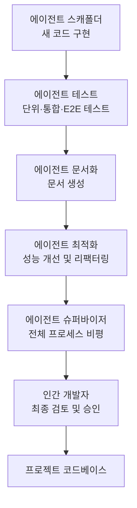

import { KeyPoints, Diagram, CrossRef } from '@site/src/components';

<KeyPoints
  items={[
    "바이브 코딩(Vibe Coding)은 LLM을 활용해 초기 초안을 생성하고 빠른 프로토타입을 구축하는 기법으로, '빈 페이지' 문제를 극복하고 아이디어를 실행 가능한 코드로 신속하게 전환하는 데 유용합니다.",
    "프로덕션 개발에서는 단순한 코드 생성을 넘어 전문화된 코딩 에이전트들로 구성된 팀과 협력하는 통합적 패러다임으로 전환되고 있습니다.",
    "인간 주도 오케스트레이션, 컨텍스트의 우선성, 프런티어 모델 직접 접근이라는 세 가지 원칙이 인간-에이전트 팀 프레임워크의 기반을 이룹니다.",
    "스캐폴더, 테스트 엔지니어, 문서화 담당, 최적화 담당, 프로세스 에이전트 등 역할별 전문 에이전트를 통해 개발 생산성을 극대화할 수 있습니다.",
    "인간 개발자는 전략적 방향과 아키텍처 설계를 담당하는 최종 의사결정자로서, 에이전트 팀의 오케스트레이터 역할을 수행합니다.",
  ]}
/>

# 부록 G: 코딩 에이전트

## 바이브 코딩: 출발점

'바이브 코딩(Vibe Coding)'은 빠른 혁신과 창의적 탐색을 위한 강력한 기법으로 자리 잡았습니다. 이 방식은 LLM을 활용하여 초기 초안을 생성하거나, 복잡한 로직을 개괄하거나, 빠른 프로토타입을 구축함으로써 초기 진입 장벽을 크게 낮춥니다. 바이브 코딩은 '빈 페이지' 문제를 극복하고 모호한 개념에서 실행 가능한 코드로 신속하게 전환하는 데 매우 효과적입니다. 특히 낯선 API를 탐색하거나 새로운 아키텍처 패턴을 테스트할 때 완벽한 구현에 대한 즉각적인 요구를 우회할 수 있어 유용합니다. 생성된 코드는 종종 창의적인 촉매제 역할을 하며, 개발자가 비판·리팩터링·확장할 수 있는 토대를 제공합니다. 바이브 코딩의 주요 강점은 소프트웨어 개발 생명주기의 초기 발견과 아이디어 도출 단계를 가속화하는 데 있습니다. 그러나 바이브 코딩이 브레인스토밍에서 탁월하더라도, 견고하고 확장 가능하며 유지 보수 가능한 소프트웨어를 개발하려면 순수한 코드 생성에서 전문화된 코딩 에이전트와의 협업 파트너십으로 전환하는 보다 구조화된 접근법이 필요합니다.

## 팀원으로서의 에이전트

초기 물결이 아이디어 구상에 적합한 '바이브 코드'인 순수 코드 생성에 집중했다면, 이제 업계는 프로덕션 작업을 위한 보다 통합적이고 강력한 패러다임으로 전환하고 있습니다. 가장 효과적인 개발 팀은 단순히 에이전트에게 작업을 위임하는 데 그치지 않고, 정교한 코딩 에이전트 군(群)으로 자신들을 증강하고 있습니다. 이러한 에이전트들은 지칠 줄 모르는 전문 팀원으로서 인간의 창의성을 증폭시키고 팀의 확장성과 개발 속도를 극적으로 향상시킵니다.

이러한 변화는 업계 리더들의 발언에서도 확인됩니다. 2025년 초, Alphabet CEO 순다르 피차이(Sundar Pichai)는 Google에서 "신규 코드의 30% 이상이 이제 Gemini 모델의 지원 또는 생성으로 이루어지며, 이는 우리의 개발 속도를 근본적으로 변화시키고 있다"고 언급했습니다. Microsoft도 유사한 주장을 내놓았습니다. 이러한 업계 전반의 변화는 진정한 프런티어가 개발자를 대체하는 것이 아니라 그들을 역량 강화하는 데 있음을 시사합니다. 목표는 인간이 아키텍처 비전과 창의적 문제 해결을 주도하는 동시에, 에이전트가 테스트·문서화·코드 리뷰와 같은 전문화되고 확장 가능한 작업을 처리하는 증강된 협업 관계입니다.

이 장에서는 인간 개발자가 창의적 리더와 아키텍트 역할을 수행하고, AI 에이전트가 역량 배가 수단으로 기능한다는 핵심 철학에 기반한 인간-에이전트 팀 조직 프레임워크를 제시합니다. 이 프레임워크는 세 가지 기본 원칙을 토대로 합니다.

1. **인간 주도 오케스트레이션(Human-Led Orchestration):** 개발자는 팀 리더이자 프로젝트 아키텍트입니다. 개발자는 항상 루프 안에 있으며, 워크플로를 오케스트레이션하고 고수준 목표를 설정하며 최종 결정을 내립니다. 에이전트는 강력하지만 지원적인 협력자입니다. 개발자는 어떤 에이전트를 참여시킬지 지시하고, 필요한 컨텍스트를 제공하며, 가장 중요하게는 에이전트가 생성한 모든 출력에 대한 최종 판단을 행사하여 프로젝트의 품질 기준 및 장기적 비전과의 일치 여부를 확인합니다.

2. **컨텍스트의 우선성(The Primacy of Context):** 에이전트의 성능은 컨텍스트의 품질과 완전성에 전적으로 의존합니다. 컨텍스트가 빈약한 강력한 LLM은 무용지물입니다. 따라서 이 프레임워크는 세심한 인간 주도의 컨텍스트 큐레이션을 우선시합니다. 자동화된 블랙박스 방식의 컨텍스트 검색은 지양합니다. 개발자는 에이전트 팀원을 위한 완벽한 '브리핑'을 조립할 책임이 있습니다. 여기에는 다음이 포함됩니다.
   - **전체 코드베이스:** 에이전트가 기존 패턴과 로직을 이해할 수 있도록 모든 관련 소스 코드를 제공합니다.
   - **외부 지식:** 특정 문서, API 정의 또는 설계 문서를 제공합니다.
   - **인간 브리프:** 명확한 목표, 요구사항, 풀 리퀘스트 설명, 스타일 가이드를 명확히 전달합니다.

3. **프런티어 모델 직접 접근(Direct Model Access):** 최첨단 결과를 달성하려면 에이전트가 프런티어 모델(예: Gemini 2.5 PRO, Claude Opus 4, OpenAI, DeepSeek 등)에 직접 접근하여 구동되어야 합니다. 덜 강력한 모델을 사용하거나 컨텍스트를 불투명하게 처리하거나 잘라내는 중개 플랫폼을 통해 요청을 라우팅하면 성능이 저하됩니다. 이 프레임워크는 인간 리더와 기저 모델의 원초적 능력 사이에 가능한 한 순수한 대화를 만들어 각 에이전트가 최고 잠재력을 발휘하도록 구축되어 있습니다.

이 프레임워크는 개발 생명주기의 핵심 기능별로 설계된 전문 에이전트 팀으로 구조화됩니다. 인간 개발자는 중앙 오케스트레이터로서 작업을 위임하고 결과를 통합합니다.

## 핵심 구성 요소

프런티어 대형 언어 모델을 효과적으로 활용하기 위해 이 프레임워크는 전문 에이전트 팀에 별개의 개발 역할을 부여합니다. 이 에이전트들은 별개의 애플리케이션이 아니라, 신중하게 설계된 역할별 프롬프트와 컨텍스트를 통해 LLM 내에서 호출되는 개념적 페르소나입니다. 이 접근법은 초기 코드 작성부터 미묘하고 비판적인 리뷰 수행까지, 모델의 방대한 능력이 현재 작업에 정확히 집중되도록 보장합니다.

**오케스트레이터: 인간 개발자**

이 협업 프레임워크에서 인간 개발자는 오케스트레이터로서 AI 에이전트에 대한 중앙 지성이자 최고 권위를 담당합니다.

- **역할:** 팀 리더, 아키텍트, 최종 의사결정자. 오케스트레이터는 작업을 정의하고, 컨텍스트를 준비하며, 에이전트가 수행한 모든 작업을 검증합니다.
- **인터페이스:** 개발자 자신의 터미널, 편집기, 선택한 에이전트의 기본 웹 UI.

**컨텍스트 스테이징 영역(Context Staging Area)**

성공적인 에이전트 상호작용의 기반으로서, 컨텍스트 스테이징 영역은 인간 개발자가 완전하고 작업별 브리핑을 꼼꼼히 준비하는 공간입니다.

- **역할:** 각 작업을 위한 전용 작업 공간으로, 에이전트가 완전하고 정확한 브리핑을 수신하도록 보장합니다.
- **구현:** 목표·코드 파일·관련 문서를 위한 마크다운 파일이 포함된 임시 디렉터리(`task-context/`).

**전문 에이전트(Specialist Agents)**

타겟화된 프롬프트를 사용하여 특정 개발 작업에 맞춤화된 전문 에이전트 팀을 구성할 수 있습니다.

- **스캐폴더 에이전트(Scaffolder Agent): 구현자**
  - **목적:** 상세한 사양을 기반으로 새 코드를 작성하고, 기능을 구현하거나, 보일러플레이트를 생성합니다.
  - **호출 프롬프트:** "You are a senior software engineer. Based on the requirements in 01\_BRIEF.md and the existing patterns in 02\_CODE/, implement the feature..."

- **테스트 엔지니어 에이전트(Test Engineer Agent): 품질 관리자**
  - **목적:** 새 코드 또는 기존 코드에 대한 포괄적인 단위 테스트, 통합 테스트, 엔드투엔드 테스트를 작성합니다.
  - **호출 프롬프트:** "You are a quality assurance engineer. For the code provided in 02\_CODE/, write a full suite of unit tests using \[Testing Framework, e.g., pytest\]. Cover all edge cases and adhere to the project's testing philosophy."

- **문서화 에이전트(Documenter Agent): 서기**
  - **목적:** 함수, 클래스, API 또는 전체 코드베이스에 대한 명확하고 간결한 문서를 생성합니다.
  - **호출 프롬프트:** "You are a technical writer. Generate markdown documentation for the API endpoints defined in the provided code. Include request/response examples and explain each parameter."

- **최적화 에이전트(Optimizer Agent): 리팩터링 파트너**
  - **목적:** 가독성, 유지 보수성, 효율성 향상을 위한 성능 최적화 및 코드 리팩터링을 제안합니다.
  - **호출 프롬프트:** "Analyze the provided code for performance bottlenecks or areas that could be refactored for clarity. Propose specific changes with explanations for why they are an improvement."

- **프로세스 에이전트(Process Agent): 코드 감독자**
  - **비판(Critique):** 에이전트가 초기 검토를 수행하여 잠재적 버그, 스타일 위반, 논리적 결함을 식별합니다. 이는 정적 분석 도구와 유사합니다.
  - **성찰(Reflection):** 에이전트가 자체 비판을 분석합니다. 발견 사항을 종합하고, 가장 중요한 문제를 우선순위화하며, 사소하거나 영향이 낮은 제안을 기각하고, 인간 개발자를 위한 고수준의 실행 가능한 요약을 제공합니다.
  - **호출 프롬프트:** "You are a principal engineer conducting a code review. First, perform a detailed critique of the changes. Second, reflect on your critique to provide a concise, prioritized summary of the most important feedback."

궁극적으로 이 인간 주도 모델은 개발자의 전략적 방향과 에이전트의 전술적 실행 사이에 강력한 시너지를 창출합니다. 그 결과, 개발자는 일상적인 작업을 초월하여 가장 큰 가치를 제공하는 창의적이고 아키텍처적인 도전에 전문성을 집중할 수 있습니다.

## 실용적 구현

### 설정 체크리스트

인간-에이전트 팀 프레임워크를 효과적으로 구현하기 위해 제어를 유지하면서 효율성을 개선하는 데 초점을 맞춘 다음 설정을 권장합니다.

1. **프런티어 모델 접근 권한 확보** Gemini 2.5 Pro와 Claude 4 Opus 등 주요 대형 언어 모델 최소 두 개에 대한 API 키를 확보하십시오. 이 이중 공급자 접근법은 비교 분석을 가능하게 하고 단일 플랫폼 의존에 따른 제한이나 장애를 방지합니다. 이 자격 증명은 다른 프로덕션 시크릿과 동일하게 안전하게 관리해야 합니다.

2. **로컬 컨텍스트 오케스트레이터 구현** 임시방편적인 스크립트 대신, 컨텍스트를 관리하는 경량 CLI 도구나 로컬 에이전트 러너를 사용하십시오. 이러한 도구는 프로젝트 루트에 간단한 설정 파일(예: `context.toml`)을 정의하여 LLM 프롬프트를 위한 단일 페이로드로 컴파일할 파일, 디렉터리 또는 URL을 지정할 수 있어야 합니다. 이를 통해 모든 요청에서 모델이 보는 내용에 대한 완전하고 투명한 제어를 유지할 수 있습니다.

3. **버전 관리 프롬프트 라이브러리 구축** 프로젝트 Git 저장소 내에 전용 `/prompts` 디렉터리를 생성하십시오. 각 전문 에이전트의 호출 프롬프트(예: `reviewer.md`, `documenter.md`, `tester.md`)를 마크다운 파일로 저장하십시오. 프롬프트를 코드처럼 다루면 팀 전체가 AI 에이전트에게 주어지는 지시를 협업하여 개선하고 버전 관리할 수 있습니다.

4. **Git 훅과 에이전트 워크플로 통합** 로컬 Git 훅을 사용하여 리뷰 주기를 자동화하십시오. 예를 들어, pre-commit 훅을 구성하여 스테이징된 변경사항에 대해 리뷰어 에이전트를 자동으로 트리거할 수 있습니다. 에이전트의 비판-성찰 요약을 터미널에 직접 표시하면 커밋 확정 전 즉각적인 피드백을 받고 품질 보증 단계를 개발 프로세스에 직접 내재화할 수 있습니다.

<figure>

<figcaption>그림 1: 코딩 전문가 에이전트 구성 — 스캐폴더·테스트·문서화·최적화·슈퍼바이저 에이전트가 협력하여 프로젝트 코드베이스에 기여</figcaption>
</figure>

## 증강된 팀을 이끄는 원칙

이 프레임워크를 성공적으로 이끌려면 단독 기여자에서 인간-AI 팀의 리더로 진화해야 합니다. 다음 원칙이 이를 안내합니다.

- **아키텍처적 소유권 유지** 전략적 방향을 설정하고 고수준 아키텍처를 소유하는 것이 여러분의 역할입니다. 여러분은 '무엇'과 '왜'를 정의하고, 에이전트 팀을 활용하여 '어떻게'를 가속화합니다. 여러분은 설계의 최종 중재자로서 모든 구성 요소가 프로젝트의 장기적 비전 및 품질 기준과 일치하도록 보장합니다.

- **브리핑의 기술 숙달** 에이전트 출력의 품질은 입력의 품질을 직접 반영합니다. 모든 작업에 명확하고 모호하지 않으며 포괄적인 컨텍스트를 제공하는 브리핑의 기술을 숙달하십시오. 프롬프트를 단순한 명령이 아니라 새롭고 유능한 팀원을 위한 완전한 브리핑 패키지로 생각하십시오.

- **최고의 품질 게이트 역할 수행** 에이전트의 출력은 언제나 제안이지 명령이 아닙니다. 리뷰어 에이전트의 피드백을 강력한 신호로 취급하되, 최고의 품질 게이트는 여러분입니다. 도메인 전문성과 프로젝트별 지식을 적용하여 모든 변경사항을 검증하고, 도전하며, 승인함으로써 코드베이스 무결성의 최종 수호자로 행동하십시오.

- **반복적 대화 참여** 최선의 결과는 독백이 아닌 대화에서 나옵니다. 에이전트의 초기 출력이 완벽하지 않더라도 폐기하지 말고 개선하십시오. 수정 피드백을 제공하고, 명확한 컨텍스트를 추가하며, 재시도를 요청하십시오. 이 반복적 대화는 특히 리뷰어 에이전트에서 중요합니다. 리뷰어 에이전트의 '성찰' 출력은 최종 보고서가 아니라 협업 토론의 시작점으로 설계되었습니다.

## 결론

코드 개발의 미래가 도래했으며, 그것은 증강된 미래입니다. 고독한 코더의 시대는 지나가고, 개발자가 전문화된 AI 에이전트 팀을 이끄는 새로운 패러다임이 자리 잡았습니다. 이 모델은 인간의 역할을 축소시키지 않습니다. 오히려 일상적인 작업을 자동화하고, 개인의 영향력을 확장하며, 이전에는 상상하기 어려웠던 개발 속도를 달성함으로써 인간의 역할을 한층 높입니다.

에이전트에게 전술적 실행을 위임함으로써, 개발자는 이제 진정으로 중요한 것에 인지적 에너지를 쏟을 수 있습니다. 바로 전략적 혁신, 탄탄한 아키텍처 설계, 그리고 사용자를 기쁘게 하는 제품을 구축하는 데 필요한 창의적 문제 해결입니다. 근본적인 관계가 재정의되었습니다. 더 이상 인간 대 기계의 경쟁이 아니라, 인간의 독창성과 AI가 하나의 매끄럽게 통합된 팀으로 함께 일하는 파트너십입니다.

## 참고문헌

1. Google에서 코드의 30% 이상이 AI 생성  
   https://www.reddit.com/r/singularity/comments/1k7rxo0/ai\_is\_now\_writing\_well\_over\_30\_of\_the\_code\_at/

2. Microsoft에서 코드의 30% 이상이 AI 생성  
   https://www.businesstoday.in/tech-today/news/story/30-of-microsofts-code-is-now-ai-generated-says-ceo-satya-nadella-474167-2025-04-30

<figure>

<figcaption>그림 1: 코딩 전문가 에이전트 구성 — 스캐폴더·테스트·문서화·최적화·슈퍼바이저 에이전트가 협력하여 프로젝트 코드베이스에 기여</figcaption>
</figure>

<figure>

<figcaption>그림 1: 코딩 전문가 에이전트 구성 (중복) — 스캐폴더·테스트·문서화·최적화·슈퍼바이저 에이전트가 협력하여 프로젝트 코드베이스에 기여</figcaption>
</figure>

