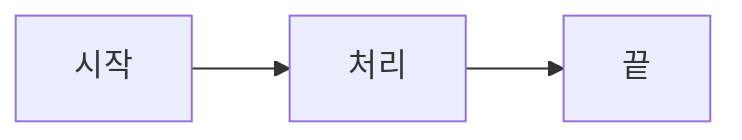

# Agentic Design Patterns — 한국어판

에이전트 설계 패턴(Agentic Design Patterns)은 LLM 기반 에이전트 시스템을 설계할 때 반복적으로 나타나는 구조적 해결책을 정리한 문서입니다.

## 책 구성

### [전면부](/docs/intro/foreword)

- [추천사](/docs/intro/foreword)
- [머리말](/docs/intro/preface)
- [프레임워크 소개](/docs/intro/frameworks-intro)

### [Part 1: 기본 패턴](/docs/part1/ch01)

- [1장 — 프롬프트 체이닝](/docs/part1/ch01)
- [2장 — 라우팅](/docs/part1/ch02)
- [3장 — 병렬화](/docs/part1/ch03)
- [4장 — Reflection](/docs/part1/ch04)
- [5장 — 툴 사용(Tool Use) / 함수 호출(Function Calling)](/docs/part1/ch05)
- [6장 — 계획 수립](/docs/part1/ch06)
- [7장 — 멀티 에이전트 협업](/docs/part1/ch07)

### [Part 2: 학습 및 적응](/docs/part2/ch08)

- [8장 — 메모리 관리](/docs/part2/ch08)
- [9장 — 학습과 적응](/docs/part2/ch09)

### [Part 3: 고급 제어](/docs/part3/ch10)

- [10장 — 모델 컨텍스트 프로토콜(MCP)](/docs/part3/ch10)
- [11장 — 목표 설정과 모니터링](/docs/part3/ch11)
- [12장 — 예외 처리 및 복구](/docs/part3/ch12)
- [13장 — Human-in-the-Loop](/docs/part3/ch13)

### [Part 4: 심화 패턴](/docs/part4/ch14)

- [14장 — 지식 검색(RAG)](/docs/part4/ch14)
- [15장 — 에이전트 간 통신(A2A)](/docs/part4/ch15)
- [16장 — 리소스 인식 최적화](/docs/part4/ch16)
- [17장 — 추론 기법](/docs/part4/ch17)
- [18장 — Guardrail / 안전성 패턴](/docs/part4/ch18)
- [19장 — 평가 및 모니터링](/docs/part4/ch19)
- [20장 — 우선순위 결정(Prioritization)](/docs/part4/ch20)
- [21장 — 탐색과 발견](/docs/part4/ch21)

### [부록](/docs/appendix/appendix-a)

- [부록 A — 고급 프롬프팅 기법](/docs/appendix/appendix-a)
- [부록 B — AI 에이전틱 인터랙션](/docs/appendix/appendix-b)
- [부록 C — 에이전틱 프레임워크 빠른 개요](/docs/appendix/appendix-c)
- [부록 D — AgentSpace로 에이전트 구축하기](/docs/appendix/appendix-d)
- [부록 E — CLI의 AI 에이전트](/docs/appendix/appendix-e)
- [부록 F — (원본 누락)](/docs/appendix/appendix-f)
- [부록 G — 코딩 에이전트 / 바이브 코딩](/docs/appendix/appendix-g)

### [후면부](/docs/back/conclusion)

- [결론](/docs/back/conclusion)
- [자주 묻는 질문 (FAQ)](/docs/back/faq)
- [Gemini 추론 트레이스 예시](/docs/back/gemini-transcript)
- [용어집](/docs/back/glossary)

---

## 에이전트 시스템 처리 흐름

아래 다이어그램은 에이전트 시스템의 기본 처리 흐름을 나타냅니다.
(Mermaid + 한국어 폰트 빌드 검증용)

## 이 사이트에 대하여

| 항목 | 결정 사항 |
|---|---|
| 빌드 스택 | Docusaurus 3 (React + MDX + SSG) |
| 코드 하이라이팅 | Prism (Docusaurus 기본) |
| 다이어그램 | Mermaid (한국어 라벨, Noto Sans KR 폰트) |
| 언어 | 한국어 단일 로케일 (`ko`) |

원서의 Index(색인) 대신 이 사이트의 **검색 기능**을 이용하시면 전체 문서에서 한국어 키워드로 빠르게 원하는 내용을 찾을 수 있습니다.
