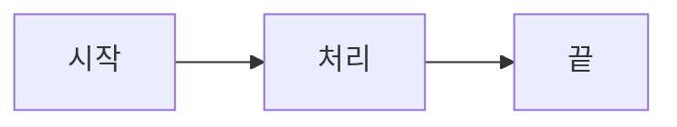

# Agentic Design Patterns

에이전트 설계 패턴(Agentic Design Patterns)은 LLM 기반 에이전트 시스템을 설계할 때 반복적으로 나타나는 구조적 해결책을 정리한 문서입니다.

:::tip 이 사이트에 대하여
이 사이트는 현재 구축 중입니다. 전체 콘텐츠는 PDF 추출(T1) 및 번역(T5) 태스크 완료 후 게시됩니다.
검색 기능(Pagefind)이 통합되어 있어 한국어 키워드로 전체 문서를 검색할 수 있습니다.
:::

## 주요 패턴 개요

아래 다이어그램은 에이전트 시스템의 기본 처리 흐름을 나타냅니다.
Korean labels are rendered using Noto Sans KR — this diagram serves as a build-time verification
that Mermaid + Korean fonts work correctly (no tofu □ boxes).

## 구성

이 문서 사이트는 다음 구성을 사용합니다.

| 항목 | 결정 사항 |
|---|---|
| 빌드 스택 | Docusaurus 3 (React + MDX + SSG) |
| 코드 하이라이팅 | Prism (Docusaurus 기본) |
| 검색 | Pagefind (CJK n-gram 토크나이징) |
| 다이어그램 | Mermaid (한국어 라벨, Noto Sans KR 폰트) |
| 언어 | 한국어 단일 로케일 (`ko`) |

## 색인 대신 검색 이용

원서의 Index(색인)는 영문 슬러그와 페이지 번호 기반으로 구성되어 있어 번역 사이트에서는 사용하기 어렵습니다.
대신 이 사이트의 **검색 기능**을 이용하시면 전체 문서에서 한국어 키워드로 빠르게 원하는 내용을 찾을 수 있습니다.
