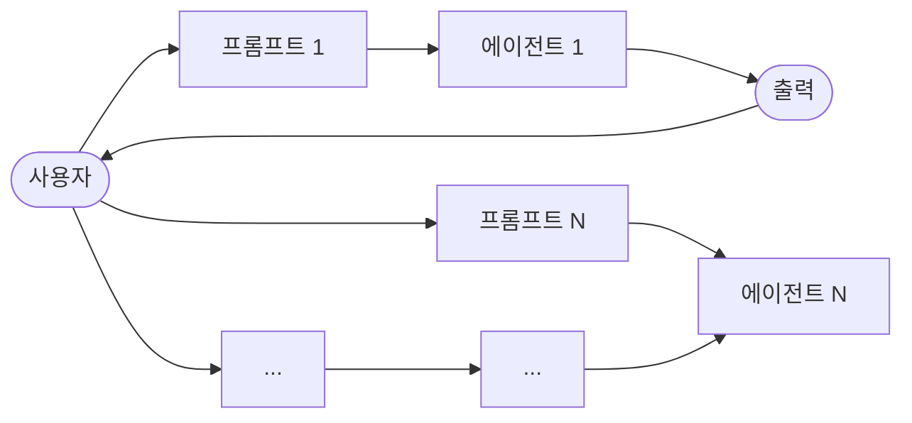

import { KeyPoints, OriginalText, Diagram, CrossRef, ChapterNav } from '@site/src/components';

<KeyPoints
  items={[
    "프롬프트 체이닝(Prompt Chaining)은 복잡한 작업을 일련의 집중된 단계로 분해하여 LLM의 신뢰성과 제어성을 높이는 패턴입니다.",
    "각 단계에서 이전 단계의 출력이 다음 단계의 입력이 되며, 단계 사이에 구조화된 출력(Structured Output)이나 게이트 조건을 삽입할 수 있습니다.",
    "컨텍스트 엔지니어링(Context Engineering)은 프롬프트 체이닝의 이론적 토대로, 모델 성능은 모델 아키텍처보다 제공되는 컨텍스트의 풍부함에 더 크게 의존합니다.",
    "LangChain, LangGraph, Crew AI, Google ADK 등의 프레임워크는 다단계 체인 구성을 위한 구조화된 환경을 제공합니다.",
    "이 패턴은 단일 프롬프트로 처리하기 어려운 다단계 추론, 외부 도구 연동, 상태 유지가 필요한 에이전틱 시스템의 기반이 됩니다.",
  ]}
/>

# 1장: 프롬프트 체이닝

## 프롬프트 체이닝 패턴 개요

프롬프트 체이닝(Prompt Chaining)은 파이프라인 패턴(Pipeline Pattern)이라고도 불리며, 대규모 언어 모델(LLM)을 활용해 복잡한 작업을 처리할 때 강력한 패러다임을 제공합니다. 이 패턴은 LLM이 하나의 단일 단계에서 복잡한 문제를 해결하기를 기대하는 대신, 분할 정복(divide-and-conquer) 전략을 취합니다. 핵심 아이디어는 원래의 어려운 문제를 일련의 더 작고 관리하기 쉬운 하위 문제들로 분해하는 것입니다. 각 하위 문제는 특별히 설계된 프롬프트를 통해 개별적으로 처리되며, 한 프롬프트에서 생성된 출력은 체인의 다음 프롬프트의 입력으로 전략적으로 공급됩니다.

이 순차적 처리 기법은 LLM과의 상호작용에 모듈성과 명료성을 본질적으로 도입합니다. 복잡한 작업을 분해함으로써 각 개별 단계를 이해하고 디버깅하기가 더 쉬워지며, 전체 프로세스의 견고성과 해석 가능성이 향상됩니다. 체인의 각 단계는 더 큰 문제의 특정 측면에 집중하도록 세심하게 설계되고 최적화될 수 있어, 더 정확하고 집중된 출력으로 이어집니다.

한 단계의 출력이 다음 단계의 입력으로 작용하는 것이 핵심입니다. 이 정보 전달 방식은 의존성 체인을 형성합니다 — 바로 이름의 유래입니다 — 여기서 이전 연산의 컨텍스트와 결과가 이후 처리를 안내합니다. 이를 통해 LLM은 이전 작업을 기반으로 구축하고, 이해를 정제하며, 원하는 솔루션을 향해 점진적으로 나아갈 수 있습니다.

더 나아가, 프롬프트 체이닝은 단순히 문제를 분해하는 것에 그치지 않습니다. 각 단계에서 LLM이 외부 시스템, API, 데이터베이스와 상호작용하도록 지시할 수 있으며, 이를 통해 내부 훈련 데이터를 넘어선 지식과 능력을 풍부하게 합니다. 이 능력은 LLM의 잠재력을 극적으로 확장하여, LLM이 단순히 고립된 모델이 아니라 더 광범위하고 지능적인 시스템의 핵심 구성 요소로 기능할 수 있게 합니다.

프롬프트 체이닝의 중요성은 단순한 문제 해결을 넘어섭니다. 이는 정교한 AI 에이전트를 구축하기 위한 기반 기법으로 작용합니다. 이러한 에이전트는 프롬프트 체인을 활용하여 동적 환경에서 자율적으로 계획하고, 추론하며, 행동할 수 있습니다. 프롬프트 시퀀스를 전략적으로 구조화함으로써, 에이전트는 다단계 추론, 계획, 의사결정을 요구하는 작업에 참여할 수 있습니다. 이러한 에이전트 워크플로는 인간의 사고 과정을 더 가깝게 모방하여, 복잡한 도메인과 시스템과의 더 자연스럽고 효과적인 상호작용을 가능하게 합니다.

---

### 단일 프롬프트의 한계

다면적인 작업에서 LLM에 단일의 복잡한 프롬프트를 사용하면 비효율적일 수 있으며, 모델이 제약조건과 지시사항을 처리하는 데 어려움을 겪게 됩니다. 이는 다음과 같은 문제로 이어질 수 있습니다.

- **지시 무시(Instruction Neglect)**: 프롬프트의 일부가 간과되는 현상
- **컨텍스트 드리프트(Contextual Drift)**: 모델이 초기 컨텍스트를 놓치는 현상
- **오류 전파(Error Propagation)**: 초기 오류가 증폭되는 현상
- **불충분한 컨텍스트 윈도우**: 더 긴 컨텍스트 윈도우를 요구하는 프롬프트에서 모델이 응답하기 위한 충분한 정보를 얻지 못하는 현상
- **환각(Hallucination)**: 인지 부하가 증가함에 따라 잘못된 정보가 생성될 가능성이 높아지는 현상

예를 들어, 시장 조사 보고서를 분석하고, 결과를 요약하며, 데이터 포인트로 트렌드를 식별하고, 이메일 초안을 작성하도록 요청하는 쿼리는 실패 위험이 있습니다. 모델이 요약은 잘 수행하지만 데이터 추출(Data Extraction)이나 이메일 초안 작성에서는 실패할 수 있기 때문입니다.

### 순차적 분해를 통한 신뢰성 향상

프롬프트 체이닝은 복잡한 작업을 집중된 순차적 워크플로로 분해함으로써 이러한 문제들을 해결하여, 신뢰성과 제어성을 크게 향상시킵니다. 위의 예시를 파이프라인 또는 체인 방식으로 설명하면 다음과 같습니다.

1. **초기 프롬프트(요약)**: "다음 시장 조사 보고서의 핵심 내용을 요약하십시오: [텍스트]." 모델의 유일한 초점은 요약이며, 이 초기 단계의 정확도를 높입니다.
2. **두 번째 프롬프트(트렌드 식별)**: "요약을 사용하여 상위 3가지 신흥 트렌드를 식별하고 각 트렌드를 뒷받침하는 특정 데이터 포인트를 추출하십시오: [1단계 출력]." 이 프롬프트는 더 제한적이며 검증된 출력을 직접 기반으로 합니다.
3. **세 번째 프롬프트(이메일 작성)**: "다음 트렌드와 지원 데이터를 요약한 간결한 이메일을 마케팅팀에 작성하십시오: [2단계 출력]."

이 분해는 프로세스에 대한 더 세분화된 제어를 가능하게 합니다. 각 단계는 더 단순하고 모호성이 적어, 모델의 인지 부하를 줄이고 더 정확하고 신뢰할 수 있는 최종 출력으로 이어집니다. 이 모듈성은 각 함수가 특정 연산을 수행한 후 결과를 다음으로 전달하는 계산 파이프라인과 유사합니다. 각 특정 작업에 대한 정확한 응답을 보장하기 위해, 매 단계에서 모델에 별개의 역할을 부여할 수 있습니다. 예를 들어, 주어진 시나리오에서 초기 프롬프트는 "시장 분석가"로, 후속 프롬프트는 "무역 분석가"로, 세 번째 프롬프트는 "전문 문서 작성자"로 지정될 수 있습니다.

### 구조화된 출력의 역할

프롬프트 체인의 신뢰성은 단계 간에 전달되는 데이터의 무결성에 크게 의존합니다. 한 프롬프트의 출력이 모호하거나 형식이 좋지 않으면, 다음 프롬프트가 잘못된 입력으로 인해 실패할 수 있습니다. 이를 완화하기 위해 JSON이나 XML과 같은 구조화된 출력(Structured Output) 형식을 지정하는 것이 중요합니다.

예를 들어, 트렌드 식별 단계의 출력을 JSON 객체로 형식화할 수 있습니다.

```json
{
 "trends": [
   {
     "trend_name": "AI-Powered Personalization",
     "supporting_data": "73% of consumers prefer to do business with
brands that use personal information to make their shopping
experiences more relevant."
   },
   {
     "trend_name": "Sustainable and Ethical Brands",
     "supporting_data": "Sales of products with ESG-related claims
grew 28% over the last five years, compared to 20% for products
without."
   }
 ]
}
```

이 구조화된 형식은 데이터가 기계가 읽을 수 있고 모호함 없이 정확하게 파싱되어 다음 프롬프트에 삽입될 수 있음을 보장합니다. 이 방식은 자연어 해석에서 발생할 수 있는 오류를 최소화하며, 견고한 다단계 LLM 기반 시스템을 구축하는 데 핵심 구성 요소입니다.

---

## 실용적 응용 및 사용 사례

프롬프트 체이닝은 에이전틱 시스템을 구축할 때 광범위한 시나리오에 적용 가능한 다재다능한 패턴입니다. 핵심 유틸리티는 복잡한 문제를 순차적이고 관리 가능한 단계로 분해하는 데 있습니다. 다음은 몇 가지 실용적인 응용 및 사용 사례입니다.

### 1. 정보 처리 워크플로

많은 작업은 다양한 변환을 통해 원시 정보를 처리하는 것을 포함합니다. 예를 들어 문서를 요약하고, 핵심 엔티티를 추출한 다음, 해당 엔티티를 사용하여 데이터베이스를 조회하거나 보고서를 생성하는 것입니다. 프롬프트 체인의 예는 다음과 같습니다.

- **프롬프트 1**: 주어진 URL 또는 문서에서 텍스트 콘텐츠를 추출합니다.
- **프롬프트 2**: 정제된 텍스트를 요약합니다.
- **프롬프트 3**: 요약 또는 원본 텍스트에서 특정 엔티티(예: 이름, 날짜, 위치)를 추출합니다.
- **프롬프트 4**: 엔티티를 사용하여 내부 지식 베이스를 검색합니다.
- **프롬프트 5**: 요약, 엔티티, 검색 결과를 통합한 최종 보고서를 생성합니다.

이 방법론은 자동화된 콘텐츠 분석, AI 기반 연구 보조 도구 개발, 복잡한 보고서 생성 등의 도메인에서 적용됩니다.

### 2. 복잡한 쿼리 응답

여러 단계의 추론이나 정보 검색을 필요로 하는 복잡한 질문에 답변하는 것은 주요 사용 사례입니다. 예를 들어, "1929년 주식 시장 붕괴의 주요 원인은 무엇이며, 정부 정책은 어떻게 대응했습니까?"와 같은 질문입니다.

- **프롬프트 1**: 사용자 쿼리에서 핵심 하위 질문(붕괴 원인, 정부 대응)을 식별합니다.
- **프롬프트 2**: 1929년 붕괴 원인에 대한 정보를 연구하거나 검색합니다.
- **프롬프트 3**: 1929년 주식 시장 붕괴에 대한 정부의 정책 대응에 대한 정보를 연구하거나 검색합니다.
- **프롬프트 4**: 2단계와 3단계의 정보를 합성하여 원래 쿼리에 대한 일관된 답변을 생성합니다.

이 순차적 처리 방법론은 다단계 추론과 정보 합성이 가능한 AI 시스템 개발에 필수적입니다. 이러한 시스템은 쿼리가 단일 데이터 포인트에서 답변될 수 없고, 대신 일련의 논리적 단계나 다양한 출처의 정보 통합이 필요한 경우에 요구됩니다.

예를 들어, 특정 주제에 대한 포괄적인 보고서를 생성하도록 설계된 자동화 연구 에이전트는 하이브리드 계산 워크플로를 실행합니다. 처음에 시스템은 관련 문서를 다수 검색합니다. 각 문서에서 핵심 정보를 추출하는 후속 작업은 각 소스에 대해 동시에 수행될 수 있습니다. 이 단계는 독립적인 하위 작업이 동시에 실행되어 효율성을 극대화하는 병렬 처리에 적합합니다.

그러나 개별 추출이 완료되면, 프로세스는 본질적으로 순차적이 됩니다. 시스템은 먼저 추출된 데이터를 수집하고, 이를 일관된 초안으로 합성한 다음, 최종 보고서를 생성하기 위해 이 초안을 검토하고 정제해야 합니다. 이 후반 단계 각각은 이전 단계의 성공적인 완료에 논리적으로 의존합니다. 프롬프트 체이닝이 적용되는 곳이 바로 여기입니다. 수집된 데이터는 합성 프롬프트의 입력으로 사용되고, 결과로 생성된 합성 텍스트는 최종 검토 프롬프트의 입력이 됩니다. 따라서 복잡한 연산은 종종 독립적인 데이터 수집을 위한 병렬 처리와 합성 및 정제의 의존적 단계를 위한 프롬프트 체이닝을 결합합니다.

### 3. 데이터 추출(Data Extraction) 및 변환

비구조화 텍스트를 구조화된 형식으로 변환하는 것은 일반적으로 출력의 정확성과 완전성을 향상시키기 위한 순차적 수정을 필요로 하는 반복적인 프로세스를 통해 달성됩니다.

- **프롬프트 1**: 청구서 문서에서 특정 필드(예: 이름, 주소, 금액)를 추출하려고 시도합니다.
- **처리**: 모든 필수 필드가 추출되었는지, 형식 요구사항을 충족하는지 확인합니다.
- **프롬프트 2(조건부)**: 필드가 누락되거나 잘못 형성된 경우, 누락/잘못된 정보를 구체적으로 찾도록 새 프롬프트를 작성하고, 실패한 시도의 컨텍스트를 제공할 수 있습니다.
- **처리**: 결과를 다시 검증합니다. 필요한 경우 반복합니다.
- **출력**: 추출되고 검증된 구조화 데이터를 제공합니다.

이 순차적 처리 방법론은 양식, 청구서, 이메일과 같은 비구조화된 소스의 데이터 추출 및 분석에 특히 적용 가능합니다. 예를 들어, PDF 양식을 처리하는 것과 같은 복잡한 광학 문자 인식(OCR) 문제를 해결하는 것은 분해된 다단계 접근 방식을 통해 더 효과적으로 처리됩니다.

처음에, 대규모 언어 모델이 문서 이미지에서 기본 텍스트 추출을 수행하는 데 사용됩니다. 이에 따라 모델은 원시 출력을 처리하여 데이터를 정규화합니다. 이 단계에서 "일천오십"과 같은 수치 텍스트를 숫자 등가물인 1050으로 변환할 수 있습니다. LLM에 대한 중요한 과제는 정밀한 수학적 계산을 수행하는 것입니다. 따라서 후속 단계에서 시스템은 필요한 산술 연산을 외부 계산기 도구에 위임할 수 있습니다. LLM은 필요한 계산을 식별하고, 정규화된 숫자를 도구에 공급한 다음, 정확한 결과를 통합합니다. 텍스트 추출, 데이터 정규화, 외부 도구 사용의 이 체인 시퀀스는 단일 LLM 쿼리에서 신뢰할 수 있게 얻기 어려운 최종적이고 정확한 결과를 달성합니다.

### 4. 콘텐츠 생성 워크플로

복잡한 콘텐츠의 작성은 초기 아이디어 생성, 구조적 개요 작성, 초안 작성, 후속 수정을 포함한 별개의 단계로 분해되는 절차적 작업입니다.

- **프롬프트 1**: 사용자의 일반적인 관심사를 기반으로 5가지 주제 아이디어를 생성합니다.
- **처리**: 사용자가 하나의 아이디어를 선택하거나 최적의 것을 자동으로 선택합니다.
- **프롬프트 2**: 선택된 주제를 기반으로 상세한 개요를 생성합니다.
- **프롬프트 3**: 개요의 첫 번째 항목을 기반으로 초안 섹션을 작성합니다.
- **프롬프트 4**: 개요의 두 번째 항목을 기반으로 초안 섹션을 작성하되, 이전 섹션을 컨텍스트로 제공합니다. 모든 개요 항목에 대해 계속합니다.
- **프롬프트 5**: 일관성, 어조, 문법을 위해 전체 초안을 검토하고 정제합니다.

이 방법론은 창의적인 서사의 자동화된 작성, 기술 문서, 기타 구조화된 텍스트 콘텐츠 형식을 포함한 다양한 자연어 생성 작업에 사용됩니다.

### 5. 상태가 있는 대화 에이전트

포괄적인 상태 관리 아키텍처는 순차적 연결보다 더 복잡한 방법을 사용하지만, 프롬프트 체이닝은 대화 연속성을 유지하기 위한 기반 메커니즘을 제공합니다. 이 기법은 각 대화 턴을 이전 상호작용의 정보나 추출된 엔티티를 체계적으로 통합하는 새 프롬프트로 구성함으로써 컨텍스트를 유지합니다.

- **프롬프트 1**: 사용자 발화 1을 처리하고, 의도와 핵심 엔티티를 식별합니다.
- **처리**: 의도와 엔티티로 대화 상태를 업데이트합니다.
- **프롬프트 2**: 현재 상태를 기반으로 응답을 생성하거나 다음으로 필요한 정보를 식별합니다.
- 누적되는 대화 기록(상태)을 활용하는 체인을 시작하는 각각의 새로운 사용자 발화를 사용하여 후속 턴에 대해 반복합니다.

이 원칙은 대화 에이전트 개발의 기본이 되며, 확장된 다중 턴 대화에서 컨텍스트와 일관성을 유지할 수 있게 합니다. 대화 기록을 보존함으로써, 시스템은 이전에 교환된 정보에 의존하는 사용자 입력을 이해하고 적절하게 응답할 수 있습니다.

### 6. 코드 생성(Code Generation) 및 정제

기능적 코드 생성(Code Generation)은 일반적으로 문제를 일련의 이산적인 논리적 연산으로 분해해야 하는 다단계 프로세스입니다.

- **프롬프트 1**: 코드 함수에 대한 사용자의 요청을 이해합니다. 의사 코드나 개요를 생성합니다.
- **프롬프트 2**: 개요를 기반으로 초기 코드 초안을 작성합니다.
- **프롬프트 3**: 코드의 잠재적 오류나 개선 영역을 식별합니다(정적 분석 도구나 다른 LLM 호출을 사용할 수 있습니다).
- **프롬프트 4**: 식별된 문제를 기반으로 코드를 재작성하거나 정제합니다.
- **프롬프트 5**: 문서나 테스트 케이스를 추가합니다.

AI 보조 소프트웨어 개발과 같은 응용에서 프롬프트 체이닝의 유용성은 복잡한 코딩 작업을 일련의 관리 가능한 하위 문제로 분해하는 능력에서 비롯됩니다. 이 모듈식 구조는 각 단계에서 대규모 언어 모델의 운영 복잡성을 줄입니다. 중요하게도, 이 접근 방식은 모델 호출 사이에 결정론적 로직의 삽입을 허용하여, 워크플로 내에서 중간 데이터 처리, 출력 검증, 조건부 분기를 가능하게 합니다. 이 방법으로, 그렇지 않으면 불안정하거나 불완전한 결과로 이어질 수 있는 단일의 다면적 요청이 기반 실행 프레임워크가 관리하는 구조화된 연산 시퀀스로 변환됩니다.

### 7. 멀티모달 및 다단계 추론

다양한 모달리티를 가진 데이터셋을 분석하려면 문제를 더 작은 프롬프트 기반 작업으로 분해해야 합니다. 예를 들어, 임베디드 텍스트, 특정 텍스트 세그먼트를 강조하는 레이블, 각 레이블을 설명하는 표 형식 데이터가 포함된 이미지를 해석하려면 이러한 접근 방식이 필요합니다.

- **프롬프트 1**: 사용자의 이미지 요청에서 텍스트를 추출하고 이해합니다.
- **프롬프트 2**: 추출된 이미지 텍스트와 해당 레이블을 연결합니다.
- **프롬프트 3**: 표를 사용하여 수집된 정보를 해석하고 필요한 출력을 결정합니다.

---

## 실습 코드 예제

프롬프트 체이닝의 구현 방법은 스크립트 내의 직접적인 순차 함수 호출부터 제어 흐름, 상태 및 컴포넌트 통합을 관리하기 위해 설계된 특수 프레임워크의 활용에 이르기까지 다양합니다. LangChain, LangGraph, Crew AI, Google Agent Development Kit(ADK)와 같은 프레임워크는 이러한 다단계 프로세스를 구성하고 실행하기 위한 구조화된 환경을 제공하며, 특히 복잡한 아키텍처에 유리합니다.

데모 목적으로 LangChain과 LangGraph는 핵심 API가 연산의 체인과 그래프를 구성하기 위해 명시적으로 설계되어 있어 적합한 선택입니다. LangChain은 선형 시퀀스를 위한 기반 추상화를 제공하고, LangGraph는 더 정교한 에이전틱 동작을 구현하는 데 필요한 상태 기반 및 순환 연산을 지원하도록 이러한 기능을 확장합니다. 이 예제는 기본적인 선형 시퀀스에 초점을 맞춥니다.

다음 코드는 데이터 처리 파이프라인으로 기능하는 2단계 프롬프트 체인을 구현합니다. 초기 단계는 비구조화된 텍스트를 파싱하고 특정 정보를 추출하도록 설계되었습니다. 후속 단계는 이 추출된 출력을 받아 구조화된 데이터 형식으로 변환합니다.

이 절차를 복제하려면 먼저 필요한 라이브러리를 설치해야 합니다. 다음 명령을 사용하여 설치할 수 있습니다.

```bash
pip install langchain langchain-community langchain-openai langgraph
```

`langchain-openai`는 다른 모델 제공자의 적절한 패키지로 대체할 수 있습니다. 이후 실행 환경에는 선택한 언어 모델 제공자(OpenAI, Google Gemini, Anthropic 등)에 필요한 API 자격 증명이 설정되어야 합니다.

```python
import os
from langchain_openai import ChatOpenAI
from langchain_core.prompts import ChatPromptTemplate
from langchain_core.output_parsers import StrOutputParser

# For better security, load environment variables from a .env file
# from dotenv import load_dotenv
```

```python
# load_dotenv()
# Make sure your OPENAI_API_KEY is set in the .env file

# Initialize the Language Model (using ChatOpenAI is recommended)
llm = ChatOpenAI(temperature=0)

# --- Prompt 1: Extract Information ---
prompt_extract = ChatPromptTemplate.from_template(
   "Extract the technical specifications from the following
text:\n\n{text_input}"
)

# --- Prompt 2: Transform to JSON ---
prompt_transform = ChatPromptTemplate.from_template(
   "Transform the following specifications into a JSON object with
'cpu', 'memory', and 'storage' as keys:\n\n{specifications}"
)

# --- Build the Chain using LCEL ---
# The StrOutputParser() converts the LLM's message output to a simple
string.
extraction_chain = prompt_extract | llm | StrOutputParser()

# The full chain passes the output of the extraction chain into the
'specifications'
# variable for the transformation prompt.
full_chain = (
   {"specifications": extraction_chain}
   | prompt_transform
   | llm
   | StrOutputParser()
)

# --- Run the Chain ---
input_text = "The new laptop model features a 3.5 GHz octa-core
processor, 16GB of RAM, and a 1TB NVMe SSD."

# Execute the chain with the input text dictionary.
final_result = full_chain.invoke({"text_input": input_text})

print("\n--- Final JSON Output ---")
print(final_result)
```

이 Python 코드는 LangChain 라이브러리를 사용하여 텍스트를 처리하는 방법을 보여줍니다. 입력 문자열에서 기술 사양을 추출하는 프롬프트와 이 사양을 JSON 객체로 형식화하는 두 개의 별도 프롬프트를 사용합니다. `ChatOpenAI` 모델은 언어 모델 상호작용에 사용되고, `StrOutputParser`는 출력이 사용 가능한 문자열 형식임을 보장합니다. LangChain Expression Language(LCEL)는 이러한 프롬프트와 언어 모델을 우아하게 체인으로 연결하는 데 사용됩니다. 첫 번째 체인인 `extraction_chain`은 사양을 추출합니다. `full_chain`은 추출 결과를 가져와 변환 프롬프트의 입력으로 사용합니다. 노트북을 설명하는 샘플 입력 텍스트가 제공됩니다. `full_chain`은 이 텍스트로 호출되어 두 단계를 거쳐 처리합니다. 최종 결과, 즉 추출되고 형식화된 사양을 포함하는 JSON 문자열이 출력됩니다.

---

## 컨텍스트 엔지니어링과 프롬프트 엔지니어링

컨텍스트 엔지니어링(Context Engineering)은 토큰 생성 이전에 AI 모델에 완전한 정보 환경을 설계, 구성, 전달하는 체계적인 분야입니다(<span>그림 1</span> 참조). 이 방법론은 모델의 출력 품질이 모델의 아키텍처 자체보다 제공된 컨텍스트의 풍부함에 더 의존한다고 주장합니다.

<figure>

<figcaption>그림 1 — 컨텍스트 엔지니어링은 고급 에이전틱 성능을 가능하게 하는 주요 요소로서, AI에 풍부하고 포괄적인 정보 환경을 구축하는 분야입니다.</figcaption>
</figure>

이는 사용자의 즉각적인 쿼리의 문구 최적화에 주로 초점을 맞추는 전통적인 프롬프트 엔지니어링으로부터의 중요한 발전을 나타냅니다. 컨텍스트 엔지니어링은 다음과 같은 여러 정보 계층을 포함하도록 이 범위를 확장합니다.

- **시스템 프롬프트**: AI의 운영 매개변수를 정의하는 기초 지시사항 세트 — 예를 들어, "당신은 기술 작가입니다. 어조는 공식적이고 정확해야 합니다."
- **검색된 문서**: AI가 지식 베이스에서 능동적으로 정보를 가져와 응답을 알리는 것 — 예를 들어 프로젝트의 기술 사양을 가져오는 것
- **도구 출력**: AI가 외부 API를 사용하여 실시간 데이터를 얻은 결과 — 예를 들어 사용자의 가용성을 확인하기 위해 캘린더를 조회하는 것
- **암묵적 데이터**: 사용자 신원, 상호작용 기록, 환경 상태와 같은 중요한 암묵적 정보

핵심 원칙은 심지어 고급 모델도 운영 환경에 대한 제한적이거나 잘못 구성된 뷰가 제공되면 성능이 저하된다는 것입니다. 따라서 이 방식은 질문에 단순히 답하는 것에서 에이전트를 위한 포괄적인 운영 그림을 구축하는 것으로 작업을 재구성합니다. 예를 들어, 컨텍스트 엔지니어링된 에이전트는 쿼리에 단순히 응답하는 것이 아니라, 먼저 사용자의 캘린더 가용성(도구 출력), 이메일 수신자와의 전문적 관계(암묵적 데이터), 이전 회의 노트(검색된 문서)를 통합할 것입니다. 이를 통해 모델은 매우 관련성 높고, 개인화되며, 실용적으로 유용한 출력을 생성할 수 있습니다. "엔지니어링" 구성 요소는 런타임에 이 데이터를 가져오고 변환하는 견고한 파이프라인을 만들고, 컨텍스트 품질을 지속적으로 개선하기 위한 피드백 루프를 구축하는 것을 포함합니다.

이를 구현하기 위해, 전문화된 튜닝 시스템을 사용하여 대규모로 개선 프로세스를 자동화할 수 있습니다. 예를 들어, Google의 Vertex AI prompt optimizer와 같은 도구는 샘플 입력 세트와 사전 정의된 평가 지표에 대해 응답을 체계적으로 평가함으로써 모델 성능을 향상시킬 수 있습니다. 이 접근 방식은 광범위한 수동 재작성 없이 다양한 모델에 걸쳐 프롬프트와 시스템 지시사항을 조정하는 데 효과적입니다. 옵티마이저에 샘플 프롬프트, 시스템 지시사항, 템플릿을 제공함으로써, 컨텍스트 입력을 프로그래밍 방식으로 정제하여 정교한 컨텍스트 엔지니어링에 필요한 피드백 루프를 구현하는 구조화된 방법을 제공할 수 있습니다.

이 구조화된 접근 방식은 기본적인 AI 도구를 더 정교하고 컨텍스트를 인식하는 시스템과 구분 짓는 것입니다. 컨텍스트 자체를 주요 구성 요소로 취급하여, 에이전트가 아는 것, 알게 되는 시점, 그리고 정보를 사용하는 방법에 중요한 중점을 둡니다. 이 방식은 모델이 사용자의 의도, 기록, 현재 환경에 대한 균형 잡힌 이해를 갖도록 보장합니다. 궁극적으로, 컨텍스트 엔지니어링은 상태 없는 챗봇을 고도로 유능하고 상황 인식이 가능한 시스템으로 발전시키는 데 중요한 방법론입니다.

---

## 한눈에 보기

**무엇이 문제인가**: 복잡한 작업은 단일 프롬프트 내에서 처리될 때 LLM을 압도하는 경우가 많으며, 이는 심각한 성능 문제로 이어집니다. 모델의 인지 부하가 증가하면 지시사항을 간과하거나, 컨텍스트를 잃거나, 잘못된 정보를 생성하는 오류 가능성이 높아집니다. 단일 프롬프트는 여러 제약조건과 순차적 추론 단계를 효과적으로 관리하기 어렵습니다. 이로 인해 LLM이 다면적 요청의 모든 측면을 처리하지 못하는 신뢰할 수 없고 부정확한 출력이 발생합니다.

**왜 프롬프트 체이닝인가**: 프롬프트 체이닝은 복잡한 문제를 일련의 더 작고 상호 연결된 하위 작업으로 분해함으로써 표준화된 솔루션을 제공합니다. 체인의 각 단계는 특정 연산을 수행하기 위해 집중된 프롬프트를 사용하여 신뢰성과 제어성을 크게 향상시킵니다. 한 프롬프트의 출력이 다음 프롬프트의 입력으로 전달되어, 최종 솔루션을 향해 점진적으로 구축되는 논리적 워크플로를 생성합니다. 이 모듈식 분할 정복 전략은 프로세스를 더 관리하기 쉽고 디버깅하기 쉽게 만들며, 단계 사이에 외부 도구나 구조화된 데이터 형식의 통합을 가능하게 합니다. 이 패턴은 계획하고, 추론하며, 복잡한 워크플로를 실행할 수 있는 정교한 다단계 에이전틱 시스템 개발의 기반입니다.

**경험 법칙**: 작업이 단일 프롬프트로 처리하기에 너무 복잡하거나, 여러 개의 별개 처리 단계를 포함하거나, 단계 간에 외부 도구와의 상호작용이 필요하거나, 다단계 추론을 수행하고 상태를 유지해야 하는 에이전틱 시스템을 구축할 때 이 패턴을 사용하십시오.

### 시각적 요약

<figure>



<figcaption>그림 2 — 프롬프트 체이닝 패턴: 에이전트는 사용자로부터 일련의 프롬프트를 받으며, 각 에이전트의 출력이 체인의 다음 에이전트의 입력으로 사용됩니다.</figcaption>
</figure>

---

## 핵심 정리

- **프롬프트 체이닝(Prompt Chaining)** 은 복잡한 작업을 일련의 더 작고 집중된 단계로 분해합니다. 이는 때로 파이프라인 패턴으로도 알려져 있습니다.
- 체인의 각 단계는 이전 단계의 출력을 입력으로 사용하는 LLM 호출 또는 처리 로직을 포함합니다.
- 이 패턴은 언어 모델과의 복잡한 상호작용의 신뢰성과 관리 가능성을 향상시킵니다.
- LangChain/LangGraph, Google ADK와 같은 프레임워크는 이러한 다단계 시퀀스를 정의, 관리, 실행하기 위한 견고한 도구를 제공합니다.

---

## 결론

복잡한 문제를 일련의 더 단순하고 관리하기 쉬운 하위 작업으로 분해함으로써, 프롬프트 체이닝은 대규모 언어 모델을 안내하기 위한 견고한 프레임워크를 제공합니다. 이 "분할 정복" 전략은 모델을 한 번에 하나의 특정 연산에 집중시킴으로써 출력의 신뢰성과 제어성을 크게 향상시킵니다. 기반 패턴으로서, 이는 다단계 추론, 도구 통합, 상태 관리가 가능한 정교한 AI 에이전트의 개발을 가능하게 합니다. 궁극적으로, 프롬프트 체이닝을 마스터하는 것은 단일 프롬프트의 능력을 훨씬 뛰어넘는 복잡한 워크플로를 실행할 수 있는 견고하고 컨텍스트를 인식하는 시스템을 구축하는 데 중요합니다.

---

## 참고 문헌

1. LangChain Documentation on LCEL: https://python.langchain.com/v0.2/docs/core_modules/expression_language/
2. LangGraph Documentation: https://langchain-ai.github.io/langgraph/
3. Prompt Engineering Guide - Chaining Prompts: https://www.promptingguide.ai/techniques/chaining
4. OpenAI API Documentation (General Prompting Concepts): https://platform.openai.com/docs/guides/gpt/prompting
5. Crew AI Documentation (Tasks and Processes): https://docs.crewai.com/
6. Google AI for Developers (Prompting Guides): https://cloud.google.com/discover/what-is-prompt-engineering?hl=en
7. Vertex Prompt Optimizer: https://cloud.google.com/vertex-ai/generative-ai/docs/learn/prompts/prompt-optimizer

---

<ChapterNav
  next={{ title: "2장 — 병렬화", href: "/docs/part1/ch02" }}
/>
