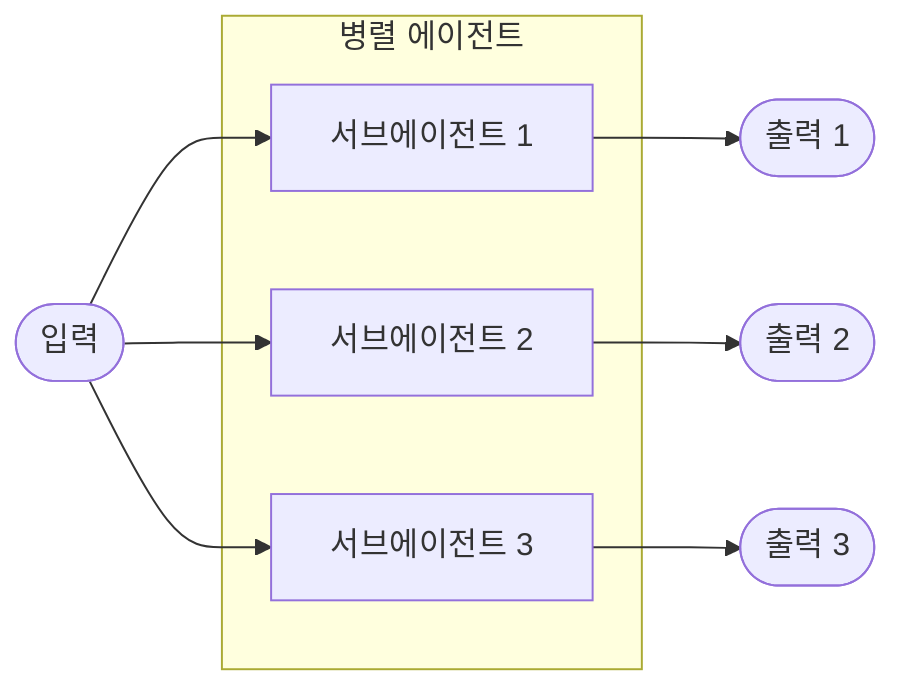
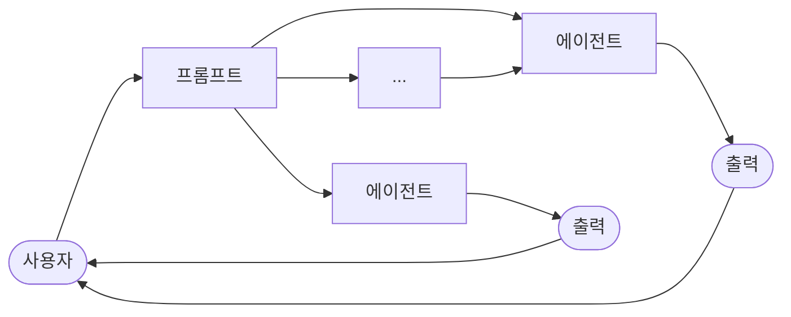

import { KeyPoints, Diagram, CrossRef } from '@site/src/components';

<KeyPoints
  items={[
    "병렬화(Parallelization)는 독립적인 태스크를 동시에 실행하여 에이전틱 워크플로의 효율성을 높이는 패턴입니다.",
    "서로 의존하지 않는 LLM 호출, 툴 사용, sub-agent 실행 등을 병렬로 처리하면 전체 지연 시간을 크게 줄일 수 있습니다.",
    "LangChain의 RunnableParallel과 Google ADK의 ParallelAgent는 병렬 실행을 정의하고 관리하는 대표적인 내장 구조입니다.",
    "asyncio는 단일 스레드에서 이벤트 루프를 통해 동시성(concurrency)을 제공하지만, 진정한 병렬 처리(parallelism)와는 구별됩니다.",
    "병렬화 패턴은 체이닝(chaining), 라우팅(routing)과 결합하여 고성능 복잡 에이전틱 시스템을 구축하는 핵심 기법입니다.",
  ]}
/>

# 3장: 병렬화

## 병렬화(Parallelization) 패턴 개요

앞선 장들에서 순차적 워크플로를 위한 프롬프트 체이닝과 동적 의사결정 및 경로 전환을 위한 라우팅을 살펴보았습니다. 이러한 패턴들은 필수적이지만, 복잡한 에이전틱 태스크의 상당수는 순차적으로 처리하는 것보다 여러 서브태스크를 동시에 실행할 수 있습니다. 바로 이 지점에서 병렬화(Parallelization) 패턴이 중요해집니다.

병렬화는 LLM 호출, 툴 사용, 심지어 sub-agent 전체와 같은 여러 구성 요소를 동시에(concurrently) 실행하는 것입니다(Fig.1 참조). 한 단계가 완료될 때까지 기다리는 대신, 병렬 실행을 통해 독립적인 태스크들이 동시에 실행될 수 있어 독립적인 부분으로 분해 가능한 태스크의 전체 실행 시간을 크게 줄입니다.

주제를 조사하고 결과를 요약하도록 설계된 에이전트를 생각해 보십시오. 순차적 접근 방식은 다음과 같습니다.

1. 소스 A를 검색합니다.
2. 소스 A를 요약합니다.
3. 소스 B를 검색합니다.
4. 소스 B를 요약합니다.
5. 요약 A와 B를 종합하여 최종 답변을 생성합니다.

병렬 접근 방식은 대신 다음과 같이 처리합니다.

1. 소스 A와 소스 B를 동시에 검색합니다.
2. 두 검색이 완료되면, 소스 A와 소스 B를 동시에 요약합니다.
3. 요약 A와 B를 종합하여 최종 답변을 생성합니다(이 단계는 일반적으로 순차적으로, 병렬 단계가 완료될 때까지 기다립니다).

핵심 아이디어는 다른 부분의 출력에 의존하지 않는 워크플로의 부분을 파악하여 병렬로 실행하는 것입니다. 이는 대기 시간(latency)이 있는 외부 서비스(API나 데이터베이스 등)를 다룰 때 특히 효과적으로, 여러 요청을 동시에 발행할 수 있습니다.

병렬화를 구현하려면 비동기 실행이나 멀티스레딩/멀티프로세싱을 지원하는 프레임워크가 필요한 경우가 많습니다. 현대 에이전틱 프레임워크들은 비동기 작업을 염두에 두고 설계되어, 병렬로 실행할 수 있는 단계를 쉽게 정의할 수 있습니다.

<figure>



<figcaption>그림 1: 병렬화 예시 — 단일 입력이 병렬 에이전트로 분기되어 각각 출력을 생성</figcaption>
</figure>

LangChain, LangGraph, Google ADK와 같은 프레임워크는 병렬 실행을 위한 메커니즘을 제공합니다. LangChain Expression Language(LCEL)에서는 `|`(순차) 연산자를 사용하여 실행 가능한 객체들을 결합하고, 동시에 실행되는 분기를 가지도록 체인이나 그래프를 구조화함으로써 병렬 실행을 달성할 수 있습니다. 그래프 구조를 갖는 LangGraph는 단일 상태 전환에서 실행할 수 있는 여러 노드를 정의하여 워크플로에서 효과적으로 병렬 분기를 활성화합니다. Google ADK는 에이전트의 병렬 실행을 용이하게 하고 관리하는 강력한 네이티브 메커니즘을 제공하여, 복잡한 멀티 에이전트 시스템의 효율성과 확장성을 크게 향상시킵니다. ADK 프레임워크의 이 내재적 기능 덕분에 개발자는 여러 에이전트가 순차적이 아닌 동시에 작동하는 솔루션을 설계하고 구현할 수 있습니다.

병렬화 패턴은 특히 다수의 독립적인 조회, 계산, 또는 외부 서비스와의 상호작용이 수반되는 태스크를 처리할 때 에이전틱 시스템의 효율성과 응답성을 향상시키는 데 필수적입니다. 이는 복잡한 에이전트 워크플로의 성능을 최적화하는 핵심 기법입니다.

## 실용적 적용 및 활용 사례

병렬화는 다양한 애플리케이션에서 에이전트 성능을 최적화하는 강력한 패턴입니다.

### 1. 정보 수집 및 조사

여러 출처에서 동시에 정보를 수집하는 것은 전형적인 활용 사례입니다.

- **활용 사례:** 기업을 조사하는 에이전트.
  - **병렬 태스크:** 뉴스 기사 검색, 주가 데이터 조회, 소셜 미디어 언급 확인, 기업 데이터베이스 쿼리를 동시에 수행합니다.
  - **이점:** 순차적 조회보다 훨씬 빠르게 포괄적인 정보를 수집합니다.

### 2. 데이터 처리 및 분석

서로 다른 분석 기법을 동시에 적용하거나 서로 다른 데이터 세그먼트를 병렬로 처리합니다.

- **활용 사례:** 고객 피드백을 분석하는 에이전트.
  - **병렬 태스크:** 피드백 배치에 대해 감성 분석, 키워드 추출, 피드백 분류, 긴급 이슈 식별을 동시에 실행합니다.
  - **이점:** 다각적인 분석을 신속하게 제공합니다.

### 3. 다중 API 또는 툴 상호작용

서로 다른 유형의 정보를 수집하거나 서로 다른 작업을 수행하기 위해 여러 독립적인 API 또는 툴을 호출합니다.

- **활용 사례:** 여행 계획 에이전트.
  - **병렬 태스크:** 항공권 가격 확인, 호텔 가용성 검색, 현지 이벤트 조회, 레스토랑 추천 검색을 동시에 수행합니다.
  - **이점:** 완전한 여행 계획을 더 빠르게 제시합니다.

### 4. 다중 구성 요소를 포함한 콘텐츠 생성

복잡한 콘텐츠의 서로 다른 부분을 병렬로 생성합니다.

- **활용 사례:** 마케팅 이메일을 작성하는 에이전트.
  - **병렬 태스크:** 제목 생성, 본문 초안 작성, 관련 이미지 검색, 행동 유도 버튼 텍스트 작성을 동시에 수행합니다.
  - **이점:** 최종 이메일을 더 효율적으로 조합합니다.

### 5. 검증(Validation) 및 확인

여러 독립적인 검사나 검증(Validation)을 동시에 수행합니다.

- **활용 사례:** 사용자 입력을 검증(Validation)하는 에이전트.
  - **병렬 태스크:** 이메일 형식 확인, 전화번호 유효성 검사, 데이터베이스 대조 주소 확인, 부적절한 표현 감지를 동시에 수행합니다.
  - **이점:** 입력 유효성에 대한 피드백을 더 빠르게 제공합니다.

### 6. 멀티모달 처리

동일한 입력의 서로 다른 모달리티(텍스트, 이미지, 오디오)를 동시에 처리합니다.

- **활용 사례:** 텍스트와 이미지가 포함된 소셜 미디어 게시물을 분석하는 에이전트.
  - **병렬 태스크:** 감성 및 키워드 텍스트 분석과 객체 및 장면 설명을 위한 이미지 분석을 동시에 수행합니다.
  - **이점:** 서로 다른 모달리티의 인사이트를 더 빠르게 통합합니다.

### 7. A/B 테스팅(A/B Testing) 또는 다중 옵션 생성

최선의 옵션을 선택하기 위해 응답이나 출력의 여러 변형을 병렬로 생성합니다.

- **활용 사례:** 다양한 창의적 텍스트 옵션을 생성하는 에이전트.
  - **병렬 태스크:** 약간 다른 프롬프트나 모델을 사용하여 기사의 세 가지 다른 헤드라인을 동시에 생성합니다.
  - **이점:** 최선의 옵션을 빠르게 비교하고 선택할 수 있습니다.

병렬화는 에이전틱 디자인의 근본적인 최적화 기법으로, 개발자가 독립적인 태스크의 동시 실행을 활용하여 더 성능 좋고 응답성이 뛰어난 애플리케이션을 구축할 수 있게 합니다.

## 실습 코드 예제 (LangChain)

LangChain 프레임워크 내에서의 병렬 실행은 LangChain Expression Language(LCEL)에 의해 지원됩니다. 주요 방법은 딕셔너리나 리스트 구조 안에 여러 실행 가능한 구성 요소를 배치하는 것입니다. 이 컬렉션이 체인의 다음 구성 요소에 입력으로 전달되면, LCEL 런타임은 포함된 실행 가능 객체들을 동시에 실행합니다.

LangGraph의 맥락에서 이 원리는 그래프의 토폴로지에 적용됩니다. 병렬 워크플로는 직접적인 순차 의존성이 없는 여러 노드가 단일 공통 노드에서 시작될 수 있도록 그래프를 구조화함으로써 정의됩니다. 이러한 병렬 경로들은 독립적으로 실행된 후, 그래프의 수렴 지점에서 결과가 집계될 수 있습니다.

다음 구현은 LangChain 프레임워크로 구축된 병렬 처리 워크플로를 보여줍니다. 이 워크플로는 단일 사용자 쿼리에 대응하여 두 가지 독립 작업을 동시에 실행하도록 설계되었습니다. 이러한 병렬 프로세스는 별개의 체인이나 함수로 인스턴스화되며, 각각의 출력은 이후 단일 결과로 집계됩니다.

이 구현의 사전 요구사항으로는 `langchain`, `langchain-community`, `langchain-openai`와 같은 필수 Python 패키지 설치가 포함됩니다. 또한 인증을 위해 선택한 언어 모델의 유효한 API 키가 로컬 환경에 구성되어 있어야 합니다.

```python
import os
import asyncio
from typing import Optional

from langchain_openai import ChatOpenAI
from langchain_core.prompts import ChatPromptTemplate
from langchain_core.output_parsers import StrOutputParser
from langchain_core.runnables import Runnable, RunnableParallel,
RunnablePassthrough

# --- Configuration ---
# Ensure your API key environment variable is set (e.g.,
OPENAI_API_KEY)
try:
   llm: Optional[ChatOpenAI] = ChatOpenAI(model="gpt-4o-mini",
temperature=0.7)

except Exception as e:
   print(f"Error initializing language model: {e}")
   llm = None

# --- Define Independent Chains ---
# These three chains represent distinct tasks that can be executed in
parallel.

summarize_chain: Runnable = (
   ChatPromptTemplate.from_messages([
       ("system", "Summarize the following topic concisely:"),
       ("user", "{topic}")
   ])
   | llm
   | StrOutputParser()
)

questions_chain: Runnable = (
   ChatPromptTemplate.from_messages([
```

```python
       ("system", "Generate three interesting questions about the
following topic:"),
       ("user", "{topic}")
   ])
   | llm
   | StrOutputParser()
)

terms_chain: Runnable = (
   ChatPromptTemplate.from_messages([
       ("system", "Identify 5-10 key terms from the following topic,
separated by commas:"),
       ("user", "{topic}")
   ])
   | llm
   | StrOutputParser()
)

# --- Build the Parallel + Synthesis Chain ---

# 1. Define the block of tasks to run in parallel. The results of
these,
#    along with the original topic, will be fed into the next step.
map_chain = RunnableParallel(
   {
       "summary": summarize_chain,
       "questions": questions_chain,
       "key_terms": terms_chain,
       "topic": RunnablePassthrough(),  # Pass the original topic
through
   }
)

# 2. Define the final synthesis prompt which will combine the
parallel results.
synthesis_prompt = ChatPromptTemplate.from_messages([
   ("system", """Based on the following information:
    Summary: {summary}
    Related Questions: {questions}
    Key Terms: {key_terms}
    Synthesize a comprehensive answer."""),
   ("user", "Original topic: {topic}")
])

# 3. Construct the full chain by piping the parallel results directly
#    into the synthesis prompt, followed by the LLM and output
parser.
```

```python
full_parallel_chain = map_chain | synthesis_prompt | llm |
StrOutputParser()

# --- Run the Chain ---
async def run_parallel_example(topic: str) -> None:
   """
   Asynchronously invokes the parallel processing chain with a
specific topic
   and prints the synthesized result.

   Args:
       topic: The input topic to be processed by the LangChain
chains.
   """
   if not llm:
       print("LLM not initialized. Cannot run example.")
       return

   print(f"\n--- Running Parallel LangChain Example for Topic:
'{topic}' ---")
   try:
       # The input to `ainvoke` is the single 'topic' string,
       # then passed to each runnable in the `map_chain`.
       response = await full_parallel_chain.ainvoke(topic)
       print("\n--- Final Response ---")
       print(response)
   except Exception as e:
       print(f"\nAn error occurred during chain execution: {e}")

if __name__ == "__main__":
   test_topic = "The history of space exploration"
   # In Python 3.7+, asyncio.run is the standard way to run an async
function.
   asyncio.run(run_parallel_example(test_topic))
```

제공된 Python 코드는 병렬 실행을 활용하여 주어진 주제를 효율적으로 처리하도록 설계된 LangChain 애플리케이션을 구현합니다. asyncio는 동시성(concurrency)을 제공하지만 병렬 처리(parallelism)는 아님에 유의하십시오. 이는 하나의 태스크가 유휴 상태(예: 네트워크 요청 대기)일 때 태스크 간에 지능적으로 전환하는 이벤트 루프를 사용하여 단일 스레드에서 동시성을 달성합니다. 이로 인해 여러 태스크가 동시에 진행되는 효과가 생기지만, 코드 자체는 Python의 전역 인터프리터 잠금(GIL)에 의해 제한된 단일 스레드에서만 실행됩니다.

코드는 언어 모델, 프롬프트, 출력 파싱, 실행 가능 구조를 위한 구성 요소를 포함하여 `langchain_openai`와 `langchain_core`에서 필수 모듈을 가져오는 것으로 시작합니다. 코드는 창의성 제어를 위한 지정된 온도로 "gpt-4o-mini" 모델을 사용하여 ChatOpenAI 인스턴스를 초기화하려고 시도합니다. try-except 블록은 언어 모델 초기화 중 견고성을 위해 사용됩니다. 그런 다음 각각 입력 주제에 대해 별개의 태스크를 수행하도록 설계된 세 가지 독립적인 LangChain "체인"이 정의됩니다. 첫 번째 체인은 주제 자리 표시자가 포함된 시스템 메시지와 사용자 메시지를 사용하여 주제를 간결하게 요약하기 위한 것입니다. 두 번째 체인은 주제와 관련된 세 가지 흥미로운 질문을 생성하도록 구성되었습니다. 세 번째 체인은 입력 주제에서 5개에서 10개의 핵심 용어를 식별하도록 설정되었으며, 쉼표로 구분하도록 요청합니다. 이러한 각 독립 체인은 해당 태스크에 맞게 조정된 ChatPromptTemplate, 초기화된 언어 모델, 출력을 문자열로 포맷하는 StrOutputParser로 구성됩니다.

그런 다음 이 세 체인을 묶어 동시에 실행할 수 있도록 RunnableParallel 블록이 구성됩니다. 이 병렬 실행 가능 객체에는 원래 입력 주제를 이후 단계에서 사용할 수 있도록 RunnablePassthrough도 포함됩니다. 별도의 ChatPromptTemplate이 최종 종합 단계를 위해 정의되며, 요약, 질문, 핵심 용어 및 원래 주제를 입력으로 받아 포괄적인 답변을 생성합니다. `full_parallel_chain`으로 명명된 전체 엔드-투-엔드 처리 체인은 `map_chain`(병렬 블록)을 종합 프롬프트로 순서화한 후, 언어 모델과 출력 파서를 연결하여 생성됩니다. 비동기 함수 `run_parallel_example`은 이 `full_parallel_chain`을 호출하는 방법을 보여줍니다. 이 함수는 주제를 입력으로 받아 invoke를 사용하여 비동기 체인을 실행합니다. 마지막으로 표준 Python `if __name__ == "__main__":` 블록은 이 경우 "The history of space exploration"이라는 샘플 주제로 `run_parallel_example`을 실행하는 방법을 보여주며, `asyncio.run`을 사용하여 비동기 실행을 관리합니다.

요컨대, 이 코드는 주어진 주제에 대해 여러 LLM 호출(요약, 질문, 용어)이 동시에 이루어지고, 그 결과가 최종 LLM 호출에 의해 결합되는 워크플로를 설정합니다. 이는 LangChain을 사용한 에이전틱 워크플로에서 병렬화의 핵심 아이디어를 보여줍니다.

## 실습 코드 예제 (Google ADK)

이제 Google ADK 프레임워크 내에서 이러한 개념을 설명하는 구체적인 예제로 넘어가겠습니다. ParallelAgent와 SequentialAgent와 같은 ADK 프리미티브가 향상된 효율성을 위해 동시 실행을 활용하는 에이전트 흐름을 구축하는 데 어떻게 적용될 수 있는지 살펴보겠습니다.

```python
from google.adk.agents import LlmAgent, ParallelAgent,
SequentialAgent
from google.adk.tools import google_search
GEMINI_MODEL="gemini-2.0-flash"

# --- 1. Define Researcher Sub-Agents (to run in parallel) ---

# Researcher 1: Renewable Energy
researcher_agent_1 = LlmAgent(
    name="RenewableEnergyResearcher",
    model=GEMINI_MODEL,
    instruction="""You are an AI Research Assistant specializing in
energy.
Research the latest advancements in 'renewable energy sources'.
Use the Google Search tool provided.
Summarize your key findings concisely (1-2 sentences).
Output *only* the summary.
""",
    description="Researches renewable energy sources.",
    tools=[google_search],
    # Store result in state for the merger agent
    output_key="renewable_energy_result"
)

# Researcher 2: Electric Vehicles
researcher_agent_2 = LlmAgent(
    name="EVResearcher",
    model=GEMINI_MODEL,
    instruction="""You are an AI Research Assistant specializing in
transportation.
Research the latest developments in 'electric vehicle technology'.
Use the Google Search tool provided.
Summarize your key findings concisely (1-2 sentences).
Output *only* the summary.
""",
    description="Researches electric vehicle technology.",
    tools=[google_search],
    # Store result in state for the merger agent
    output_key="ev_technology_result"
)

# Researcher 3: Carbon Capture
researcher_agent_3 = LlmAgent(
```

```text
    name="CarbonCaptureResearcher",
    model=GEMINI_MODEL,
    instruction="""You are an AI Research Assistant specializing in
climate solutions.
Research the current state of 'carbon capture methods'.
Use the Google Search tool provided.
Summarize your key findings concisely (1-2 sentences).
Output *only* the summary.
""",
    description="Researches carbon capture methods.",
    tools=[google_search],
    # Store result in state for the merger agent
    output_key="carbon_capture_result"
)

# --- 2. Create the ParallelAgent (Runs researchers concurrently) ---
# This agent orchestrates the concurrent execution of the
researchers.
# It finishes once all researchers have completed and stored their
results in state.
parallel_research_agent = ParallelAgent(
    name="ParallelWebResearchAgent",
    sub_agents=[researcher_agent_1, researcher_agent_2,
researcher_agent_3],
    description="Runs multiple research agents in parallel to gather
information."
)

# --- 3. Define the Merger Agent (Runs *after* the parallel agents)
---
# This agent takes the results stored in the session state by the
parallel agents
# and synthesizes them into a single, structured response with
attributions.
merger_agent = LlmAgent(
    name="SynthesisAgent",
    model=GEMINI_MODEL,  # Or potentially a more powerful model if
needed for synthesis
    instruction="""You are an AI Assistant responsible for combining
research findings into a structured report.
Your primary task is to synthesize the following research summaries,
clearly attributing findings to their source areas. Structure your
response using headings for each topic. Ensure the report is coherent
and integrates the key points smoothly.

**Crucially: Your entire response MUST be grounded *exclusively* on
the information provided in the 'Input Summaries' below. Do NOT add
any external knowledge, facts, or details not present in these
specific summaries.**

**Input Summaries:**

*   **Renewable Energy:**
    {renewable_energy_result}
*   **Electric Vehicles:**
    {ev_technology_result}
*   **Carbon Capture:**
    {carbon_capture_result}

**Output Format:**

## Summary of Recent Sustainable Technology Advancements

### Renewable Energy Findings
(Based on RenewableEnergyResearcher's findings)
[Synthesize and elaborate *only* on the renewable energy input
summary provided above.]

### Electric Vehicle Findings
(Based on EVResearcher's findings)
[Synthesize and elaborate *only* on the EV input summary provided
above.]

### Carbon Capture Findings
(Based on CarbonCaptureResearcher's findings)
[Synthesize and elaborate *only* on the carbon capture input summary
provided above.]

### Overall Conclusion
[Provide a brief (1-2 sentence) concluding statement that connects
*only* the findings presented above.]

Output *only* the structured report following this format. Do not
include introductory or concluding phrases outside this structure,
and strictly adhere to using only the provided input summary content.
""",
    description="Combines research findings from parallel agents into
a structured, cited report, strictly grounded on provided inputs.",
    # No tools needed for merging
    # No output_key needed here, as its direct response is the final
output of the sequence
)

# --- 4. Create the SequentialAgent (Orchestrates the overall flow)
```

```python
---
# This is the main agent that will be run. It first executes the
ParallelAgent
# to populate the state, and then executes the MergerAgent to produce
the final output.
sequential_pipeline_agent = SequentialAgent(
    name="ResearchAndSynthesisPipeline",
    # Run parallel research first, then merge
    sub_agents=[parallel_research_agent, merger_agent],
    description="Coordinates parallel research and synthesizes the
results."
)
root_agent = sequential_pipeline_agent
```

이 코드는 지속 가능한 기술 발전에 관한 정보를 조사하고 종합하는 데 사용되는 멀티 에이전트 시스템을 정의합니다. 세 개의 LlmAgent 인스턴스를 전문화된 연구원으로 설정합니다. ResearcherAgent_1은 재생 에너지 원천에 집중하고, ResearcherAgent_2는 전기차 기술을 조사하며, ResearcherAgent_3은 탄소 포집 방법을 연구합니다. 각 연구원 에이전트는 GEMINI_MODEL과 google_search 툴을 사용하도록 구성됩니다. 연구 결과를 간결하게(1-2 문장) 요약하고 `output_key`를 사용하여 세션 상태에 이러한 요약을 저장하도록 지시받습니다.

그런 다음 ParallelWebResearchAgent라는 ParallelAgent가 이 세 연구원 에이전트를 동시에 실행하도록 생성됩니다. 이를 통해 연구가 병렬로 수행되어 시간을 절약할 수 있습니다. ParallelAgent는 모든 sub-agent(연구원들)가 완료되고 상태를 채운 후에 실행을 완료합니다.

다음으로, 연구 결과를 종합하기 위해 MergerAgent(역시 LlmAgent)가 정의됩니다. 이 에이전트는 병렬 연구원들이 세션 상태에 저장한 요약을 입력으로 받습니다. 지시 사항은 출력이 제공된 입력 요약에만 엄격하게 기반해야 하며, 외부 지식 추가를 금지한다는 점을 강조합니다. MergerAgent는 각 주제의 제목과 간략한 전체 결론이 포함된 보고서 구조로 결합된 연구 결과를 작성하도록 설계되었습니다.

마지막으로, ResearchAndSynthesisPipeline이라는 SequentialAgent가 전체 워크플로를 조율하기 위해 생성됩니다. 주 컨트롤러로서 이 주 에이전트는 먼저 ParallelAgent를 실행하여 연구를 수행합니다. ParallelAgent가 완료되면, SequentialAgent는 수집된 정보를 종합하기 위해 MergerAgent를 실행합니다. `sequential_pipeline_agent`는 이 멀티 에이전트 시스템의 실행 진입점을 나타내는 `root_agent`로 설정됩니다. 전체 프로세스는 여러 출처에서 병렬로 정보를 효율적으로 수집한 다음 단일하고 구조화된 보고서로 결합하도록 설계되었습니다.

## 한눈에 보기

**무엇을:** 많은 에이전틱 워크플로에는 최종 목표를 달성하기 위해 완료해야 하는 여러 서브태스크가 포함됩니다. 각 태스크가 이전 태스크가 완료될 때까지 기다리는 순수 순차적 실행은 종종 비효율적이고 느립니다. 이 지연은 다른 API를 호출하거나 여러 데이터베이스를 쿼리하는 것과 같은 외부 I/O 작업에 의존하는 태스크에서 중요한 병목 현상이 됩니다. 동시 실행 메커니즘이 없으면 총 처리 시간은 모든 개별 태스크 기간의 합이 되어 시스템의 전체 성능과 응답성을 저해합니다.

**왜:** 병렬화 패턴은 독립적인 태스크를 동시에 실행할 수 있도록 하는 표준화된 솔루션을 제공합니다. 이는 툴 사용이나 LLM 호출과 같은 워크플로의 구성 요소 중 서로의 즉각적인 출력에 의존하지 않는 부분을 식별함으로써 작동합니다. LangChain과 Google ADK와 같은 에이전틱 프레임워크는 이러한 동시 작업을 정의하고 관리하기 위한 내장 구조를 제공합니다. 예를 들어, 메인 프로세스는 병렬로 실행되는 여러 서브태스크를 호출하고 다음 단계로 진행하기 전에 모두 완료될 때까지 기다릴 수 있습니다. 이러한 독립적인 태스크를 순차적으로 처리하는 대신 동시에 실행함으로써, 이 패턴은 전체 실행 시간을 크게 줄입니다.

**경험 법칙:** 여러 API에서 데이터를 가져오거나, 서로 다른 데이터 청크를 처리하거나, 나중에 종합할 여러 콘텐츠를 생성하는 등 동시에 실행할 수 있는 여러 독립 작업이 워크플로에 포함될 때 이 패턴을 사용하십시오.

## 시각적 요약

<figure>


<figcaption>그림 2: 병렬화 설계 패턴 — 프롬프트에서 여러 에이전트가 병렬로 실행되어 사용자에게 출력을 반환</figcaption>
</figure>

## 핵심 요점

핵심 요점은 다음과 같습니다.

- 병렬화는 효율성을 향상시키기 위해 독립적인 태스크를 동시에 실행하는 패턴입니다.
- API 호출과 같은 외부 리소스를 기다리는 작업이 포함될 때 특히 유용합니다.
- 동시적 또는 병렬 아키텍처의 도입은 상당한 복잡성과 비용을 초래하며, 설계, 디버깅, 시스템 로깅과 같은 주요 개발 단계에 영향을 미칩니다.
- LangChain과 Google ADK와 같은 프레임워크는 병렬 실행을 정의하고 관리하기 위한 내장 지원을 제공합니다.
- LangChain Expression Language(LCEL)에서 RunnableParallel은 여러 실행 가능 객체를 나란히 실행하기 위한 핵심 구조입니다.
- Google ADK는 코디네이터 에이전트의 LLM이 독립적인 서브태스크를 식별하고 전문화된 sub-agent에 의한 동시 처리를 트리거하는 LLM 주도 위임(LLM-Driven Delegation)을 통해 병렬 실행을 지원할 수 있습니다.
- 병렬화는 전체 지연 시간을 줄이고 복잡한 태스크에 대해 에이전틱 시스템을 더 응답성 있게 만드는 데 도움이 됩니다.

## 결론

병렬화 패턴은 독립적인 서브태스크를 동시에 실행하여 계산 워크플로를 최적화하는 방법입니다. 이 접근 방식은 특히 여러 모델 추론이나 외부 서비스 호출이 포함된 복잡한 작업에서 전체 지연 시간을 줄입니다.

프레임워크는 이 패턴을 구현하기 위한 서로 다른 메커니즘을 제공합니다. LangChain에서는 RunnableParallel과 같은 구조가 여러 처리 체인을 동시에 명시적으로 정의하고 실행하는 데 사용됩니다. 반면 Google Agent Developer Kit(ADK)와 같은 프레임워크는 기본 코디네이터 모델이 서로 다른 서브태스크를 동시에 작동할 수 있는 전문화된 에이전트에 할당하는 멀티 에이전트 위임을 통해 병렬화를 달성할 수 있습니다.

병렬 처리를 순차적(체이닝) 및 조건부(라우팅) 제어 흐름과 통합함으로써, 다양하고 복잡한 태스크를 효율적으로 관리할 수 있는 정교하고 고성능의 계산 시스템을 구축하는 것이 가능해집니다.

## 참고 문헌

병렬화 패턴 및 관련 개념에 대한 추가 자료는 다음을 참조하십시오.

1. LangChain Expression Language(LCEL) 문서(병렬 처리): https://python.langchain.com/docs/concepts/lcel/
2. Google Agent Developer Kit(ADK) 문서(멀티 에이전트 시스템): https://google.github.io/adk-docs/agents/multi-agents/
3. Python asyncio 문서:

```text
3.​ Python asyncio Documentation: https://docs.python.org/3/library/asyncio.html
```

<figure>


<figcaption>그림 1: 병렬화 예시 — 단일 입력이 병렬 에이전트로 분기되어 각각 출력을 생성</figcaption>
</figure>

<figure>



<figcaption>그림 2: 병렬화 설계 패턴 — 프롬프트에서 여러 에이전트가 병렬로 실행되어 사용자에게 출력을 반환</figcaption>
</figure>

