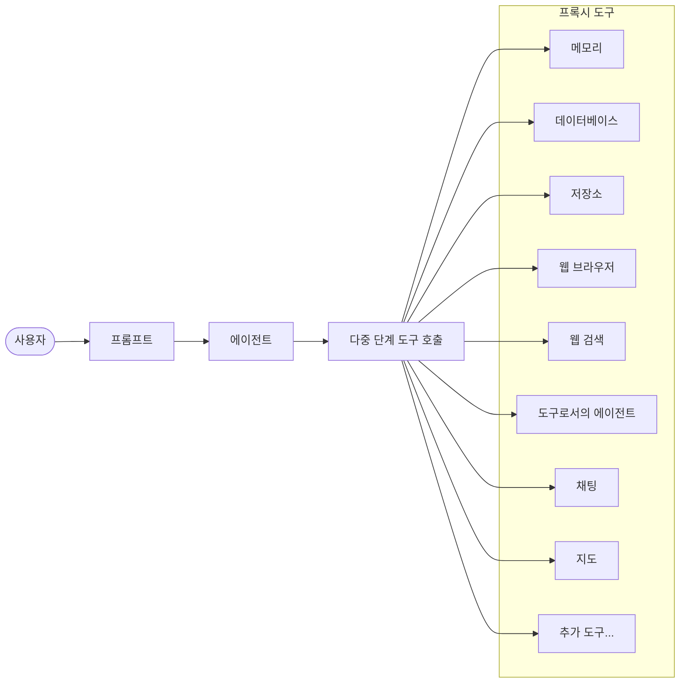
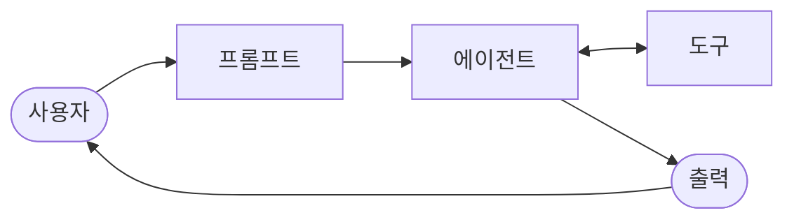

import { KeyPoints, OriginalText, Diagram, CrossRef, ChapterNav } from '@site/src/components';

<KeyPoints
  items={[
    "툴 사용(tool use) 패턴은 LLM이 외부 API, 데이터베이스, 서비스와 상호작용하거나 코드를 실행할 수 있게 해주는 핵심 에이전틱 설계 패턴입니다.",
    "함수 호출(Function Calling)은 툴 사용의 기술적 구현 메커니즘으로, LLM이 언제 어떤 도구를 사용할지 결정하고 구조화된 JSON 형태의 함수 호출 요청을 생성합니다.",
    "툴 사용 프로세스는 도구 정의 → LLM 결정 → 함수 호출 생성 → 도구 실행 → 결과 반환 → LLM 처리의 6단계로 구성됩니다.",
    "LangChain, CrewAI, Google ADK(에이전트 개발 키트(ADK)) 등의 프레임워크는 도구 정의와 에이전트 워크플로 통합을 위한 구조화된 추상화를 제공합니다.",
    "툴 사용 패턴은 LLM을 단순 텍스트 생성기에서 실제 세계와 상호작용하고 실시간 정보를 제공하는 에이전트로 변환하는 필수 요소입니다.",
  ]}
/>

# 5장: 툴 사용(Tool Use) / 함수 호출(Function Calling)

## 툴 사용(Tool Use) 패턴 개요

지금까지 에이전틱 패턴 중 언어 모델 간의 상호작용을 오케스트레이션하고 에이전트 내부 워크플로 내 정보 흐름을 관리하는 패턴들을 살펴보았습니다(프롬프트 체이닝(prompt chaining), 라우팅, 병렬화, 반성적 검토). 그러나 에이전트가 진정으로 유용하며 실제 세계 또는 외부 시스템과 상호작용하려면 도구(Tools)를 사용하는 능력이 필요합니다.

툴 사용(tool use) 패턴은 함수 호출(Function Calling)이라는 메커니즘을 통해 구현되는 경우가 많으며, 에이전트가 외부 API, 데이터베이스, 서비스와 상호작용하거나 심지어 코드를 실행할 수 있게 해줍니다. 이 패턴은 에이전트 핵심에 있는 LLM이 사용자의 요청이나 현재 작업 상태에 따라 특정 외부 함수를 언제, 어떻게 사용할지 결정할 수 있도록 합니다.

이 프로세스는 일반적으로 다음 단계를 포함합니다:

1. **도구 정의(Tool Definition)**: 외부 함수 또는 기능이 LLM에 정의되고 설명됩니다. 이 설명에는 함수의 목적, 이름, 허용되는 매개변수(파라미터), 그리고 각 매개변수의 타입과 설명이 포함됩니다.
2. **LLM 결정(LLM Decision)**: LLM은 사용자의 요청과 사용 가능한 도구 정의를 수신합니다. LLM은 요청과 도구에 대한 이해를 바탕으로 요청을 이행하기 위해 하나 이상의 도구를 호출하는 것이 필요한지 결정합니다.
3. **함수 호출 생성(Function Call Generation)**: LLM이 도구를 사용하기로 결정하면, 호출할 도구의 이름과 사용자 요청에서 추출한 인수를 지정하는 구조화된 출력(구조화된 출력(Structured Output), 즉 JSON 객체)을 생성합니다.
4. **도구 실행(Tool Execution)**: 에이전틱 프레임워크 또는 오케스트레이션 계층이 이 구조화된 출력을 가로챕니다. 요청된 도구를 식별하고 제공된 인수와 함께 실제 외부 함수를 실행합니다.
5. **관찰/결과(Observation/Result)**: 도구 실행의 출력 또는 결과가 에이전트에 반환됩니다.
6. **LLM 처리(선택적이지만 일반적)(LLM Processing)**: LLM은 도구의 출력을 컨텍스트로 수신하고, 이를 활용하여 사용자에게 최종 응답을 작성하거나 워크플로의 다음 단계를 결정합니다(다른 도구를 호출하거나, 반성적 검토를 하거나, 최종 답변을 제공하는 것이 포함될 수 있습니다).

이 패턴은 LLM 학습 데이터의 한계를 극복하고, 최신 정보에 접근하며, 내부적으로 수행하기 어려운 계산을 처리하고, 사용자별 데이터와 상호작용하거나 실제 세계에서 행동을 트리거할 수 있게 해주기 때문에 근본적으로 중요합니다. 함수 호출(Function Calling)은 LLM의 추론 능력과 외부에서 사용 가능한 방대한 기능들 사이의 간극을 메우는 기술적 메커니즘입니다.

"함수 호출"이 특정하고 사전 정의된 코드 함수를 호출하는 것을 잘 표현하는 반면, "툴 호출(tool calling)"이라는 더 포괄적인 개념을 고려하는 것도 유용합니다. 이 더 넓은 용어는 에이전트의 역량이 단순한 함수 실행을 훨씬 넘어설 수 있음을 인정합니다. "도구"는 전통적인 함수일 수도 있지만, 복잡한 API 엔드포인트, 데이터베이스에 대한 요청, 또는 심지어 다른 특화된 에이전트에게 향한 지시일 수도 있습니다. 이 관점은 예를 들어 주 에이전트가 복잡한 데이터 분석 작업을 전용 "분석가 에이전트"에게 위임하거나 API를 통해 외부 지식 베이스를 조회하는 더 정교한 시스템을 구상할 수 있게 해줍니다. "툴 호출"의 관점으로 생각하면 에이전트가 다양한 디지털 자원과 다른 지능 개체들의 생태계에 걸쳐 오케스트레이터로 역할하는 잠재력을 더 잘 포착할 수 있습니다.

LangChain, LangGraph, Google 에이전트 개발 키트(ADK) 같은 프레임워크는 도구를 정의하고 에이전트 워크플로에 통합하기 위한 강력한 지원을 제공하며, Gemini 또는 OpenAI 시리즈와 같은 현대 LLM의 네이티브 함수 호출 기능을 활용합니다. 이러한 프레임워크의 "캔버스" 위에서 도구를 정의하고, 이 도구들을 인식하고 사용할 수 있는 에이전트(일반적으로 LLM 에이전트)를 구성합니다.

툴 사용(tool use)은 강력하고 상호작용적이며 외부 인식 에이전트를 구축하기 위한 핵심 패턴입니다.

---

## 실용적 응용 및 사용 사례

툴 사용(tool use) 패턴은 에이전트가 텍스트 생성을 넘어 행동을 수행하거나 특정하고 동적인 정보를 검색해야 하는 거의 모든 시나리오에 적용 가능합니다:

**1. 외부 소스에서 정보 검색:**

LLM의 학습 데이터에 없는 실시간 데이터 또는 정보에 접근합니다.

- **사용 사례**: 날씨 에이전트
  - **도구**: 위치를 입력받아 현재 날씨 상태를 반환하는 날씨 API
  - **에이전트 흐름**: 사용자가 "런던 날씨는 어때요?"라고 묻고, LLM이 날씨 도구의 필요성을 파악하여 "런던"으로 도구를 호출하고, 도구가 데이터를 반환하면 LLM이 데이터를 사용자 친화적인 응답으로 구성합니다.

**2. 데이터베이스 및 API와의 상호작용:**

구조화된 데이터에 대한 조회, 업데이트 또는 기타 작업을 수행합니다.

- **사용 사례**: 전자상거래 에이전트
  - **도구**: 제품 재고 확인, 주문 상태 조회, 결제 처리를 위한 API 호출
  - **에이전트 흐름**: 사용자가 "제품 X가 재고에 있나요?"라고 묻고, LLM이 재고 API를 호출하고, 도구가 재고 수량을 반환하면 LLM이 사용자에게 재고 상태를 알려줍니다.

**3. 계산 및 데이터 분석 수행:**

외부 계산기, 데이터 분석 라이브러리, 또는 통계 도구를 사용합니다.

- **사용 사례**: 금융 에이전트
  - **도구**: 계산기 함수, 주식 시장 데이터 API, 스프레드시트 도구
  - **에이전트 흐름**: 사용자가 "AAPL의 현재 가격은 얼마이고, $150에 100주를 샀다면 잠재적 이익은 얼마인가요?"라고 묻고, LLM이 주식 API를 호출하여 현재 가격을 얻고, 계산기 도구를 호출하여 결과를 얻어 응답을 구성합니다.

**4. 통신 전송:**

이메일, 메시지 발송 또는 외부 통신 서비스에 대한 API 호출을 수행합니다.

- **사용 사례**: 개인 비서 에이전트
  - **도구**: 이메일 발송 API
  - **에이전트 흐름**: 사용자가 "내일 회의에 대해 John에게 이메일을 보내줘."라고 말하면, LLM이 요청에서 추출한 수신자, 제목, 본문과 함께 이메일 도구를 호출합니다.

**5. 코드 실행:**

특정 작업을 수행하기 위해 안전한 환경에서 코드 스니펫을 실행합니다.

- **사용 사례**: 코딩 어시스턴트 에이전트
  - **도구**: 코드 인터프리터(code interpreter)
  - **에이전트 흐름**: 사용자가 Python 스니펫을 제공하고 "이 코드가 무엇을 하나요?"라고 묻고, LLM이 인터프리터 도구를 사용하여 코드를 실행하고 출력을 분석합니다.

**6. 다른 시스템 또는 장치 제어:**

스마트 홈 장치, IoT 플랫폼 또는 기타 연결된 시스템과 상호작용합니다.

- **사용 사례**: 스마트 홈 에이전트
  - **도구**: 스마트 조명을 제어하는 API
  - **에이전트 흐름**: 사용자가 "거실 조명을 꺼줘."라고 말하면, LLM이 명령과 대상 장치와 함께 스마트 홈 도구를 호출합니다.

툴 사용(tool use)은 언어 모델을 단순한 텍스트 생성기에서 디지털 또는 물리적 세계에서 감지하고, 추론하며, 행동할 수 있는 에이전트로 변환하는 요소입니다(그림 1 참조).

<figure>



<figcaption>그림 1: 도구 사용 패턴 — 에이전트가 메모리·DB·저장소·웹·검색 등 다양한 프록시 도구를 활용</figcaption>
</figure>

---

## 실습 코드 예제 (LangChain)

LangChain 프레임워크 내에서 툴 사용(tool use)의 구현은 두 단계 프로세스입니다. 먼저 기존 Python 함수 또는 기타 실행 가능한 구성 요소를 캡슐화하여 하나 이상의 도구를 정의합니다. 이후 이 도구들을 언어 모델에 바인딩하여 모델이 사용자의 쿼리를 이행하기 위해 외부 함수 호출이 필요하다고 판단할 때 구조화된 툴 사용 요청을 생성할 수 있는 능력을 부여합니다.

다음 구현에서는 정보 검색 도구를 시뮬레이션하는 간단한 함수를 먼저 정의하여 이 원칙을 보여줍니다. 그 다음, 사용자 입력에 응답하여 이 도구를 활용하도록 에이전트를 구성하고 설정합니다. 이 예제를 실행하려면 핵심 LangChain 라이브러리와 모델별 공급자 패키지를 설치해야 합니다. 또한 선택한 언어 모델 서비스, 일반적으로 로컬 환경에 설정된 API 키를 통한 인증이 필수 전제 조건입니다.

```python
import os, getpass
import asyncio
import nest_asyncio
from typing import List
from dotenv import load_dotenv
import logging

from langchain_google_genai import ChatGoogleGenerativeAI
from langchain_core.prompts import ChatPromptTemplate
from langchain_core.tools import tool as langchain_tool
from langchain.agents import create_tool_calling_agent, AgentExecutor

# UNCOMMENT
# Prompt the user securely and set API keys as an environment
variables
os.environ["GOOGLE_API_KEY"] = getpass.getpass("Enter your Google API
key: ")
os.environ["OPENAI_API_KEY"] = getpass.getpass("Enter your OpenAI API
key: ")

try:
  # A model with function/tool calling capabilities is required.
  llm = ChatGoogleGenerativeAI(model="gemini-2.0-flash",
temperature=0)
  print(f"✅ Language model initialized: {llm.model}")
except Exception as e:
  print(f"🛑 Error initializing language model: {e}")
  llm = None

# --- Define a Tool ---
@langchain_tool
def search_information(query: str) -> str:
  """
  Provides factual information on a given topic. Use this tool to
find answers to phrases
  like 'capital of France' or 'weather in London?'.
  """
  print(f"\n--- 🛠️ Tool Called: search_information with query:
'{query}' ---")
  # Simulate a search tool with a dictionary of predefined results.
  simulated_results = {
      "weather in london": "The weather in London is currently cloudy
with a temperature of 15°C.",
```

```python
      "capital of france": "The capital of France is Paris.",
      "population of earth": "The estimated population of Earth is
around 8 billion people.",
      "tallest mountain": "Mount Everest is the tallest mountain
above sea level.",
      "default": f"Simulated search result for '{query}': No specific
information found, but the topic seems interesting."
  }
  result = simulated_results.get(query.lower(),
simulated_results["default"])
  print(f"--- TOOL RESULT: {result} ---")
  return result

tools = [search_information]

# --- Create a Tool-Calling Agent ---
if llm:
  # This prompt template requires an `agent_scratchpad` placeholder
for the agent's internal steps.
  agent_prompt = ChatPromptTemplate.from_messages([
      ("system", "You are a helpful assistant."),
      ("human", "{input}"),
      ("placeholder", "{agent_scratchpad}"),
  ])

  # Create the agent, binding the LLM, tools, and prompt together.
  agent = create_tool_calling_agent(llm, tools, agent_prompt)

  # AgentExecutor is the runtime that invokes the agent and executes
the chosen tools.
  # The 'tools' argument is not needed here as they are already bound
to the agent.
  agent_executor = AgentExecutor(agent=agent, verbose=True,
tools=tools)

async def run_agent_with_tool(query: str):
  """Invokes the agent executor with a query and prints the final
response."""
  print(f"\n--- 🏃 Running Agent with Query: '{query}' ---")
  try:
      response = await agent_executor.ainvoke({"input": query})
      print("\n--- ✅ Final Agent Response ---")
      print(response["output"])
  except Exception as e:
      print(f"\n🛑 An error occurred during agent execution: {e}")

async def main():
```

```python
  """Runs all agent queries concurrently."""
  tasks = [
      run_agent_with_tool("What is the capital of France?"),
      run_agent_with_tool("What's the weather like in London?"),
      run_agent_with_tool("Tell me something about dogs.") # Should
trigger the default tool response
  ]
  await asyncio.gather(*tasks)

nest_asyncio.apply()
asyncio.run(main())
```

이 코드는 LangChain 라이브러리와 Google Gemini 모델을 사용하여 툴 호출 에이전트를 설정합니다. 특정 쿼리에 대한 사실적 답변을 제공하는 `search_information` 도구를 시뮬레이션하여 정의합니다. 이 도구는 "weather in london", "capital of france", "population of earth"에 대한 사전 정의된 응답과 다른 쿼리에 대한 기본 응답을 가지고 있습니다. ChatGoogleGenerativeAI 모델이 초기화되어 툴 호출 기능을 갖추고 있습니다. ChatPromptTemplate이 에이전트의 상호작용을 안내하기 위해 생성됩니다. `create_tool_calling_agent` 함수는 언어 모델, 도구, 프롬프트를 에이전트로 결합하는 데 사용됩니다. AgentExecutor는 에이전트의 실행과 도구 호출을 관리하도록 설정됩니다. `run_agent_with_tool` 비동기 함수는 주어진 쿼리로 에이전트를 호출하고 결과를 출력하도록 정의됩니다. `main` 비동기 함수는 동시에 실행될 여러 쿼리를 준비합니다. 이 쿼리들은 `search_information` 도구의 특정 응답과 기본 응답을 모두 테스트하도록 설계되었습니다. 마지막으로 `asyncio.run(main())` 호출이 모든 에이전트 작업을 실행합니다. 코드에는 에이전트 설정과 실행을 진행하기 전에 LLM 초기화 성공 여부를 확인하는 점검이 포함되어 있습니다.

---

## 실습 코드 예제 (CrewAI)

이 코드는 CrewAI 프레임워크 내에서 함수 호출(도구)을 구현하는 실용적인 예제를 제공합니다. 에이전트가 정보를 조회하는 도구를 갖추고 있는 간단한 시나리오를 설정합니다. 이 예제는 특히 이 에이전트와 도구를 사용하여 시뮬레이션된 주식 가격을 가져오는 방법을 보여줍니다.

```python
# pip install crewai langchain-openai

import os
from crewai import Agent, Task, Crew
from crewai.tools import tool
import logging
```

```python
# --- Best Practice: Configure Logging ---
# A basic logging setup helps in debugging and tracking the crew's
execution.
logging.basicConfig(level=logging.INFO, format='%(asctime)s -
%(levelname)s - %(message)s')

# --- Set up your API Key ---
# For production, it's recommended to use a more secure method for
key management
# like environment variables loaded at runtime or a secret manager.
#
# Set the environment variable for your chosen LLM provider (e.g.,
OPENAI_API_KEY)
# os.environ["OPENAI_API_KEY"] = "YOUR_API_KEY"
# os.environ["OPENAI_MODEL_NAME"] = "gpt-4o"

# --- 1. Refactored Tool: Returns Clean Data ---
# The tool now returns raw data (a float) or raises a standard Python
error.
# This makes it more reusable and forces the agent to handle outcomes
properly.
@tool("Stock Price Lookup Tool")
def get_stock_price(ticker: str) -> float:
   """
   Fetches the latest simulated stock price for a given stock ticker
symbol.
   Returns the price as a float. Raises a ValueError if the ticker is
not found.
   """
   logging.info(f"Tool Call: get_stock_price for ticker '{ticker}'")
   simulated_prices = {
       "AAPL": 178.15,
       "GOOGL": 1750.30,
       "MSFT": 425.50,
   }
   price = simulated_prices.get(ticker.upper())

   if price is not None:
       return price
   else:
       # Raising a specific error is better than returning a string.
       # The agent is equipped to handle exceptions and can decide on
the next action.
       raise ValueError(f"Simulated price for ticker
'{ticker.upper()}' not found.")
```

```python
# --- 2. Define the Agent ---
# The agent definition remains the same, but it will now leverage the
improved tool.
financial_analyst_agent = Agent(
 role='Senior Financial Analyst',
 goal='Analyze stock data using provided tools and report key
prices.',
 backstory="You are an experienced financial analyst adept at using
data sources to find stock information. You provide clear, direct
answers.",
 verbose=True,
 tools=[get_stock_price],
 # Allowing delegation can be useful, but is not necessary for this
simple task.
 allow_delegation=False,
)

# --- 3. Refined Task: Clearer Instructions and Error Handling ---
# The task description is more specific and guides the agent on how
to react
# to both successful data retrieval and potential errors.
analyze_aapl_task = Task(
 description=(
     "What is the current simulated stock price for Apple (ticker:
AAPL)? "
     "Use the 'Stock Price Lookup Tool' to find it. "
     "If the ticker is not found, you must report that you were
unable to retrieve the price."
 ),
 expected_output=(
     "A single, clear sentence stating the simulated stock price for
AAPL. "
     "For example: 'The simulated stock price for AAPL is $178.15.' "
     "If the price cannot be found, state that clearly."
 ),
 agent=financial_analyst_agent,
)

# --- 4. Formulate the Crew ---
# The crew orchestrates how the agent and task work together.
financial_crew = Crew(
 agents=[financial_analyst_agent],
 tasks=[analyze_aapl_task],
 verbose=True # Set to False for less detailed logs in production
)

# --- 5. Run the Crew within a Main Execution Block ---
```

```python
# Using a __name__ == "__main__": block is a standard Python best
practice.
def main():
   """Main function to run the crew."""
   # Check for API key before starting to avoid runtime errors.
   if not os.environ.get("OPENAI_API_KEY"):
       print("ERROR: The OPENAI_API_KEY environment variable is not
set.")
       print("Please set it before running the script.")
       return

   print("\n## Starting the Financial Crew...")
   print("---------------------------------")

   # The kickoff method starts the execution.
   result = financial_crew.kickoff()

   print("\n---------------------------------")
   print("## Crew execution finished.")
   print("\nFinal Result:\n", result)

if __name__ == "__main__":
   main()
```

이 코드는 Crew.ai 라이브러리를 사용하여 금융 분석 작업을 시뮬레이션하는 간단한 애플리케이션을 보여줍니다. 사전 정의된 티커에 대한 주식 가격 조회를 시뮬레이션하는 커스텀 도구 `get_stock_price`를 정의합니다. 이 도구는 유효한 티커에 대해 부동소수점 숫자를 반환하거나 유효하지 않은 티커에 대해 `ValueError`를 발생시키도록 설계되었습니다. 시니어 금융 분석가 역할의 Crew.ai 에이전트 `financial_analyst_agent`가 생성됩니다. 이 에이전트에게 상호작용할 `get_stock_price` 도구가 주어집니다. `analyze_aapl_task`라는 작업이 정의되어, 에이전트가 도구를 사용하여 AAPL의 시뮬레이션 주식 가격을 찾도록 지시합니다. 작업 설명에는 도구 사용 시 성공과 실패 케이스 모두를 처리하는 방법에 대한 명확한 지시가 포함됩니다. `financial_analyst_agent`와 `analyze_aapl_task`로 구성된 크루가 조합됩니다. `verbose` 설정이 에이전트와 크루 모두에 활성화되어 실행 중 상세한 로깅을 제공합니다. 스크립트의 주요 부분은 표준 `if __name__ == "__main__":` 블록 내에서 `kickoff()` 메서드를 사용하여 크루의 작업을 실행합니다. 크루를 시작하기 전에 에이전트가 기능하는 데 필요한 `OPENAI_API_KEY` 환경 변수가 설정되었는지 확인합니다. 작업의 출력인 크루 실행 결과가 콘솔에 출력됩니다. 코드에는 크루의 행동과 도구 호출을 더 잘 추적하기 위한 기본 로깅 구성도 포함됩니다. API 키 관리에는 환경 변수를 사용하며, 프로덕션 환경에서는 더 안전한 방법을 권장합니다. 요약하면, 핵심 로직은 Crew.ai에서 협력적 워크플로를 생성하기 위해 도구, 에이전트, 작업을 정의하는 방법을 보여줍니다.

---

## 실습 코드 (Google ADK)

Google 에이전트 개발 키트(ADK)에는 에이전트의 기능에 직접 통합될 수 있는 네이티브 통합 도구 라이브러리가 포함되어 있습니다.

**Google 검색(Google Search)**: 이러한 구성 요소의 주요 예는 Google Search 도구입니다. 이 도구는 Google 검색 엔진에 대한 직접 인터페이스 역할을 하며, 에이전트가 웹 검색을 수행하고 외부 정보를 검색하는 기능을 갖추게 합니다.

```python
from google.adk.agents import Agent
from google.adk.runners import Runner
from google.adk.sessions import InMemorySessionService
from google.adk.tools import google_search
from google.genai import types
import nest_asyncio
import asyncio

# Define variables required for Session setup and Agent execution
APP_NAME="Google Search_agent"
USER_ID="user1234"
SESSION_ID="1234"

# Define Agent with access to search tool
root_agent = ADKAgent(
  name="basic_search_agent",
  model="gemini-2.0-flash-exp",
  description="Agent to answer questions using Google Search.",
  instruction="I can answer your questions by searching the internet.
Just ask me anything!",
  tools=[google_search] # Google Search is a pre-built tool to
perform Google searches.
)

# Agent Interaction
async def call_agent(query):
  """
  Helper function to call the agent with a query.
  """

  # Session and Runner
```

```text
  session_service = InMemorySessionService()
  session = await session_service.create_session(app_name=APP_NAME,
user_id=USER_ID, session_id=SESSION_ID)
  runner = Runner(agent=root_agent, app_name=APP_NAME,
session_service=session_service)

  content = types.Content(role='user',
parts=[types.Part(text=query)])
  events = runner.run(user_id=USER_ID, session_id=SESSION_ID,
new_message=content)

  for event in events:
      if event.is_final_response():
          final_response = event.content.parts[0].text
          print("Agent Response: ", final_response)

nest_asyncio.apply()

asyncio.run(call_agent("what's the latest ai news?"))
```

이 코드는 Python용 Google ADK를 사용하여 기본 에이전트를 생성하고 사용하는 방법을 보여줍니다. 에이전트는 Google Search를 도구로 활용하여 질문에 답하도록 설계되었습니다. 먼저 필요한 라이브러리가 임포트됩니다. 애플리케이션 이름, 사용자 ID, 세션 ID에 대한 상수가 정의됩니다. "basic_search_agent"라는 이름의 에이전트 인스턴스가 생성됩니다. ADK에서 제공하는 사전 구축 도구인 Google Search 도구를 사용하도록 구성됩니다. InMemorySessionService(8장 참조)가 에이전트의 세션을 관리하도록 초기화됩니다. `call_agent` 헬퍼 함수가 에이전트에 쿼리를 보내고 응답을 처리하는 과정을 단순화하기 위해 정의됩니다. 마지막으로 `call_agent` 함수가 "what's the latest ai news?" 쿼리와 함께 호출되어 에이전트를 시연합니다.

**코드 실행(Code Execution)**: Google ADK에는 특화된 작업을 위한 통합 구성 요소가 포함되어 있으며, 동적 코드 실행 환경도 그 중 하나입니다. `built_in_code_execution` 도구는 에이전트에게 샌드박스(sandbox)된 Python 인터프리터를 제공합니다. 이를 통해 모델은 코드를 작성하고 실행하여 계산 작업을 수행하고, 데이터 구조를 조작하며, 절차적 스크립트를 실행할 수 있습니다. 이러한 기능은 확률적 언어 생성만으로는 범위를 벗어난 결정론적 로직과 정밀한 계산이 필요한 문제를 처리하는 데 중요합니다.

```python
import os, getpass
import asyncio
import nest_asyncio
from typing import List
from dotenv import load_dotenv
import logging
from google.adk.agents import Agent as ADKAgent, LlmAgent
from google.adk.runners import Runner
from google.adk.sessions import InMemorySessionService
from google.adk.tools import google_search
from google.adk.code_executors import BuiltInCodeExecutor
from google.genai import types

# Define variables required for Session setup and Agent execution
APP_NAME="calculator"
USER_ID="user1234"
SESSION_ID="session_code_exec_async"

# Agent Definition
code_agent = LlmAgent(
  name="calculator_agent",
  model="gemini-2.0-flash",
  code_executor=BuiltInCodeExecutor(),
  instruction="""You are a calculator agent.
  When given a mathematical expression, write and execute Python code
to calculate the result.
  Return only the final numerical result as plain text, without
markdown or code blocks.
  """,
  description="Executes Python code to perform calculations.",
)

# Agent Interaction (Async)
async def call_agent_async(query):

  # Session and Runner
  session_service = InMemorySessionService()
```

````python
  session = await session_service.create_session(app_name=APP_NAME,
user_id=USER_ID, session_id=SESSION_ID)
  runner = Runner(agent=code_agent, app_name=APP_NAME,
session_service=session_service)

  content = types.Content(role='user',
parts=[types.Part(text=query)])
  print(f"\n--- Running Query: {query} ---")
  final_response_text = "No final text response captured."
  try:
      # Use run_async
      async for event in runner.run_async(user_id=USER_ID,
session_id=SESSION_ID, new_message=content):
          print(f"Event ID: {event.id}, Author: {event.author}")

          # --- Check for specific parts FIRST ---
          # has_specific_part = False
          if event.content and event.content.parts and
event.is_final_response():
              for part in event.content.parts: # Iterate through all
parts
                  if part.executable_code:
                      # Access the actual code string via .code
                      print(f"  Debug: Agent generated
code:\n```python\n{part.executable_code.code}\n```")
                      has_specific_part = True
                  elif part.code_execution_result:
                      # Access outcome and output correctly
                      print(f"  Debug: Code Execution Result:
{part.code_execution_result.outcome} -
Output:\n{part.code_execution_result.output}")
                      has_specific_part = True
                  # Also print any text parts found in any event for
debugging
                  elif part.text and not part.text.isspace():
                      print(f"  Text: '{part.text.strip()}'")
                      # Do not set has_specific_part=True here, as we
want the final response logic below

              # --- Check for final response AFTER specific parts ---
              text_parts = [part.text for part in event.content.parts
if part.text]
              final_result = "".join(text_parts)
              print(f"==> Final Agent Response: {final_result}")

  except Exception as e:
      print(f"ERROR during agent run: {e}")
````

```python
  print("-" * 30)

# Main async function to run the examples
async def main():
  await call_agent_async("Calculate the value of (5 + 7) * 3")
  await call_agent_async("What is 10 factorial?")

# Execute the main async function
try:
  nest_asyncio.apply()
  asyncio.run(main())
except RuntimeError as e:
  # Handle specific error when running asyncio.run in an already
running loop (like Jupyter/Colab)
  if "cannot be called from a running event loop" in str(e):
      print("\nRunning in an existing event loop (like
Colab/Jupyter).")
      print("Please run `await main()` in a notebook cell instead.")
      # If in an interactive environment like a notebook, you might
need to run:
      # await main()
  else:
      raise e # Re-raise other runtime errors
```

이 스크립트는 Google의 에이전트 개발 키트(ADK)를 사용하여 Python 코드를 작성하고 실행하여 수학 문제를 해결하는 에이전트를 생성합니다. `built_in_code_execution` 도구를 갖춘 계산기로 행동하도록 특별히 지시된 LlmAgent를 정의합니다. 주요 로직은 사용자의 쿼리를 에이전트의 러너에 전송하고 결과 이벤트를 처리하는 `call_agent_async` 함수에 있습니다. 이 함수 내부에서 비동기 루프가 이벤트를 반복하며 디버깅을 위해 생성된 Python 코드와 실행 결과를 출력합니다. 마지막으로, `main` 함수가 서로 다른 두 개의 수학 표현식으로 에이전트를 실행하여 계산 수행 능력을 보여줍니다.

**엔터프라이즈 검색(Enterprise Search)**: 이 코드는 Python에서 `google.adk` 라이브러리를 사용하는 Google ADK 애플리케이션을 정의합니다. 특히 지정된 Vertex AI Search 데이터스토어를 검색하여 질문에 답하도록 설계된 VSearchAgent를 사용합니다. 코드는 "q2_strategy_vsearch_agent"라는 이름의 VSearchAgent를 초기화하며, 설명, 사용할 모델("gemini-2.0-flash-exp"), Vertex AI Search 데이터스토어 ID를 제공합니다. `DATASTORE_ID`는 환경 변수로 설정될 것으로 예상됩니다.

```python
import asyncio
from google.genai import types
from google.adk import agents
from google.adk.runners import Runner
from google.adk.sessions import InMemorySessionService
import os

# --- Configuration ---
# Ensure you have set your GOOGLE_API_KEY and DATASTORE_ID
environment variables
# For example:
# os.environ["GOOGLE_API_KEY"] = "YOUR_API_KEY"
# os.environ["DATASTORE_ID"] = "YOUR_DATASTORE_ID"

DATASTORE_ID = os.environ.get("DATASTORE_ID")

# --- Application Constants ---
APP_NAME = "vsearch_app"
USER_ID = "user_123"  # Example User ID
SESSION_ID = "session_456" # Example Session ID

# --- Agent Definition (Updated with the newer model from the guide)
---
vsearch_agent = agents.VSearchAgent(
   name="q2_strategy_vsearch_agent",
   description="Answers questions about Q2 strategy documents using
Vertex AI Search.",
   model="gemini-2.0-flash-exp", # Updated model based on the guide's
examples
   datastore_id=DATASTORE_ID,
   model_parameters={"temperature": 0.0}
```

```python
)

# --- Runner and Session Initialization ---
runner = Runner(
   agent=vsearch_agent,
   app_name=APP_NAME,
   session_service=InMemorySessionService(),
)

# --- Agent Invocation Logic ---
async def call_vsearch_agent_async(query: str):
   """Initializes a session and streams the agent's response."""
   print(f"User: {query}")
   print("Agent: ", end="", flush=True)

   try:
       # Construct the message content correctly
       content = types.Content(role='user',
parts=[types.Part(text=query)])


       # Process events as they arrive from the asynchronous runner
       async for event in runner.run_async(
           user_id=USER_ID,
           session_id=SESSION_ID,
           new_message=content
       ):
           # For token-by-token streaming of the response text
           if hasattr(event, 'content_part_delta') and
event.content_part_delta:
               print(event.content_part_delta.text, end="",
flush=True)

           # Process the final response and its associated metadata
           if event.is_final_response():
               print() # Newline after the streaming response
               if event.grounding_metadata:
                   print(f"  (Source Attributions:
{len(event.grounding_metadata.grounding_attributions)} sources
found)")
               else:
                   print("  (No grounding metadata found)")
               print("-" * 30)

   except Exception as e:
       print(f"\nAn error occurred: {e}")
       print("Please ensure your datastore ID is correct and that the
```

```python
service account has the necessary permissions.")
       print("-" * 30)

# --- Run Example ---
async def run_vsearch_example():
   # Replace with a question relevant to YOUR datastore content
   await call_vsearch_agent_async("Summarize the main points about
the Q2 strategy document.")
   await call_vsearch_agent_async("What safety procedures are
mentioned for lab X?")

# --- Execution ---
if __name__ == "__main__":
   if not DATASTORE_ID:
       print("Error: DATASTORE_ID environment variable is not set.")
   else:
       try:
           asyncio.run(run_vsearch_example())
       except RuntimeError as e:
           # This handles cases where asyncio.run is called in an
environment
           # that already has a running event loop (like a Jupyter
notebook).
           if "cannot be called from a running event loop" in str(e):
               print("Skipping execution in a running event loop.
Please run this script directly.")
           else:
               raise e
```

이 코드는 데이터스토어에 저장된 정보를 기반으로 질문에 답하기 위해 Vertex AI Search를 활용하는 대화형 AI 애플리케이션을 구축하기 위한 기본 프레임워크를 제공합니다. 에이전트를 정의하고, 러너를 설정하며, 응답을 스트리밍하면서 비동기적으로 에이전트와 상호작용하는 방법을 보여줍니다.

**Vertex Extensions**: Vertex AI 익스텐션(extension)은 모델이 실시간 데이터 처리 및 행동 실행을 위해 외부 API에 연결할 수 있게 해주는 구조화된 API 래퍼입니다. 익스텐션은 엔터프라이즈급 보안, 데이터 프라이버시, 성능 보장을 제공합니다. 코드 생성 및 실행, 웹사이트 쿼리, 프라이빗 데이터스토어의 정보 분석과 같은 작업에 사용될 수 있습니다. Google은 코드 인터프리터(Code Interpreter)와 Vertex AI Search와 같은 일반적인 사용 사례를 위한 사전 구축 익스텐션을 제공하며, 커스텀 익스텐션도 생성할 수 있는 옵션이 있습니다. 익스텐션의 주요 이점에는 강력한 엔터프라이즈 제어와 다른 Google 제품과의 원활한 통합이 포함됩니다. 익스텐션과 함수 호출(Function Calling)의 핵심 차이는 실행 방식에 있습니다: Vertex AI는 익스텐션을 자동으로 실행하는 반면, 함수 호출은 사용자 또는 클라이언트의 수동 실행이 필요합니다.

---

## 한눈에 보기

**무엇인가(What)**: LLM은 강력한 텍스트 생성기이지만 근본적으로 외부 세계와 단절되어 있습니다. 그들의 지식은 학습 데이터에 한정된 정적인 것이며, 행동을 수행하거나 실시간 정보를 검색하는 능력이 없습니다. 이 내재된 한계는 외부 API, 데이터베이스, 서비스와의 상호작용이 필요한 작업을 완료하는 것을 방해합니다. 이러한 외부 시스템에 대한 다리 없이는 실제 문제 해결을 위한 유용성이 심각하게 제한됩니다.

**왜인가(Why)**: 툴 사용(tool use) 패턴은 함수 호출(Function Calling)을 통해 구현되는 경우가 많으며, 이 문제에 대한 표준화된 해결책을 제공합니다. LLM이 이해할 수 있는 방식으로 사용 가능한 외부 함수, 즉 "도구"를 설명하는 방식으로 작동합니다. 사용자의 요청을 기반으로, 에이전틱 LLM은 도구가 필요한지 결정하고 어떤 함수를 호출할지와 어떤 인수와 함께 할지를 지정하는 구조화된 데이터 객체(JSON 등)를 생성할 수 있습니다. 오케스트레이션 계층이 이 함수 호출을 실행하고, 결과를 검색하여 LLM에 다시 전달합니다. 이를 통해 LLM은 최신의 외부 정보 또는 행동의 결과를 최종 응답에 통합하여 효과적으로 행동할 수 있는 능력을 갖게 됩니다.

**경험적 지침(Rule of thumb)**: 에이전트가 LLM의 내부 지식에서 벗어나 외부 세계와 상호작용해야 할 때마다 툴 사용(tool use) 패턴을 사용하십시오. 이것은 실시간 데이터가 필요한 작업(예: 날씨, 주가 확인), 프라이빗 또는 독점 정보에 접근하는 작업(예: 회사 데이터베이스 쿼리), 정밀한 계산 수행, 코드 실행, 또는 다른 시스템에서 행동을 트리거하는 작업(예: 이메일 발송, 스마트 장치 제어)에 필수적입니다.

**시각적 요약:**

<figure>



<figcaption>그림 2: 도구 사용 설계 패턴 — 에이전트가 도구와 상호작용하며 출력을 생성</figcaption>
</figure>

---

## 핵심 요점

- 툴 사용(Tool Use) (함수 호출(Function Calling))은 에이전트가 외부 시스템과 상호작용하고 동적 정보에 접근할 수 있게 해줍니다.
- LLM이 이해할 수 있는 명확한 설명과 매개변수를 가진 도구를 정의하는 것이 포함됩니다.
- LLM은 도구를 언제 사용할지 결정하고 구조화된 함수 호출을 생성합니다.
- 에이전틱 프레임워크가 실제 도구 호출을 실행하고 결과를 LLM에 반환합니다.
- 툴 사용(Tool Use)은 실제 세계 행동을 수행하고 최신 정보를 제공할 수 있는 에이전트를 구축하는 데 필수적입니다.
- LangChain은 `@tool` 데코레이터를 사용한 도구 정의를 단순화하고 툴 사용 에이전트를 구축하기 위한 `create_tool_calling_agent`와 `AgentExecutor`를 제공합니다.
- Google ADK에는 Google 검색, 코드 실행, Vertex AI Search 도구와 같은 매우 유용한 사전 구축 도구가 다수 있습니다.

---

## 결론

툴 사용(Tool Use) 패턴은 대규모 언어 모델의 기능적 범위를 본질적인 텍스트 생성 능력을 넘어 확장하기 위한 중요한 아키텍처 원칙입니다. 모델에 외부 소프트웨어 및 데이터 소스와 인터페이스할 수 있는 능력을 부여함으로써, 이 패러다임은 에이전트가 다른 시스템에서 행동을 수행하고, 계산을 실행하며, 정보를 검색할 수 있게 해줍니다. 이 프로세스는 모델이 사용자의 쿼리를 이행하기 위해 필요하다고 판단할 때 외부 도구를 호출하는 구조화된 요청을 생성하는 것을 포함합니다. LangChain, Google ADK, Crew AI와 같은 프레임워크는 이러한 외부 도구의 통합을 용이하게 하는 구조화된 추상화와 구성 요소를 제공합니다. 이러한 프레임워크는 모델에 도구 사양을 노출하고 이후 툴 사용 요청을 파싱하는 프로세스를 관리합니다. 이는 외부 디지털 환경과 상호작용하고 행동을 취할 수 있는 정교한 에이전틱 시스템의 개발을 단순화합니다.

---

## 참고 문헌

1. LangChain Documentation (Tools): [https://python.langchain.com/docs/integrations/tools/](https://python.langchain.com/docs/integrations/tools/)
2. Google Agent Developer Kit (ADK) Documentation (Tools): [https://google.github.io/adk-docs/tools/](https://google.github.io/adk-docs/tools/)
3. OpenAI Function Calling Documentation: [https://platform.openai.com/docs/guides/function-calling](https://platform.openai.com/docs/guides/function-calling)
4. CrewAI Documentation (Tools): [https://docs.crewai.com/concepts/tools](https://docs.crewai.com/concepts/tools)
