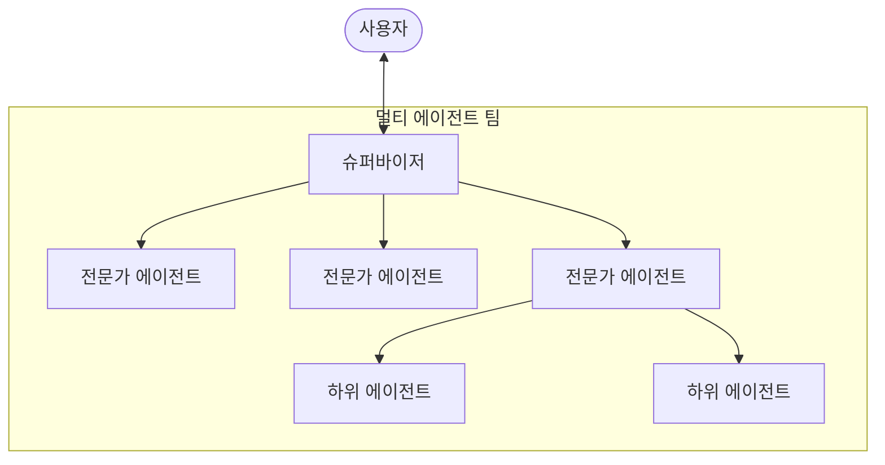
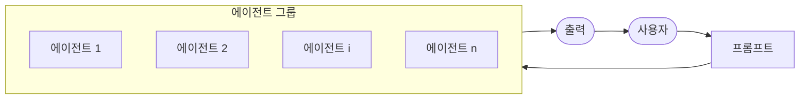

import { KeyPoints, Diagram, CrossRef, ChapterNav } from '@site/src/components';

<KeyPoints
  items={[
    "멀티 에이전트 협업(Multi-Agent Collaboration)은 복잡하고 다영역에 걸친 작업을 처리하기 위해 여러 전문화된 에이전트를 협력적으로 구성하는 패턴입니다.",
    "협업 형태에는 순차적 핸드오프(Sequential Handoffs), 병렬 처리, 토론과 합의(Debate and Consensus), 계층적 구조(Hierarchical Structures), 전문가 팀(Expert Teams), 비평자-검토자 방식이 포함됩니다.",
    "에이전트 간 상호작용 모델은 단일 에이전트에서 네트워크, 감독자(Supervisor), 계층형(Hierarchical), 커스텀(Custom) 구조까지 다양한 스펙트럼을 이룹니다.",
    "Crew AI와 Google ADK는 에이전트, 작업, 상호작용 절차를 정의하기 위한 구조를 제공하여 이 패턴의 구현을 지원합니다.",
    "이 패턴은 다양한 전문 지식, 병렬 처리, 또는 여러 단계로 구성된 구조적 워크플로가 필요한 복잡한 문제에 이상적입니다.",
  ]}
/>

# 7장: 멀티 에이전트 협업

단일 에이전트 아키텍처는 명확히 정의된 문제에는 효과적일 수 있으나, 복잡하고 다영역에 걸친 작업에 직면했을 때는 그 역량이 종종 제한됩니다. 멀티 에이전트 협업(Multi-Agent Collaboration) 패턴은 시스템을 독립적이고 전문화된 에이전트들의 협력적 앙상블로 구성함으로써 이러한 한계를 해결합니다. 이 접근 방식은 작업 분해(task decomposition)의 원칙에 기반하며, 고수준 목표를 이산적인 하위 문제들로 분해합니다. 각 하위 문제는 해당 작업에 가장 적합한 특정 도구, 데이터 접근 권한 또는 추론 역량을 보유한 에이전트에게 할당됩니다.

예를 들어, 복잡한 연구 쿼리는 정보 검색을 위한 Research Agent, 통계 처리를 위한 Data Analysis Agent, 최종 보고서 생성을 위한 Synthesis Agent로 분해되어 할당될 수 있습니다. 이러한 시스템의 효율성은 단순한 분업에 의한 것이 아니라, 에이전트 간 통신(inter-agent communication) 메커니즘에 결정적으로 의존합니다. 이를 위해서는 표준화된 통신 프로토콜과 공유 온톨로지가 필요하며, 이를 통해 에이전트들이 데이터를 교환하고, 하위 작업을 위임하며, 최종 출력이 일관성을 갖도록 행동을 조율할 수 있습니다.

이 분산 아키텍처는 모듈성, 확장성, 견고성 향상 등 여러 장점을 제공합니다. 단일 에이전트의 실패가 반드시 전체 시스템 장애로 이어지지 않기 때문입니다. 협업을 통해 멀티 에이전트 시스템의 집단적 성능이 앙상블 내 어떤 단일 에이전트의 잠재적 역량도 뛰어넘는 시너지적 결과를 달성할 수 있습니다.

## 멀티 에이전트 협업 패턴 개요

멀티 에이전트 협업 패턴은 여러 독립적이거나 반독립적인 에이전트가 공동 목표를 달성하기 위해 협력하는 시스템을 설계하는 것을 포함합니다. 각 에이전트는 일반적으로 정의된 역할, 전체 목표와 일치하는 특정 목표, 그리고 잠재적으로 서로 다른 도구나 지식 베이스에 대한 접근 권한을 가집니다. 이 패턴의 강점은 이러한 에이전트들 간의 상호작용과 시너지에 있습니다.

협업은 다양한 형태를 취할 수 있습니다.

- **순차적 핸드오프**: 한 에이전트가 작업을 완료하고 그 출력을 파이프라인의 다음 단계를 위해 다른 에이전트에게 전달합니다(계획 수립 패턴과 유사하지만, 명시적으로 서로 다른 에이전트를 포함합니다).
- **병렬 처리**: 여러 에이전트가 문제의 서로 다른 부분을 동시에 처리하고, 그 결과가 나중에 결합됩니다.
- **토론과 합의**: 다양한 관점과 정보 소스를 가진 에이전트들이 옵션을 평가하기 위해 토론에 참여하여 궁극적으로 합의나 더 정보에 기반한 결정에 도달하는 멀티 에이전트 협업입니다.
- **계층적 구조**: 관리자 에이전트가 해당 에이전트들의 도구 접근 권한이나 플러그인 역량에 따라 동적으로 작업자 에이전트에게 작업을 위임하고 결과를 합성할 수 있습니다. 각 에이전트는 또한 모든 도구를 단일 에이전트가 처리하는 대신 관련 도구 그룹을 처리할 수 있습니다.
- **전문가 팀**: 서로 다른 도메인(예: 연구원, 작가, 편집자)의 전문 지식을 갖춘 에이전트들이 복잡한 출력을 생성하기 위해 협력합니다.
- **비평자-검토자**: 에이전트들이 계획, 초안, 답변과 같은 초기 출력물을 생성합니다. 두 번째 그룹의 에이전트들이 정책 준수, 보안, 컴플라이언스, 정확성, 품질 및 조직 목표와의 일치 여부에 대해 이 출력물을 비판적으로 평가합니다. 원래 창작자 또는 최종 에이전트가 이 피드백을 바탕으로 출력물을 수정합니다. 이 패턴은 코드 생성(Code Generation), 연구 작성, 논리 검증 및 윤리적 정렬 보장에 특히 효과적입니다. 이 접근 방식의 장점으로는 견고성 향상, 품질 개선, 환각(hallucination)이나 오류 발생 가능성 감소가 있습니다.

멀티 에이전트 시스템(그림 1 참조)은 근본적으로 에이전트 역할과 책임의 구분, 에이전트들이 정보를 교환하는 통신 채널의 수립, 그리고 협력적 노력을 지시하는 작업 흐름이나 상호작용 프로토콜의 공식화로 구성됩니다.

<figure>


<figcaption>그림 1 — 멀티 에이전트 시스템의 예시</figcaption>
</figure>

Crew AI와 Google ADK와 같은 프레임워크는 에이전트, 작업 및 상호작용 절차의 명세를 위한 구조를 제공함으로써 이 패러다임을 지원하도록 설계되었습니다. 이 접근 방식은 다양한 전문 지식이 필요하고, 여러 이산적 단계를 포함하거나, 동시 처리 및 에이전트 간 정보 검증의 장점을 활용하는 도전에 특히 효과적입니다.

## 실용적 응용 및 사용 사례

멀티 에이전트 협업은 다양한 도메인에 적용 가능한 강력한 패턴입니다.

- **복잡한 연구 및 분석**: 에이전트 팀이 연구 프로젝트에서 협력할 수 있습니다. 한 에이전트는 학술 데이터베이스 검색을 전문으로 하고, 다른 에이전트는 결과 요약, 세 번째 에이전트는 트렌드 식별, 네 번째 에이전트는 정보를 보고서로 종합하는 것을 전담합니다. 이는 인간 연구팀이 운영되는 방식을 반영합니다.
- **소프트웨어 개발**: 에이전트들이 소프트웨어 구축에서 협력하는 것을 상상해 보십시오. 한 에이전트는 요구사항 분석가, 다른 에이전트는 코드 생성기, 세 번째 에이전트는 테스터, 네 번째 에이전트는 문서 작성자가 될 수 있습니다. 이들은 컴포넌트를 구축하고 검증하기 위해 서로 간에 출력물을 전달할 수 있습니다.
- **창의적 콘텐츠 생성**: 마케팅 캠페인을 만들기 위해 시장 조사 에이전트, 카피라이터 에이전트, 그래픽 디자인 에이전트(이미지 생성 도구 사용), 소셜 미디어 일정 관리 에이전트가 모두 함께 협력할 수 있습니다.
- **금융 분석**: 멀티 에이전트 시스템이 금융 시장을 분석할 수 있습니다. 에이전트들은 주가 데이터 가져오기, 뉴스 감성 분석, 기술적 분석 수행, 투자 권장 사항 생성을 전문으로 할 수 있습니다.
- **고객 지원 에스컬레이션**: 일선 지원 에이전트가 초기 쿼리를 처리하다가, 문제 복잡성에 따른 순차적 핸드오프를 시연하면서 필요할 때 전문 에이전트(예: 기술 전문가 또는 청구 전문가)에게 복잡한 문제를 에스컬레이션할 수 있습니다.
- **공급망 최적화**: 에이전트들이 공급망의 서로 다른 노드(공급업체, 제조업체, 유통업체)를 나타내고, 변화하는 수요나 장애에 대응하여 재고 수준, 물류, 일정을 최적화하기 위해 협력할 수 있습니다.
- **네트워크 분석 및 복구**: 자율적 운영은 특히 장애 지점 파악에서 에이전틱 아키텍처로부터 큰 혜택을 받습니다. 여러 에이전트가 문제를 분류하고 복구하며 최적 조치를 제안하기 위해 협력할 수 있습니다. 이러한 에이전트들은 또한 기존 기계 학습 모델 및 도구와 통합되어, 생성형 AI의 장점을 동시에 제공하면서 기존 시스템을 활용할 수 있습니다.

전문화된 에이전트를 구분하고 상호관계를 세심하게 오케스트레이션하는 역량은 개발자들이 향상된 모듈성, 확장성을 갖추고 단일 통합 에이전트에는 극복 불가능한 복잡성을 처리할 수 있는 시스템을 구축하도록 합니다.

## 멀티 에이전트 협업: 상호관계 및 통신 구조 탐구

에이전트들이 상호작용하고 통신하는 복잡한 방식을 이해하는 것은 효과적인 멀티 에이전트 시스템을 설계하는 데 근본적입니다. 그림 2에 묘사된 바와 같이, 가장 단순한 단일 에이전트 시나리오부터 복잡한 맞춤형 협업 프레임워크에 이르기까지 다양한 상호관계 및 통신 모델이 존재합니다. 각 모델은 고유한 장단점을 제시하며, 멀티 에이전트 시스템의 전반적인 효율성, 견고성 및 적응성에 영향을 미칩니다.

**1. 단일 에이전트(Single Agent)**: 가장 기본적인 수준에서 "단일 에이전트"는 다른 개체와의 직접적인 상호작용이나 통신 없이 자율적으로 작동합니다. 이 모델은 구현 및 관리가 간단하지만, 그 역량은 본질적으로 개별 에이전트의 범위와 자원에 의해 제한됩니다. 각각 단일의 자족적 에이전트로 해결 가능한 독립적 하위 문제로 분해될 수 있는 작업에 적합합니다.

**2. 네트워크(Network)**: "네트워크" 모델은 협업을 향한 중요한 단계로, 여러 에이전트가 탈중앙화된 방식으로 서로 직접 상호작용합니다. 통신은 일반적으로 피어 투 피어 방식으로 이루어지며, 정보, 자원, 심지어 작업의 공유가 가능합니다. 이 모델은 한 에이전트의 실패가 반드시 전체 시스템을 마비시키지 않으므로 복원력을 높입니다. 그러나 대규모의 비구조화된 네트워크에서 통신 오버헤드를 관리하고 일관된 의사결정을 보장하는 것은 어려울 수 있습니다.

**3. 감독자(Supervisor)**: "감독자" 모델에서는 전담 에이전트인 "감독자"가 하위 에이전트 그룹의 활동을 감독하고 조율합니다. 감독자는 통신, 작업 할당 및 충돌 해결을 위한 중앙 허브 역할을 합니다. 이 계층적 구조는 명확한 권한 체계를 제공하고 관리 및 통제를 단순화할 수 있습니다. 그러나 단일 실패 지점(감독자)이 발생하고, 감독자가 다수의 하위 에이전트나 복잡한 작업에 압도되면 병목 현상이 생길 수 있습니다.

**4. 도구로서의 감독자(Supervisor as a Tool)**: 이 모델은 "감독자" 개념의 미묘한 확장으로, 감독자의 역할이 직접적인 명령과 통제보다는 다른 에이전트들에게 자원, 가이드, 또는 분석적 지원을 제공하는 것에 더 가깝습니다. 감독자는 반드시 모든 행동을 지시하지 않고도 다른 에이전트들이 작업을 더 효과적으로 수행할 수 있는 도구, 데이터, 또는 컴퓨팅 서비스를 제공할 수 있습니다. 이 접근 방식은 경직된 하향식 통제를 부과하지 않고 감독자의 역량을 활용하는 것을 목표로 합니다.

**5. 계층형(Hierarchical)**: "계층형" 모델은 감독자 개념을 확장하여 다층 조직 구조를 만듭니다. 이는 여러 수준의 감독자로 이루어지며, 상위 수준 감독자가 하위 수준 감독자를 감독하고, 궁극적으로 최하위 계층에 운영 에이전트 집합이 있습니다. 이 구조는 각 계층이 관리하는 하위 문제로 분해될 수 있는 복잡한 문제에 잘 적합합니다. 정의된 경계 내에서 분산 의사결정을 가능하게 하여 확장성과 복잡성 관리에 대한 구조화된 접근 방식을 제공합니다.

<figure>

<figcaption>그림 2 — 에이전트들은 다양한 방식으로 통신하고 상호작용합니다.</figcaption>
</figure>

**6. 커스텀(Custom)**: "커스텀" 모델은 멀티 에이전트 시스템 설계에서 최고의 유연성을 나타냅니다. 주어진 문제나 애플리케이션의 특정 요구사항에 정확히 맞춘 고유한 상호관계 및 통신 구조를 만들 수 있습니다. 이는 앞서 언급한 모델들의 요소를 결합하는 하이브리드 접근 방식이나, 환경의 고유한 제약과 기회에서 등장하는 완전히 새로운 설계를 포함할 수 있습니다. 커스텀 모델은 특정 성능 지표 최적화, 고도로 동적인 환경 처리, 또는 도메인별 지식을 시스템 아키텍처에 통합하려는 필요에서 종종 발생합니다. 커스텀 모델을 설계하고 구현하려면 일반적으로 멀티 에이전트 시스템 원칙에 대한 깊은 이해와 통신 프로토콜, 조율 메커니즘, 창발적 행동에 대한 신중한 고려가 필요합니다.

요약하자면, 멀티 에이전트 시스템의 상호관계 및 통신 모델 선택은 중요한 설계 결정입니다. 각 모델은 뚜렷한 장단점을 제공하며, 최적의 선택은 작업의 복잡성, 에이전트 수, 원하는 자율성 수준, 견고성 필요성, 허용 가능한 통신 오버헤드와 같은 요소에 달려 있습니다. 멀티 에이전트 시스템의 미래 발전은 이러한 모델을 계속 탐구하고 개선하며 협업 지능을 위한 새로운 패러다임을 개발할 것으로 예상됩니다.

## 실습 코드 (Crew AI)

이 Python 코드는 CrewAI 프레임워크를 사용하여 AI 트렌드에 관한 블로그 게시물을 생성하는 AI 팀(crew)을 정의합니다. 환경을 설정하고 .env 파일에서 API 키를 로드하는 것으로 시작합니다. 애플리케이션의 핵심은 두 에이전트를 정의하는 것입니다. AI 트렌드를 찾아 요약하는 연구원 에이전트, 그리고 연구 결과를 바탕으로 블로그 게시물을 작성하는 작성자 에이전트입니다.

두 가지 작업이 이에 따라 정의됩니다. 하나는 트렌드 조사를 위한 것이고, 다른 하나는 블로그 게시물 작성을 위한 것으로, 작성 작업은 조사 작업의 출력에 의존합니다. 이 에이전트들과 작업들은 순차 프로세스(sequential process)를 지정하는 Crew에 조립되어 작업이 순서대로 실행됩니다. Crew는 에이전트, 작업, 그리고 언어 모델(특히 "gemini-2.0-flash" 모델)로 초기화됩니다. 메인 함수는 `kickoff()` 메서드를 사용하여 이 crew를 실행하며, 에이전트들 간의 협업을 조율하여 원하는 출력을 생성합니다. 마지막으로, 코드는 crew 실행의 최종 결과인 생성된 블로그 게시물을 출력합니다.

```python
import os
from dotenv import load_dotenv
from crewai import Agent, Task, Crew, Process
from langchain_google_genai import ChatGoogleGenerativeAI

def setup_environment():
   """Loads environment variables and checks for the required API
key."""
   load_dotenv()
   if not os.getenv("GOOGLE_API_KEY"):
       raise ValueError("GOOGLE_API_KEY not found. Please set it in
your .env file.")

def main():
   """
   Initializes and runs the AI crew for content creation using the
latest Gemini model.
   """
   setup_environment()

   # Define the language model to use.
```

```python
   # Updated to a model from the Gemini 2.0 series for better
performance and features.
   # For cutting-edge (preview) capabilities, you could use
"gemini-2.5-flash".
   llm = ChatGoogleGenerativeAI(model="gemini-2.0-flash")

   # Define Agents with specific roles and goals
   researcher = Agent(
       role='Senior Research Analyst',
       goal='Find and summarize the latest trends in AI.',
       backstory="You are an experienced research analyst with a
knack for identifying key trends and synthesizing information.",
       verbose=True,
       allow_delegation=False,
   )

   writer = Agent(
       role='Technical Content Writer',
       goal='Write a clear and engaging blog post based on research
findings.',
       backstory="You are a skilled writer who can translate complex
technical topics into accessible content.",
       verbose=True,
       allow_delegation=False,
   )

   # Define Tasks for the agents
   research_task = Task(
       description="Research the top 3 emerging trends in Artificial
Intelligence in 2024-2025. Focus on practical applications and
potential impact.",
       expected_output="A detailed summary of the top 3 AI trends,
including key points and sources.",
       agent=researcher,
   )

   writing_task = Task(
       description="Write a 500-word blog post based on the research
findings. The post should be engaging and easy for a general audience
to understand.",
       expected_output="A complete 500-word blog post about the
latest AI trends.",
       agent=writer,
       context=[research_task],
   )

   # Create the Crew
```

```python
   blog_creation_crew = Crew(
       agents=[researcher, writer],
       tasks=[research_task, writing_task],
       process=Process.sequential,
       llm=llm,
       verbose=2 # Set verbosity for detailed crew execution logs
   )

   # Execute the Crew
   print("## Running the blog creation crew with Gemini 2.0 Flash...
##")
   try:
       result = blog_creation_crew.kickoff()
       print("\n------------------\n")
       print("## Crew Final Output ##")
       print(result)
   except Exception as e:
       print(f"\nAn unexpected error occurred: {e}")


if __name__ == "__main__":
   main()
```

이제 Google ADK 프레임워크 내의 추가 예제들을 살펴보겠습니다. 특히 계층형, 병렬, 순차 조율 패러다임과 함께 에이전트를 운영 도구로 구현하는 방법에 중점을 둡니다.

## 실습 코드 (Google ADK)

다음 코드 예제는 부모-자식 관계를 생성하여 Google ADK 내에서 계층적 에이전트 구조를 수립하는 방법을 보여줍니다. 코드는 두 가지 유형의 에이전트를 정의합니다. LlmAgent와 BaseAgent에서 파생된 커스텀 TaskExecutor 에이전트입니다. TaskExecutor는 특정 비LLM 작업을 위해 설계되었으며 이 예제에서는 단순히 "Task finished successfully" 이벤트를 생성합니다. greeter라는 LlmAgent는 친근한 인사를 하도록 지정된 모델과 instruction으로 초기화됩니다. 커스텀 TaskExecutor는 task_doer로 인스턴스화됩니다. coordinator라는 부모 LlmAgent가 생성되며, 모델과 instruction도 함께 정의됩니다. coordinator의 instruction은 인사는 greeter에게, 작업 실행은 task_doer에게 위임하도록 안내합니다. greeter와 task_doer는 coordinator의 하위 에이전트로 추가되어 부모-자식 관계를 수립합니다. 코드는 이 관계가 올바르게 설정되었는지 확인합니다. 마지막으로 에이전트 계층 구조가 성공적으로 생성되었음을 나타내는 메시지를 출력합니다.

```python
from google.adk.agents import LlmAgent, BaseAgent
from google.adk.agents.invocation_context import InvocationContext
from google.adk.events import Event
from typing import AsyncGenerator

# Correctly implement a custom agent by extending BaseAgent
class TaskExecutor(BaseAgent):
   """A specialized agent with custom, non-LLM behavior."""
   name: str = "TaskExecutor"
   description: str = "Executes a predefined task."

   async def _run_async_impl(self, context: InvocationContext) ->
AsyncGenerator[Event, None]:
       """Custom implementation logic for the task."""
       # This is where your custom logic would go.
       # For this example, we'll just yield a simple event.
       yield Event(author=self.name, content="Task finished
successfully.")

# Define individual agents with proper initialization
# LlmAgent requires a model to be specified.
greeter = LlmAgent(
   name="Greeter",
   model="gemini-2.0-flash-exp",
   instruction="You are a friendly greeter."
)
task_doer = TaskExecutor() # Instantiate our concrete custom agent

# Create a parent agent and assign its sub-agents
# The parent agent's description and instructions should guide its
delegation logic.
coordinator = LlmAgent(
   name="Coordinator",
   model="gemini-2.0-flash-exp",
   description="A coordinator that can greet users and execute
tasks.",
   instruction="When asked to greet, delegate to the Greeter. When
asked to perform a task, delegate to the TaskExecutor.",
   sub_agents=[
       greeter,
       task_doer
   ]
)

# The ADK framework automatically establishes the parent-child
```

```python
relationships.
# These assertions will pass if checked after initialization.
assert greeter.parent_agent == coordinator
assert task_doer.parent_agent == coordinator

print("Agent hierarchy created successfully.")
```

이 코드 발췌문은 Google ADK 프레임워크 내에서 LoopAgent를 사용하여 반복 워크플로를 수립하는 방법을 보여줍니다. 코드는 두 에이전트를 정의합니다. ConditionChecker와 ProcessingStep입니다. ConditionChecker는 세션 상태에서 "status" 값을 확인하는 커스텀 에이전트입니다. "status"가 "completed"이면 ConditionChecker는 루프를 중지하기 위해 이벤트를 에스컬레이션합니다. 그렇지 않으면 루프를 계속하기 위한 이벤트를 생성합니다. ProcessingStep은 "gemini-2.0-flash-exp" 모델을 사용하는 LlmAgent입니다. 그 instruction은 작업을 수행하고, 최종 단계인 경우 세션 "status"를 "completed"로 설정하는 것입니다. StatusPoller라는 LoopAgent가 생성됩니다. StatusPoller는 max_iterations=10으로 구성됩니다. StatusPoller는 ProcessingStep과 ConditionChecker 인스턴스를 하위 에이전트로 포함합니다. LoopAgent는 최대 10회 반복까지 하위 에이전트를 순차적으로 실행하며, ConditionChecker가 상태가 "completed"임을 발견하면 중지됩니다.

```python
import asyncio
from typing import AsyncGenerator
from google.adk.agents import LoopAgent, LlmAgent, BaseAgent
from google.adk.events import Event, EventActions
from google.adk.agents.invocation_context import InvocationContext

# Best Practice: Define custom agents as complete, self-describing
classes.
class ConditionChecker(BaseAgent):
   """A custom agent that checks for a 'completed' status in the
session state."""
   name: str = "ConditionChecker"
   description: str = "Checks if a process is complete and signals
the loop to stop."

   async def _run_async_impl(
       self, context: InvocationContext
   ) -> AsyncGenerator[Event, None]:
       """Checks state and yields an event to either continue or stop
the loop."""
       status = context.session.state.get("status", "pending")
```

```python
       is_done = (status == "completed")

       if is_done:
           # Escalate to terminate the loop when the condition is
met.
           yield Event(author=self.name,
actions=EventActions(escalate=True))
       else:
           # Yield a simple event to continue the loop.
           yield Event(author=self.name, content="Condition not met,
continuing loop.")

# Correction: The LlmAgent must have a model and clear instructions.
process_step = LlmAgent(
   name="ProcessingStep",
   model="gemini-2.0-flash-exp",
   instruction="You are a step in a longer process. Perform your
task. If you are the final step, update session state by setting
'status' to 'completed'."
)

# The LoopAgent orchestrates the workflow.
poller = LoopAgent(
   name="StatusPoller",
   max_iterations=10,
   sub_agents=[
       process_step,
       ConditionChecker() # Instantiating the well-defined custom
agent.
   ]
)

# This poller will now execute 'process_step'
# and then 'ConditionChecker'
# repeatedly until the status is 'completed' or 10 iterations
# have passed.
```

이 코드 발췌문은 선형 워크플로 구축을 위해 설계된 Google ADK 내의 SequentialAgent 패턴을 설명합니다. 이 코드는 google.adk.agents 라이브러리를 사용하여 순차 에이전트 파이프라인을 정의합니다. 파이프라인은 두 에이전트 step1과 step2로 구성됩니다. step1은 "Step1_Fetch"로 명명되며 출력이 "data" 키 아래 세션 상태에 저장됩니다. step2는 "Step2_Process"로 명명되며 session.state["data"]에 저장된 정보를 분석하고 요약을 제공하도록 지시받습니다. "MyPipeline"이라는 SequentialAgent가 이 하위 에이전트들의 실행을 조율합니다. 파이프라인이 초기 입력으로 실행되면 step1이 먼저 실행됩니다. step1의 응답은 "data" 키 아래 세션 상태에 저장됩니다. 이후 step2가 실행되어 instruction에 따라 step1이 상태에 저장한 정보를 활용합니다. 이 구조는 한 에이전트의 출력이 다음 에이전트의 입력이 되는 워크플로를 구축할 수 있게 합니다. 이는 다단계 AI 또는 데이터 처리 파이프라인을 만드는 데 일반적인 패턴입니다.

```python
from google.adk.agents import SequentialAgent, Agent

# This agent's output will be saved to session.state["data"]
step1 = Agent(name="Step1_Fetch", output_key="data")

# This agent will use the data from the previous step.
# We instruct it on how to find and use this data.
step2 = Agent(
   name="Step2_Process",
   instruction="Analyze the information found in state['data'] and
provide a summary."
)

pipeline = SequentialAgent(
   name="MyPipeline",
   sub_agents=[step1, step2]
)

# When the pipeline is run with an initial input, Step1 will execute,
# its response will be stored in session.state["data"], and then
# Step2 will execute, using the information from the state as
instructed.
```

다음 코드 예제는 여러 에이전트 작업의 동시 실행을 가능하게 하는 Google ADK 내의 ParallelAgent 패턴을 보여줍니다. data_gatherer는 weather_fetcher와 news_fetcher 두 하위 에이전트를 동시에 실행하도록 설계되었습니다. weather_fetcher 에이전트는 주어진 위치의 날씨를 가져와 그 결과를 session.state["weather_data"]에 저장하도록 지시받습니다. 마찬가지로 news_fetcher 에이전트는 주어진 주제의 상위 뉴스를 검색하여 session.state["news_data"]에 저장하도록 지시받습니다. 각 하위 에이전트는 "gemini-2.0-flash-exp" 모델을 사용하도록 구성됩니다. ParallelAgent는 이 하위 에이전트들의 실행을 조율하여 병렬로 작동하게 합니다. weather_fetcher와 news_fetcher의 결과는 세션 상태에 수집 및 저장됩니다. 마지막으로, 예제는 에이전트 실행이 완료된 후 final_state에서 수집된 날씨 및 뉴스 데이터에 접근하는 방법을 보여줍니다.

```python
from google.adk.agents import Agent, ParallelAgent

# It's better to define the fetching logic as tools for the agents
# For simplicity in this example, we'll embed the logic in the
agent's instruction.
# In a real-world scenario, you would use tools.

# Define the individual agents that will run in parallel
weather_fetcher = Agent(
   name="weather_fetcher",
   model="gemini-2.0-flash-exp",
   instruction="Fetch the weather for the given location and return
only the weather report.",
   output_key="weather_data"  # The result will be stored in
session.state["weather_data"]
)

news_fetcher = Agent(
   name="news_fetcher",
   model="gemini-2.0-flash-exp",
   instruction="Fetch the top news story for the given topic and
return only that story.",
   output_key="news_data"      # The result will be stored in
session.state["news_data"]
)

# Create the ParallelAgent to orchestrate the sub-agents
data_gatherer = ParallelAgent(
   name="data_gatherer",
   sub_agents=[
       weather_fetcher,
       news_fetcher
   ]
)
```

제공된 코드 세그먼트는 Google ADK 내의 "도구로서의 에이전트(Agent as a Tool)" 패러다임을 예시하며, 에이전트가 함수 호출과 유사한 방식으로 다른 에이전트의 역량을 활용할 수 있게 합니다. 구체적으로 이 코드는 Google의 LlmAgent와 AgentTool 클래스를 사용한 이미지 생성 시스템을 정의합니다. 부모 artist_agent와 하위 에이전트 image_generator_agent로 구성됩니다. `generate_image` 함수는 이미지 생성을 시뮬레이션하는 간단한 도구로, 모의 이미지 데이터를 반환합니다. image_generator_agent는 수신된 텍스트 프롬프트를 기반으로 이 도구를 사용할 책임이 있습니다. artist_agent의 역할은 먼저 창의적인 이미지 프롬프트를 고안하는 것입니다. 그런 다음 AgentTool 래퍼를 통해 image_generator_agent를 호출합니다. AgentTool은 한 에이전트가 다른 에이전트를 도구로 사용할 수 있게 하는 브리지 역할을 합니다. artist_agent가 image_tool을 호출하면 AgentTool이 아티스트의 고안된 프롬프트로 image_generator_agent를 호출합니다. image_generator_agent는 그 프롬프트로 `generate_image` 함수를 사용합니다. 마지막으로 생성된 이미지(또는 모의 데이터)가 에이전트들을 통해 반환됩니다. 이 아키텍처는 상위 수준 에이전트가 하위 수준의 전문화된 에이전트를 조율하여 작업을 수행하는 계층화된 에이전트 시스템을 보여줍니다.

```python
from google.adk.agents import LlmAgent
from google.adk.tools import agent_tool
from google.genai import types

# 1. A simple function tool for the core capability.
# This follows the best practice of separating actions from
reasoning.
def generate_image(prompt: str) -> dict:
   """
   Generates an image based on a textual prompt.

   Args:
       prompt: A detailed description of the image to generate.

   Returns:
       A dictionary with the status and the generated image bytes.
   """
   print(f"TOOL: Generating image for prompt: '{prompt}'")
   # In a real implementation, this would call an image generation
API.
   # For this example, we return mock image data.
   mock_image_bytes = b"mock_image_data_for_a_cat_wearing_a_hat"
   return {
       "status": "success",
       # The tool returns the raw bytes, the agent will handle the
Part creation.
       "image_bytes": mock_image_bytes,
       "mime_type": "image/png"
   }

# 2. Refactor the ImageGeneratorAgent into an LlmAgent.
# It now correctly uses the input passed to it.
```

```python
image_generator_agent = LlmAgent(
   name="ImageGen",
   model="gemini-2.0-flash",
   description="Generates an image based on a detailed text prompt.",
   instruction=(
       "You are an image generation specialist. Your task is to take
the user's request "
       "and use the `generate_image` tool to create the image. "
       "The user's entire request should be used as the 'prompt'
argument for the tool. "
       "After the tool returns the image bytes, you MUST output the
image."
   ),
   tools=[generate_image]
)

# 3. Wrap the corrected agent in an AgentTool.
# The description here is what the parent agent sees.
image_tool = agent_tool.AgentTool(
   agent=image_generator_agent,
   description="Use this tool to generate an image. The input should
be a descriptive prompt of the desired image."
)

# 4. The parent agent remains unchanged. Its logic was correct.
artist_agent = LlmAgent(
   name="Artist",
   model="gemini-2.0-flash",
   instruction=(
       "You are a creative artist. First, invent a creative and
descriptive prompt for an image. "
       "Then, use the `ImageGen` tool to generate the image using
your prompt."
   ),
   tools=[image_tool]
)
```

## 한눈에 보기

**무엇이 문제인가**: 복잡한 문제는 종종 단일 모놀리식 LLM 기반 에이전트의 역량을 초과합니다. 단독 에이전트는 다면적 작업의 모든 부분을 처리하는 데 필요한 다양하고 전문화된 기술이나 특정 도구에 대한 접근 권한이 부족할 수 있습니다. 이 한계는 병목 현상을 일으켜 시스템의 전반적인 효율성과 확장성을 줄입니다. 그 결과, 정교하고 다영역에 걸친 목표를 다루는 것이 비효율적이 되어 불완전하거나 최적이 아닌 결과로 이어질 수 있습니다.

**왜 멀티 에이전트 협업인가**: 멀티 에이전트 협업(Multi-Agent Collaboration) 패턴은 여러 협력하는 에이전트의 시스템을 만들어 표준화된 해결책을 제공합니다. 복잡한 문제가 더 작고 관리하기 쉬운 하위 문제들로 분해됩니다. 각 하위 문제는 이를 해결하는 데 필요한 정확한 도구와 역량을 갖춘 전문화된 에이전트에게 할당됩니다. 이 에이전트들은 순차적 핸드오프, 병렬 워크스트림, 또는 계층적 위임과 같은 정의된 통신 프로토콜 및 상호작용 모델을 통해 협력합니다. 이 에이전틱 분산 접근 방식은 시너지 효과를 만들어, 그룹이 어떤 단일 에이전트에게도 불가능한 결과를 달성할 수 있게 합니다.

**경험 법칙**: 작업이 단일 에이전트에게 너무 복잡하고 전문화된 기술이나 도구가 필요한 별개의 하위 작업으로 분해될 수 있을 때 이 패턴을 사용하십시오. 다양한 전문성, 병렬 처리, 또는 복잡한 연구 및 분석, 소프트웨어 개발, 창의적 콘텐츠 생성과 같이 여러 단계로 구성된 구조적 워크플로의 혜택을 받는 문제에 이상적입니다.

## 시각적 요약

<figure>


<figcaption>그림 3 — 멀티 에이전트 디자인 패턴</figcaption>
</figure>

---

## 핵심 정리

- 멀티 에이전트 협업은 공동 목표를 달성하기 위해 여러 에이전트가 협력하는 것을 포함합니다.
- 이 패턴은 전문화된 역할, 분산된 작업 및 에이전트 간 통신을 활용합니다.
- 협업은 순차적 핸드오프, 병렬 처리, 토론, 또는 계층적 구조와 같은 형태를 취할 수 있습니다.
- 이 패턴은 다양한 전문 지식이나 여러 별개 단계가 필요한 복잡한 문제에 이상적입니다.

---

## 결론

이 장에서는 멀티 에이전트 협업(Multi-Agent Collaboration) 패턴을 탐구하며, 시스템 내에서 여러 전문화된 에이전트를 오케스트레이션하는 이점을 보여주었습니다. 다양한 협업 모델을 살펴보면서, 다양한 도메인에 걸친 복잡하고 다면적인 문제를 해결하는 데 있어 이 패턴의 본질적인 역할을 강조하였습니다. 에이전트 협업을 이해하면 자연스럽게 외부 환경과의 상호작용에 대한 질문으로 이어집니다.

---

## 참고 문헌

1. Multi-Agent Collaboration Mechanisms: A Survey of LLMs, https://arxiv.org/abs/2501.06322
2. Multi-Agent System — The Power of Collaboration, https://aravindakumar.medium.com/introducing-multi-agent-frameworks-the-power-of-collaboration-e9db31bba1b6

---


<figure>



<figcaption>그림 1: 멀티 에이전트 시스템 예시 — 슈퍼바이저가 전문가 에이전트들을 계층적으로 조율</figcaption>
</figure>

<figure>



<figcaption>그림 3: 멀티 에이전트 설계 패턴 — 프롬프트가 에이전트 그룹으로 전달되어 협력 실행 후 출력 반환</figcaption>
</figure>

<ChapterNav
  prev={{ title: "6장 — 계획 수립", href: "/docs/part1/ch06" }}
  next={{ title: "8장 — 메모리 관리", href: "/docs/part1/ch08" }}
/>
