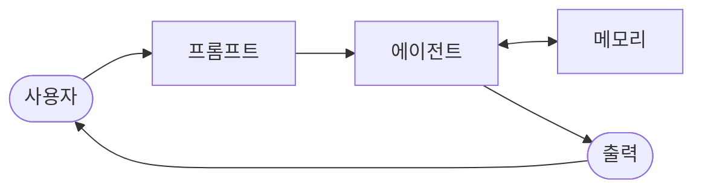

import { KeyPoints, OriginalText, Diagram, CrossRef, ChapterNav } from '@site/src/components';

<KeyPoints
  items={[
    "메모리 관리(Memory Management)는 에이전트가 과거 상호작용과 지식을 저장·조회·활용할 수 있도록 하는 핵심 패턴으로, 단기 기억과 장기 기억으로 구분됩니다.",
    "에피소드 기억(Episodic Memory)은 특정 상호작용과 경험을 기록하며, 의미 기억(Semantic Memory)은 사실·개념·규칙 등 일반적인 지식을 저장합니다.",
    "세션(Session) 기반 상태(State) 관리는 대화 흐름을 유지하는 핵심이며, ADK는 InMemorySessionService, DatabaseSessionService, VertexAiSessionService 세 가지 구현을 제공합니다.",
    "LangChain은 ChatMessageHistory와 ConversationBufferMemory를 통해 대화 기록을 관리하며, LangGraph의 BaseStore는 크로스 세션 장기 기억을 지원합니다.",
    "VertexAiRagMemoryService와 VertexAiMemoryBankService는 RAG 기반의 확장 가능한 프로덕션 메모리 솔루션을 제공합니다.",
  ]}
/>

# 8장: 메모리 관리

메모리 관리(Memory Management)는 에이전트 설계의 근본적인 측면으로, 에이전트가 시간이 지남에 따라 정보를 저장하고, 조회하며, 활용하는 방법을 결정합니다. 인간의 기억 시스템과 유사하게, AI 에이전트는 현재 대화에서 즉각적인 컨텍스트를 처리하는 능력뿐만 아니라 과거 상호작용에서 학습하고 관련 지식을 영속적으로 유지하는 능력도 필요합니다.

효과적인 메모리 관리는 에이전트가 일관성 있는 대화를 유지하고, 사용자 선호도를 기억하며, 이전에 수집한 지식을 적용하고, 여러 세션에 걸쳐 성능을 향상시킬 수 있도록 합니다. 메모리 시스템이 없다면, 에이전트는 각 상호작용을 독립적으로 처리하게 되어 맥락 인식이 부재하고 개인화된 경험 제공이 불가능해집니다.

이 장에서는 에이전트 메모리의 핵심 유형, 실제 구현에 사용되는 기술, 그리고 다양한 시나리오에서 효과적인 메모리 관리를 달성하는 방법을 살펴봅니다.

## 메모리 유형 개요

에이전트 메모리는 주로 두 가지 핵심 유형으로 구분됩니다: 단기 기억과 장기 기억. 이 구분은 정보가 얼마나 오래 유지되는지, 그리고 어떤 목적으로 사용되는지에 따라 결정됩니다.

**단기 기억**은 현재 진행 중인 대화나 작업의 즉각적인 컨텍스트를 유지합니다. 이는 보통 활성 세션(Session) 동안에만 존재하며, 컨텍스트 윈도우 내에서 관리됩니다. 단기 기억의 주요 특징은 다음과 같습니다.

- 현재 대화의 메시지 기록 유지
- 진행 중인 작업의 중간 결과 저장
- 현재 세션(Session)의 사용자 상태(State) 추적
- 컨텍스트 윈도우 크기에 의해 제한됨

**장기 기억**은 세션(Session)이 종료된 후에도 정보를 영속적으로 유지합니다. 이는 에이전트가 과거 경험으로부터 학습하고, 사용자 선호도를 기억하며, 시간이 지남에 따라 지식을 누적할 수 있도록 합니다. 장기 기억의 주요 특징은 다음과 같습니다.

- 여러 세션(Session)에 걸친 사용자 정보 및 선호도 유지
- 과거 대화 및 상호작용 기록 저장
- 도메인 지식 및 학습된 사실 보존
- 외부 데이터베이스나 벡터 데이터베이스에 저장됨

## 에피소드 기억과 의미 기억

장기 기억은 저장하는 정보의 성격에 따라 에피소드 기억(Episodic Memory)과 의미 기억(Semantic Memory)으로 더욱 세분화될 수 있습니다.

**에피소드 기억(Episodic Memory)**은 특정 사건, 경험, 상호작용에 관한 기억입니다. 이는 "무엇이, 언제, 어디서 일어났는지"에 대한 기록으로, 시간적 맥락을 포함합니다. 에이전트 시스템에서 에피소드 기억(Episodic Memory)의 예시는 다음과 같습니다.

- 사용자가 이전 세션(Session)에서 했던 특정 질문들
- 에이전트가 완료한 작업의 이력
- 특정 시점에 발생한 오류 및 해결 방법
- 개별 대화의 요약본

**의미 기억(Semantic Memory)**은 사실, 개념, 규칙, 관계에 관한 일반적인 지식입니다. 이는 특정 경험보다는 세상에 대한 일반적인 이해를 나타냅니다. 에이전트 시스템에서 의미 기억(Semantic Memory)의 예시는 다음과 같습니다.

- 도메인 특화 지식 및 전문 정보
- 사용자 프로필 및 장기적 선호도
- 회사 정책 및 절차
- 학습된 사실 및 관계

이 두 가지 기억 유형의 조합이 에이전트가 개인화되고 맥락 인식이 풍부한 경험을 제공하는 데 필수적입니다.

## ADK에서의 세션 및 상태 관리

Google Agent Developer Kit(ADK)에서 세션(Session)은 에이전트와 사용자 간의 단일 지속적인 대화 스레드를 나타냅니다. 각 세션(Session)은 고유한 식별자를 가지며, 해당 대화와 관련된 모든 메시지, 이벤트, 상태(State) 데이터를 포함합니다.

상태(State)는 세션(Session) 내에서 에이전트의 현재 컨텍스트와 관련 정보를 저장하는 딕셔너리입니다. 상태(State)를 사용하면 에이전트가 현재 대화의 흐름과 관련된 동적 데이터를 추적할 수 있습니다. ADK는 세션(Session) 및 상태(State) 관리를 위해 세 가지 주요 서비스 구현을 제공합니다.

### InMemorySessionService

`InMemorySessionService`는 모든 세션(Session) 데이터를 애플리케이션 메모리에 저장하는 가장 단순한 구현입니다. 로컬 개발 및 테스트에 적합하며, 애플리케이션이 재시작되면 모든 데이터가 손실됩니다.

````python
# 예제: InMemorySessionService 사용
# 애플리케이션 재시작 시 데이터 영속성이 필요하지 않은
# 로컬 개발 및 테스트에 적합합니다.
from google.adk.sessions import InMemorySessionService
session_service = InMemorySessionService()
````

### DatabaseSessionService

`DatabaseSessionService`는 SQL 데이터베이스에 세션(Session) 데이터를 영속적으로 저장합니다. SQLite, PostgreSQL 등 다양한 데이터베이스를 지원하며, 프로덕션 환경이나 재시작 간 데이터 영속성이 필요한 개발 환경에 적합합니다.

````python
# Example: Using DatabaseSessionService
# This is suitable for production or development requiring persistent
storage.
# You need to configure a database URL (e.g., for SQLite, PostgreSQL,
etc.).
# Requires: pip install google-adk[sqlalchemy] and a database driver
(e.g., psycopg2 for PostgreSQL)
from google.adk.sessions import DatabaseSessionService
# Example using a local SQLite file:
db_url = "sqlite:///./my_agent_data.db"
session_service = DatabaseSessionService(db_url=db_url)
````

### VertexAiSessionService

`VertexAiSessionService`는 Google Cloud Platform의 Vertex AI 인프라를 활용하여 확장 가능한 프로덕션 환경에서 세션(Session)을 관리합니다.

````python
# Example: Using VertexAiSessionService
# This is suitable for scalable production on Google Cloud Platform,
leveraging
# Vertex AI infrastructure for session management.
# Requires: pip install google-adk[vertexai] and GCP
setup/authentication
from google.adk.sessions import VertexAiSessionService

PROJECT_ID = "your-gcp-project-id" # Replace with your GCP project ID
LOCATION = "us-central1" # Replace with your desired GCP location
# The app_name used with this service should correspond to the
Reasoning Engine ID or name
REASONING_ENGINE_APP_NAME =
"projects/your-gcp-project-id/locations/us-central1/reasoningEngines/
your-engine-id" # Replace with your Reasoning Engine resource name

session_service = VertexAiSessionService(project=PROJECT_ID,
location=LOCATION)
# When using this service, pass REASONING_ENGINE_APP_NAME to service
methods:
# session_service.create_session(app_name=REASONING_ENGINE_APP_NAME,
...)
# session_service.get_session(app_name=REASONING_ENGINE_APP_NAME,
...)
# session_service.append_event(session, event,
app_name=REASONING_ENGINE_APP_NAME)
# session_service.delete_session(app_name=REASONING_ENGINE_APP_NAME,
...)
````

## output_key를 통한 상태 자동 저장

ADK의 강력한 기능 중 하나는 `LlmAgent`의 `output_key` 파라미터를 통해 에이전트 응답을 자동으로 세션(Session) 상태(State)에 저장하는 것입니다. `output_key`를 설정하면 에이전트가 응답을 생성할 때마다 해당 응답이 지정된 키 이름으로 상태(State)에 자동으로 저장됩니다.

````python
# Import necessary classes from the Google Agent Developer Kit
(ADK)
from google.adk.agents import LlmAgent
from google.adk.sessions import InMemorySessionService, Session
from google.adk.runners import Runner
from google.genai.types import Content, Part

# output_key를 설정한 LlmAgent 정의
greeting_agent = LlmAgent(
   name="Greeter",
   model="gemini-2.0-flash",
   instruction="Generate a short, friendly greeting.",
   output_key="last_greeting"
)

# --- Runner 및 Session 설정 ---
app_name, user_id, session_id = "state_app", "user1", "session1"
session_service = InMemorySessionService()
runner = Runner(
   agent=greeting_agent,
   app_name=app_name,
   session_service=session_service
)
session = session_service.create_session(
   app_name=app_name,
   user_id=user_id,
   session_id=session_id
)

print(f"Initial state: {session.state}")

# --- 에이전트 실행 ---
user_message = Content(parts=[Part(text="Hello")])
print("\n--- Running the agent ---")
for event in runner.run(
   user_id=user_id,
   session_id=session_id,
   new_message=user_message
):
   if event.is_final_response():
     print("Agent responded.")

# --- 업데이트된 상태 확인 ---
# runner가 모든 이벤트 처리를 완료한 *후* 상태를 올바르게 확인합니다
````

위 코드에 이어서 runner가 완료된 후 상태(State)를 확인하는 부분입니다.

````text
processing all events.
updated_session = session_service.get_session(app_name, user_id,
session_id)
print(f"\nState after agent run: {updated_session.state}")
````

`output_key`를 사용하면 에이전트 응답 결과가 `session.state["last_greeting"]`에 자동으로 저장되므로, 별도의 상태(State) 업데이트 코드 없이도 에이전트 출력을 다음 단계에서 활용할 수 있습니다.

## 도구를 통한 상태 관리

상태(State)를 업데이트하는 권장 방식은 `ToolContext`를 사용하는 도구(tool) 기반 접근법입니다. 이 방식은 상태(State) 변경 로직을 도구 내에 캡슐화하여 코드를 더 깔끔하고 유지보수하기 쉽게 만듭니다. ADK는 상태(State) 키에 대한 네임스페이스 규칙을 지원합니다. `user:` 접두사는 사용자별 데이터, `temp:` 접두사는 임시 데이터를 나타내며, 접두사가 없는 키는 일반 세션(Session) 데이터입니다.

````python
import time
from google.adk.tools.tool_context import ToolContext
from google.adk.sessions import InMemorySessionService

# --- Define the Recommended Tool-Based Approach ---
def log_user_login(tool_context: ToolContext) -> dict:
   """
   Updates the session state upon a user login event.
   This tool encapsulates all state changes related to a user
login.
   Args:
       tool_context: Automatically provided by ADK, gives access
to session state.
   Returns:
       A dictionary confirming the action was successful.
   """
   # Access the state directly through the provided context.
   state = tool_context.state

   # Get current values or defaults, then update the state.
   # This is much cleaner and co-locates the logic.
   login_count = state.get("user:login_count", 0) + 1
   state["user:login_count"] = login_count
   state["task_status"] = "active"
   state["user:last_login_ts"] = time.time()
   state["temp:validation_needed"] = True

   print("State updated from within the `log_user_login` tool.")
````

도구의 반환값 및 실제 사용 예시는 다음과 같습니다.

````python
   return {
       "status": "success",
       "message": f"User login tracked. Total logins:
{login_count}."
   }

# --- Demonstration of Usage ---
# In a real application, an LLM Agent would decide to call this
tool.
# Here, we simulate a direct call for demonstration purposes.

# 1. Setup
session_service = InMemorySessionService()
app_name, user_id, session_id = "state_app_tool", "user3",
"session3"
session = session_service.create_session(
   app_name=app_name,
   user_id=user_id,
   session_id=session_id,
   state={"user:login_count": 0, "task_status": "idle"}
)
print(f"Initial state: {session.state}")

# 2. Simulate a tool call (in a real app, the ADK Runner does
this)
# We create a ToolContext manually just for this standalone
example.
from google.adk.tools.tool_context import InvocationContext
mock_context = ToolContext(
   invocation_context=InvocationContext(
       app_name=app_name, user_id=user_id, session_id=session_id,
       session=session, session_service=session_service
   )
)

# 3. Execute the tool
log_user_login(mock_context)

# 4. Check the updated state
updated_session = session_service.get_session(app_name, user_id,
session_id)
print(f"State after tool execution: {updated_session.state}")

# Expected output will show the same state change as the
# "Before" case,
# but the code organization is significantly cleaner
````

````text
# 그리고 더욱 견고합니다.
````

## ADK에서의 메모리 서비스

세션(Session) 관리가 현재 대화의 단기 기억을 다루는 반면, 메모리 서비스는 여러 세션(Session)에 걸친 장기 기억을 관리합니다. ADK의 메모리 서비스를 사용하면 과거 대화를 저장하고 나중에 검색하여 에이전트가 시간이 지남에 따라 사용자에 대해 "기억"할 수 있도록 합니다.

### InMemoryMemoryService

`InMemoryMemoryService`는 메모리 서비스의 가장 단순한 구현으로, 로컬 개발 및 테스트에 적합합니다.

````python
# 예제: InMemoryMemoryService 사용
# 애플리케이션 재시작 시 데이터 영속성이 필요하지 않은
# 로컬 개발 및 테스트에 적합합니다.
# 앱이 중지되면 메모리 내용이 손실됩니다.
from google.adk.memory import InMemoryMemoryService
memory_service = InMemoryMemoryService()
````

### VertexAiRagMemoryService

`VertexAiRagMemoryService`는 Vertex AI의 검색 증강 생성(RAG) 기능을 활용하여 영속적이고 검색 가능한 메모리를 제공합니다.

````text
# Example: Using VertexAiRagMemoryService
# This is suitable for scalable production on GCP, leveraging
# Vertex AI RAG (Retrieval Augmented Generation) for persistent,
# searchable memory.
# Requires: pip install google-adk[vertexai], GCP
# setup/authentication, and a Vertex AI RAG Corpus.
from google.adk.memory import VertexAiRagMemoryService

# The resource name of your Vertex AI RAG Corpus
RAG_CORPUS_RESOURCE_NAME =
"projects/your-gcp-project-id/locations/us-central1/ragCorpora/your-c
orpus-id" # Replace with your Corpus resource name
````

````python
# Optional configuration for retrieval behavior
SIMILARITY_TOP_K = 5 # Number of top results to retrieve
VECTOR_DISTANCE_THRESHOLD = 0.7 # Threshold for vector similarity

memory_service = VertexAiRagMemoryService(
   rag_corpus=RAG_CORPUS_RESOURCE_NAME,
   similarity_top_k=SIMILARITY_TOP_K,
   vector_distance_threshold=VECTOR_DISTANCE_THRESHOLD
)
# When using this service, methods like add_session_to_memory
# and search_memory will interact with the specified Vertex AI
# RAG Corpus.
````

## 아키텍처 다이어그램

다음 다이어그램은 ADK의 세션(Session) 및 메모리 관리 아키텍처를 보여줍니다.

<figure>



<figcaption>그림 1: 메모리 관리 설계 패턴 — 에이전트가 메모리와 상호작용하며 출력을 생성</figcaption>
</figure>

위 다이어그램에서 볼 수 있듯이, 세션(Session) 서비스와 메모리 서비스는 에이전트의 단기 기억과 장기 기억을 각각 담당합니다. Runner는 이 두 서비스를 조율하여 에이전트가 현재 대화의 맥락을 유지하면서도 과거 경험을 활용할 수 있도록 합니다.

## LangChain에서의 메모리 관리

LangChain은 대화 메모리를 관리하기 위한 다양한 도구와 추상화를 제공합니다. 이러한 도구들은 단기 기억과 장기 기억 모두를 지원하며, 다양한 LLM 프레임워크와 통합될 수 있습니다.

### ChatMessageHistory

`ChatMessageHistory`는 대화 메시지를 저장하고 관리하는 가장 기본적인 메모리 구성 요소입니다.

````python
from langchain.memory import ChatMessageHistory

# 기록 객체 초기화
history = ChatMessageHistory()

# 사용자 및 AI 메시지 추가
history.add_user_message("I'm heading to New York next week.")
history.add_ai_message("Great! It's a fantastic city.")

# 메시지 목록에 접근
print(history.messages)
````

### ConversationBufferMemory

`ConversationBufferMemory`는 전체 대화 기록을 버퍼에 유지하는 메모리 유형으로, 전체 대화 맥락이 필요한 경우에 적합합니다.

````python
from langchain.memory import ConversationBufferMemory

# 메모리 초기화
memory = ConversationBufferMemory()

# 대화 턴 저장
memory.save_context({"input": "What's the weather like?"}, {"output":
"It's sunny today."})

# 문자열로 메모리 로드
print(memory.load_memory_variables({}))
````

### LLMChain과 메모리 통합

`ConversationBufferMemory`를 `LLMChain`과 통합하면 에이전트가 대화 기록을 프롬프트에 자동으로 포함시킬 수 있습니다.

````python
from langchain_openai import OpenAI
from langchain.chains import LLMChain
from langchain.prompts import PromptTemplate
from langchain.memory import ConversationBufferMemory

# 1. LLM 및 프롬프트 정의
llm = OpenAI(temperature=0)
template = """You are a helpful travel agent.

Previous conversation:
{history}

New question: {question}
Response:"""
prompt = PromptTemplate.from_template(template)

# 2. 메모리 구성
# memory_key "history"는 프롬프트의 변수와 일치합니다
memory = ConversationBufferMemory(memory_key="history")

# 3. 체인 구성
conversation = LLMChain(llm=llm, prompt=prompt, memory=memory)

# 4. 대화 실행
response = conversation.predict(question="I want to book a flight.")
print(response)
response = conversation.predict(question="My name is Sam, by the
way.")
print(response)
response = conversation.predict(question="What was my name again?")
print(response)
````

### 채팅 모델을 위한 메모리 설정

채팅 모델을 사용할 때는 `return_messages=True` 설정과 `MessagesPlaceholder`를 함께 사용하여 구조화된 메시지 형식을 유지합니다.

````python
from langchain_openai import ChatOpenAI
from langchain.chains import LLMChain
from langchain.memory import ConversationBufferMemory
from langchain_core.prompts import (
   ChatPromptTemplate,
   MessagesPlaceholder,
````

````python
   SystemMessagePromptTemplate,
   HumanMessagePromptTemplate,
)

# 1. 채팅 모델 및 프롬프트 정의
llm = ChatOpenAI()
prompt = ChatPromptTemplate(
   messages=[
       SystemMessagePromptTemplate.from_template("You are a friendly
assistant."),
       MessagesPlaceholder(variable_name="chat_history"),
       HumanMessagePromptTemplate.from_template("{question}")
   ]
)

# 2. 메모리 구성
# return_messages=True는 채팅 모델에 필수입니다
memory = ConversationBufferMemory(memory_key="chat_history",
return_messages=True)

# 3. 체인 구성
conversation = LLMChain(llm=llm, prompt=prompt, memory=memory)

# 4. 대화 실행
response = conversation.predict(question="Hi, I'm Jane.")
print(response)
response = conversation.predict(question="Do you remember my name?")
print(response)
````

## LangGraph에서의 장기 기억

LangGraph는 `BaseStore` 인터페이스를 통해 크로스 세션(Session) 장기 기억을 지원합니다. 이를 통해 에이전트는 여러 대화에 걸쳐 지속되는 정보를 저장하고 검색할 수 있습니다. `BaseStore`는 네임스페이스 기반의 키-값 저장소를 제공하며, 벡터 유사도 검색도 지원합니다.

### 에이전트 지시 업데이트

다음 예제는 LangGraph에서 에이전트가 대화를 분석하여 자신의 지시를 동적으로 업데이트하는 방법을 보여줍니다.

````python
# 에이전트의 지시를 업데이트하는 노드
def update_instructions(state: State, store: BaseStore):
   namespace = ("instructions",)
   # 저장소에서 현재 지시를 가져옵니다
   current_instructions = store.search(namespace)[0]

   # LLM에게 대화를 반성하고
   # 새롭고 개선된 지시를 생성하도록 프롬프트를 생성합니다
   prompt = prompt_template.format(
       instructions=current_instructions.value["instructions"],
       conversation=state["messages"]
   )

   # LLM으로부터 새로운 지시를 가져옵니다
   output = llm.invoke(prompt)
   new_instructions = output['new_instructions']

   # 업데이트된 지시를 저장소에 다시 저장합니다
   store.put(("agent_instructions",), "agent_a", {"instructions":
new_instructions})

# 지시를 사용하여 응답을 생성하는 노드
def call_model(state: State, store: BaseStore):
   namespace = ("agent_instructions", )
   # 저장소에서 최신 지시를 가져옵니다
   instructions = store.get(namespace, key="agent_a")[0]

   # 검색된 지시를 사용하여 프롬프트를 포맷합니다
   prompt =
prompt_template.format(instructions=instructions.value["instructions"
])
   # ... 애플리케이션 로직 계속
````

### InMemoryStore 사용

`InMemoryStore`는 벡터 유사도 검색을 지원하는 인메모리 저장소 구현으로, 개발 및 테스트에 적합합니다. 프로덕션 환경에서는 데이터베이스 기반 저장소를 사용해야 합니다.

````python
from langgraph.store.memory import InMemoryStore

# A placeholder for a real embedding function
def embed(texts: list[str]) -> list[list[float]]:
   # In a real application, use a proper embedding model
   return [[1.0, 2.0] for _ in texts]

# Initialize an in-memory store. For production, use a
database-backed store.
store = InMemoryStore(index={"embed": embed, "dims": 2})

# Define a namespace for a specific user and application context
user_id = "my-user"
application_context = "chitchat"
namespace = (user_id, application_context)

# 1. Put a memory into the store
store.put(
   namespace,
   "a-memory",  # The key for this memory
   {
       "rules": [
           "User likes short, direct language",
           "User only speaks English & python",
       ],
       "my-key": "my-value",
   },
)

# 2. Get the memory by its namespace and key
item = store.get(namespace, "a-memory")
print("Retrieved Item:", item)

# 3. Search for memories within the namespace, filtering by content
# and sorting by vector similarity to the query.
items = store.search(
````

````text
   namespace,
   filter={"my-key": "my-value"},
   query="language preferences"
)
print("Search Results:", items)
````

## VertexAiMemoryBankService를 통한 고급 메모리 관리

`VertexAiMemoryBankService`는 Vertex AI의 메모리 뱅크 기능을 활용하여 에이전트 엔진과 통합된 고급 메모리 관리를 제공합니다. 이 서비스는 세션(Session) 데이터를 메모리 뱅크에 추가하고 나중에 검색할 수 있도록 하는 비동기 API를 제공합니다.

````text
from google.adk.memory import VertexAiMemoryBankService

agent_engine_id = agent_engine.api_resource.name.split("/")[-1]

memory_service = VertexAiMemoryBankService(
   project="PROJECT_ID",
   location="LOCATION",
   agent_engine_id=agent_engine_id
)

session = await session_service.get_session(
   app_name=app_name,
   user_id="USER_ID",
   session_id=session.id
)
await memory_service.add_session_to_memory(session)
````

위 예제에서 `add_session_to_memory`를 호출하면 완료된 세션(Session)의 대화 내용이 메모리 뱅크에 저장됩니다. 이후 에이전트는 이 메모리를 검색하여 사용자와의 과거 상호작용 내용을 참조할 수 있습니다.

## 메모리 관리 모범 사례

효과적인 메모리 관리(Memory Management)를 구현하기 위한 주요 모범 사례는 다음과 같습니다.

- **적절한 저장소 선택**: 개발 및 테스트에는 인메모리 저장소를, 프로덕션 환경에는 영속적인 데이터베이스나 클라우드 서비스를 사용합니다.
- **상태 네임스페이스 활용**: `user:`, `temp:` 등의 접두사를 사용하여 상태(State) 데이터를 논리적으로 구분합니다.
- **도구 기반 상태 업데이트**: 상태(State) 변경은 가능한 한 `ToolContext`를 통해 도구 내에서 수행하여 코드의 명확성과 유지보수성을 높입니다.
- **메모리 크기 관리**: 컨텍스트 윈도우 한계를 고려하여 단기 기억의 크기를 적절히 관리합니다. 필요한 경우 요약이나 필터링을 통해 관련성 높은 정보만 유지합니다.
- **보안 고려**: 메모리에 저장되는 민감한 사용자 정보는 적절히 암호화하고 접근 권한을 제한합니다.
- **검색 최적화**: 장기 기억의 경우 벡터 데이터베이스를 활용하여 의미론적 유사도 기반 검색을 구현함으로써 관련성 높은 메모리를 효율적으로 검색합니다.

## 요약

이 장에서는 에이전트 시스템에서의 메모리 관리(Memory Management)에 대해 살펴보았습니다. 에피소드 기억(Episodic Memory)과 의미 기억(Semantic Memory)의 구분, 단기 기억과 장기 기억의 역할, 그리고 ADK와 LangChain에서 이러한 개념을 구현하는 구체적인 방법들을 다루었습니다.

ADK는 세션(Session) 관리를 위한 `InMemorySessionService`, `DatabaseSessionService`, `VertexAiSessionService`와 메모리 관리를 위한 `InMemoryMemoryService`, `VertexAiRagMemoryService`, `VertexAiMemoryBankService`를 제공합니다. LangChain은 `ChatMessageHistory`, `ConversationBufferMemory` 등을 통해 대화 메모리를 관리하며, LangGraph의 `BaseStore`는 크로스 세션(Session) 장기 기억을 지원합니다.

효과적인 메모리 관리(Memory Management)는 에이전트가 맥락 인식이 풍부하고 개인화된 경험을 제공할 수 있도록 하는 핵심 요소입니다. 상태(State) 관리와 메모리 서비스를 올바르게 구현함으로써, 에이전트는 단순한 단일 대화를 넘어 여러 세션(Session)에 걸쳐 사용자와의 관계를 발전시키고 지속적으로 개선될 수 있습니다.

## 참고 문헌

- Google. (2024). *Agent Developer Kit (ADK) Documentation: Session and State Management*. https://google.github.io/adk-docs/
- Google. (2024). *Agent Developer Kit (ADK) Documentation: Memory Services*. https://google.github.io/adk-docs/
- LangChain. (2024). *LangChain Memory Documentation*. https://python.langchain.com/docs/modules/memory/
- LangGraph. (2024). *LangGraph Store Documentation: Cross-Session Memory*. https://langchain-ai.github.io/langgraph/
- Google Cloud. (2024). *Vertex AI RAG Engine Documentation*. https://cloud.google.com/vertex-ai/docs/
