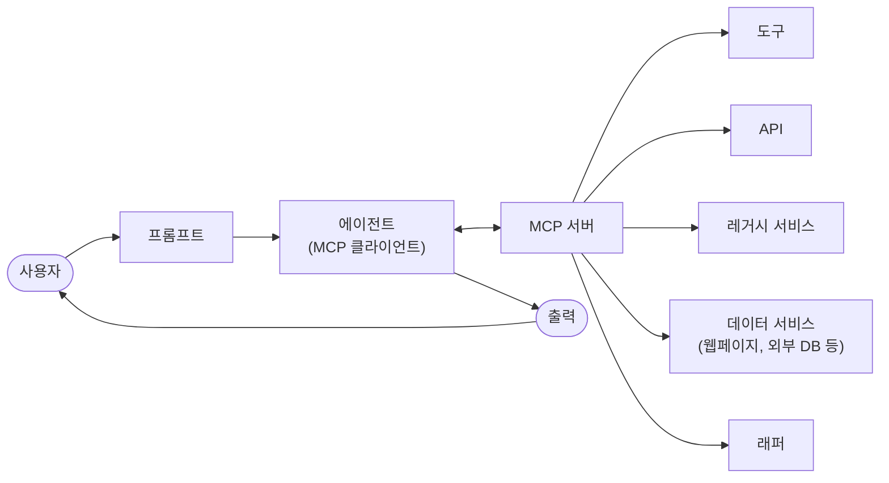

import { KeyPoints, Diagram, CrossRef, ChapterNav } from '@site/src/components';

<KeyPoints
  items={[
    "모델 컨텍스트 프로토콜(MCP)은 LLM이 외부 애플리케이션, 데이터 소스, 도구와 표준화된 방식으로 통신할 수 있도록 하는 오픈 표준입니다.",
    "MCP는 클라이언트-서버 아키텍처를 채택하며, MCP 서버가 리소스·프롬프트·툴을 노출하고 MCP 클라이언트(LLM 호스트 애플리케이션)가 이를 소비합니다.",
    "툴 함수 호출이 LLM과 특정 함수 간의 일대일 통신이라면, MCP는 다양한 시스템에 걸친 상호운용성과 재사용성을 지원하는 표준화된 통신 프레임워크입니다.",
    "에이전트 개발 키트(ADK)는 기존 MCP 서버 활용 및 ADK 툴을 MCP 서버로 노출하는 두 가지 방향을 모두 지원합니다.",
    "FastMCP는 Python 데코레이터를 통해 MCP 서버 개발을 단순화하며, 자동 스키마 생성으로 보일러플레이트 코드를 최소화합니다.",
  ]}
/>

# 10장: 모델 컨텍스트 프로토콜(MCP)

LLM이 에이전트로서 효과적으로 기능하려면 멀티모달 생성을 넘어서는 역량이 필요합니다. 최신 데이터 접근, 외부 소프트웨어 활용, 특정 운영 작업 실행 등 외부 환경과의 상호작용이 필수적입니다. 모델 컨텍스트 프로토콜(MCP)은 LLM이 외부 리소스와 인터페이스할 수 있도록 표준화된 인터페이스를 제공함으로써 이 필요를 해결합니다. 이 프로토콜은 일관되고 예측 가능한 통합을 촉진하는 핵심 메커니즘으로 기능합니다.

## MCP 패턴 개요

어떤 LLM이든 외부 시스템, 데이터베이스, 도구에 각각의 커스텀 통합 없이 연결할 수 있는 범용 어댑터를 상상해 보십시오. 그것이 바로 모델 컨텍스트 프로토콜(MCP)입니다. MCP는 Gemini, OpenAI의 GPT 모델, Mixtral, Claude와 같은 LLM이 외부 애플리케이션·데이터 소스·도구와 통신하는 방식을 표준화하도록 설계된 오픈 표준입니다. 이는 LLM이 컨텍스트를 얻고, 행동을 실행하며, 다양한 시스템과 상호작용하는 방식을 단순화하는 범용 연결 메커니즘으로 이해할 수 있습니다.

MCP는 클라이언트-서버 아키텍처로 동작합니다. MCP 서버가 데이터(리소스), 대화형 템플릿(프롬프트), 실행 가능 함수(툴)라는 서로 다른 요소들을 노출하는 방식을 정의합니다. 이를 소비하는 MCP 클라이언트는 LLM 호스트 애플리케이션이나 AI 에이전트 자체가 될 수 있습니다. 이 표준화된 접근 방식은 LLM을 다양한 운영 환경에 통합하는 복잡성을 획기적으로 줄여 줍니다.

그러나 MCP는 "에이전틱 인터페이스"에 대한 계약이며, 그 효과는 노출하는 기반 API의 설계에 크게 의존합니다. 개발자가 기존의 레거시 API를 수정 없이 단순히 래핑하는 위험이 있으며, 이는 에이전트에게 최적이 아닐 수 있습니다. 예를 들어, 티켓 시스템 API가 티켓 세부 정보를 하나씩만 조회할 수 있다면, 우선순위 높은 티켓을 요약하도록 요청받은 에이전트는 높은 볼륨에서 느리고 부정확해질 것입니다. 진정으로 효과적이기 위해서는 기반 API에 필터링·정렬과 같은 결정론적 기능을 개선하여 비결정론적 에이전트가 효율적으로 작동하도록 지원해야 합니다. 이는 에이전트가 결정론적 워크플로를 마법처럼 대체하지 않으며, 성공하기 위해 더 강력한 결정론적 지원이 필요한 경우가 많다는 점을 강조합니다.

나아가, MCP는 에이전트가 여전히 본질적으로 이해하기 어려운 입출력을 가진 API를 래핑할 수 있습니다. API는 데이터 형식이 에이전트 친화적인 경우에만 유용하며, 이는 MCP 자체가 보장하지 않습니다. 예를 들어, 파일을 PDF로 반환하는 문서 저장소에 MCP 서버를 생성하는 것은 소비하는 에이전트가 PDF 콘텐츠를 파싱할 수 없다면 거의 쓸모가 없습니다. 더 나은 접근 방식은 에이전트가 실제로 읽고 처리할 수 있는 Markdown과 같은 텍스트 버전의 문서를 반환하는 API를 먼저 만드는 것입니다. 이는 개발자가 단순한 연결뿐만 아니라 교환되는 데이터의 본질을 고려하여 진정한 호환성을 보장해야 함을 보여 줍니다.

## MCP vs. 툴 함수 호출

모델 컨텍스트 프로토콜(MCP)과 툴 함수 호출은 LLM이 외부 기능(툴 포함)과 상호작용하고 행동을 실행할 수 있도록 하는 서로 다른 메커니즘입니다. 둘 다 텍스트 생성을 넘어 LLM 역량을 확장하는 역할을 하지만, 접근 방식과 추상화 수준에서 차이가 있습니다.

툴 함수 호출(함수 호출)은 LLM이 특정하고 사전 정의된 툴 또는 함수에 직접 요청하는 것으로 이해할 수 있습니다. 이 상호작용은 일대일 통신 모델로 특징지어지며, LLM이 외부 행동이 필요한 사용자 의도에 대한 이해를 바탕으로 요청을 형식화합니다. 애플리케이션 코드가 이 요청을 실행하고 결과를 LLM에 반환합니다. 이 프로세스는 종종 독점적이며 LLM 제공자마다 다릅니다.

반면 모델 컨텍스트 프로토콜(MCP)은 LLM이 외부 기능을 발견하고, 통신하며, 활용하기 위한 표준화된 인터페이스로 동작합니다. MCP는 광범위한 툴 및 시스템과의 상호작용을 촉진하는 오픈 프로토콜로, 규격에 맞는 모든 툴이 규격에 맞는 모든 LLM에서 접근 가능한 에코시스템 구축을 목표로 합니다. 이는 다양한 시스템과 구현 간의 상호운용성, 구성 가능성, 재사용성을 촉진합니다. 연합 모델을 채택함으로써 상호운용성을 크게 개선하고 기존 자산의 가치를 잠금 해제할 수 있습니다. 이 전략을 통해 이질적이고 레거시 서비스를 MCP 규격 인터페이스로 래핑하기만 해도 현대 에코시스템에 통합할 수 있습니다. 이러한 서비스는 독립적으로 계속 운영되지만 이제 새로운 애플리케이션과 워크플로에 구성될 수 있으며, 그 협업은 LLM에 의해 오케스트레이션됩니다. 이는 기반 시스템의 비용이 많이 드는 재작성 없이 민첩성과 재사용성을 촉진합니다.

다음은 MCP와 툴 함수 호출의 근본적인 차이점을 정리한 표입니다.

| 특징 | 툴 함수 호출 | 모델 컨텍스트 프로토콜(MCP) |
|------|-------------|--------------------------|
| 표준화 | 독점적·공급업체별. 형식과 구현이 LLM 제공자마다 다름 | 오픈 표준화 프로토콜로, 서로 다른 LLM과 툴 간 상호운용성 촉진 |
| 범위 | LLM이 특정하고 사전 정의된 함수 실행을 요청하는 직접적 메커니즘 | LLM과 외부 툴이 서로를 발견하고 통신하는 방식을 위한 더 넓은 프레임워크 |
| 아키텍처 | LLM과 애플리케이션의 툴 처리 로직 간의 일대일 상호작용 | LLM 기반 애플리케이션(클라이언트)이 다양한 MCP 서버(툴)에 연결하여 활용할 수 있는 클라이언트-서버 아키텍처 |
| 발견 | LLM이 특정 대화 컨텍스트 내에서 어떤 툴이 사용 가능한지 명시적으로 전달받음 | 사용 가능한 툴의 동적 발견을 가능하게 함. MCP 클라이언트가 서버에 쿼리하여 제공하는 기능을 확인할 수 있음 |
| 재사용성 | 툴 통합이 특정 애플리케이션과 사용 중인 LLM에 긴밀하게 결합되는 경우가 많음 | 모든 규격에 맞는 애플리케이션에서 접근 가능한 재사용 가능한 독립형 "MCP 서버" 개발 촉진 |

툴 함수 호출을 AI에게 특정 커스텀 도구 세트(특정 렌치와 드라이버)를 제공하는 것으로 생각하십시오. 이는 고정된 작업 세트가 있는 작업실에 효율적입니다. 반면 MCP는 범용 표준화된 전원 콘센트 시스템을 만드는 것과 같습니다. 도구 자체를 제공하지는 않지만, 어떤 제조업체의 규격에 맞는 도구든 연결하여 작동할 수 있게 하여 동적이고 계속 확장되는 작업실을 가능하게 합니다.

요약하면, 함수 호출은 몇 가지 특정 함수에 대한 직접 접근을 제공하고, MCP는 LLM이 광범위한 외부 리소스를 발견하고 사용할 수 있도록 하는 표준화된 통신 프레임워크입니다. 간단한 애플리케이션에는 특정 툴만으로 충분하지만, 적응이 필요한 복잡하고 상호연결된 AI 시스템에는 MCP와 같은 범용 표준이 필수적입니다.

## MCP에 대한 추가 고려 사항

MCP는 강력한 프레임워크를 제시하지만, 철저한 평가를 위해서는 특정 사용 사례에 대한 적합성에 영향을 미치는 몇 가지 중요한 측면을 고려해야 합니다. 주요 측면을 살펴보겠습니다.

- **툴 vs. 리소스 vs. 프롬프트**: 이 구성 요소들의 특정 역할을 이해하는 것이 중요합니다. 리소스는 정적 데이터(예: PDF 파일, 데이터베이스 레코드)입니다. 툴은 행동을 수행하는 실행 가능 함수(예: 이메일 보내기, API 쿼리)입니다. 프롬프트는 LLM이 리소스나 툴과 상호작용하는 방식을 안내하는 템플릿으로, 상호작용이 구조화되고 효과적으로 이루어지도록 합니다.
- **발견 가능성**: MCP의 핵심 이점은 MCP 클라이언트가 서버에 동적으로 쿼리하여 제공하는 툴과 리소스를 파악할 수 있다는 것입니다. 이 "저스트-인-타임" 발견 메커니즘은 재배포 없이 새로운 기능에 적응해야 하는 에이전트에게 강력합니다.
- **보안**: 어떤 프로토콜이든 툴과 데이터를 노출하려면 강력한 보안 조치가 필요합니다. MCP 구현에는 어떤 클라이언트가 어떤 서버에 접근할 수 있고 어떤 특정 행동을 수행할 수 있는지 제어하기 위한 인증과 권한 부여가 포함되어야 합니다.
- **구현**: MCP는 오픈 표준이지만 구현이 복잡할 수 있습니다. 그러나 제공업체들이 이 프로세스를 단순화하기 시작하고 있습니다. 예를 들어, Anthropic이나 FastMCP 같은 일부 모델 제공업체는 보일러플레이트 코드를 많이 추상화하는 SDK를 제공하여 개발자가 MCP 클라이언트와 서버를 더 쉽게 생성하고 연결할 수 있게 합니다.
- **오류 처리**: 포괄적인 오류 처리 전략이 중요합니다. 프로토콜은 LLM이 실패를 이해하고 잠재적으로 대안적 접근 방식을 시도할 수 있도록 오류(예: 툴 실행 실패, 서버 사용 불가, 잘못된 요청)를 LLM에 전달하는 방법을 정의해야 합니다.
- **로컬 vs. 원격 서버**: MCP 서버는 에이전트와 동일한 머신에 로컬로 배포하거나 다른 서버에 원격으로 배포할 수 있습니다. 로컬 서버는 민감한 데이터의 속도와 보안을 위해 선택될 수 있으며, 원격 서버 아키텍처는 조직 전반에 걸쳐 공통 툴에 대한 공유되고 확장 가능한 접근을 가능하게 합니다.
- **온디맨드 vs. 배치**: MCP는 온디맨드 대화형 세션과 대규모 배치 처리를 모두 지원할 수 있습니다. 선택은 애플리케이션에 따라 다르며, 즉각적인 툴 접근이 필요한 실시간 대화형 에이전트부터 레코드를 일괄 처리하는 데이터 분석 파이프라인까지 다양합니다.
- **전송 메커니즘**: 프로토콜은 통신을 위한 기반 전송 계층도 정의합니다. 로컬 상호작용의 경우 효율적인 프로세스 간 통신을 위해 STDIO(표준 입출력)를 통한 JSON-RPC를 사용합니다. 원격 연결의 경우 지속적이고 효율적인 클라이언트-서버 통신을 가능하게 하기 위해 Streamable HTTP 및 Server-Sent Events(SSE)와 같은 웹 친화적 프로토콜을 활용합니다.

모델 컨텍스트 프로토콜은 클라이언트-서버 모델을 사용하여 정보 흐름을 표준화합니다. MCP의 고급 에이전틱 동작을 이해하기 위해서는 구성 요소 상호작용을 파악하는 것이 핵심입니다.

1. **대규모 언어 모델(LLM)**: 핵심 지능입니다. 사용자 요청을 처리하고, 계획을 수립하며, 외부 정보에 접근하거나 행동을 수행해야 할 때를 결정합니다.
2. **MCP 클라이언트**: LLM을 둘러싼 애플리케이션 또는 래퍼입니다. 중개자 역할을 하며, LLM의 의도를 MCP 표준에 맞는 공식 요청으로 변환합니다. MCP 서버를 발견하고, 연결하며, 통신하는 역할을 담당합니다.
3. **MCP 서버**: 외부 세계로의 게이트웨이입니다. 권한이 있는 모든 MCP 클라이언트에게 툴·리소스·프롬프트 세트를 노출합니다. 각 서버는 일반적으로 회사의 내부 데이터베이스 연결, 이메일 서비스, 공개 API와 같은 특정 도메인을 담당합니다.
4. **선택적 서드파티(3P) 서비스**: MCP 서버가 관리하고 노출하는 실제 외부 툴, 애플리케이션, 데이터 소스를 나타냅니다. 독점 데이터베이스 쿼리, SaaS 플랫폼과의 상호작용, 공개 날씨 API 호출 등 요청된 행동을 실제로 수행하는 최종 엔드포인트입니다.

상호작용 흐름은 다음과 같습니다.

1. **발견**: MCP 클라이언트가 LLM을 대신하여 MCP 서버에 쿼리하여 제공하는 기능을 묻습니다. 서버는 사용 가능한 툴(예: `send_email`), 리소스(예: `customer_database`), 프롬프트를 나열한 매니페스트로 응답합니다.
2. **요청 형식화**: LLM이 발견된 툴 중 하나를 사용해야 한다고 결정합니다. 예를 들어, 이메일을 보내기로 결정합니다. 사용할 툴(`send_email`)과 필요한 파라미터(수신자, 제목, 본문)를 지정하는 요청을 형식화합니다.
3. **클라이언트 통신**: MCP 클라이언트가 LLM의 형식화된 요청을 가져와 적절한 MCP 서버에 표준화된 호출로 전송합니다.
4. **서버 실행**: MCP 서버가 요청을 수신합니다. 클라이언트를 인증하고, 요청을 검증한 다음, 기반 소프트웨어와 인터페이스하여 지정된 행동을 실행합니다(예: 이메일 API의 `send()` 함수 호출).
5. **응답 및 컨텍스트 업데이트**: 실행 후 MCP 서버가 MCP 클라이언트에 표준화된 응답을 보냅니다. 이 응답은 행동이 성공했는지 여부를 나타내고 관련 출력(예: 보낸 이메일의 확인 ID)을 포함합니다. 클라이언트는 이 결과를 LLM에 전달하여 컨텍스트를 업데이트하고 LLM이 작업의 다음 단계를 진행할 수 있도록 합니다.

## 실용적 응용 및 사용 사례

MCP는 AI/LLM 기능을 크게 확장하여 더욱 다재다능하고 강력하게 만듭니다. 다음은 9가지 주요 사용 사례입니다.

- **데이터베이스 통합**: MCP를 통해 LLM과 에이전트가 데이터베이스의 구조화된 데이터에 원활하게 접근하고 상호작용할 수 있습니다. 예를 들어, MCP Toolbox for Databases를 사용하면 에이전트가 Google BigQuery 데이터셋을 쿼리하여 실시간 정보를 검색하고, 보고서를 생성하거나, 레코드를 업데이트하는 것을 모두 자연어 명령으로 수행할 수 있습니다.
- **생성형 미디어 오케스트레이션**: MCP를 통해 에이전트가 고급 생성형 미디어 서비스와 통합할 수 있습니다. MCP Tools for Genmedia Services를 통해 에이전트는 이미지 생성을 위한 Google의 Imagen, 동영상 제작을 위한 Google의 Veo, 실감나는 목소리를 위한 Google의 Chirp 3 HD, 음악 작곡을 위한 Google의 Lyria를 포함하는 워크플로를 오케스트레이션할 수 있어 AI 애플리케이션 내에서 동적인 콘텐츠 생성이 가능합니다.
- **외부 API 상호작용**: MCP는 LLM이 외부 API를 호출하고 응답을 받는 표준화된 방법을 제공합니다. 이를 통해 에이전트는 실시간 날씨 데이터를 가져오고, 주가를 조회하며, 이메일을 보내거나, CRM 시스템과 상호작용하여 핵심 언어 모델을 훨씬 넘어서는 기능을 확장할 수 있습니다.
- **추론 기반 정보 추출**: LLM의 강력한 추론 능력을 활용하여 MCP는 기존의 검색 및 검색 시스템을 능가하는 효과적인 쿼리 의존 정보 추출을 촉진합니다. 전통적인 검색 도구가 전체 문서를 반환하는 대신, 에이전트는 텍스트를 분석하여 사용자의 복잡한 질문에 직접 답하는 정확한 조항·수치·진술을 추출할 수 있습니다.
- **커스텀 툴 개발**: 개발자는 커스텀 툴을 구축하고 MCP 서버(예: FastMCP 사용)를 통해 노출할 수 있습니다. 이를 통해 특화된 내부 함수나 독점 시스템을 LLM과 다른 에이전트가 표준화되고 쉽게 소비할 수 있는 형식으로 제공하며, LLM을 직접 수정할 필요가 없습니다.
- **표준화된 LLM-애플리케이션 통신**: MCP는 LLM과 이들이 상호작용하는 애플리케이션 사이에 일관된 통신 계층을 보장합니다. 이는 통합 오버헤드를 줄이고, 서로 다른 LLM 제공자와 호스트 애플리케이션 간의 상호운용성을 촉진하며, 복잡한 에이전틱 시스템 개발을 단순화합니다.
- **복잡한 워크플로 오케스트레이션**: 다양한 MCP 노출 툴과 데이터 소스를 결합하여 에이전트는 고도로 복잡한 다단계 워크플로를 오케스트레이션할 수 있습니다. 에이전트는 데이터베이스에서 고객 데이터를 검색하고, 개인화된 마케팅 이미지를 생성하며, 맞춤형 이메일 초안을 작성한 다음 발송하는 것을 모두 서로 다른 MCP 서비스와 상호작용하여 수행할 수 있습니다.
- **IoT 기기 제어**: MCP는 LLM이 사물인터넷(IoT) 기기와 상호작용하는 것을 촉진할 수 있습니다. 에이전트는 MCP를 사용하여 스마트 홈 가전, 산업용 센서, 로봇 공학에 명령을 보내 물리적 시스템의 자연어 제어와 자동화를 가능하게 합니다.
- **금융 서비스 자동화**: 금융 서비스에서 MCP는 LLM이 다양한 금융 데이터 소스, 거래 플랫폼, 컴플라이언스 시스템과 상호작용할 수 있게 합니다. 에이전트는 시장 데이터를 분석하고, 거래를 실행하며, 개인화된 금융 조언을 생성하거나, 규제 보고를 자동화하는 것을 모두 안전하고 표준화된 통신을 유지하면서 수행할 수 있습니다.

요약하면, 모델 컨텍스트 프로토콜(MCP)은 에이전트가 데이터베이스·API·웹 리소스에서 실시간 정보에 접근할 수 있게 합니다. 또한 에이전트가 이메일 보내기, 레코드 업데이트, 기기 제어, 다양한 소스의 데이터를 통합하고 처리하여 복잡한 작업을 실행하는 행동을 수행할 수 있게 합니다. 추가로 MCP는 AI 애플리케이션을 위한 미디어 생성 툴을 지원합니다.

## ADK를 활용한 실습 코드 예제

이 섹션은 파일 시스템 운영을 제공하는 로컬 MCP 서버에 연결하는 방법을 설명하며, 에이전트 개발 키트(ADK) 에이전트가 로컬 파일 시스템과 상호작용할 수 있게 합니다.

### MCPToolset을 활용한 에이전트 설정

파일 시스템 상호작용을 위한 에이전트를 구성하려면 `agent.py` 파일을 생성해야 합니다(예: `./adk_agent_samples/mcp_agent/agent.py`). `MCPToolset`은 `LlmAgent` 객체의 `tools` 목록 내에서 인스턴스화됩니다. `args` 목록의 `"/path/to/your/folder"`를 MCP 서버가 접근할 수 있는 로컬 시스템의 절대 경로로 교체하는 것이 중요합니다. 이 디렉토리는 에이전트가 수행하는 파일 시스템 운영의 루트가 됩니다.

```python
import os
from google.adk.agents import LlmAgent
from google.adk.tools.mcp_tool.mcp_toolset import MCPToolset,
StdioServerParameters

# Create a reliable absolute path to a folder named
'mcp_managed_files'
# within the same directory as this agent script.
# This ensures the agent works out-of-the-box for demonstration.
# For production, you would point this to a more persistent and
secure location.
TARGET_FOLDER_PATH =
os.path.join(os.path.dirname(os.path.abspath(__file__)),
"mcp_managed_files")

# Ensure the target directory exists before the agent needs it.
os.makedirs(TARGET_FOLDER_PATH, exist_ok=True)

root_agent = LlmAgent(
   model='gemini-2.0-flash',
   name='filesystem_assistant_agent',
   instruction=(
       'Help the user manage their files. You can list files, read
files, and write files. '
       f'You are operating in the following directory:
{TARGET_FOLDER_PATH}'
   ),
   tools=[
       MCPToolset(
           connection_params=StdioServerParameters(
               command='npx',
               args=[
                   "-y",  # Argument for npx to auto-confirm install
                   "@modelcontextprotocol/server-filesystem",
                   # This MUST be an absolute path to a folder.
```

```text
                   TARGET_FOLDER_PATH,
               ],
           ),
           # Optional: You can filter which tools from the MCP server
are exposed.
           # For example, to only allow reading:
           # tool_filter=['list_directory', 'read_file']
       )
   ],
)
```

`npx`(Node Package Execute)는 npm(Node Package Manager) 버전 5.2.0 이상에 번들된 유틸리티로, npm 레지스트리에서 Node.js 패키지를 직접 실행할 수 있게 합니다. 전역 설치가 필요하지 않습니다. 본질적으로 `npx`는 npm 패키지 실행기 역할을 하며, Node.js 패키지로 배포되는 많은 커뮤니티 MCP 서버를 실행하는 데 일반적으로 사용됩니다.

에이전트 개발 키트(ADK)가 `agent.py` 파일을 발견 가능한 Python 패키지의 일부로 인식하도록 하기 위해 `__init__.py` 파일을 생성해야 합니다. 이 파일은 `agent.py`와 동일한 디렉토리에 있어야 합니다.

```text
# ./adk_agent_samples/mcp_agent/__init__.py
from . import agent
```

물론 다른 지원되는 명령도 사용할 수 있습니다. 예를 들어, `python3`에 연결하는 방법은 다음과 같습니다.

```text
connection_params = StdioConnectionParams(
 server_params={
     "command": "python3",
     "args": ["./agent/mcp_server.py"],
     "env": {
       "SERVICE_ACCOUNT_PATH":SERVICE_ACCOUNT_PATH,
       "DRIVE_FOLDER_ID": DRIVE_FOLDER_ID
     }
 }
)
```

UVX는 Python 맥락에서 `uv`를 사용하여 임시적이고 격리된 Python 환경에서 명령을 실행하는 명령줄 도구입니다. 본질적으로 전역적으로 또는 프로젝트 환경 내에 설치하지 않고도 Python 툴과 패키지를 실행할 수 있게 합니다. MCP 서버를 통해 실행할 수 있습니다.

```text
connection_params = StdioConnectionParams(
 server_params={
   "command": "uvx",
   "args": ["mcp-google-sheets@latest"],
   "env": {
     "SERVICE_ACCOUNT_PATH":SERVICE_ACCOUNT_PATH,
     "DRIVE_FOLDER_ID": DRIVE_FOLDER_ID
   }
 }
)
```

MCP 서버가 생성되면 다음 단계는 연결입니다.

### ADK Web으로 MCP 서버 연결하기

시작하려면 `adk web`을 실행하십시오. 터미널에서 `mcp_agent`의 상위 디렉토리(예: `adk_agent_samples`)로 이동하여 다음을 실행하십시오.

```text
cd ./adk_agent_samples # Or your equivalent parent directory
adk web
```

ADK Web UI가 브라우저에 로드되면 에이전트 메뉴에서 `filesystem_assistant_agent`를 선택하십시오. 다음과 같은 프롬프트를 실험해 보십시오.

- "이 폴더의 내용을 보여 주십시오."
- "`sample.txt` 파일을 읽어 주십시오." (`sample.txt`가 `TARGET_FOLDER_PATH`에 있다고 가정합니다.)
- "`another_file.md`에 무엇이 있습니까?"

### FastMCP로 MCP 서버 생성하기

FastMCP는 MCP 서버 개발을 간소화하도록 설계된 고수준 Python 프레임워크입니다. 프로토콜 복잡성을 단순화하는 추상화 계층을 제공하여 개발자가 핵심 로직에 집중할 수 있게 합니다.

이 라이브러리는 간단한 Python 데코레이터를 사용하여 툴·리소스·프롬프트를 신속하게 정의할 수 있게 합니다. 주목할 만한 이점은 자동 스키마 생성으로, Python 함수 시그니처·타입 힌트·문서 문자열을 지능적으로 해석하여 필요한 AI 모델 인터페이스 사양을 구성합니다. 이 자동화는 수동 구성을 최소화하고 인적 오류를 줄입니다.

기본 툴 생성을 넘어, FastMCP는 서버 구성 및 프록시와 같은 고급 아키텍처 패턴을 촉진합니다. 이는 복잡한 다중 구성 요소 시스템의 모듈식 개발과 기존 서비스를 AI 접근 가능한 프레임워크에 원활하게 통합할 수 있게 합니다. 또한 FastMCP에는 효율적이고 분산되며 확장 가능한 AI 기반 애플리케이션을 위한 최적화가 포함되어 있습니다.

#### FastMCP로 서버 설정하기

서버가 활성화되면 ADK 에이전트와 다른 MCP 클라이언트가 HTTP를 통해 이 툴과 상호작용할 수 있습니다. 간단한 "greet" 툴을 제공하는 기본 예시를 살펴보겠습니다.

```python
# fastmcp_server.py
# This script demonstrates how to create a simple MCP server using FastMCP.
# It exposes a single tool that generates a greeting.

# 1. Make sure you have FastMCP installed:
# pip install fastmcp
from fastmcp import FastMCP, Client

# Initialize the FastMCP server.
mcp_server = FastMCP()

# Define a simple tool function.
# The `@mcp_server.tool` decorator registers this Python function as an MCP
tool.
# The docstring becomes the tool's description for the LLM.
@mcp_server.tool
def greet(name: str) -> str:
    """
    Generates a personalized greeting.

    Args:
```

```python
        name: The name of the person to greet.

    Returns:
        A greeting string.
    """
    return f"Hello, {name}! Nice to meet you."

# Or if you want to run it from the script:
if __name__ == "__main__":
    mcp_server.run(
        transport="http",
        host="127.0.0.1",
        port=8000
    )
```

이 Python 스크립트는 사람의 이름을 받아 개인화된 인사말을 반환하는 `greet`라는 단일 함수를 정의합니다. 이 함수 위의 `@tool()` 데코레이터는 AI나 다른 프로그램이 사용할 수 있는 툴로 자동 등록합니다. 함수의 문서 문자열과 타입 힌트는 FastMCP가 에이전트에게 툴의 작동 방식, 필요한 입력, 반환 값을 알리는 데 사용됩니다.

스크립트가 실행되면 `localhost:8000`에서 요청을 수신하는 FastMCP 서버가 시작됩니다. 이는 `greet` 함수를 네트워크 서비스로 사용할 수 있게 합니다. 에이전트는 이 서버에 연결하고 `greet` 툴을 사용하여 더 큰 작업의 일부로 인사말을 생성하도록 구성될 수 있습니다. 서버는 수동으로 중지할 때까지 계속 실행됩니다.

#### ADK 에이전트로 FastMCP 서버 소비하기

ADK 에이전트는 실행 중인 FastMCP 서버를 사용하는 MCP 클라이언트로 설정될 수 있습니다. 이를 위해 FastMCP 서버의 네트워크 주소(일반적으로 `http://localhost:8000`)로 `HttpServerParameters`를 구성해야 합니다.

`tool_filter` 파라미터를 포함하여 에이전트의 툴 사용을 서버가 제공하는 특정 툴(예: `greet`)로 제한할 수 있습니다. "Greet John Doe"와 같은 요청을 받으면 에이전트의 내장 LLM이 MCP를 통해 사용 가능한 `greet` 툴을 식별하고, 인수 "John Doe"로 이를 호출하여 서버의 응답을 반환합니다. 이 프로세스는 MCP를 통해 노출된 사용자 정의 툴과 ADK 에이전트의 통합을 보여 줍니다.

이 구성을 설정하려면 에이전트 파일(예: `./adk_agent_samples/fastmcp_client_agent/`에 위치한 `agent.py`)이 필요합니다. 이 파일은 ADK 에이전트를 인스턴스화하고 `HttpServerParameters`를 사용하여 운영 중인 FastMCP 서버와 연결을 설정합니다.

```python
# ./adk_agent_samples/fastmcp_client_agent/agent.py
import os
from google.adk.agents import LlmAgent
from google.adk.tools.mcp_tool.mcp_toolset import MCPToolset,
HttpServerParameters

# Define the FastMCP server's address.
# Make sure your fastmcp_server.py (defined previously) is running on
this port.
FASTMCP_SERVER_URL = "http://localhost:8000"

root_agent = LlmAgent(
   model='gemini-2.0-flash', # Or your preferred model
   name='fastmcp_greeter_agent',
   instruction='You are a friendly assistant that can greet people by
their name. Use the "greet" tool.',
   tools=[
       MCPToolset(
           connection_params=HttpServerParameters(
               url=FASTMCP_SERVER_URL,
           ),
           # Optional: Filter which tools from the MCP server are
exposed
           # For this example, we're expecting only 'greet'
           tool_filter=['greet']
       )
   ],
)
```

이 스크립트는 Gemini 언어 모델을 사용하는 `fastmcp_greeter_agent`라는 에이전트를 정의합니다. 사람들에게 인사하는 것을 목적으로 하는 친절한 어시스턴트로 역할하도록 특정 지시사항이 부여됩니다. 중요하게도, 코드는 이 에이전트에 작업을 수행하기 위한 툴을 갖춥니다. `MCPToolset`을 구성하여 `localhost:8000`에서 실행 중인 별도 서버에 연결하며, 이는 이전 예제의 FastMCP 서버로 예상됩니다. 에이전트에는 해당 서버에서 호스팅되는 `greet` 툴에 대한 접근 권한이 부여됩니다. 본질적으로, 이 코드는 시스템의 클라이언트 측을 설정하여 사람들에게 인사하는 것이 목표임을 이해하고 이를 달성하기 위해 어떤 외부 툴을 사용해야 하는지 정확히 알고 있는 지능형 에이전트를 만듭니다.

`fastmcp_client_agent` 디렉토리 내에 `__init__.py` 파일을 생성해야 합니다. 이는 에이전트가 ADK의 발견 가능한 Python 패키지로 인식되도록 보장합니다.

시작하려면 새 터미널을 열고 `python fastmcp_server.py`를 실행하여 FastMCP 서버를 시작하십시오. 다음으로 터미널에서 `fastmcp_client_agent`의 상위 디렉토리(예: `adk_agent_samples`)로 이동하여 `adk web`을 실행하십시오. 브라우저에 ADK Web UI가 로드되면 에이전트 메뉴에서 `fastmcp_greeter_agent`를 선택하십시오. 그런 다음 "Greet John Doe"와 같은 프롬프트를 입력하여 테스트할 수 있습니다. 에이전트는 FastMCP 서버의 `greet` 툴을 사용하여 응답을 생성합니다.

## 한눈에 보기

**무엇이 문제인가**: 효과적인 에이전트로 기능하기 위해 LLM은 단순한 텍스트 생성을 넘어야 합니다. 최신 데이터에 접근하고 외부 소프트웨어를 활용하기 위해 외부 환경과 상호작용하는 능력이 필요합니다. 표준화된 통신 방법이 없다면, LLM과 외부 툴 또는 데이터 소스 간의 각 통합은 커스텀적이고 복잡하며 재사용 불가능한 작업이 됩니다. 이 임시방편적 접근 방식은 확장성을 저해하고 복잡하고 상호연결된 AI 시스템을 구축하기 어렵고 비효율적으로 만듭니다.

**왜 MCP인가**: 모델 컨텍스트 프로토콜(MCP)은 LLM과 외부 시스템 간의 범용 인터페이스로 작용하여 표준화된 솔루션을 제공합니다. 외부 기능이 발견되고 사용되는 방법을 정의하는 오픈 표준화 프로토콜을 확립합니다. 클라이언트-서버 모델로 운영되며, MCP는 서버가 모든 규격 클라이언트에 툴·데이터 리소스·대화형 프롬프트를 노출할 수 있게 합니다. LLM 기반 애플리케이션이 이 클라이언트 역할을 하여 예측 가능한 방식으로 사용 가능한 리소스를 동적으로 발견하고 상호작용합니다. 이 표준화된 접근 방식은 상호운용 가능하고 재사용 가능한 구성 요소의 에코시스템을 조성하여 복잡한 에이전틱 워크플로 개발을 획기적으로 단순화합니다.

**경험 법칙**: 다양하고 진화하는 외부 툴·데이터 소스·API 세트와 상호작용해야 하는 복잡하고 확장 가능한 또는 엔터프라이즈급 에이전틱 시스템을 구축할 때 모델 컨텍스트 프로토콜(MCP)을 사용하십시오. 서로 다른 LLM과 툴 간의 상호운용성이 우선순위이고, 에이전트가 재배포 없이 새로운 기능을 동적으로 발견하는 능력이 필요할 때 이상적입니다. 사전 정의된 함수의 수가 고정되고 제한적인 더 간단한 애플리케이션의 경우, 직접 툴 함수 호출로도 충분할 수 있습니다.

### 시각적 요약

<figure>



<figcaption>그림 1 — 모델 컨텍스트 프로토콜</figcaption>
</figure>

## 핵심 정리

- **모델 컨텍스트 프로토콜(MCP)** 은 LLM과 외부 애플리케이션·데이터 소스·툴 간의 표준화된 통신을 촉진하는 오픈 표준입니다.
- MCP는 클라이언트-서버 아키텍처를 채택하며, 리소스·프롬프트·툴을 노출하고 소비하는 방법을 정의합니다.
- 에이전트 개발 키트(ADK)는 기존 MCP 서버 활용과 MCP 서버를 통한 ADK 툴 노출을 모두 지원합니다.
- FastMCP는 특히 Python으로 구현된 툴 노출에 있어 MCP 서버의 개발 및 관리를 단순화합니다.
- MCP Tools for Genmedia Services는 에이전트가 Google Cloud의 생성형 미디어 기능(Imagen, Veo, Chirp 3 HD, Lyria)과 통합할 수 있게 합니다.
- MCP는 LLM과 에이전트가 실제 시스템과 상호작용하고, 동적 정보에 접근하며, 텍스트 생성을 넘어서는 행동을 수행할 수 있게 합니다.

## 결론

모델 컨텍스트 프로토콜(MCP)은 대규모 언어 모델(LLM)과 외부 시스템 간의 통신을 촉진하는 오픈 표준입니다. 클라이언트-서버 아키텍처를 채택하여 LLM이 표준화된 툴을 통해 리소스에 접근하고, 프롬프트를 활용하며, 행동을 실행할 수 있게 합니다. MCP는 LLM이 데이터베이스와 상호작용하고, 생성형 미디어 워크플로를 관리하며, IoT 기기를 제어하고, 금융 서비스를 자동화할 수 있게 합니다. 실용적인 예시들은 파일 시스템 서버 및 FastMCP로 구축된 서버와 통신하는 에이전트를 설정하는 방법을 보여 주며, 에이전트 개발 키트(ADK)와의 통합을 설명합니다. MCP는 기본적인 언어 능력을 넘어서는 대화형 AI 에이전트 개발을 위한 핵심 구성 요소입니다.

## 참고 문헌

1. Model Context Protocol (MCP) Documentation. (Latest). Model Context Protocol (MCP). https://google.github.io/adk-docs/mcp/
2. FastMCP Documentation. FastMCP. https://github.com/jlowin/fastmcp
3. MCP Tools for Genmedia Services. MCP Tools for Genmedia Services. https://google.github.io/adk-docs/mcp/#mcp-servers-for-google-cloud-genmedia
4. MCP Toolbox for Databases Documentation. (Latest). MCP Toolbox for Databases. https://google.github.io/adk-docs/mcp/databases/
