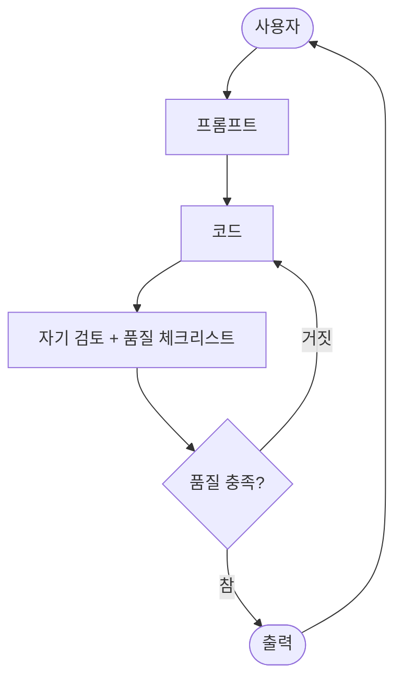
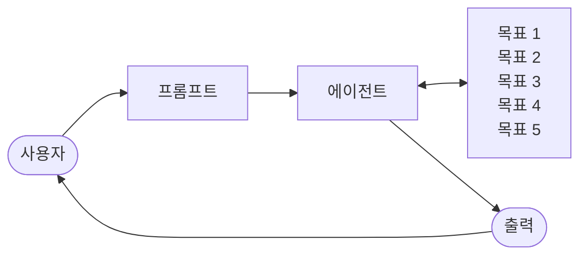

import { KeyPoints, Diagram, CrossRef } from '@site/src/components';

<KeyPoints
  items={[
    "목표 설정(Goal Setting)과 모니터링(Monitoring) 패턴은 AI 에이전트에 목적의식과 자기 평가 능력을 부여합니다.",
    "좋은 목표는 SMART 목표(SMART Goals) 기준, 즉 구체적(Specific)·측정 가능(Measurable)·달성 가능(Achievable)·관련성 있음(Relevant)·기한 있음(Time-bound)을 충족해야 합니다.",
    "모니터링은 에이전트의 행동, 환경 상태, 툴 사용(tool use) 출력을 관찰하여 목표 달성 여부를 지속적으로 추적합니다.",
    "모니터링에서 발생하는 피드백 루프는 에이전트가 계획을 수정하거나 이슈를 에스컬레이션할 수 있게 해 줍니다.",
    "단일 에이전트 자기 평가의 한계를 극복하려면 코드 작성자·검토자·테스트 작성자처럼 역할을 분리한 멀티 에이전트 시스템이 효과적입니다.",
  ]}
/>

# 11장: 목표 설정과 모니터링

AI 에이전트가 진정으로 효과적이고 목적 지향적이려면 정보를 처리하거나 툴을 사용하는 능력 이상이 필요합니다. 에이전트에게는 명확한 방향감각과, 자신이 실제로 목표를 달성하고 있는지 파악할 수 있는 수단이 있어야 합니다. 바로 이 지점에서 목표 설정과 모니터링 패턴이 등장합니다. 이 패턴은 에이전트에게 달성해야 할 구체적인 목표를 부여하고, 진행 상황을 추적하여 목표가 충족되었는지 판단하는 수단을 갖추게 하는 것입니다.

## 목표 설정과 모니터링 패턴 개요

여행을 계획하는 상황을 생각해 보십시오. 목적지에 즉흥적으로 도달하는 일은 없습니다. 어디로 갈지(목표 상태)를 결정하고, 현재 위치(초기 상태)를 파악하며, 이용 가능한 옵션(교통편, 경로, 예산)을 검토한 다음, 일련의 단계를 계획합니다. 예를 들어 항공권 예약, 짐 싸기, 공항·역으로 이동, 탑승, 도착, 숙소 찾기 등의 순서입니다. 이처럼 의존성과 제약을 고려하며 단계별로 진행하는 과정이 바로 에이전틱 시스템에서 말하는 계획 수립(Planning)의 본질입니다.

AI 에이전트의 맥락에서 계획 수립이란 일반적으로 에이전트가 고수준의 목표를 받아 자율적으로, 혹은 반자율적으로 일련의 중간 단계 또는 하위 목표를 생성하는 것을 의미합니다. 이 단계들은 순차적으로 실행되거나, 툴 사용·라우팅(Routing)·멀티 에이전트 협업 등 다른 패턴을 포함하는 더 복잡한 흐름으로 실행될 수 있습니다. 계획 수립 메커니즘은 정교한 탐색 알고리즘, 논리적 추론, 혹은 점점 더 많이 활용되고 있는 대규모 언어 모델(LLM)의 역량을 활용하여 훈련 데이터와 과제 이해를 바탕으로 타당하고 효과적인 계획을 생성하는 방식을 취합니다.

뛰어난 계획 수립 역량은 에이전트가 단순한 단일 단계 쿼리로는 처리할 수 없는 문제에 도전할 수 있게 해 줍니다. 에이전트는 복잡한 요청을 처리하고, 재계획을 통해 변화하는 상황에 적응하며, 복잡한 워크플로를 조율할 수 있습니다. 이는 단순한 반응형 시스템을 정의된 목표를 향해 능동적으로 나아가는 시스템으로 전환하는, 많은 고급 에이전틱 행동의 토대가 되는 핵심 패턴입니다.

## 실용적 응용 사례

목표 설정과 모니터링 패턴은 복잡한 실제 시나리오에서 자율적이고 안정적으로 동작하는 에이전트를 구축하는 데 필수적입니다. 다음은 몇 가지 실용적 응용 사례입니다.

- **고객 지원 자동화**: 에이전트의 목표는 "고객의 청구 문의를 해결하는 것"일 수 있습니다. 에이전트는 대화를 모니터링하고, 데이터베이스 항목을 확인하며, 청구를 조정하는 툴을 사용합니다. 성공 여부는 청구 변경 확인과 긍정적인 고객 피드백으로 모니터링되며, 문제가 해결되지 않으면 에스컬레이션합니다.
- **개인화 학습 시스템**: 학습 에이전트는 "학생의 대수학 이해도를 향상시키는 것"을 목표로 할 수 있습니다. 에이전트는 학생의 연습 문제 진행 상황을 모니터링하고, 교육 자료를 조정하며, 정확도와 완료 시간 같은 성능 지표를 추적하고, 학생이 어려움을 겪으면 접근 방식을 조정합니다.
- **프로젝트 관리 보조 도구**: 에이전트에게 "프로젝트 마일스톤 X를 Y 날짜까지 완료하는 것"을 보장하는 과제가 주어질 수 있습니다. 에이전트는 작업 상태, 팀 커뮤니케이션, 자원 가용성을 모니터링하여 지연을 감지하고 목표 달성이 위험에 처하면 시정 조치를 제안합니다.
- **자동화 트레이딩 봇**: 트레이딩 에이전트의 목표는 "리스크 허용 범위를 유지하면서 포트폴리오 수익을 극대화하는 것"일 수 있습니다. 에이전트는 시장 데이터, 현재 포트폴리오 가치, 리스크 지표를 지속적으로 모니터링하며, 조건이 목표에 부합할 때 거래를 실행하고 리스크 임계값이 초과되면 전략을 조정합니다.
- **로보틱스 및 자율 주행 차량**: 자율 주행 차량의 주요 목표는 "승객을 A에서 B로 안전하게 이송하는 것"입니다. 차량은 환경(다른 차량, 보행자, 신호등), 자신의 상태(속도, 연료), 계획된 경로에서의 진행 상황을 지속적으로 모니터링하여 안전하고 효율적으로 목표를 달성하도록 주행 행동을 조정합니다.
- **콘텐츠 모더레이션**: 에이전트의 목표는 "플랫폼 X에서 유해 콘텐츠를 식별하고 제거하는 것"일 수 있습니다. 에이전트는 유입되는 콘텐츠를 모니터링하고, 분류 모델을 적용하며, 거짓 양성/거짓 음성 같은 지표를 추적하여 필터링 기준을 조정하거나 모호한 사례를 인간 검토자에게 에스컬레이션합니다.

이 패턴은 안정적으로 동작하고, 특정 결과를 달성하며, 동적인 조건에 적응해야 하는 에이전트에게 근본적으로 필요한 것으로, 지능적인 자기 관리를 위한 필수 프레임워크를 제공합니다.

## 실습 코드 예제

목표 설정과 모니터링 패턴을 설명하기 위해 LangChain과 OpenAI API를 활용한 예제를 살펴보겠습니다. 이 Python 스크립트는 Python 코드를 생성하고 개선하도록 설계된 자율 AI 에이전트의 개요를 보여줍니다. 핵심 기능은 지정된 문제에 대한 솔루션을 생성하면서 사용자가 정의한 품질 기준을 준수하는 것입니다.

이 에이전트는 "목표 설정과 모니터링" 패턴을 채택하여, 코드를 한 번만 생성하는 것이 아니라 생성-자기 평가-개선의 반복 주기에 들어갑니다. 에이전트의 성공 여부는 생성된 코드가 초기 목표를 충족하는지에 대한 AI 자체의 판단으로 측정됩니다. 최종 출력물은 이 정제 과정의 결실로, 주석이 달리고 바로 사용할 수 있는 완성도 높은 Python 파일입니다.

**의존성:**

```bash
pip install langchain_openai openai python-dotenv
.env file with key in OPENAI_API_KEY
```

이 스크립트는 자율 AI 프로그래머가 프로젝트에 배정된 것으로 상상하면 가장 잘 이해할 수 있습니다(그림 1 참조). AI에게 해결해야 할 구체적인 코딩 문제인 상세한 프로젝트 개요서를 건네주면 프로세스가 시작됩니다.

```python
# MIT License
# Copyright (c) 2025 Mahtab Syed
# https://www.linkedin.com/in/mahtabsyed/


"""
Hands-On Code Example - Iteration 2
- To illustrate the Goal Setting and Monitoring pattern, we have an
example using LangChain and OpenAI APIs:

Objective: Build an AI Agent which can write code for a specified
use case based on specified goals:
- Accepts a coding problem (use case) in code or can be as input.
- Accepts a list of goals (e.g., "simple", "tested", "handles edge
cases")  in code or can be input.
- Uses an LLM (like GPT-4o) to generate and refine Python code
until the goals are met. (I am using max 5 iterations, this could
be based on a set goal as well)
- To check if we have met our goals I am asking the LLM to judge
this and answer just True or False which makes it easier to stop
the iterations.
- Saves the final code in a .py file with a clean filename and a
header comment.
"""

import os
import random
import re
from pathlib import Path
from langchain_openai import ChatOpenAI
```

```python
from dotenv import load_dotenv, find_dotenv

# 🔐 Load environment variables
_ = load_dotenv(find_dotenv())
OPENAI_API_KEY = os.getenv("OPENAI_API_KEY")
if not OPENAI_API_KEY:
   raise EnvironmentError("❌ Please set the OPENAI_API_KEY
environment variable.")

# ✅ Initialize OpenAI model
print("📡 Initializing OpenAI LLM (gpt-4o)...")
llm = ChatOpenAI(
   model="gpt-4o", # If you dont have access to got-4o use other
OpenAI LLMs
   temperature=0.3,
   openai_api_key=OPENAI_API_KEY,
)

# --- Utility Functions ---

def generate_prompt(
   use_case: str, goals: list[str], previous_code: str = "",
feedback: str = ""
) -> str:
   print("📝 Constructing prompt for code generation...")
   base_prompt = f"""
You are an AI coding agent. Your job is to write Python code based
on the following use case:

Use Case: {use_case}

Your goals are:
{chr(10).join(f"- {g.strip()}" for g in goals)}
"""
   if previous_code:
       print("🔄 Adding previous code to the prompt for
refinement.")
       base_prompt += f"\nPreviously generated
code:\n{previous_code}"
   if feedback:
       print("📋 Including feedback for revision.")
       base_prompt += f"\nFeedback on previous
version:\n{feedback}\n"

   base_prompt += "\nPlease return only the revised Python code. Do
not include comments or explanations outside the code."
   return base_prompt
```

````python
def get_code_feedback(code: str, goals: list[str]) -> str:
   print("🔍 Evaluating code against the goals...")
   feedback_prompt = f"""
You are a Python code reviewer. A code snippet is shown below.
Based on the following goals:

{chr(10).join(f"- {g.strip()}" for g in goals)}

Please critique this code and identify if the goals are met.
Mention if improvements are needed for clarity, simplicity,
correctness, edge case handling, or test coverage.

Code:
{code}
"""
   return llm.invoke(feedback_prompt)

def goals_met(feedback_text: str, goals: list[str]) -> bool:
   """
   Uses the LLM to evaluate whether the goals have been met based
on the feedback text.
   Returns True or False (parsed from LLM output).
   """
   review_prompt = f"""
You are an AI reviewer.

Here are the goals:
{chr(10).join(f"- {g.strip()}" for g in goals)}

Here is the feedback on the code:
\"\"\"
{feedback_text}
\"\"\"

Based on the feedback above, have the goals been met?

Respond with only one word: True or False.
"""
   response = llm.invoke(review_prompt).content.strip().lower()
   return response == "true"

def clean_code_block(code: str) -> str:
   lines = code.strip().splitlines()
   if lines and lines[0].strip().startswith("```"):
       lines = lines[1:]
   if lines and lines[-1].strip() == "```":
````

```python
       lines = lines[:-1]
   return "\n".join(lines).strip()

def add_comment_header(code: str, use_case: str) -> str:
   comment = f"# This Python program implements the following use
case:\n# {use_case.strip()}\n"
   return comment + "\n" + code

def to_snake_case(text: str) -> str:
   text = re.sub(r"[^a-zA-Z0-9 ]", "", text)
   return re.sub(r"\s+", "_", text.strip().lower())

def save_code_to_file(code: str, use_case: str) -> str:
   print("💾 Saving final code to file...")

   summary_prompt = (
       f"Summarize the following use case into a single lowercase
word or phrase, "
       f"no more than 10 characters, suitable for a Python
filename:\n\n{use_case}"
   )
   raw_summary = llm.invoke(summary_prompt).content.strip()
   short_name = re.sub(r"[^a-zA-Z0-9_]", "", raw_summary.replace("
", "_").lower())[:10]

   random_suffix = str(random.randint(1000, 9999))
   filename = f"{short_name}_{random_suffix}.py"
   filepath = Path.cwd() / filename

   with open(filepath, "w") as f:
       f.write(code)

   print(f"✅ Code saved to: {filepath}")
   return str(filepath)

# --- Main Agent Function ---

def run_code_agent(use_case: str, goals_input: str, max_iterations:
int = 5) -> str:
   goals = [g.strip() for g in goals_input.split(",")]

   print(f"\n🎯 Use Case: {use_case}")
   print("🎯 Goals:")
   for g in goals:
       print(f"  - {g}")

   previous_code = ""
```

```python
   feedback = ""

   for i in range(max_iterations):
       print(f"\n=== 🔁 Iteration {i + 1} of {max_iterations} ===")
       prompt = generate_prompt(use_case, goals, previous_code,
feedback if isinstance(feedback, str) else feedback.content)

       print("🚧 Generating code...")
       code_response = llm.invoke(prompt)
       raw_code = code_response.content.strip()
       code = clean_code_block(raw_code)
       print("\n🧾 Generated Code:\n" + "-" * 50 + f"\n{code}\n" +
"-" * 50)

       print("\n📤 Submitting code for feedback review...")
       feedback = get_code_feedback(code, goals)
       feedback_text = feedback.content.strip()
       print("\n📥 Feedback Received:\n" + "-" * 50 +
f"\n{feedback_text}\n" + "-" * 50)

       if goals_met(feedback_text, goals):
           print("✅ LLM confirms goals are met. Stopping
iteration.")
           break

       print("🛠️ Goals not fully met. Preparing for next
iteration...")
       previous_code = code

   final_code = add_comment_header(code, use_case)
   return save_code_to_file(final_code, use_case)

# --- CLI Test Run ---

if __name__ == "__main__":
   print("\n🧠 Welcome to the AI Code Generation Agent")

   # Example 1
   use_case_input = "Write code to find BinaryGap of a given
positive integer"
   goals_input = "Code simple to understand, Functionally correct,
Handles comprehensive edge cases, Takes positive integer input
only, prints the results with few examples"
   run_code_agent(use_case_input, goals_input)

   # Example 2
   # use_case_input = "Write code to count the number of files in
```

```python
current directory and all its nested sub directories, and print the
total count"
   # goals_input = (
   #     "Code simple to understand, Functionally correct, Handles
comprehensive edge cases, Ignore recommendations for performance,
Ignore recommendations for test suite use like unittest or pytest"
   # )
   # run_code_agent(use_case_input, goals_input)

   # Example 3
   # use_case_input = "Write code which takes a command line input
of a word doc or docx file and opens it and counts the number of
words, and characters in it and prints all"
   # goals_input = "Code simple to understand, Functionally
correct, Handles edge cases"
   # run_code_agent(use_case_input, goals_input)
```

이 개요서와 함께 엄격한 품질 체크리스트를 제공하는데, 이는 최종 코드가 충족해야 할 목표 기준을 나타냅니다. 예를 들어 "솔루션은 이해하기 쉬워야 한다", "기능적으로 올바르다", "예상치 못한 엣지 케이스를 처리해야 한다" 같은 기준입니다.

<figure>



<figcaption>그림 1: 목표 설정 및 모니터링 예시 — 사용자 프롬프트로부터 코드를 생성하고 자기 검토 후 조건에 따라 반복 개선</figcaption>
</figure>

이 과제를 받은 AI 프로그래머는 작업에 착수하여 코드의 첫 번째 초안을 작성합니다. 그러나 이 초기 버전을 즉시 제출하는 대신, 중요한 단계를 위해 잠시 멈춥니다. 바로 엄격한 자기 검토입니다. 에이전트는 자신의 작업물을 제공된 품질 체크리스트의 모든 항목과 꼼꼼히 비교하며, 자체 품질 보증 검사원 역할을 합니다. 이 검사를 마친 후 에이전트는 자신의 진행 상황에 대해 단순하고 편향 없는 판정을 내립니다. 모든 기준을 충족하면 "True", 미달이면 "False"입니다.

판정이 "False"라면 에이전트는 포기하지 않습니다. 자기 비평의 통찰을 활용하여 약점을 찾아내고 코드를 지능적으로 재작성하는 신중한 수정 단계에 들어갑니다. 초안 작성-자기 검토-개선의 주기가 반복되며, 반복할수록 목표에 더 가까워집니다. 이 과정은 AI가 모든 요구 사항을 충족하여 "True" 상태를 달성하거나, 마감 기한을 앞둔 개발자처럼 사전에 정의된 시도 한계에 도달할 때까지 계속됩니다. 코드가 최종 검사를 통과하면 스크립트는 완성된 솔루션을 패키지로 묶어 유용한 주석을 추가하고 깔끔하고 새로운 Python 파일로 저장하여 사용 준비를 마칩니다.

**주의 사항 및 고려 사항:** 이것은 예시적인 설명이며 프로덕션 수준의 코드가 아님에 유의하십시오. 실제 응용에서는 여러 요소를 고려해야 합니다. LLM은 목표의 의도된 의미를 완전히 파악하지 못하고 자신의 성능을 성공적으로 잘못 평가할 수 있습니다. 목표를 잘 이해하더라도 모델이 환각(Hallucination)을 일으킬 수 있습니다. 동일한 LLM이 코드 작성과 품질 판단을 모두 담당할 때는 잘못된 방향으로 가고 있음을 발견하기 더 어려울 수 있습니다.

궁극적으로 LLM은 마법처럼 완벽한 코드를 생성하지 않습니다. 생성된 코드는 여전히 실행하고 테스트해야 합니다. 게다가 이 간단한 예제의 "모니터링"은 기초적인 수준이며 프로세스가 무한 실행될 잠재적 위험이 있습니다.

다음은 코드 검토자를 위한 시스템 프롬프트(Prompt) 예시입니다.

```text
Act as an expert code reviewer with a deep commitment to producing
clean, correct, and simple code. Your core mission is to eliminate
code "hallucinations" by ensuring every suggestion is grounded in
reality and best practices.
When I provide you with a code snippet, I want you to:

-- Identify and Correct Errors: Point out any logical flaws, bugs, or
potential runtime errors.

-- Simplify and Refactor: Suggest changes that make the code more
readable, efficient, and maintainable without sacrificing
correctness.

-- Provide Clear Explanations: For every suggested change, explain
why it is an improvement, referencing principles of clean code,
performance, or security.

-- Offer Corrected Code: Show the "before" and "after" of your
suggested changes so the improvement is clear.

Your feedback should be direct, constructive, and always aimed at
improving the quality of the code.
```

더 견고한 접근 방식은 전용 역할을 갖는 에이전트 팀에 이러한 역할을 분리하는 것입니다. 예를 들어, 각각 특정 역할을 가진 Gemini 기반의 AI 에이전트 팀을 구성할 수 있습니다.

- **동료 프로그래머(Peer Programmer)**: 코드 작성과 아이디어 발상을 돕습니다.
- **코드 검토자(Code Reviewer)**: 오류를 발견하고 개선 사항을 제안합니다.
- **문서화 담당자(Documenter)**: 명확하고 간결한 문서를 생성합니다.
- **테스트 작성자(Test Writer)**: 포괄적인 단위 테스트를 작성합니다.
- **프롬프트 개선자(Prompt Refiner)**: AI와의 상호작용을 최적화합니다.

이 멀티 에이전트 시스템에서 코드 검토자는 프로그래머 에이전트와 별개의 독립 주체로서 작동하며, 예제의 판사와 유사한 프롬프트를 가짐으로써 객관적 평가를 크게 향상시킵니다. 이 구조는 자연스럽게 더 나은 관행으로 이어지는데, 테스트 작성자 에이전트가 동료 프로그래머가 생성한 코드에 대한 단위 테스트 작성 필요성을 충족할 수 있기 때문입니다.

더 정교한 제어를 추가하고 코드를 프로덕션 수준에 가깝게 만드는 작업은 관심 있는 독자에게 맡기겠습니다.

## 한눈에 보기

**무엇이 문제인가:** AI 에이전트는 종종 명확한 방향성이 부족하여 단순한 반응형 작업을 넘어서는 목적 있는 행동을 하지 못합니다. 정의된 목표 없이는 복잡한 다단계 문제를 독립적으로 처리하거나 정교한 워크플로를 조율할 수 없습니다. 더욱이 자신의 행동이 성공적인 결과로 이어지고 있는지 판단하는 내재적 메커니즘이 없습니다. 이는 에이전트의 자율성을 제한하고, 단순한 작업 실행으로는 불충분한 동적 실제 시나리오에서 진정으로 효과적이지 못하게 합니다.

**왜 필요한가:** 목표 설정과 모니터링 패턴은 에이전틱 시스템에 목적의식과 자기 평가를 내재화하는 표준화된 솔루션을 제공합니다. 에이전트가 달성해야 할 명확하고 측정 가능한 목표를 명시적으로 정의하는 것을 포함합니다. 동시에 에이전트의 진행 상황과 환경 상태를 이러한 목표에 대비하여 지속적으로 추적하는 모니터링 메커니즘을 구축합니다. 이를 통해 에이전트가 자신의 성과를 평가하고, 방향을 수정하며, 목표 달성 경로에서 벗어날 경우 계획을 조정할 수 있는 중요한 피드백 루프가 형성됩니다. 이 패턴을 구현함으로써 개발자는 단순한 반응형 에이전트를 자율적이고 안정적으로 운영 가능한 능동적 목표 지향 시스템으로 전환할 수 있습니다.

**경험 법칙:** AI 에이전트가 다단계 작업을 자율적으로 실행하고, 동적 조건에 적응하며, 지속적인 인간 개입 없이 특정 고수준 목표를 안정적으로 달성해야 할 때 이 패턴을 사용하십시오.

<figure>



<figcaption>그림 2: 목표 설계 패턴 — 에이전트가 다중 목표를 참조하여 실행하고 출력을 반환</figcaption>
</figure>

## 핵심 내용

핵심 내용은 다음과 같습니다.

- 목표 설정과 모니터링은 에이전트에게 목적의식과 진행 상황을 추적하는 메커니즘을 부여합니다.
- 목표는 구체적(Specific)·측정 가능(Measurable)·달성 가능(Achievable)·관련성 있음(Relevant)·기한 있음(Time-bound)의 SMART 목표 기준을 충족해야 합니다.
- 효과적인 모니터링을 위해서는 지표와 성공 기준을 명확히 정의하는 것이 필수적입니다.
- 모니터링은 에이전트의 행동, 환경 상태, 툴 사용(tool use) 출력을 관찰하는 것을 포함합니다.
- 모니터링에서 발생하는 피드백 루프는 에이전트가 적응하고, 계획을 수정하거나, 이슈를 에스컬레이션할 수 있게 해 줍니다.
- Google ADK에서 목표는 종종 에이전트 지시사항을 통해 전달되며, 모니터링은 상태 관리와 툴 상호작용을 통해 이루어집니다.

## 결론

이 장에서는 목표 설정과 모니터링이라는 중요한 패러다임에 집중하였습니다. 이 개념이 AI 에이전트를 단순한 반응형 시스템에서 능동적이고 목표 지향적인 주체로 전환하는 방법을 강조하였습니다. 명확하고 측정 가능한 목표를 정의하고 진행 상황을 추적하는 엄격한 모니터링 절차를 수립하는 것의 중요성을 설명하였습니다. 실용적인 응용 사례는 고객 서비스와 로보틱스를 포함한 다양한 영역에서 이 패러다임이 안정적인 자율 운영을 어떻게 지원하는지 보여주었습니다. 개념적 코딩 예제는 에이전트 지시사항과 상태 관리를 사용하여 에이전트가 지정된 목표를 달성하도록 안내하고 평가하는 구조화된 프레임워크 내에서 이러한 원칙의 구현을 설명합니다. 궁극적으로 에이전트에게 목표를 수립하고 감독하는 능력을 갖추게 하는 것은 진정으로 지능적이고 책임 있는 AI 시스템을 구축하는 데 근본적인 단계입니다.

## 참고 문헌

1. SMART Goals Framework. https://en.wikipedia.org/wiki/SMART_criteria

<figure>


<figcaption>그림 1: 목표 설정 및 모니터링 예시 — 사용자 프롬프트로부터 코드를 생성하고 자기 검토 후 조건에 따라 출력 또는 재시도</figcaption>
</figure>

<figure>


<figcaption>그림 2: 목표 설계 패턴 — 에이전트가 다중 목표를 참조하여 실행하고 출력을 반환</figcaption>
</figure>

