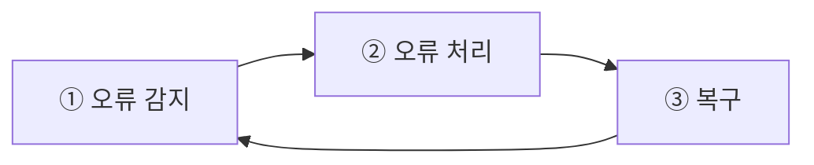
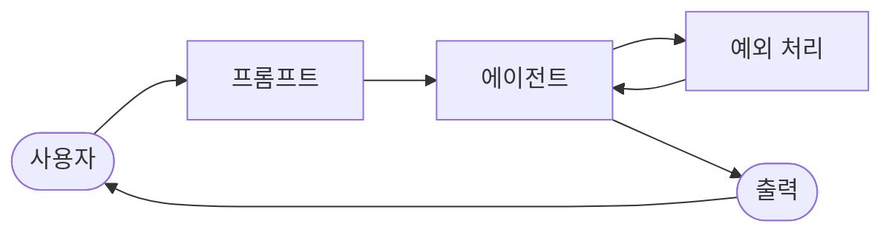

import { KeyPoints, Diagram, CrossRef } from '@site/src/components';

<KeyPoints
  items={[
    "예외 처리(Exception Handling)는 AI 에이전트가 예상치 못한 오류와 장애에도 안정적으로 동작할 수 있도록 하는 필수 패턴입니다.",
    "오류 처리(Error Handling) 전략에는 로깅, 재시도, 폴백(Fallback), 우아한 성능 저하(Graceful Degradation), 알림이 포함됩니다.",
    "복구(Recovery) 단계에서는 상태 롤백(State Rollback), 자가 수정, 에스컬레이션을 통해 에이전트를 안정적인 운영 상태로 복원합니다.",
    "이 패턴은 Reflection와 함께 사용되어, 실패한 시도를 분석하고 개선된 접근 방식으로 재시도할 수 있습니다.",
    "실세계에 배포되는 모든 에이전트에게 이 패턴은 신뢰성, 회복 탄력성, 사용자 친화성을 확보하는 핵심입니다.",
  ]}
/>

# 12장: 예외 처리 및 복구

AI 에이전트가 다양한 실세계 환경에서 안정적으로 운영되려면, 예상치 못한 상황, 오류, 장애를 관리할 수 있어야 합니다. 인간이 예기치 않은 장애물에 적응하듯이, 지능형 에이전트는 문제를 감지하고 복구 절차를 시작하거나, 최소한 제어된 방식으로 실패를 처리할 수 있는 견고한 시스템이 필요합니다. 이 핵심 요구사항이 예외 처리 및 복구 패턴의 토대를 형성합니다.

이 패턴은 다양한 어려움과 이상 상황에도 불구하고 중단 없는 기능과 운영 무결성을 유지할 수 있는, 뛰어나게 내구성 있고 회복 탄력적인 에이전트를 개발하는 데 초점을 맞춥니다. 이 패턴은 지속적인 운영을 보장하기 위한 사전적 준비와 사후적 전략 모두의 중요성을 강조합니다. 이러한 적응성은 에이전트가 복잡하고 예측 불가능한 환경에서 성공적으로 기능하며 전반적인 효과성과 신뢰성을 높이는 데 필수적입니다.

예상치 못한 이벤트를 처리하는 능력은 AI 시스템이 지능적일 뿐만 아니라 안정적이고 신뢰할 수 있도록 보장하며, 이는 배포 및 성능에 대한 더 큰 신뢰를 형성합니다. 포괄적인 모니터링(Monitoring) 및 진단 도구를 통합하면 에이전트가 문제를 신속하게 식별하고 해결하는 능력이 더욱 강화되어, 잠재적 중단을 방지하고 변화하는 조건에서 더 원활한 운영을 보장합니다. 이러한 고급 시스템은 AI 운영의 무결성과 효율성을 유지하는 데 필수적이며, 복잡성과 예측 불가능성을 관리하는 능력을 강화합니다.

이 패턴은 때때로 Reflection와 함께 사용됩니다. 예를 들어, 초기 시도가 실패하여 예외가 발생하면, 반성적 프로세스가 실패를 분석하고 오류를 해결하기 위한 개선된 프롬프트와 같은 정제된 접근 방식으로 작업을 재시도할 수 있습니다.

## 예외 처리 및 복구 패턴 개요

예외 처리(Exception Handling) 및 복구 패턴은 AI 에이전트가 운영 실패를 관리해야 하는 필요성을 해결합니다. 이 패턴은 도구 오류나 서비스 불가용성과 같은 잠재적 문제를 예상하고 이를 완화하기 위한 전략을 개발하는 것을 포함합니다. 이러한 전략에는 오류 로깅, 재시도, 폴백(Fallback), 우아한 성능 저하(Graceful Degradation), 알림이 포함될 수 있습니다. 또한, 이 패턴은 에이전트를 안정적인 운영으로 복원하기 위한 상태 롤백(State Rollback), 진단, 자가 수정, 에스컬레이션과 같은 복구 메커니즘을 강조합니다. 이 패턴을 구현하면 AI 에이전트의 신뢰성과 견고성이 향상되어, 예측 불가능한 환경에서도 기능할 수 있게 됩니다. 실용적인 적용 사례로는 데이터베이스 오류를 관리하는 챗봇, 금융 오류를 처리하는 거래 봇, 기기 오작동을 해결하는 스마트홈 에이전트 등이 있습니다. 이 패턴은 에이전트가 복잡성과 실패에 직면하더라도 효과적으로 운영을 계속할 수 있도록 보장합니다.

<figure>



<figcaption>그림 1: AI 에이전트 예외 처리의 핵심 구성요소 — 오류 감지 → 오류 처리 → 복구 사이클</figcaption>
</figure>

**오류 감지(Error Detection):** 운영 문제가 발생할 때 세심하게 식별하는 것을 포함합니다. 이는 유효하지 않거나 잘못된 형식의 도구 출력, 404(Not Found) 또는 500(Internal Server Error) 코드와 같은 특정 API 오류, 서비스나 API로부터의 비정상적으로 긴 응답 시간, 또는 예상 형식에서 벗어난 비일관적이고 무의미한 응답으로 나타날 수 있습니다. 또한, 다른 에이전트나 전문 모니터링(Monitoring) 시스템에 의한 모니터링이 더욱 사전적인 이상 탐지를 위해 구현될 수 있으며, 이를 통해 시스템이 문제가 악화되기 전에 잠재적 문제를 발견할 수 있습니다.

**오류 처리(Error Handling):** 오류가 감지되면, 신중하게 고려된 대응 계획이 필수적입니다. 이는 나중의 디버깅 및 분석을 위해 오류 세부 정보를 로그에 세심하게 기록하는 것(로깅)을 포함합니다. 특히 일시적인 오류의 경우, 약간 조정된 매개변수로 작업이나 요청을 재시도하는 것이 실행 가능한 전략일 수 있습니다(재시도). 대체 전략이나 방법을 활용하면(폴백(Fallback)) 일부 기능을 유지할 수 있습니다. 즉각적인 완전한 복구가 불가능한 경우, 에이전트는 최소한 일부 가치를 제공하기 위해 부분적인 기능을 유지할 수 있습니다(우아한 성능 저하(Graceful Degradation)). 마지막으로, 인간의 개입이나 협업이 필요한 상황에서는 인간 운영자나 다른 에이전트에게 경보를 보내는 것이 중요할 수 있습니다(알림).

**복구(Recovery):** 이 단계는 오류 후 에이전트나 시스템을 안정적이고 운영 가능한 상태로 복원하는 것입니다. 최근 변경사항이나 트랜잭션을 되돌려 오류의 영향을 취소하는 것(상태 롤백(State Rollback))이 포함될 수 있습니다. 재발을 방지하기 위해 오류 원인에 대한 철저한 조사가 중요합니다. 동일한 오류를 피하기 위해 자가 수정 메커니즘 또는 재계획 프로세스를 통해 에이전트의 계획, 로직, 또는 매개변수를 조정하는 것이 필요할 수 있습니다. 복잡하거나 심각한 경우에는 문제를 인간 운영자나 상위 시스템에 위임하는 것(에스컬레이션)이 최선의 방안일 수 있습니다.

이 견고한 예외 처리 및 복구 패턴을 구현하면 AI 에이전트를 취약하고 신뢰할 수 없는 시스템에서 도전적이고 매우 예측 불가능한 환경에서도 효과적이고 회복 탄력적으로 운영할 수 있는 견고하고 신뢰할 수 있는 구성 요소로 변환할 수 있습니다. 이를 통해 에이전트는 기능을 유지하고, 다운타임을 최소화하며, 예상치 못한 문제에 직면하더라도 원활하고 신뢰할 수 있는 경험을 제공합니다.

## 실용적 응용 사례

예외 처리(Exception Handling) 및 복구는 완벽한 조건을 보장할 수 없는 실세계 시나리오에 배포되는 모든 에이전트(Agent)에게 필수적입니다.

- **고객 서비스 챗봇:** 챗봇이 고객 데이터베이스에 접근하려고 할 때 데이터베이스가 일시적으로 다운되면 충돌해서는 안 됩니다. 대신, API 오류를 감지하고, 사용자에게 일시적인 문제를 알리며, 나중에 다시 시도하도록 제안하거나 쿼리를 인간 에이전트(Agent)에게 에스컬레이션해야 합니다.
- **자동화 금융 거래:** 거래를 실행하려는 거래 봇은 "잔액 부족" 오류나 "시장 마감" 오류에 직면할 수 있습니다. 오류를 로깅하고, 동일한 유효하지 않은 거래를 반복하지 않으며, 잠재적으로 사용자에게 알리거나 전략을 조정함으로써 이러한 예외를 처리해야 합니다.
- **스마트홈 자동화:** 스마트 조명을 제어하는 에이전트(Agent)는 네트워크 문제나 기기 오작동으로 인해 조명을 켜는 데 실패할 수 있습니다. 이 실패를 감지하고, 재시도하며, 여전히 실패하면 조명을 켤 수 없다고 사용자에게 알리고 수동 개입을 제안해야 합니다.
- **데이터 처리 에이전트:** 문서 배치를 처리하는 에이전트(Agent)는 손상된 파일을 만날 수 있습니다. 손상된 파일을 건너뛰고, 오류를 로깅하며, 다른 파일 처리를 계속하고, 전체 프로세스를 중단하는 대신 건너뛴 파일을 마지막에 보고해야 합니다.
- **웹 스크래핑 에이전트:** 웹 스크래핑 에이전트가 CAPTCHA, 변경된 웹사이트 구조, 서버 오류(예: 404 Not Found, 503 Service Unavailable)를 만나면 우아하게 처리해야 합니다. 이는 일시 중지, 프록시 사용, 또는 실패한 특정 URL을 보고하는 것을 포함할 수 있습니다.
- **로봇공학 및 제조:** 조립 작업을 수행하는 로봇 팔이 정렬 불량으로 인해 부품을 집는 데 실패할 수 있습니다. 이 실패를 감지하고(예: 센서 피드백을 통해), 재조정을 시도하고, 집기를 재시도하며, 지속되면 인간 운영자에게 경보를 보내거나 다른 부품으로 전환해야 합니다.

요약하자면, 이 패턴은 실세계의 복잡성에 직면했을 때 지능적일 뿐만 아니라 신뢰할 수 있고, 회복 탄력적이며, 사용자 친화적인 에이전트를 구축하는 데 근본적입니다.

## 실습 코드 예제 (ADK)

예외 처리(Exception Handling) 및 복구는 시스템의 견고성과 신뢰성에 필수적입니다. 예를 들어, 실패한 도구 호출(Tool call)에 대한 에이전트(Agent)의 대응을 생각해 보십시오. 이러한 실패는 잘못된 도구 입력이나 도구가 의존하는 외부 서비스의 문제에서 비롯될 수 있습니다.

```python
from google.adk.agents import Agent, SequentialAgent

# Agent 1: Tries the primary tool. Its focus is narrow and clear.
primary_handler = Agent(
   name="primary_handler",
   model="gemini-2.0-flash-exp",
   instruction="""
Your job is to get precise location information.
Use the get_precise_location_info tool with the user's provided
address.
   """,
   tools=[get_precise_location_info]
)

# Agent 2: Acts as the fallback handler, checking state to decide its
action.
fallback_handler = Agent(
   name="fallback_handler",
   model="gemini-2.0-flash-exp",
   instruction="""
Check if the primary location lookup failed by looking at
state["primary_location_failed"].
- If it is True, extract the city from the user's original query and
use the get_general_area_info tool.
- If it is False, do nothing.
   """,
   tools=[get_general_area_info]
)

# Agent 3: Presents the final result from the state.
response_agent = Agent(
   name="response_agent",
   model="gemini-2.0-flash-exp",
   instruction="""
Review the location information stored in state["location_result"].
Present this information clearly and concisely to the user.
If state["location_result"] does not exist or is empty, apologize
that you could not retrieve the location.
   """,
   tools=[] # This agent only reasons over the final state.
)

# The SequentialAgent ensures the handlers run in a guaranteed order.
robust_location_agent = SequentialAgent(
   name="robust_location_agent",
   sub_agents=[primary_handler, fallback_handler, response_agent]
)
```

이 코드는 에이전트 개발 키트(ADK)의 SequentialAgent를 사용하여 세 개의 sub-agent로 구성된 견고한 위치 검색 시스템을 정의합니다. `primary_handler`는 첫 번째 에이전트(Agent)로, `get_precise_location_info` 도구를 사용하여 정밀한 위치 정보를 가져오려고 시도합니다. `fallback_handler`는 백업 역할을 하며, 상태(State) 변수를 검사하여 기본 조회가 실패했는지 확인합니다. 기본 조회가 실패한 경우, 폴백(Fallback) 에이전트는 사용자 쿼리에서 도시를 추출하고 `get_general_area_info` 도구를 사용합니다. `response_agent`는 시퀀스의 마지막 에이전트(Agent)입니다. 상태(State)에 저장된 위치 정보를 검토하며, 최종 결과를 사용자에게 제시하도록 설계되었습니다. 위치 정보를 찾지 못한 경우 사과합니다. SequentialAgent는 이 세 에이전트가 미리 정해진 순서로 실행되도록 보장합니다. 이 구조는 위치 정보 검색에 계층적 접근 방식을 가능하게 합니다.

## 한눈에 보기

**무엇(What):** 실세계 환경에서 운영되는 AI 에이전트(Agent)는 불가피하게 예상치 못한 상황, 오류, 시스템 장애를 마주칩니다. 이러한 중단은 도구 실패와 네트워크 문제부터 유효하지 않은 데이터까지 다양하며, 에이전트가 작업을 완료하는 능력을 위협합니다. 이러한 문제를 관리하는 구조화된 방법 없이는 에이전트가 취약하고, 신뢰할 수 없으며, 예상치 못한 문제에 직면했을 때 완전히 실패하기 쉽습니다. 이 신뢰성 부족은 일관된 성능이 필수적인 중요하거나 복잡한 애플리케이션에 배포하기 어렵게 만듭니다.

**왜(Why):** 예외 처리(Exception Handling) 및 복구 패턴은 견고하고 회복 탄력적인 AI 에이전트를 구축하기 위한 표준화된 솔루션을 제공합니다. 이 패턴은 에이전트에게 운영 실패를 예상하고, 관리하며, 복구하는 에이전틱 능력을 갖추게 합니다. 이 패턴에는 도구 출력 및 API 응답 모니터링(Monitoring)과 같은 사전적 오류 감지, 그리고 진단을 위한 로깅, 일시적 실패 재시도, 폴백(Fallback) 메커니즘 사용과 같은 사후적 처리 전략이 포함됩니다. 더 심각한 문제에 대해서는 안정적인 상태로 되돌리기, 계획을 조정한 자가 수정, 인간 운영자에게 문제 에스컬레이션을 포함한 복구 프로토콜을 정의합니다. 이 체계적인 접근 방식은 에이전트가 운영 무결성을 유지하고, 실패로부터 학습하며, 예측 불가능한 환경에서 신뢰할 수 있게 기능하도록 보장합니다.

**경험 법칙:** 시스템 장애, 도구 오류, 네트워크 문제, 또는 예측 불가능한 입력이 가능하고 운영 신뢰성이 핵심 요구사항인 동적인 실세계 환경에 배포되는 모든 AI 에이전트(Agent)에 이 패턴을 사용하십시오.

## 시각적 요약

<figure>



<figcaption>그림 2: 예외 처리 설계 패턴 — 에이전트 출력의 예외를 감지하고 재처리하는 피드백 루프</figcaption>
</figure>

## 핵심 요점

필수적으로 기억해야 할 사항:

- 예외 처리(Exception Handling) 및 복구는 견고하고 신뢰할 수 있는 에이전트(Agent)를 구축하는 데 필수적입니다.
- 이 패턴은 오류를 감지하고, 우아하게 처리하며, 복구 전략을 구현하는 것을 포함합니다.
- 오류 감지는 도구 출력 검증, API 오류 코드 확인, 타임아웃 사용을 포함할 수 있습니다.
- 처리 전략에는 로깅, 재시도, 폴백(Fallback), 우아한 성능 저하(Graceful Degradation), 알림이 포함됩니다.
- 복구는 진단, 자가 수정, 또는 에스컬레이션을 통해 안정적인 운영 복원에 초점을 맞춥니다.
- 이 패턴은 에이전트가 예측 불가능한 실세계 환경에서도 효과적으로 운영될 수 있도록 보장합니다.

## 결론

이 장은 견고하고 신뢰할 수 있는 AI 에이전트를 개발하는 데 필수적인 예외 처리(Exception Handling) 및 복구 패턴을 탐구합니다. 이 패턴은 AI 에이전트가 예상치 못한 문제를 식별하고 관리하며, 적절한 대응을 구현하고, 안정적인 운영 상태로 복구하는 방법을 다룹니다. 이 장은 오류 감지, 로깅, 재시도, 폴백(Fallback)과 같은 메커니즘을 통한 오류 처리, 그리고 에이전트나 시스템을 정상 기능으로 복원하는 데 사용되는 전략을 포함하여 이 패턴의 다양한 측면을 논의합니다. 예외 처리(Exception Handling) 및 복구 패턴의 실용적인 적용은 실세계의 복잡성과 잠재적 실패를 처리하는 데 있어 그 관련성을 보여주기 위해 여러 도메인에 걸쳐 설명됩니다. 이러한 응용 사례들은 AI 에이전트에게 예외 처리 능력을 갖추는 것이 동적 환경에서의 신뢰성과 적응성에 어떻게 기여하는지를 보여줍니다.

## 참고문헌

1. McConnell, S. (2004). Code Complete (2nd ed.). Microsoft Press.
2. Shi, Y., Pei, H., Feng, L., Zhang, Y., &amp; Yao, D. (2024). Towards Fault Tolerance in Multi-Agent Reinforcement Learning. arXiv preprint arXiv:2412.00534.
3. O'Neill, V. (2022). Improving Fault Tolerance and Reliability of Heterogeneous Multi-Agent IoT Systems Using Intelligence Transfer. Electronics, 11(17), 2724.

<figure>


<figcaption>그림 1: AI 에이전트 예외 처리의 핵심 구성요소 — 오류 감지 → 오류 처리 → 복구 사이클</figcaption>
</figure>

<figure>


<figcaption>그림 2: 예외 처리 설계 패턴 — 에이전트 출력의 예외를 감지하고 재처리하는 피드백 루프</figcaption>
</figure>

