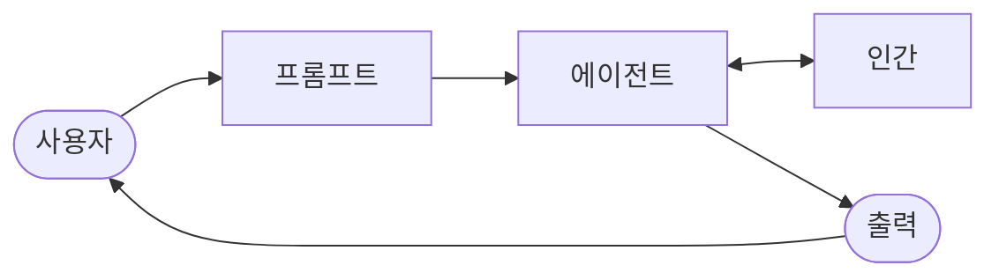

import { KeyPoints, OriginalText, Diagram, CrossRef, ChapterNav } from '@site/src/components';

<KeyPoints
  items={[
    "Human-in-the-Loop (HITL)는 에이전트(Agent) 개발 및 배포에서 인간의 판단력·창의성·섬세한 이해와 AI의 연산 능력을 의도적으로 결합하는 핵심 패턴입니다.",
    "HITL의 핵심 원칙은 AI가 윤리적 경계 안에서 동작하고, 안전 프로토콜을 준수하며, 최적의 효과를 달성하도록 보장하는 것입니다.",
    "주요 구성 요소로는 인간 감독(Human Oversight), 개입 및 수정(Intervention and Correction), 학습을 위한 인간 피드백, 의사결정 증강(Decision Augmentation), 인간-에이전트 협업, 에스컬레이션 정책(Escalation Policies)이 있습니다.",
    "HITL의 주요 한계는 확장성 부재와 숙련된 도메인 전문가 의존성이며, 민감 정보 익명화 등 운영상 과제도 수반합니다.",
    "ADK의 escalate_to_human 도구와 콜백 기반 개인화를 결합하면 실용적인 HITL 지원 에이전트를 구현할 수 있습니다.",
  ]}
/>

# 13장: Human-in-the-Loop

Human-in-the-Loop (HITL) 패턴은 에이전트(Agent) 개발 및 배포에서 중추적 전략을 나타냅니다. 이 패턴은 판단력, 창의성, 섬세한 이해력 같은 인간 인지의 고유한 강점과 AI의 연산 능력 및 효율성을 의도적으로 결합합니다. 이러한 전략적 통합은 단순한 선택지가 아니라, AI 시스템이 중요한 의사결정 프로세스에 점점 더 깊이 내재화될수록 종종 필수 요건이 됩니다.

HITL의 핵심 원칙은 AI가 윤리적 경계 안에서 동작하고, 안전 프로토콜을 준수하며, 최적의 효과로 목표를 달성하도록 보장하는 것입니다. 이러한 우려는 복잡성, 모호성, 또는 상당한 위험성을 특징으로 하는 도메인에서 특히 두드러지며, 이런 환경에서는 AI 오류나 잘못된 해석의 파급 효과가 클 수 있습니다. 이런 시나리오에서 완전한 자율성 — AI 시스템이 어떤 인간 개입도 없이 독립적으로 기능하는 형태 — 은 신중하지 못한 선택임이 드러날 수 있습니다. HITL은 이 현실을 인정하고, 빠르게 발전하는 AI 기술 속에서도 인간의 감독, 전략적 입력, 협력적 상호작용이 필수불가결하게 남아 있음을 강조합니다.

HITL 접근법은 근본적으로 인공 지능과 인간 지능 사이의 시너지 개념을 중심으로 합니다. AI를 인간 노동자의 대체제로 보는 시각과 달리, HITL은 AI를 인간의 역량을 증강하고 향상시키는 도구로 자리매김합니다. 이 증강은 루틴 작업 자동화부터 인간 의사결정을 돕는 데이터 기반 인사이트 제공까지 다양한 형태를 취할 수 있습니다. 궁극적 목표는 인간과 AI 에이전트 모두 각자의 고유한 강점을 발휘하여, 어느 한쪽만으로는 달성할 수 없는 결과를 이끌어내는 협력적 생태계를 구축하는 것입니다.

실제로 HITL은 다양한 방식으로 구현될 수 있습니다. 일반적인 접근법 중 하나는 인간이 검증자 또는 검토자 역할을 맡아 AI 출력을 검사하고 정확성을 확인하며 잠재적 오류를 식별하는 것입니다. 또 다른 구현 방식은 인간이 AI 행동을 적극적으로 안내하고, 실시간으로 피드백을 제공하거나 수정하는 것입니다. 더 복잡한 설정에서는 인간이 대화형 다이얼로그나 공유 인터페이스를 통해 AI와 파트너로서 협력하며 공동으로 문제를 해결하거나 의사결정을 내릴 수 있습니다. 구체적인 구현 방식과 무관하게, HITL 패턴은 인간의 통제 및 감독 유지의 중요성을 강조하며, AI 시스템이 인간의 윤리·가치·목표·사회적 기대와 일치하도록 보장합니다.

## Human-in-the-Loop 패턴 개요

Human-in-the-Loop (HITL) 패턴은 인공 지능과 인간 입력을 통합하여 에이전트(Agent) 역량을 강화합니다. 이 접근법은 최적의 AI 성능이 자동화된 처리와 인간의 통찰력의 결합을 자주 필요로 한다는 점, 특히 높은 복잡성 또는 윤리적 고려가 수반되는 시나리오에서 그러하다는 점을 인정합니다. 인간 입력을 대체하는 것이 아니라, HITL은 중요한 판단과 결정이 인간의 이해를 반영하도록 보장함으로써 인간의 능력을 증강하는 것을 목표로 합니다.

HITL은 여러 핵심 측면을 포괄합니다. **인간 감독(Human Oversight)** 은 에이전트(Agent) 성능과 출력을 모니터링(예: 로그 검토 또는 실시간 대시보드를 통해)하여 지침 준수를 보장하고 바람직하지 않은 결과를 방지하는 것을 포함합니다. **개입 및 수정(Intervention and Correction)** 은 AI 에이전트가 오류나 모호한 시나리오에 직면했을 때 인간 개입을 요청할 수 있을 때 발생하며, 인간 운영자는 오류를 수정하고, 누락된 데이터를 보충하거나, 에이전트를 안내할 수 있으며, 이는 향후 에이전트 개선에도 기여합니다. **학습을 위한 인간 피드백(Human Feedback for Learning)** 은 AI 모델을 정제하기 위해 수집·활용되며, 인간 피드백 강화학습(RLHF)과 같은 방법론에서 두드러지게 나타나는데, 이 방법에서는 인간의 선호도가 에이전트의 학습 궤적에 직접적인 영향을 미칩니다. **의사결정 증강(Decision Augmentation)** 은 AI 에이전트가 분석과 권고안을 인간에게 제공하고, 인간이 최종 결정을 내리는 방식으로, 완전한 자율성이 아닌 AI 생성 인사이트를 통해 인간의 의사결정을 강화합니다. **인간-에이전트 협업(Human-Agent Collaboration)** 은 인간과 AI 에이전트가 각자의 강점을 기여하는 협력적 상호작용으로, 루틴적인 데이터 처리는 에이전트가 담당하고 창의적인 문제 해결이나 복잡한 협상은 인간이 관리합니다. 마지막으로 **에스컬레이션 정책(Escalation Policies)** 은 에이전트가 언제 어떻게 작업을 인간 운영자에게 에스컬레이션해야 하는지를 규정하는 확립된 프로토콜로, 에이전트의 역량 범위를 벗어난 상황에서 오류를 방지합니다.

HITL 패턴을 구현하면 완전한 자율성이 불가능하거나 허용되지 않는 민감한 분야에서 에이전트(Agent) 활용이 가능해집니다. 또한 피드백 루프를 통한 지속적인 개선 메커니즘도 제공합니다. 예를 들어, 금융 분야에서 대규모 기업 대출의 최종 승인에는 인간 대출 담당자가 리더십의 성격 같은 질적 요소를 평가해야 합니다. 마찬가지로 법률 분야에서 정의와 책임의 핵심 원칙은 복잡한 도덕적 추론이 수반되는 양형 같은 중요한 결정에서 인간 판사가 최종 권한을 보유하도록 요구합니다.

**주의사항**: 장점에도 불구하고 HITL 패턴에는 상당한 주의사항이 있으며, 그 중에서도 확장성 부족이 가장 중요합니다. 인간 감독은 높은 정확도를 제공하지만, 운영자가 수백만 건의 작업을 처리할 수 없다는 근본적인 트레이드오프가 발생하며, 이는 종종 규모를 위한 자동화와 정확도를 위한 HITL을 결합한 하이브리드 접근법이 필요합니다. 더불어 이 패턴의 효과는 인간 운영자의 전문성에 크게 의존합니다. 예를 들어, AI가 소프트웨어 코드를 생성할 수 있지만, 미묘한 오류를 정확히 식별하고 수정을 위한 올바른 안내를 제공할 수 있는 것은 숙련된 개발자뿐입니다. 이러한 전문성 필요성은 HITL을 사용하여 훈련 데이터를 생성할 때도 적용되며, 인간 주석자들이 고품질 데이터를 생산하는 방식으로 AI를 수정하는 방법을 배우기 위해 특별한 훈련이 필요할 수 있습니다. 마지막으로 HITL 구현은 상당한 프라이버시 우려를 제기하는데, 민감한 정보를 인간 운영자에게 노출하기 전에 엄격하게 익명화해야 하는 경우가 많아 프로세스 복잡성의 또 다른 층을 추가합니다.

## 실용적 응용 및 사용 사례

Human-in-the-Loop 패턴은 정확성, 안전성, 윤리, 또는 섬세한 이해가 최우선인 다양한 산업과 응용 분야에서 필수적입니다.

- **콘텐츠 모더레이션(Content Moderation)**: AI 에이전트는 온라인 콘텐츠에서 위반 사항(예: 혐오 발언, 스팸)을 신속하게 필터링할 수 있습니다. 그러나 모호하거나 경계선상의 콘텐츠는 인간 모더레이터의 검토와 최종 결정을 위해 에스컬레이션되어, 섬세한 판단과 복잡한 정책 준수를 보장합니다.
- **자율 주행(Autonomous Driving)**: 자율 주행차는 대부분의 운전 작업을 자율적으로 처리하지만, AI가 자신 있게 탐색할 수 없는 복잡하거나 예측 불가능하거나 위험한 상황(예: 극한 날씨, 비정상적인 도로 조건)에서는 인간 운전자에게 제어권을 이양하도록 설계됩니다.
- **금융 사기 감지(Financial Fraud Detection)**: AI 시스템은 패턴을 기반으로 의심스러운 거래를 표시할 수 있습니다. 그러나 고위험 또는 모호한 알림은 종종 추가 조사를 수행하고 고객에게 연락하며 거래가 사기인지 최종 판단을 내리는 인간 분석가에게 전송됩니다.
- **법률 문서 검토(Legal Document Review)**: AI는 수천 건의 법률 문서를 빠르게 스캔하고 분류하여 관련 조항이나 증거를 식별할 수 있습니다. 그런 다음 인간 법률 전문가가 AI의 결과물을 정확성, 맥락, 법적 함의에 대해 검토하며, 특히 중요한 사건에서 그러합니다.
- **고객 지원 - 복잡한 쿼리(Customer Support - Complex Queries)**: 챗봇은 루틴한 고객 문의를 처리할 수 있습니다. 사용자의 문제가 너무 복잡하거나, 감정적으로 격해 있거나, AI가 제공하기 어려운 공감이 필요한 경우, 대화는 원활하게 인간 지원 에이전트에게 이관됩니다.
- **데이터 레이블링 및 주석(Data Labeling and Annotation)**: AI 모델은 종종 학습을 위한 대규모 레이블 데이터셋을 필요로 합니다. 인간이 루프에 투입되어 이미지, 텍스트, 또는 오디오를 정확하게 레이블링하여 AI가 학습하는 그라운드 트루스(Ground Truth)를 제공합니다. 이는 모델이 발전함에 따라 지속되는 프로세스입니다.
- **생성 AI 정제(Generative AI Refinement)**: LLM이 창의적 콘텐츠(예: 마케팅 카피, 디자인 아이디어)를 생성할 때, 인간 편집자나 디자이너가 출력을 검토하고 정제하여 브랜드 가이드라인 준수, 대상 독자와의 공명, 품질 유지를 보장합니다.
- **자율 네트워크(Autonomous Networks)**: AI 시스템은 핵심 성과 지표(KPI)와 식별된 패턴을 활용하여 알림을 분석하고 네트워크 문제 및 트래픽 이상을 예측할 수 있습니다. 그럼에도 고위험 알림 처리 등 중요한 결정은 인간 분석가에게 자주 에스컬레이션됩니다. 이 분석가들은 추가 조사를 수행하고 네트워크 변경 승인에 대한 최종 판단을 내립니다.

이 패턴은 AI 구현을 위한 실용적인 방법을 예시합니다. 향상된 확장성과 효율성을 위해 AI를 활용하면서, 품질, 안전성, 윤리적 준수를 보장하기 위한 인간 감독(Human Oversight)을 유지합니다.

"인간 루프 감시(Human-on-the-loop)"는 이 패턴의 변형으로, 인간 전문가가 전체적인 정책을 정의하고 AI가 준수를 위해 즉각적인 조치를 처리합니다. 두 가지 예시를 살펴보겠습니다.

- **자동화된 금융 거래 시스템(Automated financial trading system)**: 이 시나리오에서는 인간 금융 전문가가 전체적인 투자 전략과 규칙을 설정합니다. 예를 들어, 인간은 "70% 기술주와 30% 채권으로 포트폴리오를 유지하고, 단일 기업에 5% 이상 투자하지 말며, 구매 가격보다 10% 하락한 주식은 자동으로 매각하라"는 정책을 정의할 수 있습니다. 그러면 AI는 주식 시장을 실시간으로 모니터링하고, 이러한 사전 정의된 조건이 충족될 때 즉시 거래를 실행합니다. AI는 인간 운영자가 설정한 더 느리고 더 전략적인 정책을 기반으로 즉각적이고 빠른 속도의 조치를 처리합니다.
- **현대적 콜 센터(Modern call center)**: 이 설정에서는 인간 관리자가 고객 상호작용을 위한 고수준 정책을 수립합니다. 예를 들어, 관리자는 "서비스 중단'을 언급하는 모든 통화는 즉시 기술 지원 전문가에게 라우팅되어야 한다" 또는 "고객의 음성 톤이 높은 불만을 나타내면, 시스템이 인간 에이전트와 직접 연결을 제안해야 한다"와 같은 규칙을 설정할 수 있습니다. 그러면 AI 시스템이 초기 고객 상호작용을 처리하며, 실시간으로 고객의 요구를 듣고 해석합니다. 각 개별 케이스에 인간 개입 없이 통화를 즉시 라우팅하거나 에스컬레이션을 제안함으로써 관리자의 정책을 자율적으로 실행합니다. 이를 통해 AI는 인간 운영자가 제공하는 더 느리고 전략적인 안내에 따라 대용량의 즉각적인 조치를 관리할 수 있습니다.

## 실습 코드 예제

Human-in-the-Loop 패턴을 시연하기 위해, ADK 에이전트는 인간 검토가 필요한 시나리오를 식별하고 에스컬레이션 프로세스를 시작할 수 있습니다. 이를 통해 에이전트의 자율적 의사결정 역량이 제한되거나 복잡한 판단이 필요한 상황에서 인간 개입이 가능해집니다. 이는 독립된 기능이 아닙니다. LangChain과 같은 다른 인기 있는 프레임워크들도 이러한 유형의 상호작용을 구현하기 위한 유사한 도구를 채택했습니다.

````python
from google.adk.agents import Agent
from google.adk.tools.tool_context import ToolContext
from google.adk.callbacks import CallbackContext
from google.adk.models.llm import LlmRequest
from google.genai import types
from typing import Optional

# Placeholder for tools (replace with actual implementations if
needed)
def troubleshoot_issue(issue: str) -> dict:
   return {"status": "success", "report": f"Troubleshooting steps for
{issue}."}

def create_ticket(issue_type: str, details: str) -> dict:
   return {"status": "success", "ticket_id": "TICKET123"}

def escalate_to_human(issue_type: str) -> dict:
   # This would typically transfer to a human queue in a real system
   return {"status": "success", "message": f"Escalated {issue_type}
to a human specialist."}

technical_support_agent = Agent(
   name="technical_support_specialist",
   model="gemini-2.0-flash-exp",
   instruction="""
You are a technical support specialist for our electronics company.
FIRST, check if the user has a support history in
state["customer_info"]["support_history"]. If they do, reference this
history in your responses.
For technical issues:
1. Use the troubleshoot_issue tool to analyze the problem.
2. Guide the user through basic troubleshooting steps.
3. If the issue persists, use create_ticket to log the issue.
For complex issues beyond basic troubleshooting:
1. Use escalate_to_human to transfer to a human specialist.
Maintain a professional but empathetic tone. Acknowledge the
frustration technical issues can cause, while providing clear steps
toward resolution.
""",
   tools=[troubleshoot_issue, create_ticket, escalate_to_human]
)

def personalization_callback(
   callback_context: CallbackContext, llm_request: LlmRequest
) -> Optional[LlmRequest]:
   """Adds personalization information to the LLM request."""
   # Get customer info from state
   customer_info = callback_context.state.get("customer_info")
   if customer_info:
       customer_name = customer_info.get("name", "valued customer")
       customer_tier = customer_info.get("tier", "standard")
       recent_purchases = customer_info.get("recent_purchases", [])

       personalization_note = (
           f"\nIMPORTANT PERSONALIZATION:\n"
           f"Customer Name: {customer_name}\n"
           f"Customer Tier: {customer_tier}\n"
       )
       if recent_purchases:
           personalization_note += f"Recent Purchases: {',
'.join(recent_purchases)}\n"


       if llm_request.contents:
           # Add as a system message before the first content
           system_content = types.Content(
               role="system",
parts=[types.Part(text=personalization_note)]
           )
           llm_request.contents.insert(0, system_content)
   return None # Return None to continue with the modified request
````

이 코드는 Google의 ADK를 사용하여 HITL 프레임워크를 중심으로 설계된 기술 지원 에이전트를 생성하는 청사진을 제공합니다. 에이전트는 지능적인 첫 번째 지원 라인 역할을 하며, 완전한 지원 워크플로를 관리하기 위해 `troubleshoot_issue`, `create_ticket`, `escalate_to_human`과 같은 특정 지시사항과 도구로 구성됩니다. 에스컬레이션 도구는 HITL 설계의 핵심 부분으로, 복잡하거나 민감한 케이스가 인간 전문가에게 전달되도록 보장합니다.

이 아키텍처의 핵심 기능은 전용 콜백(Callback) 함수를 통해 달성되는 심층적인 개인화 역량입니다. LLM에 접촉하기 전에, 이 함수는 에이전트의 상태에서 고객별 데이터(이름, 등급, 구매 내역 등)를 동적으로 조회합니다. 이 컨텍스트는 시스템 메시지로 프롬프트에 주입되어, 에이전트가 사용자의 이력을 참조하는 고도로 맞춤화된 응답을 제공할 수 있게 합니다. 구조화된 워크플로와 필수적인 인간 감독(Human Oversight), 동적 개인화를 결합함으로써, 이 코드는 ADK가 정교하고 견고한 AI 지원 솔루션 개발을 어떻게 촉진하는지 보여주는 실용적인 예시로 기능합니다.

## 한눈에 보기

**무엇이 문제인가**: 고급 LLM을 포함한 AI 시스템은 섬세한 판단, 윤리적 추론, 또는 복잡하고 모호한 맥락에 대한 깊은 이해를 필요로 하는 작업에서 종종 어려움을 겪습니다. 고위험 환경에 완전 자율 AI를 배포하면 상당한 위험이 수반되며, 오류는 심각한 안전, 금융, 또는 윤리적 결과로 이어질 수 있습니다. 이러한 시스템은 인간이 보유한 본질적인 창의성과 상식적 추론이 부족합니다. 따라서 중요한 의사결정 프로세스에서 자동화만 의존하는 것은 종종 신중하지 못하며 시스템의 전반적인 효과성과 신뢰성을 약화시킬 수 있습니다.

**왜 Human-in-the-Loop인가**: Human-in-the-Loop (HITL) 패턴은 AI 워크플로에 인간 감독(Human Oversight)을 전략적으로 통합하는 표준화된 해결책을 제공합니다. 이 에이전틱 접근법은 AI가 연산적 중노동과 데이터 처리를 담당하고, 인간이 중요한 검증, 피드백, 개입을 제공하는 공생적 파트너십을 만들어냅니다. 이를 통해 HITL은 AI 조치가 인간의 가치와 안전 프로토콜에 부합하도록 보장합니다. 이 협력적 프레임워크는 완전 자동화의 위험을 완화할 뿐만 아니라 인간 입력으로부터의 지속적 학습을 통해 시스템의 역량을 향상시킵니다. 궁극적으로 이는 인간도 AI도 단독으로 달성할 수 없는 더 견고하고, 정확하며, 윤리적인 결과로 이어집니다.

**경험 법칙**: 의료, 금융, 자율 시스템과 같이 오류가 상당한 안전, 윤리, 또는 금융적 결과를 초래하는 도메인에 AI를 배포할 때 이 패턴을 사용하십시오. 콘텐츠 모더레이션이나 복잡한 고객 지원 에스컬레이션처럼 LLM이 신뢰성 있게 처리하기 어려운 모호성과 뉘앙스가 포함된 작업에 필수적입니다. 고품질 인간 레이블 데이터로 AI 모델을 지속적으로 개선하거나 생성 AI 출력을 특정 품질 기준에 맞게 정제하는 것이 목표일 때 HITL을 활용하십시오.

## 시각적 요약

<figure>



<figcaption>그림 1 — Human-in-the-Loop 디자인 패턴</figcaption>
</figure>

## 핵심 정리

- Human-in-the-Loop (HITL)는 인간의 지능과 판단력을 AI 워크플로에 통합합니다.
- 복잡하거나 고위험 시나리오에서 안전, 윤리, 효과성을 위해 매우 중요합니다.
- 주요 측면에는 인간 감독(Human Oversight), 개입 및 수정(Intervention and Correction), 학습을 위한 피드백, 의사결정 증강(Decision Augmentation)이 포함됩니다.
- 에스컬레이션 정책(Escalation Policies)은 에이전트가 언제 인간에게 이관해야 하는지 파악하는 데 필수적입니다.
- HITL은 책임감 있는 AI 배포와 지속적 개선을 가능하게 합니다.
- Human-in-the-Loop의 주요 단점은 확장성의 본질적 부재로, 정확도와 처리량 사이의 트레이드오프를 만들어내며, 효과적인 개입을 위해 고도로 숙련된 도메인 전문가에 의존한다는 것입니다.
- 구현에는 운영상의 과제가 따르는데, 데이터 생성을 위한 인간 운영자 훈련 필요성과 민감한 정보를 익명화하여 프라이버시 우려를 해결하는 것이 포함됩니다.

## 결론

이 장에서는 견고하고 안전하며 윤리적인 AI 시스템 구축에서 HITL의 역할을 강조하며, 중요한 Human-in-the-Loop (HITL) 패턴을 탐구했습니다. 에이전트(Agent) 워크플로에 인간 감독(Human Oversight), 개입, 피드백을 통합하면 성능과 신뢰성을 크게 향상시킬 수 있으며, 특히 복잡하고 민감한 도메인에서 그러하다는 것을 논의했습니다. 실용적 응용들은 콘텐츠 모더레이션과 의료 진단부터 자율 주행과 고객 지원까지 HITL의 광범위한 유용성을 입증했습니다. 개념적 코드 예제는 ADK가 에스컬레이션 메커니즘을 통해 이러한 인간-에이전트 상호작용을 어떻게 촉진하는지 엿볼 수 있게 해주었습니다. AI 역량이 계속 발전함에 따라, HITL은 책임감 있는 AI 개발의 초석으로 남아 있으며, 인간의 가치와 전문성이 지능형 시스템 설계의 중심에 유지되도록 보장합니다.

## 참고 문헌

1. A Survey of Human-in-the-loop for Machine Learning, Xingjiao Wu, Luwei Xiao, Yixuan Sun, Junhang Zhang, Tianlong Ma, Liang He, https://arxiv.org/abs/2108.00941

---


<figure>


<figcaption>그림 1: 휴먼인더루프(Human-in-the-Loop) 설계 패턴 — 에이전트가 인간 피드백을 받아 응답을 개선</figcaption>
</figure>

<ChapterNav
  prev={{ title: "12장", href: "/docs/part3/ch12" }}
  next={{ title: "14장 — 지식 검색 (RAG)", href: "/docs/part3/ch14" }}
/>
