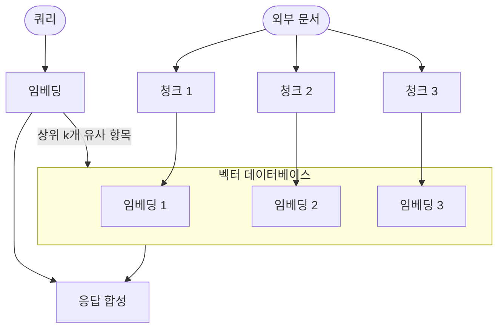
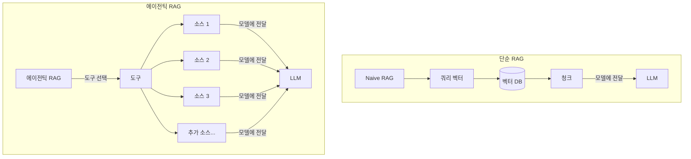
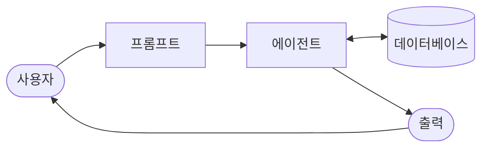
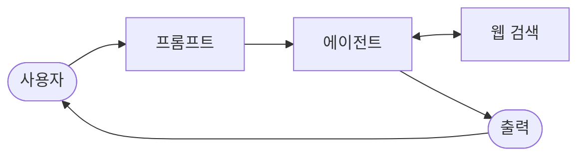

import { KeyPoints, Diagram, CrossRef } from '@site/src/components';

<KeyPoints
  items={[
    "지식 검색(RAG, Knowledge Retrieval)은 LLM이 정적 학습 데이터를 넘어 외부의 최신 정보에 접근할 수 있도록 하는 패턴입니다.",
    "RAG 파이프라인은 임베딩(Embedding) 기반 의미 검색으로 관련 청크를 찾아 프롬프트에 추가한 뒤 LLM에 전달합니다.",
    "벡터 데이터베이스(Vector Database)는 고차원 벡터를 효율적으로 저장·조회하여 의미 기반 검색을 가능하게 합니다.",
    "Graph RAG는 지식 그래프를 활용해 복잡한 다문서 질의에 대한 보다 정확한 답변을 제공합니다.",
    "에이전틱 RAG(Agentic RAG)는 추론 레이어를 도입해 검색 결과를 검증·조정·합성함으로써 더 신뢰할 수 있는 응답을 생성합니다.",
    "RAG는 기업 검색, 고객 지원, 법률 조사, 개인화 추천 등 다양한 산업에서 LLM의 실용성과 신뢰성을 높이고 있습니다.",
  ]}
/>

# 14장: 지식 검색(RAG)

LLM은 인간과 유사한 텍스트를 생성하는 데 뛰어난 역량을 발휘합니다. 그러나 LLM의 지식 베이스(Knowledge Base)는 학습에 사용된 데이터로 한정되어 있어, 실시간 정보나 특정 기업 데이터, 고도로 전문화된 세부 사항에 접근하기 어렵습니다. 검색 증강 생성(RAG, Retrieval-Augmented Generation)은 이 한계를 해결합니다. RAG는 LLM이 외부의 최신 정보와 맥락별 특화 정보에 접근·통합할 수 있도록 하여, 출력의 정확성·관련성·사실적 근거를 강화합니다.

AI 에이전트(에이전트)에게 이 역량은 매우 중요합니다. 에이전트가 정적 학습 데이터를 넘어 실시간으로 검증 가능한 데이터에 행동과 응답을 기반하도록 만들기 때문입니다. 이 역량 덕분에 에이전트는 최신 사내 정책을 조회해 특정 질문에 답하거나, 주문 전 현재 재고를 확인하는 등 복잡한 작업을 정확히 수행할 수 있습니다. 외부 지식을 통합함으로써 RAG는 에이전트를 단순한 대화 상대에서 의미 있는 작업을 실행할 수 있는 효과적인 데이터 기반 도구로 변환합니다.

## 지식 검색(RAG) 패턴 개요

지식 검색(RAG) 패턴은 응답을 생성하기 전에 외부 지식 베이스에 대한 접근 권한을 부여함으로써 LLM의 역량을 크게 향상시킵니다. 내부의 사전 학습된 지식에만 의존하는 대신, RAG는 LLM이 인간이 책을 펼치거나 인터넷을 검색하듯 정보를 "조회"할 수 있게 합니다. 이 과정은 LLM이 더 정확하고 최신의, 그리고 검증 가능한 답변을 제공할 수 있도록 합니다.

사용자가 RAG 시스템에 질문하거나 프롬프트(프롬프트)를 입력하면, 해당 쿼리는 LLM에 직접 전달되지 않습니다. 대신 시스템은 먼저 방대한 외부 지식 베이스—문서, 데이터베이스, 웹 페이지로 구성된 고도로 조직화된 라이브러리—에서 관련 정보를 탐색합니다. 이 검색은 단순한 키워드 매칭이 아니라, 사용자의 의도와 단어 이면의 의미를 이해하는 "의미 검색(Semantic Search)"입니다. 이 초기 검색은 가장 관련성 높은 정보 단편, 즉 "청크(chunk)"를 추출합니다. 추출된 정보 조각은 원래의 프롬프트에 "증강(augmented)"되어 더 풍부하고 정보가 담긴 쿼리를 형성합니다. 최종적으로 이 강화된 프롬프트가 LLM에 전달됩니다. 이 추가적인 맥락을 바탕으로 LLM은 유창하고 자연스러울 뿐만 아니라 검색된 데이터에 사실적으로 근거한 응답을 생성할 수 있습니다.

RAG 프레임워크는 몇 가지 중요한 이점을 제공합니다. LLM이 최신 정보에 접근할 수 있도록 하여 정적 학습 데이터의 제약을 극복할 수 있습니다. 이 접근 방식은 또한 검증 가능한 데이터에 응답을 기반함으로써 "환각(Hallucination)"—잘못된 정보를 생성하는 현상—의 위험을 줄입니다. 더 나아가 LLM은 내부 사내 문서나 위키에서 찾을 수 있는 전문화된 지식을 활용할 수 있습니다. 이 과정의 핵심 장점은 정보의 정확한 출처를 명시하는 "인용(Citation)" 기능으로, AI 응답의 신뢰성과 검증 가능성을 높입니다.

RAG의 작동 방식을 완전히 이해하려면 몇 가지 핵심 개념을 파악하는 것이 중요합니다(<span>그림 1</span> 참조):

```text
1
```

**임베딩(Embedding):** LLM의 맥락에서 임베딩(Embedding)은 단어, 구문, 또는 전체 문서와 같은 텍스트의 수치적 표현입니다. 이 표현은 숫자 목록인 벡터의 형태를 취합니다. 핵심 아이디어는 수학적 공간에서 텍스트 간의 의미 관계를 포착하는 것입니다. 유사한 의미를 가진 단어나 구문은 이 벡터 공간에서 서로 더 가까운 임베딩을 갖게 됩니다. 예를 들어 간단한 2D 그래프를 상상해 보십시오. "cat"이라는 단어는 좌표 (2, 3)으로 표현될 수 있고, "kitten"은 매우 가까운 (2.1, 3.1)에 위치합니다. 반면 "car"라는 단어는 다른 의미를 반영하여 (8, 1)과 같이 먼 좌표에 위치합니다. 실제로 이 임베딩은 수백 또는 수천 차원의 훨씬 고차원 공간에 있어 언어에 대한 매우 세밀한 이해를 가능하게 합니다.

**텍스트 유사도(Text Similarity):** 텍스트 유사도는 두 텍스트가 얼마나 유사한지를 측정합니다. 이는 단어 겹침을 보는 표면적 수준(어휘 유사도)이거나 더 깊은 의미 기반 수준일 수 있습니다. RAG의 맥락에서 텍스트 유사도는 사용자의 쿼리에 대응하는 지식 베이스의 가장 관련성 높은 정보를 찾는 데 중요합니다. 예를 들어 "프랑스의 수도는 무엇입니까?"와 "프랑스의 수도는 어느 도시입니까?"라는 문장을 고려해 보십시오. 표현은 다르지만 같은 질문입니다. 좋은 텍스트 유사도 모델은 이를 인식하고 공통 단어가 몇 개밖에 없더라도 두 문장에 높은 유사도 점수를 부여합니다. 이는 텍스트의 임베딩을 사용하여 계산되는 경우가 많습니다.

```text
2
```

**의미 유사도(Semantic Similarity)와 거리:** 의미 유사도(Semantic Similarity)는 텍스트의 의미와 맥락에 초점을 맞추는 더 고급 형태의 텍스트 유사도로, 단순히 사용된 단어가 아닌 의미를 이해합니다. 두 텍스트가 같은 개념이나 아이디어를 전달하는지 이해하는 것을 목표로 합니다. 의미 거리는 이의 역수로, 높은 의미 유사도는 낮은 의미 거리를 의미합니다. RAG에서 의미 검색은 사용자 쿼리와 의미 거리가 가장 작은 문서를 찾는 데 의존합니다. 예를 들어 "털북숭이 고양이 친구"와 "집에서 기르는 고양이"라는 구문은 "a"를 제외하고 공통 단어가 없습니다. 그러나 의미 유사도를 이해하는 모델은 두 구문이 같은 것을 가리킨다는 것을 인식하고 매우 유사하다고 판단합니다. 이는 두 구문의 임베딩이 벡터 공간에서 매우 가까워 작은 의미 거리를 나타내기 때문입니다. 이것이 RAG가 사용자의 표현이 지식 베이스의 텍스트와 정확히 일치하지 않더라도 관련 정보를 찾을 수 있게 하는 "스마트 검색"입니다.

<figure>



<figcaption>그림 1: RAG 핵심 개념 — 청킹, 임베딩, 벡터 데이터베이스</figcaption>
</figure>

```text
3
```

**문서 청킹(Chunking of Documents):** 청킹(Chunking)은 대형 문서를 더 작고 관리하기 쉬운 조각, 즉 "청크"로 분해하는 과정입니다. RAG 시스템이 효율적으로 작동하려면 전체 대형 문서를 LLM에 입력할 수 없습니다. 대신 이 더 작은 청크를 처리합니다. 문서를 청킹하는 방식은 정보의 맥락과 의미를 보존하는 데 중요합니다. 예를 들어 50페이지 사용자 매뉴얼을 단일 텍스트 블록으로 처리하는 대신, 청킹 전략은 섹션, 단락, 심지어 문장으로 분해할 수 있습니다. 예를 들어 "문제 해결" 섹션은 "설치 가이드"와 별도의 청크가 됩니다. 사용자가 특정 문제에 대해 질문할 때 RAG 시스템은 전체 매뉴얼이 아닌 가장 관련성 높은 문제 해결 청크를 검색할 수 있습니다. 이로써 검색 프로세스가 더 빨라지고 LLM에 제공되는 정보가 사용자의 즉각적인 필요에 더 집중적으로 관련됩니다.

```text
4
```

문서가 청킹되면 RAG 시스템은 특정 쿼리에 가장 관련성 높은 조각을 찾기 위한 검색 기법을 사용해야 합니다. 주요 방법은 벡터 검색(Vector Search)으로, 임베딩과 의미 거리를 사용해 사용자 질문과 개념적으로 유사한 청크를 찾습니다. 더 오래되었지만 여전히 유용한 기법은 BM25로, 의미를 이해하지 않고 용어 빈도에 따라 청크를 순위화하는 키워드 기반 알고리즘입니다. 두 방식의 장점을 모두 활용하기 위해 BM25의 키워드 정밀도와 의미 검색의 맥락 이해를 결합한 하이브리드 검색 방식이 자주 사용됩니다.

**벡터 데이터베이스(Vector databases):** 벡터 데이터베이스는 임베딩(Embedding)을 효율적으로 저장하고 쿼리하도록 설계된 특수 유형의 데이터베이스입니다. 문서가 청킹되고 임베딩으로 변환되면, 이 고차원 벡터가 벡터 데이터베이스에 저장됩니다. 키워드 기반 검색과 같은 전통적인 검색 기법은 쿼리에서 정확한 단어를 포함하는 문서를 찾는 데는 탁월하지만 언어에 대한 깊은 이해가 부족합니다. 바로 이 점에서 벡터 데이터베이스가 뛰어납니다. 텍스트를 숫자 벡터로 저장함으로써 단순한 키워드 겹침이 아닌 개념적 의미에 기반한 결과를 찾을 수 있습니다. 사용자의 쿼리도 벡터로 변환되면, 데이터베이스는 고도로 최적화된 알고리즘(예: HNSW—Hierarchical Navigable Small World)을 사용하여 수백만 개의 벡터를 신속하게 탐색하고 의미가 "가장 가까운" 벡터를 찾습니다. 이 접근 방식은 사용자의 표현이 원본 문서와 완전히 다른 경우에도 관련 맥락을 발견할 수 있기 때문에 RAG에 훨씬 우수합니다. 본질적으로 다른 기법들이 단어를 검색하는 동안 벡터 데이터베이스는 의미를 검색합니다. 이 기술은 Pinecone, Weaviate와 같은 매니지드 데이터베이스부터 Chroma DB, Milvus, Qdrant와 같은 오픈소스 솔루션까지 다양한 형태로 구현됩니다. Redis, Elasticsearch, Postgres(pgvector 확장 사용)와 같은 기존 데이터베이스도 벡터 검색 기능으로 강화될 수 있습니다. 핵심 검색 메커니즘은 종종 Meta AI의 FAISS나 Google Research의 ScaNN과 같은 라이브러리로 구동됩니다.

```text
5
```

**RAG의 과제:** 그 강력함에도 불구하고 RAG 패턴은 과제가 없지 않습니다. 쿼리에 답하는 데 필요한 정보가 단일 청크에 국한되지 않고 문서의 여러 부분이나 여러 문서에 분산되어 있을 때 주요 문제가 발생합니다. 이 경우 검색기가 필요한 모든 맥락을 수집하지 못해 불완전하거나 부정확한 답변이 생성될 수 있습니다. 시스템의 효과성은 청킹 및 검색 프로세스의 품질에도 크게 의존합니다. 관련 없는 청크가 검색되면 노이즈가 유입되어 LLM을 혼란스럽게 할 수 있습니다. 더 나아가 잠재적으로 상충하는 출처의 정보를 효과적으로 종합하는 것은 이러한 시스템에 있어 여전히 상당한 장벽입니다. 그 외에도 RAG는 전체 지식 베이스를 사전 처리하여 벡터 또는 그래프 데이터베이스와 같은 특수 데이터베이스에 저장해야 하는데, 이는 상당한 작업입니다.

```text
6
```

요약하면, 검색 증강 생성(RAG) 패턴은 AI를 더 지식이 풍부하고 신뢰할 수 있게 만드는 데 있어 중요한 도약을 나타냅니다. 외부 지식 검색 단계를 생성 과정에 원활하게 통합함으로써 RAG는 독립형 LLM의 핵심 한계를 해결합니다. 임베딩과 의미 유사도(Semantic Similarity)의 기본 개념은 키워드 및 하이브리드 검색과 같은 검색 기법과 결합하여 시스템이 관련 정보를 지능적으로 찾을 수 있게 하며, 이는 전략적 청킹을 통해 관리 가능하게 됩니다. 분산되거나 상충하는 정보를 검색하는 과제가 지속되지만, RAG는 LLM이 맥락적으로 적합할 뿐만 아니라 검증 가능한 사실에 기반한 답변을 생성하도록 하여 AI에 대한 더 큰 신뢰와 유용성을 촉진합니다.

## Graph RAG

```text
7
```

GraphRAG는 정보 검색을 위해 단순한 벡터 데이터베이스 대신 지식 그래프를 활용하는 검색 증강 생성(RAG)의 고급 형태입니다. 구조화된 지식 베이스 내에서 데이터 엔터티(노드) 간의 명시적 관계(엣지)를 탐색하여 복잡한 쿼리에 답변합니다. 핵심 장점은 여러 문서에 분산된 정보를 종합하는 능력으로, 이는 전통적인 RAG의 일반적인 실패 지점입니다. 이러한 연결을 이해함으로써 GraphRAG는 더 맥락적으로 정확하고 세밀한 응답을 제공합니다.

사용 사례로는 복잡한 금융 분석(기업을 시장 사건과 연결), 유전자와 질병 간의 관계를 발견하는 과학 연구 등이 있습니다. 그러나 주요 단점은 고품질 지식 그래프를 구축하고 유지하는 데 필요한 상당한 복잡성, 비용, 전문 지식입니다. 이 설정은 또한 더 간단한 벡터 검색 시스템에 비해 유연성이 낮고 더 높은 지연 시간을 초래할 수 있습니다. 결과적으로 GraphRAG는 복잡한 질문에 대해 우수한 맥락 추론을 제공하지만 구현 및 유지 비용이 훨씬 높습니다. 요약하면, 깊이 연결된 통찰이 표준 RAG의 속도와 단순성보다 더 중요한 경우에 탁월합니다.

## 에이전틱 RAG(Agentic RAG)

이 패턴의 진화 형태인 에이전틱 RAG(Agentic RAG)는 정보 추출의 신뢰성을 크게 향상시키기 위해 추론 및 의사결정 레이어를 도입합니다(<span>그림 2</span> 참조). 단순히 검색하고 증강하는 것 이상으로, "에이전트"—특수화된 AI 구성 요소—가 지식의 중요한 문지기이자 정제자 역할을 합니다. 처음 검색된 데이터를 수동적으로 수용하는 대신, 이 에이전트는 다음 시나리오로 설명되는 바와 같이 품질, 관련성, 완전성을 능동적으로 검토합니다.

첫째, 에이전트는 반성 및 출처 검증에 탁월합니다. 사용자가 "우리 회사의 재택근무 정책은 무엇입니까?"라고 질문하면, 표준 RAG는 2020년 블로그 게시물과 공식 2025년 정책 문서를 함께 가져올 수 있습니다. 그러나 에이전트는 문서의 메타데이터를 분석하고, 2025년 정책을 가장 최신이고 권위 있는 출처로 인식하며, 정확한 답변을 위해 LLM에 올바른 맥락을 전송하기 전에 오래된 블로그 게시물을 버립니다.

<figure>



<figcaption>그림 2: 에이전틱 RAG — 추론 에이전트가 검색 정보를 능동적으로 평가·조정·정제하여 더 정확하고 신뢰할 수 있는 최종 응답을 보장합니다.</figcaption>
</figure>

```text
8
```

둘째, 에이전트는 지식 충돌 조정에 능숙합니다. 금융 분석가가 "Project Alpha의 1분기 예산은 얼마였습니까?"라고 묻는다고 상상해 보십시오. 시스템은 초기 예산을 €50,000으로 명시한 제안서와 €65,000으로 기재된 최종 재무 보고서라는 두 문서를 검색합니다. 에이전틱 RAG는 이 모순을 식별하고, 재무 보고서를 더 신뢰할 수 있는 출처로 우선시하며, 검증된 수치를 LLM에 제공하여 최종 답변이 가장 정확한 데이터에 기반하도록 합니다.

셋째, 에이전트는 복잡한 답변을 종합하기 위해 다단계 추론을 수행할 수 있습니다. 사용자가 "우리 제품의 기능과 가격은 경쟁사 X와 어떻게 비교됩니까?"라고 묻는 경우, 에이전트는 이를 별도의 하위 쿼리로 분해합니다. 자사 제품의 기능, 가격, 경쟁사 X의 기능, 경쟁사 X의 가격에 대해 각각 별도의 검색을 시작합니다. 이 개별 정보를 수집한 후 에이전트는 LLM에 입력하기 전에 이를 구조화된 비교 맥락으로 종합하여, 단순한 검색으로는 생성할 수 없었던 포괄적인 응답을 가능하게 합니다.

넷째, 에이전트는 지식 격차를 식별하고 외부 도구를 사용할 수 있습니다. 사용자가 "어제 출시된 새 제품에 대한 시장의 즉각적인 반응은 어떠했습니까?"라고 묻는다고 가정해 보십시오. 에이전트는 주 단위로 업데이트되는 내부 지식 베이스를 검색하지만 관련 정보를 찾지 못합니다. 이 격차를 인식한 에이전트는 라이브 웹 검색 API와 같은 도구를 활성화하여 최근 뉴스 기사와 소셜 미디어 감정을 찾을 수 있습니다. 에이전트는 이렇게 새로 수집한 외부 정보를 사용하여 정적 내부 데이터베이스의 한계를 극복하고 최신 답변을 제공합니다.

### 에이전틱 RAG의 과제

강력하지만 에이전트 레이어는 자체적인 과제를 도입합니다. 주요 단점은 복잡성과 비용의 상당한 증가입니다. 에이전트의 의사결정 로직과 도구 통합을 설계, 구현, 유지하려면 상당한 엔지니어링 노력이 필요하고 계산 비용이 추가됩니다. 이 복잡성은 또한 에이전트의 반성, 도구 사용, 다단계 추론 사이클이 표준적이고 직접적인 검색 프로세스보다 더 많은 시간이 걸리기 때문에 지연 시간 증가로 이어질 수 있습니다. 더 나아가 에이전트 자체가 새로운 오류 원인이 될 수 있습니다. 결함 있는 추론 프로세스는 에이전트가 쓸모없는 루프에 갇히거나, 작업을 잘못 해석하거나, 관련 정보를 부적절하게 버려 최종 응답의 품질을 저하시킬 수 있습니다.

요약하면, 에이전틱 RAG(Agentic RAG)는 표준 검색 패턴의 정교한 진화를 나타내며, 이를 수동적 데이터 파이프라인에서 능동적 문제 해결 프레임워크로 변환합니다. 출처를 평가하고, 충돌을 조정하며, 복잡한 질문을 분해하고, 외부 도구를 사용할 수 있는 추론 레이어를 내장함으로써 에이전트는 생성된 답변의 신뢰성과 깊이를 크게 향상시킵니다. 이 발전은 AI를 더 신뢰할 수 있고 역량 있게 만들지만, 신중하게 관리해야 할 시스템 복잡성, 지연 시간, 비용 측면에서 중요한 트레이드오프를 수반합니다.

## 실용적 적용 및 활용 사례

지식 검색(RAG)은 대규모 언어 모델(LLM)이 다양한 산업에서 활용되는 방식을 변화시켜, 더 정확하고 맥락적으로 관련성 높은 응답을 제공하는 능력을 향상시키고 있습니다.

응용 사례:

- **기업 검색 및 Q&A:** 조직은 HR 정책, 기술 매뉴얼, 제품 사양 등 내부 문서를 사용하여 직원 문의에 응답하는 내부 챗봇을 개발할 수 있습니다. RAG 시스템은 이러한 문서에서 관련 섹션을 추출하여 LLM의 응답을 안내합니다.
- **고객 지원 및 헬프데스크:** RAG 기반 시스템은 제품 매뉴얼, 자주 묻는 질문(FAQ), 지원 티켓의 정보에 접근하여 고객 쿼리에 정확하고 일관된 응답을 제공할 수 있습니다. 이를 통해 일상적인 문제에 대한 직접적인 인간 개입의 필요성을 줄일 수 있습니다.
- **개인화된 콘텐츠 추천:** 기본적인 키워드 매칭 대신 RAG는 사용자의 선호도나 이전 상호작용과 의미적으로 관련된 콘텐츠(기사, 제품)를 식별하고 검색하여 더 관련성 높은 추천으로 이어집니다.
- **뉴스 및 시사 요약:** LLM은 실시간 뉴스 피드와 통합될 수 있습니다. 현재 사건에 대한 질문을 받으면 RAG 시스템이 최근 기사를 검색하여 LLM이 최신 요약을 생성할 수 있도록 합니다.

외부 지식을 통합함으로써 RAG는 LLM의 역량을 단순한 통신을 넘어 지식 처리 시스템으로 기능하도록 확장합니다.

## 실습 코드 예제 (ADK)

지식 검색(RAG) 패턴을 설명하기 위해 세 가지 예제를 살펴보겠습니다.

첫 번째로, Google Search를 사용하여 RAG를 수행하고 LLM을 검색 결과에 그라운딩(그라운딩)하는 방법입니다. RAG는 외부 정보에 접근하는 것을 포함하므로 Google Search 도구는 LLM의 지식을 증강할 수 있는 내장 검색 메커니즘의 직접적인 예입니다.

```text
from google.adk.tools import google_search
from google.adk.agents import Agent

search_agent = Agent(
   name="research_assistant",
   model="gemini-2.0-flash-exp",
   instruction="You help users research topics. When asked, use the
Google Search tool",
   tools=[google_search]
)
```

두 번째로, 이 섹션은 Google ADK 내에서 Vertex AI RAG 기능을 활용하는 방법을 설명합니다. 제공된 코드는 ADK에서 `VertexAiRagMemoryService`의 초기화를 보여줍니다. 이를 통해 Google Cloud Vertex AI RAG Corpus와의 연결을 설정할 수 있습니다. 서비스는 코퍼스 리소스 이름과 `SIMILARITY_TOP_K` 및 `VECTOR_DISTANCE_THRESHOLD`와 같은 선택적 파라미터를 지정하여 구성됩니다. 이 파라미터들은 검색 프로세스에 영향을 줍니다. `SIMILARITY_TOP_K`는 검색할 상위 유사 결과의 수를 정의합니다. `VECTOR_DISTANCE_THRESHOLD`는 검색된 결과에 대한 의미 거리의 한계를 설정합니다. 이 설정은 에이전트가 지정된 RAG Corpus에서 확장 가능하고 지속적인 의미 지식 검색을 수행할 수 있도록 합니다.

```text
# Import the necessary VertexAiRagMemoryService class from the
google.adk.memory module.
from google.adk.memory import VertexAiRagMemoryService

RAG_CORPUS_RESOURCE_NAME =
"projects/your-gcp-project-id/locations/us-central1/ragCorpora/your-c
orpus-id"

# Define an optional parameter for the number of top similar results
9
```

```python
to retrieve.
# This controls how many relevant document chunks the RAG service
will return.
SIMILARITY_TOP_K = 5

# Define an optional parameter for the vector distance threshold.
# This threshold determines the maximum semantic distance allowed for
retrieved results;
# results with a distance greater than this value might be filtered
out.
VECTOR_DISTANCE_THRESHOLD = 0.7

# Initialize an instance of VertexAiRagMemoryService.
# This sets up the connection to your Vertex AI RAG Corpus.
# - rag_corpus: Specifies the unique identifier for your RAG Corpus.
# - similarity_top_k: Sets the maximum number of similar results to
fetch.
# - vector_distance_threshold: Defines the similarity threshold for
filtering results.
memory_service = VertexAiRagMemoryService(
   rag_corpus=RAG_CORPUS_RESOURCE_NAME,
   similarity_top_k=SIMILARITY_TOP_K,
   vector_distance_threshold=VECTOR_DISTANCE_THRESHOLD
)
```

## 실습 코드 예제 (LangChain)

세 번째로, LangChain을 사용한 완전한 예제를 살펴보겠습니다.

```python
import os
import requests
from typing import List, Dict, Any, TypedDict
from langchain_community.document_loaders import TextLoader

from langchain_core.documents import Document
from langchain_core.prompts import ChatPromptTemplate
from langchain_core.output_parsers import StrOutputParser
from langchain_community.embeddings import OpenAIEmbeddings
from langchain_community.vectorstores import Weaviate
from langchain_openai import ChatOpenAI
from langchain.text_splitter import CharacterTextSplitter
from langchain.schema.runnable import RunnablePassthrough
from langgraph.graph import StateGraph, END
import weaviate
from weaviate.embedded import EmbeddedOptions
10
```

```python
import dotenv

# Load environment variables (e.g., OPENAI_API_KEY)
dotenv.load_dotenv()
# Set your OpenAI API key (ensure it's loaded from .env or set here)
# os.environ["OPENAI_API_KEY"] = "YOUR_OPENAI_API_KEY"

# --- 1. Data Preparation (Preprocessing) ---
# Load data
url =
"https://github.com/langchain-ai/langchain/blob/master/docs/docs/how_
to/state_of_the_union.txt"
res = requests.get(url)

with open("state_of_the_union.txt", "w") as f:
   f.write(res.text)


loader = TextLoader('./state_of_the_union.txt')
documents = loader.load()

# Chunk documents
text_splitter = CharacterTextSplitter(chunk_size=500,
chunk_overlap=50)
chunks = text_splitter.split_documents(documents)

# Embed and store chunks in Weaviate
client = weaviate.Client(
   embedded_options = EmbeddedOptions()
)

vectorstore = Weaviate.from_documents(
   client = client,
   documents = chunks,
   embedding = OpenAIEmbeddings(),
   by_text = False
)

# Define the retriever
retriever = vectorstore.as_retriever()

# Initialize LLM
llm = ChatOpenAI(model_name="gpt-3.5-turbo", temperature=0)

# --- 2. Define the State for LangGraph ---
class RAGGraphState(TypedDict):
   question: str
11
```

```python
   documents: List[Document]
   generation: str

# --- 3. Define the Nodes (Functions) ---

def retrieve_documents_node(state: RAGGraphState) -> RAGGraphState:
   """Retrieves documents based on the user's question."""
   question = state["question"]
   documents = retriever.invoke(question)
   return {"documents": documents, "question": question,
"generation": ""}

def generate_response_node(state: RAGGraphState) -> RAGGraphState:
   """Generates a response using the LLM based on retrieved
documents."""
   question = state["question"]
   documents = state["documents"]

   # Prompt template from the PDF
   template = """You are an assistant for question-answering tasks.
Use the following pieces of retrieved context to answer the question.
If you don't know the answer, just say that you don't know.
Use three sentences maximum and keep the answer concise.
Question: {question}
Context: {context}
Answer:
"""
   prompt = ChatPromptTemplate.from_template(template)

   # Format the context from the documents
   context = "\n\n".join([doc.page_content for doc in documents])

   # Create the RAG chain
   rag_chain = prompt | llm | StrOutputParser()

   # Invoke the chain
   generation = rag_chain.invoke({"context": context, "question":
question})
   return {"question": question, "documents": documents,
"generation": generation}

# --- 4. Build the LangGraph Graph ---

workflow = StateGraph(RAGGraphState)

# Add nodes
workflow.add_node("retrieve", retrieve_documents_node)
12
```

```python
workflow.add_node("generate", generate_response_node)

# Set the entry point
workflow.set_entry_point("retrieve")

# Add edges (transitions)
workflow.add_edge("retrieve", "generate")
workflow.add_edge("generate", END)

# Compile the graph
app = workflow.compile()

# --- 5. Run the RAG Application ---
if __name__ == "__main__":
   print("\n--- Running RAG Query ---")
   query = "What did the president say about Justice Breyer"
   inputs = {"question": query}
   for s in app.stream(inputs):
       print(s)

   print("\n--- Running another RAG Query ---")
   query_2 = "What did the president say about the economy?"
   inputs_2 = {"question": query_2}
   for s in app.stream(inputs_2):
       print(s)
```

이 Python 코드는 LangChain과 LangGraph(LangGraph)로 구현된 검색 증강 생성(RAG) 파이프라인을 설명합니다. 프로세스는 텍스트 문서에서 파생된 지식 베이스를 생성하는 것으로 시작되며, 이 문서는 청크로 분할되고 임베딩으로 변환됩니다. 이 임베딩은 효율적인 정보 검색을 위해 Weaviate 벡터 저장소에 저장됩니다. LangGraph의 `StateGraph`는 두 핵심 함수, 즉 `retrieve_documents_node`와 `generate_response_node` 사이의 워크플로를 관리하는 데 활용됩니다. `retrieve_documents_node` 함수는 사용자 입력을 기반으로 관련 문서 청크를 식별하기 위해 벡터 저장소를 쿼리합니다. 이후 `generate_response_node` 함수는 검색된 정보와 사전 정의된 프롬프트 템플릿을 활용하여 OpenAI LLM으로 응답을 생성합니다. `app.stream` 메서드를 통해 RAG 파이프라인을 통해 쿼리를 실행하여 시스템이 맥락적으로 관련된 출력을 생성하는 역량을 보여줍니다.

```text
13
```

## 한눈에 보기

```text
14
```

**무엇(What):** LLM은 인상적인 텍스트 생성 능력을 보유하지만 근본적으로 학습 데이터에 의해 제한됩니다. 이 지식은 정적이어서 실시간 정보나 비공개 도메인별 데이터를 포함하지 않습니다. 결과적으로 응답이 구식이거나 부정확하거나 전문화된 작업에 필요한 특정 맥락이 부족할 수 있습니다.

**왜(Why):** 검색 증강 생성(RAG) 패턴은 LLM을 외부 지식 소스에 연결하는 표준화된 솔루션을 제공합니다. 쿼리가 수신되면 시스템은 먼저 지정된 지식 베이스에서 관련 정보 스니펫을 검색합니다. 이 스니펫은 원래 프롬프트에 추가되어 시의적절하고 구체적인 맥락으로 풍부하게 됩니다. 이 증강된 프롬프트는 LLM에 전송되어 정확하고 검증 가능하며 외부 데이터에 기반한 응답을 생성할 수 있습니다. 이 프로세스는 LLM을 닫힌 책 추론자에서 열린 책 추론자로 효과적으로 변환하여 유용성과 신뢰성을 크게 향상시킵니다.

**경험 법칙:** LLM이 원래 학습 데이터의 일부가 아닌 특정하고 최신이거나 독점적인 정보를 기반으로 질문에 답하거나 콘텐츠를 생성해야 할 때 이 패턴을 사용하십시오. 내부 문서에 대한 Q&A 시스템, 고객 지원 봇, 인용과 함께 검증 가능한 사실 기반 응답을 요구하는 응용 프로그램을 구축하는 데 이상적입니다.

## 시각적 요약

```text
15
```

<figure>



<figcaption>지식 검색 패턴: AI 에이전트가 구조화된 데이터베이스에서 정보를 쿼리하고 검색합니다.</figcaption>
</figure>

```text
16
```

<figure>



<figcaption>그림 3: 지식 검색 패턴 — AI 에이전트가 사용자 쿼리에 응답하여 공개 인터넷에서 정보를 찾고 합성합니다.</figcaption>
</figure>

## 핵심 요점

```text
17
```

- **지식 검색(RAG)**은 LLM이 외부의 최신 정보 및 특정 정보에 접근할 수 있도록 하여 LLM을 향상시킵니다.
- 이 프로세스는 검색(관련 스니펫을 위한 지식 베이스 탐색)과 증강(이 스니펫을 LLM의 프롬프트에 추가)을 포함합니다.
- RAG는 LLM이 구식 학습 데이터와 같은 한계를 극복하고, "환각"을 줄이며, 도메인별 지식 통합을 가능하게 합니다.
- RAG는 LLM의 응답이 검색된 출처에 기반하므로 귀속 가능한 답변을 허용합니다.
- GraphRAG는 지식 그래프를 활용하여 서로 다른 정보 조각 간의 관계를 이해하여 여러 출처의 데이터를 종합해야 하는 복잡한 질문에 답할 수 있습니다.
- 에이전틱 RAG(Agentic RAG)는 외부 지식을 능동적으로 추론, 검증, 정제하는 지능적 에이전트를 사용하여 단순한 정보 검색을 넘어 더 정확하고 신뢰할 수 있는 답변을 보장합니다.
- 실용적 응용 사례로는 기업 검색, 고객 지원, 법률 조사, 개인화된 추천이 있습니다.

## 결론

결론적으로, 검색 증강 생성(RAG)은 외부의 최신 데이터 소스에 LLM을 연결함으로써 대규모 언어 모델의 정적 지식이라는 핵심 한계를 해결합니다. 이 프로세스는 먼저 관련 정보 스니펫을 검색한 다음 사용자의 프롬프트를 증강하여 LLM이 더 정확하고 맥락 인식적인 응답을 생성할 수 있도록 합니다. 이는 임베딩(Embedding), 의미 검색, 벡터 데이터베이스와 같은 기반 기술로 가능하며, 단순한 키워드가 아닌 의미를 기반으로 정보를 찾습니다. 검증 가능한 데이터에 출력을 기반함으로써 RAG는 사실 오류를 크게 줄이고 독점 정보의 사용을 가능하게 하여 인용을 통해 신뢰를 높입니다.

고급 진화 형태인 에이전틱 RAG(Agentic RAG)는 더 높은 신뢰성을 위해 검색된 지식을 능동적으로 검증, 조정, 합성하는 추론 레이어를 도입합니다. 마찬가지로 GraphRAG와 같은 특수화된 접근 방식은 지식 그래프를 활용하여 명시적 데이터 관계를 탐색하고, 시스템이 매우 복잡하고 연결된 쿼리에 대한 답변을 종합할 수 있도록 합니다. 과제에도 불구하고 RAG는 AI를 더 지식이 풍부하고 신뢰할 수 있으며 유용하게 만드는 중요한 패턴입니다. 궁극적으로 LLM을 닫힌 책 대화 상대에서 강력한 열린 책 추론 도구로 변환합니다.

```text
18
```

## 참고 문헌

1. Lewis, P., et al. (2020). Retrieval-Augmented Generation for Knowledge-Intensive NLP Tasks. https://arxiv.org/abs/2005.11401
2. Google AI for Developers Documentation. Retrieval Augmented Generation — https://cloud.google.com/vertex-ai/generative-ai/docs/rag-engine/rag-overview
3. Retrieval-Augmented Generation with Graphs (GraphRAG), https://arxiv.org/abs/2501.00309
4. LangChain and LangGraph: Leonie Monigatti, "Retrieval-Augmented Generation (RAG): From Theory to LangChain Implementation," https://medium.com/data-science/retrieval-augmented-generation-rag-from-theory-to-langchain-implementation-4e9bd5f6a4f2
5. Google Cloud Vertex AI RAG Corpus https://cloud.google.com/vertex-ai/generative-ai/docs/rag-engine/manage-your-rag-corpus#corpus-management
