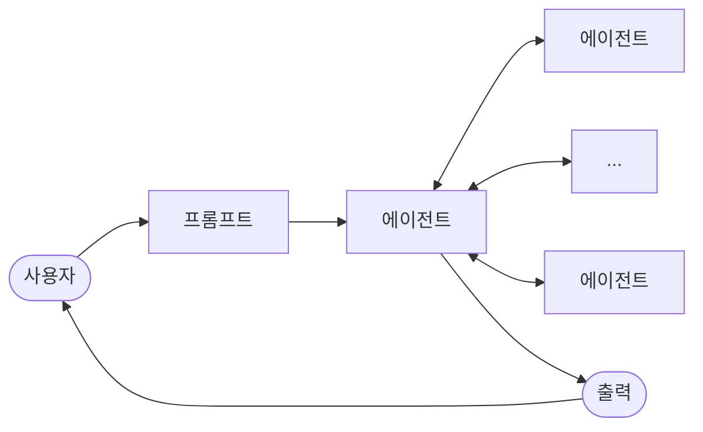

import { KeyPoints, Diagram, CrossRef } from '@site/src/components';

<KeyPoints
  items={[
    "Google A2A 프로토콜은 서로 다른 프레임워크로 구축된 AI 에이전트 간의 통신과 협업을 촉진하는 개방형 HTTP 기반 표준입니다.",
    "에이전트 카드(Agent Cards)는 에이전트의 디지털 식별자 역할을 하며, 다른 에이전트가 해당 에이전트의 역량을 자동으로 발견하고 이해할 수 있게 합니다.",
    "A2A는 다양한 통신 요구를 수용하기 위해 동기식 요청-응답(tasks/send 사용)과 스트리밍 업데이트(Streaming Updates)(tasks/sendSubscribe 사용)를 모두 지원합니다.",
    "이 프로토콜은 에이전트가 추가 정보를 요청하고 상호작용 중 컨텍스트를 유지할 수 있도록 input-required 상태를 포함한 멀티턴 대화를 지원합니다.",
    "A2A는 전문화된 에이전트가 서로 다른 포트에서 독립적으로 운영될 수 있는 모듈식 아키텍처를 장려하여 시스템 확장성과 분산을 가능하게 합니다.",
    "A2A가 서로 다른 에이전트 간의 태스크와 워크플로를 관리하는 고수준 프로토콜인 반면, Model Context Protocol(MCP)은 LLM이 외부 리소스와 인터페이스하기 위한 표준화된 인터페이스를 제공합니다.",
  ]}
/>

# 15장: 에이전트 간 통신(A2A)

개별 AI 에이전트는 고급 역량을 갖추고 있더라도 복잡하고 다면적인 문제를 다룰 때 종종 한계에 직면합니다. 이를 극복하기 위해 에이전트 간 통신(A2A)은 서로 다른 프레임워크로 구축된 다양한 AI 에이전트들이 효과적으로 협업할 수 있도록 합니다. 이 협업에는 원활한 조율, 태스크 위임, 정보 교환이 포함됩니다.

Google의 A2A 프로토콜은 이러한 보편적 통신을 촉진하기 위해 설계된 개방형 표준입니다. 이 장에서는 A2A와 그 실용적 응용, 그리고 Google ADK 내에서의 구현을 살펴봅니다.

## 에이전트 간 통신 패턴 개요

Agent2Agent(A2A) 프로토콜은 서로 다른 AI 에이전트 프레임워크 간의 통신과 협업을 가능하게 하기 위해 설계된 개방형 표준입니다. 이 프로토콜은 상호운용성을 보장하여 LangGraph, CrewAI, Google ADK 등의 기술로 개발된 AI 에이전트들이 출처나 프레임워크 차이에 관계없이 함께 작동할 수 있도록 합니다.

A2A는 Atlassian, Box, LangChain, MongoDB, Salesforce, SAP, ServiceNow를 포함한 다양한 기술 기업 및 서비스 제공업체의 지원을 받고 있습니다. Microsoft는 A2A를 Azure AI Foundry와 Copilot Studio에 통합할 계획으로, 개방형 프로토콜에 대한 의지를 보여주고 있습니다. 또한 Auth0와 SAP는 자사 플랫폼과 에이전트에 A2A 지원을 통합하고 있습니다.

오픈소스 프로토콜로서 A2A는 커뮤니티 기여를 환영하여 지속적인 발전과 광범위한 채택을 촉진합니다.

## A2A 핵심 개념

A2A 프로토콜은 에이전트 상호작용에 대한 구조화된 접근 방식을 제공하며, 여러 핵심 개념 위에 구축되어 있습니다. 이러한 개념에 대한 철저한 이해는 A2A 호환 시스템을 개발하거나 통합하는 모든 사람에게 필수적입니다. A2A의 기초 기둥에는 핵심 행위자(Core Actors), 에이전트 카드(Agent Cards), 에이전트 발견(Agent Discovery), 통신 및 태스크, 상호작용 메커니즘, 보안이 포함되며, 이 모두를 상세히 검토합니다.

**핵심 행위자:** A2A에는 세 가지 주요 주체가 있습니다:

- **사용자(User):** 에이전트 지원을 위한 요청을 시작합니다.
- **A2A 클라이언트(클라이언트 에이전트(Client Agent)):** 사용자를 대신하여 작업이나 정보를 요청하는 애플리케이션 또는 AI 에이전트입니다.
- **A2A 서버(원격 에이전트(Remote Agent)):** 클라이언트 요청을 처리하고 결과를 반환하기 위한 HTTP 엔드포인트를 제공하는 AI 에이전트 또는 시스템입니다. 원격 에이전트는 "불투명한(opaque)" 시스템으로 작동하므로, 클라이언트는 내부 운영 세부 사항을 이해할 필요가 없습니다.

**에이전트 카드:** 에이전트의 디지털 정체성은 일반적으로 JSON 파일인 에이전트 카드(Agent Card)로 정의됩니다. 이 파일에는 에이전트의 신원, 엔드포인트 URL, 버전을 포함한 클라이언트 상호작용 및 자동 발견을 위한 핵심 정보가 포함됩니다. 또한 스트리밍이나 푸시 알림과 같은 지원 역량, 특정 스킬, 기본 입출력 모드, 인증 요구 사항도 상세히 기술합니다. 다음은 WeatherBot의 에이전트 카드 예시입니다.

```json
{
 "name": "WeatherBot",
 "description": "Provides accurate weather forecasts and historical
data.",
 "url": "http://weather-service.example.com/a2a",
 "version": "1.0.0",
 "capabilities": {
   "streaming": true,
   "pushNotifications": false,
   "stateTransitionHistory": true
 },
 "authentication": {
   "schemes": [
     "apiKey"
   ]
 },
 "defaultInputModes": [
   "text"
 ],
 "defaultOutputModes": [
   "text"
 ],
 "skills": [
   {
     "id": "get_current_weather",
```

```text
     "name": "Get Current Weather",
     "description": "Retrieve real-time weather for any location.",
     "inputModes": [
       "text"
     ],
     "outputModes": [
       "text"
     ],
     "examples": [
       "What's the weather in Paris?",
       "Current conditions in Tokyo"
     ],
     "tags": [
       "weather",
       "current",
       "real-time"
     ]
   },
   {
     "id": "get_forecast",
     "name": "Get Forecast",
     "description": "Get 5-day weather predictions.",
     "inputModes": [
       "text"
     ],
     "outputModes": [
       "text"
     ],
     "examples": [
       "5-day forecast for New York",
       "Will it rain in London this weekend?"
     ],
     "tags": [
       "weather",
       "forecast",
       "prediction"
     ]
   }
 ]
}
```

**에이전트 발견:** 에이전트 발견(Agent Discovery)은 클라이언트가 사용 가능한 A2A 서버의 역량을 설명하는 에이전트 카드를 찾을 수 있게 합니다. 이 프로세스를 위한 여러 전략이 존재합니다:

- **Well-Known URI:** 에이전트는 표준화된 경로(예: `/.well-known/agent.json`)에 에이전트 카드를 호스팅합니다. 이 방식은 공개 또는 도메인별 용도로 광범위하고 종종 자동화된 접근성을 제공합니다.
- **선별된 레지스트리(Curated Registries):** 에이전트 카드가 게시되고 특정 기준에 따라 조회될 수 있는 중앙화된 카탈로그를 제공합니다. 이는 중앙 관리와 접근 제어가 필요한 기업 환경에 적합합니다.
- **직접 구성(Direct Configuration):** 에이전트 카드 정보가 내장되거나 비공개로 공유됩니다. 이 방식은 동적 발견이 중요하지 않은 긴밀하게 결합된 또는 비공개 시스템에 적합합니다.

선택한 방식에 관계없이, 에이전트 카드 엔드포인트를 보안하는 것이 중요합니다. 카드에 민감한(비밀은 아니지만) 정보가 포함된 경우에는 특히, 접근 제어, 상호 TLS(mTLS), 또는 네트워크 제한을 통해 이를 달성할 수 있습니다.

**통신 및 태스크:** A2A 프레임워크에서 통신은 장기 실행 프로세스의 근본적인 작업 단위를 나타내는 비동기 태스크를 중심으로 구조화됩니다. 각 태스크에는 고유 식별자가 할당되고 submitted, working, completed 등의 일련의 상태를 거치며, 이 설계는 복잡한 작업에서 병렬 처리를 지원합니다. 에이전트 간 통신은 메시지(Message)를 통해 이루어집니다.

이 통신에는 메시지를 설명하는 키-값 메타데이터인 속성(예: 우선순위나 생성 시간)과 일반 텍스트, 파일, 구조화된 JSON 데이터와 같이 전달되는 실제 콘텐츠를 담는 하나 이상의 파트(parts)가 포함됩니다. 태스크 중 에이전트가 생성하는 실질적인 출력을 아티팩트(artifacts)라고 합니다. 메시지와 마찬가지로 아티팩트도 하나 이상의 파트로 구성되며, 결과가 사용 가능해지면 점진적으로 스트리밍될 수 있습니다. A2A 프레임워크 내의 모든 통신은 페이로드에 JSON-RPC 2.0 프로토콜을 사용하여 HTTP(S)를 통해 수행됩니다. 여러 상호작용에 걸친 연속성을 유지하기 위해 서버 생성 contextId를 사용하여 관련 태스크를 그룹화하고 컨텍스트를 보존합니다.

**상호작용 메커니즘:** 요청/응답(폴링) 및 서버 전송 이벤트(SSE). A2A는 다양한 AI 애플리케이션 요구에 적합한 여러 상호작용 방법을 제공하며, 각각 고유한 메커니즘을 갖습니다:

- **동기식 요청/응답:** 빠르고 즉각적인 작업에 적합합니다. 이 모델에서 클라이언트는 요청을 보내고 서버가 단일 동기식 교환으로 완전한 응답을 처리하고 반환할 때까지 능동적으로 기다립니다.
- **비동기 폴링(Asynchronous Polling):** 처리 시간이 더 긴 태스크에 적합합니다. 클라이언트가 요청을 보내면 서버는 즉시 "working" 상태와 태스크 ID로 확인 응답합니다. 그런 다음 클라이언트는 자유롭게 다른 작업을 수행할 수 있으며, 태스크가 "completed" 또는 "failed"로 표시될 때까지 새 요청을 보내 태스크 상태를 주기적으로 폴링할 수 있습니다.
- **스트리밍 업데이트(Streaming Updates)(서버 전송 이벤트 - SSE):** 실시간의 점진적 결과를 수신하는 데 이상적입니다. 이 방법은 서버에서 클라이언트로의 영구적인 단방향 연결을 설정합니다. 원격 에이전트가 클라이언트가 여러 번 요청할 필요 없이 상태 변경이나 부분 결과와 같은 업데이트를 지속적으로 푸시할 수 있습니다.
- **푸시 알림(웹훅(Webhooks)):** 지속적인 연결을 유지하거나 빈번한 폴링이 비효율적인 매우 장기 실행 또는 리소스 집약적인 태스크를 위해 설계되었습니다. 클라이언트는 웹훅 URL을 등록할 수 있으며, 서버는 태스크 상태가 크게 변경될 때(예: 완료 시) 해당 URL에 비동기 알림("푸시")을 전송합니다.

에이전트 카드는 에이전트가 스트리밍 또는 푸시 알림 역량을 지원하는지 여부를 명시합니다. 또한 A2A는 모달리티에 구애받지 않으므로, 텍스트뿐만 아니라 오디오 및 비디오와 같은 다른 데이터 유형에 대해서도 이러한 상호작용 패턴을 촉진할 수 있어 풍부한 멀티모달 AI 애플리케이션이 가능합니다. 스트리밍 및 푸시 알림 역량은 에이전트 카드 내에 명시됩니다.

```text
#Synchronous Request Example
{
 "jsonrpc": "2.0",
 "id": "1",
 "method": "sendTask",
 "params": {
   "id": "task-001",
   "sessionId": "session-001",
   "message": {
     "role": "user",
     "parts": [
       {
         "type": "text",
         "text": "What is the exchange rate from USD to EUR?"
       }
     ]
   },
   "acceptedOutputModes": ["text/plain"],
   "historyLength": 5
 }
}
```

동기식 요청은 `sendTask` 메서드를 사용하며, 클라이언트는 쿼리에 대한 단일하고 완전한 답변을 요청하고 기대합니다. 반면 스트리밍 요청은 `sendTaskSubscribe` 메서드를 사용하여 영구적인 연결을 설정하고, 에이전트가 시간이 지남에 따라 여러 개의 점진적인 업데이트 또는 부분 결과를 다시 보낼 수 있게 합니다.

```text
# Streaming Request Example
{
 "jsonrpc": "2.0",
 "id": "2",
 "method": "sendTaskSubscribe",
 "params": {
   "id": "task-002",
   "sessionId": "session-001",
   "message": {
     "role": "user",
     "parts": [
       {
         "type": "text",
         "text": "What's the exchange rate for JPY to GBP today?"
       }
     ]
   },
   "acceptedOutputModes": ["text/plain"],
   "historyLength": 5
 }
}
```

**보안:** 에이전트 간 통신(A2A)은 시스템 아키텍처의 중요한 구성 요소로, 에이전트 간의 안전하고 원활한 데이터 교환을 가능하게 합니다. 이는 여러 내장 메커니즘을 통해 견고성과 무결성을 보장합니다.

**상호 전송 계층 보안(TLS):** 무단 접근과 데이터 도청을 방지하고 안전한 통신을 보장하기 위해 암호화되고 인증된 연결이 설정됩니다.

**포괄적인 감사 로그:** 모든 에이전트 간 통신은 정보 흐름, 관련 에이전트, 수행된 작업을 상세히 기록합니다. 이 감사 추적은 책임성, 문제 해결, 보안 분석에 필수적입니다.

**에이전트 카드 선언:** 인증 요구 사항은 에이전트의 신원, 역량, 보안 정책을 설명하는 구성 아티팩트인 에이전트 카드에 명시적으로 선언됩니다. 이를 통해 인증 관리가 중앙화되고 단순화됩니다.

**자격 증명 처리:** 에이전트는 일반적으로 HTTP 헤더를 통해 전달되는 OAuth 2.0 토큰이나 API 키와 같은 안전한 자격 증명을 사용하여 인증합니다. 이 방법은 URL이나 메시지 본문에서 자격 증명 노출을 방지하여 전반적인 보안을 강화합니다.

## A2A 대 MCP

A2A는 Anthropic의 Model Context Protocol(MCP)을 보완하는 프로토콜입니다(<span>그림 1</span> 참조). MCP가 에이전트의 컨텍스트 구조화와 외부 데이터 및 도구와의 상호작용에 초점을 맞추는 반면, A2A는 에이전트 간의 조율과 통신을 촉진하여 태스크 위임과 협업을 가능하게 합니다.

<figure>

<figcaption>그림 1: A2A 프로토콜과 MCP 프로토콜 비교 — 에이전트 간 통신(A2A)과 모델-도구 통신(MCP)의 구조적 차이</figcaption>
</figure>

A2A의 목표는 복잡한 멀티 에이전트 AI 시스템 개발에서 효율성을 높이고, 통합 비용을 줄이며, 혁신과 상호운용성을 촉진하는 것입니다. 따라서 A2A의 핵심 구성 요소와 운영 방법에 대한 철저한 이해는 협업적이고 상호운용 가능한 AI 에이전트 시스템 구축에서 효과적인 설계, 구현, 적용을 위해 필수적입니다.

## 실용적 응용 및 활용 사례

에이전트 간 통신은 모듈성, 확장성, 향상된 지능을 가능하게 하는 다양한 분야에서 정교한 AI 솔루션을 구축하는 데 필수적입니다.

- **멀티 프레임워크 협업:** A2A의 주요 활용 사례는 기반 프레임워크(예: ADK, LangChain, CrewAI)에 관계없이 독립적인 AI 에이전트들이 통신하고 협업할 수 있도록 하는 것입니다. 이는 서로 다른 에이전트가 문제의 서로 다른 측면을 전문으로 처리하는 복잡한 멀티 에이전트 시스템을 구축하는 데 기본적입니다.
- **자동화된 워크플로 오케스트레이션:** 기업 환경에서 A2A는 에이전트가 태스크를 위임하고 조율할 수 있게 함으로써 복잡한 워크플로를 촉진할 수 있습니다. 예를 들어 에이전트가 초기 데이터 수집을 처리한 다음 분석을 위해 다른 에이전트에 위임하고, 마지막으로 보고서 생성을 위해 세 번째 에이전트에 위임하는 방식으로 A2A 프로토콜을 통해 모두 통신할 수 있습니다.
- **동적 정보 검색:** 에이전트는 실시간 정보를 검색하고 교환하기 위해 통신할 수 있습니다. 기본 에이전트는 전문화된 "데이터 수집 에이전트"에 실시간 시장 데이터를 요청할 수 있으며, 그 에이전트는 외부 API를 사용하여 정보를 수집하고 다시 전송합니다.

## 실습 코드 예제

A2A 프로토콜의 실용적 응용을 살펴봅니다. [https://github.com/google-a2a/a2a-samples/tree/main/samples](https://github.com/google-a2a/a2a-samples/tree/main/samples) 저장소는 LangGraph, CrewAI, Azure AI Foundry, AG2와 같은 다양한 에이전트 프레임워크가 A2A를 사용하여 통신하는 방법을 보여주는 Java, Go, Python 예제를 제공합니다. 이 저장소의 모든 코드는 Apache 2.0 라이선스 하에 공개됩니다. A2A의 핵심 개념을 더 잘 설명하기 위해, Google 인증 도구를 사용하는 ADK 기반 에이전트로 A2A 서버를 설정하는 데 초점을 맞춘 코드 발췌를 검토합니다. [https://github.com/google-a2a/a2a-samples/blob/main/samples/python/agents/birthday\_planner\_adk/calendar\_agent/adk\_agent.py](https://github.com/google-a2a/a2a-samples/blob/main/samples/python/agents/birthday_planner_adk/calendar_agent/adk_agent.py)를 살펴봅니다.

```python
import datetime
from google.adk.agents import LlmAgent # type: ignore[import-untyped]
from google.adk.tools.google_api_tool import CalendarToolset # type:
```

```python
ignore[import-untyped]

async def create_agent(client_id, client_secret) -> LlmAgent:
   """Constructs the ADK agent."""
   toolset = CalendarToolset(client_id=client_id,
client_secret=client_secret)
   return LlmAgent(
       model='gemini-2.0-flash-001',
       name='calendar_agent',
       description="An agent that can help manage a user's calendar",
       instruction=f"""
You are an agent that can help manage a user's calendar.

Users will request information about the state of their calendar
or to make changes to their calendar. Use the provided tools for
interacting with the calendar API.

If not specified, assume the calendar the user wants is the 'primary'
calendar.

When using the Calendar API tools, use well-formed RFC3339
timestamps.

Today is {datetime.datetime.now()}.
""",
       tools=await toolset.get_tools(),
   )
```

이 Python 코드는 ADK LlmAgent를 구성하는 비동기 함수 `create_agent`를 정의합니다. 먼저 제공된 클라이언트 자격 증명을 사용하여 Google Calendar API에 접근하기 위해 `CalendarToolset`을 초기화합니다. 그런 다음 지정된 Gemini 모델, 설명적 이름, 사용자 캘린더 관리 지침으로 구성된 `LlmAgent` 인스턴스를 생성합니다. 에이전트는 Calendar API와 상호작용하고 캘린더 상태나 수정에 관한 사용자 쿼리에 응답할 수 있도록 `CalendarToolset`의 캘린더 도구를 갖추고 있습니다. 에이전트의 지침은 시간적 맥락을 위해 현재 날짜를 동적으로 포함합니다. 에이전트가 어떻게 구성되는지 설명하기 위해, GitHub의 A2A 샘플에 있는 calendar\_agent의 핵심 섹션을 살펴봅니다.

아래 코드는 에이전트가 특정 지침과 도구로 어떻게 정의되는지 보여줍니다. 이 기능을 설명하는 데 필요한 코드만 표시되어 있으며, 전체 파일은 다음에서 확인할 수 있습니다: [https://github.com/a2aproject/a2a-samples/blob/main/samples/python/agents/birthday\_planner\_adk/calendar\_agent/\_\_main\_\_.py](https://github.com/a2aproject/a2a-samples/blob/main/samples/python/agents/birthday_planner_adk/calendar_agent/__main__.py)

```python
def main(host: str, port: int):
   # Verify an API key is set.
   # Not required if using Vertex AI APIs.
   if os.getenv('GOOGLE_GENAI_USE_VERTEXAI') != 'TRUE' and not
os.getenv(
       'GOOGLE_API_KEY'
   ):
       raise ValueError(
           'GOOGLE_API_KEY environment variable not set and '
           'GOOGLE_GENAI_USE_VERTEXAI is not TRUE.'
       )

   skill = AgentSkill(
       id='check_availability',
       name='Check Availability',
       description="Checks a user's availability for a time using
their Google Calendar",
       tags=['calendar'],
       examples=['Am I free from 10am to 11am tomorrow?'],
   )

   agent_card = AgentCard(
       name='Calendar Agent',
       description="An agent that can manage a user's calendar",
       url=f'http://{host}:{port}/',
       version='1.0.0',
       defaultInputModes=['text'],
       defaultOutputModes=['text'],
       capabilities=AgentCapabilities(streaming=True),
       skills=[skill],
   )

   adk_agent = asyncio.run(create_agent(
       client_id=os.getenv('GOOGLE_CLIENT_ID'),
       client_secret=os.getenv('GOOGLE_CLIENT_SECRET'),
   ))
   runner = Runner(
       app_name=agent_card.name,
       agent=adk_agent,
       artifact_service=InMemoryArtifactService(),
       session_service=InMemorySessionService(),
       memory_service=InMemoryMemoryService(),
   )
```

```python
   agent_executor = ADKAgentExecutor(runner, agent_card)

   async def handle_auth(request: Request) -> PlainTextResponse:
       await agent_executor.on_auth_callback(
           str(request.query_params.get('state')), str(request.url)
       )
       return PlainTextResponse('Authentication successful.')

   request_handler = DefaultRequestHandler(
       agent_executor=agent_executor, task_store=InMemoryTaskStore()
   )

   a2a_app = A2AStarletteApplication(
       agent_card=agent_card, http_handler=request_handler
   )
   routes = a2a_app.routes()
   routes.append(
       Route(
           path='/authenticate',
           methods=['GET'],
           endpoint=handle_auth,
       )
   )
   app = Starlette(routes=routes)

   uvicorn.run(app, host=host, port=port)

if __name__ == '__main__':
   main()
```

이 Python 코드는 Google Calendar를 사용하여 사용자 가용성을 확인하는 A2A 호환 "Calendar Agent"를 설정하는 과정을 보여줍니다. 인증 목적으로 API 키 또는 Vertex AI 구성을 검증하는 과정이 포함됩니다. "check\_availability" 스킬을 포함한 에이전트의 역량은 AgentCard 내에 정의되며, 에이전트의 네트워크 주소도 명시됩니다. 그런 다음 아티팩트, 세션, 메모리 관리를 위한 인메모리 서비스로 구성된 ADK 에이전트가 생성됩니다. 코드는 이후 Starlette 웹 애플리케이션을 초기화하고, 인증 콜백과 A2A 프로토콜 핸들러를 통합하며, Uvicorn을 사용하여 HTTP를 통해 에이전트를 노출합니다.

이 예제들은 역량 정의부터 웹 서비스로 실행하는 것까지 A2A 호환 에이전트를 구축하는 과정을 보여줍니다. 에이전트 카드와 ADK를 활용함으로써 개발자는 Google Calendar와 같은 도구와 통합할 수 있는 상호운용 가능한 AI 에이전트를 만들 수 있습니다. 이 실용적인 접근 방식은 멀티 에이전트 생태계 구축에서 A2A 적용을 보여줍니다.

A2A에 대한 추가 탐구는 [https://www.trickle.so/blog/how-to-build-google-a2a-project](https://www.trickle.so/blog/how-to-build-google-a2a-project)의 코드 데모를 통해 권장됩니다. 이 링크에서 제공되는 리소스에는 Python 및 JavaScript의 샘플 A2A 클라이언트 및 서버, 멀티 에이전트 웹 애플리케이션, 커맨드라인 인터페이스, 다양한 에이전트 프레임워크에 대한 구현 예제가 포함되어 있습니다.

## 한눈에 보기

**무엇(What):** 특히 서로 다른 프레임워크로 구축된 개별 AI 에이전트는 복잡하고 다면적인 문제를 단독으로 처리하는 데 어려움을 겪는 경우가 많습니다. 주요 과제는 에이전트들이 효과적으로 통신하고 협업할 수 있도록 하는 공통 언어나 프로토콜의 부재입니다. 이러한 고립은 여러 전문화된 에이전트가 고유한 기술을 결합하여 더 큰 태스크를 해결할 수 있는 정교한 시스템의 생성을 방해합니다. 표준화된 접근 방식 없이는 이러한 이질적인 에이전트를 통합하는 것이 비용이 많이 들고 시간이 소모되며, 더 강력하고 응집력 있는 AI 솔루션 개발을 저해합니다.

**왜(Why):** 에이전트 간 통신(A2A) 프로토콜은 이 문제에 대한 개방적이고 표준화된 솔루션을 제공합니다. 이는 기반 기술에 관계없이 별개의 AI 에이전트들이 원활하게 조율하고, 태스크를 위임하며, 정보를 공유할 수 있도록 상호운용성을 가능하게 하는 HTTP 기반 프로토콜입니다. 핵심 구성 요소는 에이전트의 역량, 스킬, 통신 엔드포인트를 명확하게 정의하여 발견과 상호작용을 촉진하는 디지털 신원 파일인 에이전트 카드입니다. A2A는 다양한 활용 사례를 지원하기 위해 동기식 및 비동기식 통신을 포함한 다양한 상호작용 메커니즘을 정의합니다. 에이전트 협업을 위한 보편적 표준을 만들어 A2A는 복잡한 멀티 에이전트 에이전틱 시스템 구축을 위한 모듈식이고 확장 가능한 생태계를 조성합니다.

**경험 법칙:** 특히 서로 다른 프레임워크(예: Google ADK, LangGraph, CrewAI)로 구축된 두 개 이상의 AI 에이전트 간의 협업을 오케스트레이션해야 할 때 이 패턴을 사용합니다. 전문화된 에이전트가 데이터 분석을 한 에이전트에 위임하고 보고서 생성을 다른 에이전트에 위임하는 것과 같이 워크플로의 특정 부분을 처리하는 복잡한 모듈식 애플리케이션을 구축하는 데 이상적입니다. 이 패턴은 에이전트가 태스크를 완료하기 위해 다른 에이전트의 역량을 동적으로 발견하고 활용해야 할 때도 필수적입니다.

## 시각적 요약

<figure>



<figcaption>그림 2: A2A 에이전트 간 통신 패턴 — 중앙 에이전트가 여러 서브 에이전트와 양방향 통신</figcaption>
</figure>

## 핵심 요점

- Google A2A 프로토콜은 서로 다른 프레임워크로 구축된 AI 에이전트 간의 통신과 협업을 촉진하는 개방형 HTTP 기반 표준입니다.
- AgentCard는 에이전트의 디지털 식별자 역할을 하며, 다른 에이전트가 해당 에이전트의 역량을 자동으로 발견하고 이해할 수 있게 합니다.
- A2A는 다양한 통신 요구를 수용하기 위해 동기식 요청-응답 상호작용(`tasks/send` 사용)과 스트리밍 업데이트(`tasks/sendSubscribe` 사용)를 모두 제공합니다.
- 이 프로토콜은 에이전트가 추가 정보를 요청하고 상호작용 중 컨텍스트를 유지할 수 있도록 하는 `input-required` 상태를 포함한 멀티턴 대화를 지원합니다.
- A2A는 전문화된 에이전트가 서로 다른 포트에서 독립적으로 운영될 수 있는 모듈식 아키텍처를 장려하여 시스템 확장성과 분산을 가능하게 합니다.
- Trickle AI와 같은 도구는 A2A 통신을 시각화하고 추적하는 데 도움을 주어 개발자가 멀티 에이전트 시스템을 모니터링, 디버깅, 최적화할 수 있게 합니다.
- A2A가 서로 다른 에이전트 간의 태스크와 워크플로를 관리하는 고수준 프로토콜인 반면, Model Context Protocol(MCP)은 LLM이 외부 리소스와 인터페이스하기 위한 표준화된 인터페이스를 제공합니다.

## 결론

에이전트 간 통신(A2A) 프로토콜은 개별 AI 에이전트의 내재적 고립을 극복하기 위한 중요한 개방형 표준을 확립합니다. 공통 HTTP 기반 프레임워크를 제공함으로써, Google ADK, LangGraph, CrewAI 등 서로 다른 플랫폼으로 구축된 에이전트 간의 원활한 협업과 상호운용성을 보장합니다. 핵심 구성 요소는 디지털 신원으로 역할하며 에이전트의 역량을 명확하게 정의하고 다른 에이전트의 동적 발견을 가능하게 하는 에이전트 카드입니다. 프로토콜의 유연성은 동기식 요청, 비동기식 폴링, 실시간 스트리밍을 포함한 다양한 상호작용 패턴을 지원하여 광범위한 애플리케이션 요구에 부응합니다.

이를 통해 전문화된 에이전트가 복잡한 자동화 워크플로를 오케스트레이션하기 위해 결합될 수 있는 모듈식이고 확장 가능한 아키텍처가 가능해집니다. 보안은 mTLS와 같은 내장 메커니즘과 통신을 보호하기 위한 명시적 인증 요구 사항을 통해 근본적인 측면입니다. MCP와 같은 다른 표준을 보완하면서, A2A의 고유한 초점은 에이전트 간의 고수준 조율과 태스크 위임에 있습니다. 주요 기술 기업들의 강력한 지원과 실용적인 구현의 가용성은 그 성장하는 중요성을 부각시킵니다. 이 프로토콜은 개발자들이 더 정교하고, 분산되며, 지능적인 멀티 에이전트 시스템을 구축하는 길을 열어줍니다. 궁극적으로 A2A는 협업적 AI의 혁신적이고 상호운용 가능한 생태계를 조성하기 위한 기반 기둥입니다.

## 참고문헌

1. Chen, B. (2025, April 22). How to Build Your First Google A2A Project: A Step-by-Step Tutorial. Trickle.so Blog. [https://www.trickle.so/blog/how-to-build-google-a2a-project](https://www.trickle.so/blog/how-to-build-google-a2a-project)
2. Google A2A GitHub Repository. [https://github.com/google-a2a/A2A](https://github.com/google-a2a/A2A)
3. Google Agent Development Kit (ADK) [https://google.github.io/adk-docs/](https://google.github.io/adk-docs/)
4. Getting Started with Agent-to-Agent (A2A) Protocol: [https://codelabs.developers.google.com/intro-a2a-purchasing-concierge#0](https://codelabs.developers.google.com/intro-a2a-purchasing-concierge#0)
5. Google AgentDiscovery - [https://a2a-protocol.org/latest/](https://a2a-protocol.org/latest/)
6. Communication between different AI frameworks such as LangGraph, CrewAI, and Google ADK [https://www.trickle.so/blog/how-to-build-google-a2a-project](https://www.trickle.so/blog/how-to-build-google-a2a-project)
7. Designing Collaborative Multi-Agent Systems with the A2A Protocol [https://www.oreilly.com/radar/designing-collaborative-multi-agent-systems-with-the-a2a-protocol/](https://www.oreilly.com/radar/designing-collaborative-multi-agent-systems-with-the-a2a-protocol/)
