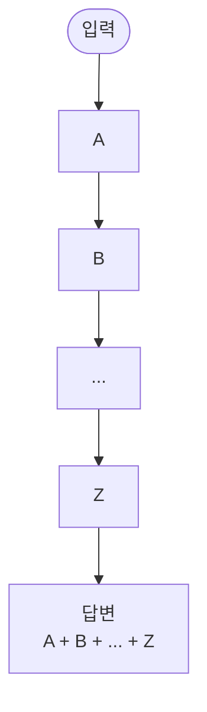
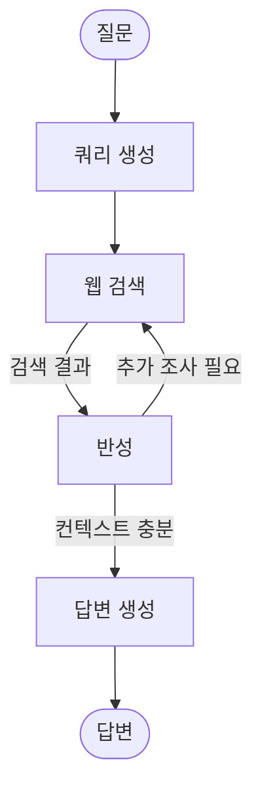

import { KeyPoints, Diagram, CrossRef } from '@site/src/components';

<KeyPoints
  items={[
    "추론 기법(Reasoning Techniques)은 AI 에이전트가 다단계 논리적 추론을 수행하고 복잡한 문제를 해결할 수 있도록 내부 사고 과정을 명시적으로 드러내는 고급 방법론입니다.",
    "연쇄 사고(Chain of Thought, CoT)는 LLM이 최종 답변 전에 중간 추론 단계를 단계별로 생성하도록 유도하여 복잡한 문제의 정확도와 투명성을 높입니다.",
    "사고의 나무(Tree of Thoughts, ToT)는 CoT를 확장하여 여러 추론 경로를 동시에 탐색하고, 역추적과 자기 수정을 통해 더 강건한 문제 해결을 가능하게 합니다.",
    "ReAct(추론 및 행동)는 CoT와 외부 도구 사용을 결합하여 사고–행동–관찰 루프를 통해 에이전트가 동적 환경에서 적응적으로 행동할 수 있게 합니다.",
    "추론 스케일링 법칙(Scaling Inference Law)은 추론 시 더 많은 계산 자원을 할당할수록 성능이 향상될 수 있음을 보여주며, 작은 모델도 충분한 '사고 시간'으로 큰 모델을 능가할 수 있습니다.",
    "토론 연쇄(CoD), 토론 그래프(GoD), 멀티 에이전트 시스템 탐색(MASS) 등 협업 프레임워크는 다수의 에이전트가 공동 추론하여 편향을 줄이고 정확도를 높이는 다중 에이전트 시스템의 기반을 형성합니다.",
  ]}
/>

# 17장: 추론 기법

이 장에서는 지능형 에이전트를 위한 고급 추론 기법(Reasoning Techniques)을 심층적으로 다룹니다. 다단계 논리적 추론과 문제 해결에 초점을 맞추며, 이러한 기법들은 단순한 순차적 연산을 넘어 에이전트의 내부 추론을 명시적으로 드러냅니다. 이를 통해 에이전트는 문제를 분해하고, 중간 단계를 고려하며, 더욱 강건하고 정확한 결론에 도달할 수 있습니다. 이러한 고급 방법들의 핵심 원칙은 추론 시 증가된 계산 자원의 할당입니다. 이는 에이전트 또는 기반 LLM에게 쿼리를 처리하고 응답을 생성하는 데 더 많은 처리 시간이나 단계를 부여하는 것을 의미합니다. 빠른 단일 패스 대신, 에이전트는 반복적 정제에 참여하거나, 여러 해결 경로를 탐색하거나, 외부 도구를 활용할 수 있습니다. 추론 시 이러한 확장된 처리 시간은 특히 심층 분석과 숙고가 필요한 복잡한 문제에서 정확성, 일관성, 강건성을 크게 향상시키는 경우가 많습니다.

## 실용적 응용 및 활용 사례

실용적 응용 사례는 다음과 같습니다.

- **복잡한 질의응답(Complex Question Answering):** 다양한 출처의 데이터 통합과 논리적 추론 실행이 필요한 멀티홉(multi-hop) 쿼리를 해결하는 것을 지원하며, 여러 추론 경로를 검토하고 확장된 추론 시간을 활용하여 정보를 합성합니다.
- **수학 문제 풀기(Mathematical Problem Solving):** 수학 문제를 더 작고 해결 가능한 구성 요소로 나누고, 단계별 과정을 설명하며, 정밀한 계산을 위해 코드 실행을 활용합니다. 확장된 추론은 더 복잡한 코드 생성 및 검증을 가능하게 합니다.
- **코드 디버깅 및 생성(Code Debugging and Generation):** 에이전트가 코드 생성 또는 수정의 근거를 설명하고, 잠재적 문제를 순차적으로 파악하며, 테스트 결과에 기반하여 코드를 반복적으로 개선하는 것(자기 수정)을 지원합니다.
- **전략 계획(Strategic Planning):** 다양한 옵션, 결과, 전제 조건에 걸친 추론을 통해 포괄적인 계획 수립을 지원하고, 실시간 피드백에 기반하여 계획을 조정합니다(ReAct). 확장된 숙고는 더 효과적이고 신뢰할 수 있는 계획으로 이어질 수 있습니다.
- **의료 진단(Medical Diagnosis):** 에이전트가 증상, 검사 결과, 환자 병력을 체계적으로 평가하여 진단에 도달하고, 각 단계에서 추론을 설명하며, 데이터 검색을 위해 외부 도구를 활용하는 것을 지원합니다(ReAct). 증가된 추론 시간은 더 포괄적인 감별 진단을 허용합니다.
- **법률 분석(Legal Analysis):** 법률 문서와 판례를 분석하여 논거를 형성하거나 지침을 제공하고, 취해진 논리적 단계를 설명하며, 자기 수정을 통해 논리적 일관성을 확보하는 것을 지원합니다. 증가된 추론 시간은 더 심층적인 법률 조사와 논거 구성을 가능하게 합니다.

## 추론 기법

먼저 AI 모델의 문제 해결 능력을 향상시키는 데 사용되는 핵심 추론 기법을 살펴보겠습니다.

연쇄 사고(Chain of Thought, CoT) 프롬프팅은 단계별 사고 과정을 모방함으로써 LLM의 복잡한 추론 능력을 크게 향상시킵니다(<span>그림 1</span> 참조). 직접적인 답변을 제공하는 대신, CoT 프롬프트는 모델이 일련의 중간 추론 단계를 생성하도록 안내합니다. 이러한 명시적 분해를 통해 LLM은 복잡한 문제를 더 작고 관리하기 쉬운 하위 문제로 분해하여 처리할 수 있습니다. 이 기법은 산술, 상식 추론, 기호 조작 등 다단계 추론이 필요한 작업에서 모델의 성능을 현저히 향상시킵니다. CoT의 주요 장점은 어려운 단일 단계 문제를 일련의 더 간단한 단계로 변환하여 LLM의 추론 과정의 투명성을 높이는 능력입니다. 이 접근법은 정확도를 높일 뿐만 아니라 모델의 의사 결정에 대한 귀중한 통찰력을 제공하여 디버깅과 이해를 돕습니다. CoT는 단계별 추론을 시연하는 퓨샷(few-shot) 예시를 제공하거나 단순히 모델에 "단계별로 생각하라"고 지시하는 등 다양한 전략으로 구현될 수 있습니다. 그 효과는 모델의 내부 처리를 더 신중하고 논리적인 진행 방향으로 이끄는 능력에서 비롯됩니다. 결과적으로 연쇄 사고는 현대 LLM에서 고급 추론 능력을 가능하게 하는 핵심 기법이 되었습니다. 이러한 복잡한 문제의 관리 가능한 하위 문제로의 향상된 투명성과 분해는 자율 에이전트에게 특히 중요하며, 복잡한 환경에서 더 신뢰할 수 있고 감사 가능한 행동을 수행할 수 있게 합니다.

<figure>



<figcaption>그림 1: 연쇄적 사고(CoT) — 입력에서 단계별 추론(A→B→…→Z)을 거쳐 최종 답변 도출</figcaption>
</figure>

*그림 1: CoT 프롬프트와 에이전트가 생성한 상세한 단계별 응답.*

예시를 살펴보겠습니다. 먼저 AI가 어떻게 생각해야 하는지 알려주는 지침 세트로 시작하여 AI의 페르소나와 따라야 할 명확한 5단계 프로세스를 정의합니다. 이것이 구조화된 사고를 시작하는 프롬프트입니다.

이어서 예시는 CoT 과정을 실제로 보여줍니다. "에이전트의 사고 과정"으로 레이블된 섹션은 모델이 지시된 단계를 실행하는 내부 독백입니다. 이것이 말 그대로 "연쇄 사고"입니다. 마지막으로, "에이전트의 최종 답변"은 그 신중한 단계별 추론 과정의 결과로 생성된 세련되고 포괄적인 출력입니다.

```text
You are an Information Retrieval Agent. Your goal is to answer the
user's question comprehensively and accurately by thinking
step-by-step.

Here's the process you must follow:
```

```text
1.  **Analyze the Query:** Understand the core subject and specific
requirements of the user's question. Identify key entities, keywords,
and the type of information being sought.
2.  **Formulate Search Queries (for Knowledge Base):** Based on your
analysis, generate a list of precise search queries that you would
use to retrieve relevant information from a knowledge base or
external tools.
3.  **Simulate Information Retrieval (Self-Correction/Reasoning):**
For each search query, mentally consider what kind of information you
expect to find. If you were to retrieve the content, what would be
the most relevant snippets? Think about potential ambiguities or
missing pieces.
4.  **Synthesize Information:** Based on the simulated retrieval and
your understanding of the user's original query, synthesize the
gathered information into a coherent and complete answer. Ensure all
aspects of the query are addressed.
5.  **Review and Refine:** Before finalizing, critically evaluate
your answer. Is it accurate? Is it comprehensive? Is it easy to
understand? Is it concise? If not, identify what needs to be improved
and how.

**User Query:** "Explain the main differences between classical
computers and quantum computers, and briefly describe a potential
application of quantum computing."

**Agent's Thought Process (Internal CoT Output - encouraged by the
prompt):**

**Thought 1 (Analyze Query):**
The user wants two things:
1.  Main differences between classical and quantum computers.
2.  One potential application of quantum computing.
Keywords: classical computers, quantum computers, differences,
potential application.

**Thought 2 (Formulate Search Queries):**
- "differences classical vs quantum computers"
- "how quantum computers work"
- "how classical computers work"
- "applications of quantum computing"

**Thought 3 (Simulate Information Retrieval & Identify Key
Concepts):**
- From "differences": Expect concepts like bits vs. qubits,
superposition, entanglement, probabilistic nature, computational
power for specific problems.
- From "how they work": Classical uses transistors/binary. Quantum
```

```text
uses quantum mechanics.
- From "applications": Expect drug discovery, material science,
cryptography, optimization.

**Thought 4 (Synthesize Information):**
Classical computers use bits (0 or 1), processing information
sequentially. Quantum computers use qubits, which can be 0, 1, or
both simultaneously (superposition), and can be entangled, allowing
for vastly different computational approaches. This enables them to
solve certain problems (like factoring large numbers or simulating
complex molecules) far more efficiently than classical computers. A
potential application is in drug discovery, where quantum computers
could simulate molecular interactions with unprecedented accuracy,
accelerating the development of new medicines.

**Thought 5 (Review and Refine):**
- Differences are covered (bits vs qubits, superposition,
entanglement, processing).
- Application is given (drug discovery).
- Is it brief? Yes.
- Is it clear? Yes.
- Looks good.

**Agent's Final Answer (Output to User):**

Classical computers process information using bits, which can be
either a 0 or a 1 at any given time, performing operations
sequentially. In contrast, quantum computers utilize qubits, which
can exist in multiple states simultaneously through superposition and
can be linked through entanglement, allowing for exponentially more
complex computations. This fundamental difference enables quantum
machines to tackle certain problems, such as simulating molecular
structures or breaking complex encryption, that are intractable for
even the most powerful classical supercomputers. A significant
potential application of quantum computing lies in drug discovery,
where its ability to precisely model molecular behavior could
revolutionize the development of new pharmaceuticals.
```

사고의 나무(Tree of Thoughts, ToT)는 연쇄 사고(CoT)를 기반으로 구축된 추론 기법입니다. 이를 통해 대규모 언어 모델은 트리 구조를 형성하는 서로 다른 중간 단계로 분기하여 여러 추론 경로를 탐색할 수 있습니다(<span>그림 2</span> 참조). 이 접근법은 역추적(backtracking), 자기 수정, 대안 솔루션 탐색을 가능하게 하여 복잡한 문제 해결을 지원합니다. 가능성의 트리를 유지함으로써 모델은 최종 답변을 확정하기 전에 다양한 추론 궤적을 평가할 수 있습니다. 이 반복적 과정은 전략적 계획과 의사 결정이 필요한 어려운 작업을 처리하는 모델의 능력을 향상시킵니다.

<figure><figcaption>다이어그램 img-p266-0 (준비 중)</figcaption></figure>

*그림 2: 사고의 나무(Tree of Thoughts) 예시.*

자기 수정(Self-Correction), 또는 자기 개선(Self-Refinement)이라고도 하는 이 기법은 에이전트의 추론 과정에서 핵심적인 측면으로, 특히 연쇄 사고 프롬프팅 내에서 중요합니다. 이는 에이전트가 생성된 콘텐츠와 중간 사고 과정을 내부적으로 평가하는 것을 포함합니다. 이 비판적 검토를 통해 에이전트는 이해나 솔루션의 모호함, 정보 공백, 또는 부정확함을 파악할 수 있습니다. 이러한 검토와 정제의 반복적 주기를 통해 에이전트는 접근 방식을 조정하고, 응답 품질을 개선하며, 최종 출력을 제공하기 전에 정확성과 철저함을 보장할 수 있습니다. 이 내부 비판은 에이전트가 신뢰할 수 있고 고품질의 결과물을 생산하는 능력을 향상시키며, 이는 전용 4장의 예시들에서 보여줍니다.

이 예시는 AI 생성 콘텐츠를 정제하는 데 중요한 자기 수정의 체계적인 과정을 보여줍니다. 이는 초안 작성, 원래 요구 사항과의 검토, 특정 개선 사항 구현의 반복적 루프를 포함합니다. 그림은 AI의 기능을 정의된 5단계 분석 및 수정 워크플로를 가진 "자기 수정 에이전트"로 개략적으로 설명하는 것으로 시작합니다. 이어서 소셜 미디어 게시물의 불량한 "초안"이 제시됩니다. "자기 수정 에이전트의 사고 과정"이 시연의 핵심을 형성합니다. 여기서 에이전트는 지침에 따라 초안을 비판적으로 평가하고, 낮은 참여도와 모호한 행동 촉구와 같은 약점을 파악합니다. 그런 다음 더 영향력 있는 동사와 이모지 사용 등 구체적인 개선 사항을 제안합니다. 과정은 자체 식별된 조정 사항을 통합한 세련되고 현저히 개선된 버전인 "최종 수정 콘텐츠"로 마무리됩니다.

```text
You are a highly critical and detail-oriented Self-Correction Agent.
Your task is to review a previously generated piece of content
against its original requirements and identify areas for improvement.
Your goal is to refine the content to be more accurate,
comprehensive, engaging, and aligned with the prompt.

Here's the process you must follow for self-correction:

1.  **Understand Original Requirements:** Review the initial
prompt/requirements that led to the content's creation. What was the
*original intent*? What were the key constraints or goals?
2.  **Analyze Current Content:** Read the provided content carefully.
3.  **Identify Discrepancies/Weaknesses:** Compare the current
content against the original requirements. Look for:
   * **Accuracy Issues:** Are there any factual errors or misleading
statements?
   * **Completeness Gaps:** Does it fully address all aspects of the
original prompt? Is anything missing?
   * **Clarity & Coherence:** Is the language clear, concise, and
easy to understand? Does it flow logically?
   * **Tone & Style:** Does it match the desired tone and style
(e.g., professional, engaging, concise)?
   * **Engagement:** Is it captivating? Does it hold the reader's
attention?
   * **Redundancy/Verbosity:** Can any parts be condensed or removed
without losing meaning?
4.  **Propose Specific Improvements:** For each identified weakness,
suggest concrete and actionable changes. Do not just state the
problem; propose a solution.
5.  **Generate Revised Content:** Based on your proposed
improvements, rewrite the original content to incorporate all the
necessary changes. Ensure the revised content is polished and ready
for final use.

**Original Prompt/Requirements:** "Write a short, engaging social
media post (max 150 characters) announcing a new eco-friendly product
```

```text
line: 'GreenTech Gadgets'."

**Initial Draft (Content to be corrected):**

"We have new products. They are green and techy. Buy GreenTech
Gadgets now!"

**Self-Correction Agent's Thought Process (Internal CoT Output -
encouraged by the prompt):**

**Thought 1 (Understand Original Requirements):**
- Short, engaging social media post.
- Max 150 characters.
- Announce "GreenTech Gadgets" - a new eco-friendly product line.

**Thought 2 (Analyze Current Content):**
"We have new products. They are green and techy. Buy GreenTech
Gadgets now!" (64 characters)

**Thought 3 (Identify Discrepancies/Weaknesses):**
- **Engaging:** Not very engaging. Sounds generic.
- **Eco-friendly:** Implied by "green," but not explicitly
highlighted as a benefit.
- **Call to Action:** "Buy now!" is okay, but could be more
compelling.
- **Conciseness:** It's short, but could use stronger verbs/phrasing.
- **Impact:** Lacks excitement for a new product launch.

**Thought 4 (Propose Specific Improvements):**
- Make it more dynamic and exciting.
- Emphasize "eco-friendly" and "innovation."
- Use stronger verbs and more active voice.
- Add a clear, engaging call to action.
- Ensure it stays under 150 characters.

**Thought 5 (Generate Revised Content):**
Original: "We have new products. They are green and techy. Buy
GreenTech Gadgets now!"
Revised idea 1: "🌱 Discover GreenTech Gadgets! Our new eco-friendly
line blends innovation with sustainability. Go green, go smart! Shop
now! #EcoFriendly #GreenTech" (148 characters)
This revision directly addresses eco-friendliness, uses emojis for
engagement, adds a stronger call to action, and includes relevant
hashtags while staying within the character limit.

**Self-Correction Agent's Final Revised Content (Output to User):**
```

```text
🌱 Discover GreenTech Gadgets! Our new eco-friendly line blends
innovation with sustainability. Go green, go smart! Shop now!
#EcoFriendly #GreenTech
```

근본적으로 이 기법은 에이전트의 콘텐츠 생성에 품질 관리 측정을 직접 통합하여 복잡한 사용자 요구를 더 효과적으로 충족하는 더욱 정제되고 정확하며 우수한 결과물을 생산합니다.

프로그램 보조 언어 모델(Program-Aided Language Models, PALMs)은 LLM에 기호적 추론 능력을 통합합니다. 이 통합을 통해 LLM은 문제 해결 과정의 일부로 Python과 같은 코드를 생성하고 실행할 수 있습니다. PALMs는 복잡한 계산, 논리 연산, 데이터 조작을 결정론적 프로그래밍 환경에 오프로드합니다. 이 접근법은 LLM이 정확성이나 일관성에서 한계를 보일 수 있는 작업에 전통적인 프로그래밍의 강점을 활용합니다. 기호적 과제에 직면했을 때, 모델은 코드를 생성하고, 실행하며, 결과를 자연어로 변환할 수 있습니다. 이 하이브리드 방법론은 LLM의 이해 및 생성 능력과 정밀한 계산을 결합하여 모델이 잠재적으로 향상된 신뢰성과 정확도로 더 넓은 범위의 복잡한 문제를 해결할 수 있게 합니다. 이는 에이전트에게 중요한데, 이해 및 생성 능력과 함께 정밀한 계산을 활용하여 더 정확하고 신뢰할 수 있는 행동을 수행할 수 있게 하기 때문입니다. 예시로는 코드 생성을 위한 Google의 ADK 내 외부 도구 사용이 있습니다.

```text
from google.adk.tools import agent_tool
from google.adk.agents import Agent
from google.adk.tools import google_search
from google.adk.code_executors import BuiltInCodeExecutor

search_agent = Agent(
   model='gemini-2.0-flash',
   name='SearchAgent',
   instruction="""
   You're a specialist in Google Search
   """,
   tools=[google_search],
)
coding_agent = Agent(
   model='gemini-2.0-flash',
   name='CodeAgent',
   instruction="""
   You're a specialist in Code Execution
```

```text
   """,
   code_executor=[BuiltInCodeExecutor],
)
root_agent = Agent(
   name="RootAgent",
   model="gemini-2.0-flash",
   description="Root Agent",
   tools=[agent_tool.AgentTool(agent=search_agent),
agent_tool.AgentTool(agent=coding_agent)],
)
```


검증 가능한 보상 강화학습(Reinforcement Learning with Verifiable Rewards, RLVR): 효과적이지만, 많은 LLM이 사용하는 표준 연쇄 사고(CoT) 프롬프팅은 추론에 대한 다소 기본적인 접근법입니다. 이는 문제의 복잡성에 적응하지 않고 단일하고 미리 결정된 사고 라인을 생성합니다. 이러한 한계를 극복하기 위해 새로운 클래스의 특화된 "추론 모델"이 개발되었습니다. 이러한 모델은 답변을 제공하기 전에 가변적인 양의 "사고" 시간을 할애하는 방식으로 다르게 작동합니다. 이 "사고" 과정은 수천 개의 토큰에 달할 수 있는 더 광범위하고 동적인 연쇄 사고를 생성합니다. 이 확장된 추론은 자기 수정과 역추적 같은 더 복잡한 행동을 허용하며, 모델은 더 어려운 문제에 더 많은 노력을 기울입니다. 이러한 모델을 가능하게 하는 핵심 혁신은 검증 가능한 보상 강화학습(RLVR)이라는 훈련 전략입니다. 알려진 정답이 있는 문제(수학이나 코드 등)로 모델을 훈련함으로써, 모델은 시행착오를 통해 효과적이고 장형식의 추론을 생성하는 방법을 학습합니다. 이를 통해 모델은 직접적인 인간 감독 없이 문제 해결 능력을 발전시킬 수 있습니다. 궁극적으로, 이러한 추론 모델은 단순히 답변을 생성하는 것이 아니라, 계획, 모니터링, 평가와 같은 고급 기술을 보여주는 "추론 궤적"을 생성합니다. 이 향상된 추론 및 전략화 능력은 최소한의 인간 개입으로 복잡한 작업을 분해하고 해결할 수 있는 자율 AI 에이전트 개발의 근본입니다.

ReAct(추론 및 행동, Reasoning and Acting)는 연쇄 사고(CoT) 프롬프팅과 에이전트가 도구를 통해 외부 환경과 상호작용하는 능력을 통합하는 패러다임입니다(<span>그림 3</span> 참조. KB는 지식 베이스를 나타냅니다). 최종 답변을 생성하는 생성 모델과 달리, ReAct 에이전트는 취해야 할 행동에 대해 추론합니다. 이 추론 단계는 CoT와 유사한 내부 계획 과정을 포함하며, 에이전트는 다음 단계를 결정하고, 사용 가능한 도구를 고려하며, 결과를 예측합니다. 이어서 에이전트는 데이터베이스 쿼리, 계산 수행, API와의 상호작용 등 도구 또는 함수 호출을 실행하여 행동합니다.

<figure><figcaption>다이어그램 img-p271-0 (준비 중)</figcaption></figure>

*그림 3: 추론 및 행동(ReAct).*

ReAct는 상호 연결된 방식으로 작동합니다. 에이전트는 행동을 실행하고, 결과를 관찰하며, 이 관찰을 후속 추론에 통합합니다. "사고, 행동, 관찰, 사고..." 의 이 반복적 루프를 통해 에이전트는 계획을 동적으로 조정하고, 오류를 수정하며, 환경과의 여러 상호작용이 필요한 목표를 달성할 수 있습니다. 이는 에이전트가 실시간 피드백에 반응하기 때문에 선형 CoT에 비해 더 강건하고 유연한 문제 해결 접근법을 제공합니다. 언어 모델의 이해 및 생성 능력과 도구 사용 능력을 결합함으로써, ReAct는 에이전트가 추론과 실용적 실행이 모두 필요한 복잡한 작업을 수행할 수 있게 합니다. 이 접근법은 에이전트에게 매우 중요한데, 단순히 추론하는 것뿐만 아니라 실용적으로 단계를 실행하고 동적 환경과 상호작용할 수 있게 하기 때문입니다.

토론 연쇄(Chain of Debates, CoD)는 Microsoft가 제안한 공식 AI 프레임워크로, 여러 다양한 모델들이 협력하고 논쟁하여 문제를 해결하며, 단일 AI의 "연쇄 사고"를 넘어섭니다. 이 시스템은 AI 위원회 회의처럼 작동하며, 서로 다른 모델들이 초기 아이디어를 제시하고, 상대방의 추론을 비판하며, 반론을 교환합니다. 주요 목표는 집단 지능을 활용하여 정확도를 향상시키고, 편향을 줄이며, 최종 답변의 전반적인 품질을 개선하는 것입니다. 동료 검토의 AI 버전으로 기능하며, 이 방법은 추론 과정의 투명하고 신뢰할 수 있는 기록을 만들어냅니다. 궁극적으로, 이는 단일 에이전트가 답변을 제공하는 것에서 에이전트 팀이 협력하여 더 강건하고 검증된 솔루션을 찾는 것으로의 전환을 나타냅니다.

토론 그래프(Graph of Debates, GoD)는 토론을 단순한 체인이 아닌 동적이고 비선형 네트워크로 재구성하는 고급 에이전틱 프레임워크입니다. 이 모델에서 논거는 '지지' 또는 '반박'과 같은 관계를 나타내는 엣지로 연결된 개별 노드로, 실제 토론의 다중 스레드 특성을 반영합니다. 이 구조를 통해 새로운 탐구 라인이 동적으로 분기하고, 독립적으로 발전하며, 시간이 지남에 따라 합쳐질 수 있습니다. 결론은 시퀀스의 끝이 아니라 전체 그래프 내에서 가장 강건하고 잘 지지된 논거 클러스터를 식별함으로써 도달됩니다. 이 맥락에서 "잘 지지된"이란 확고하게 확립되고 검증 가능한 지식을 말합니다. 여기에는 고유하게 올바르고 사실로 널리 받아들여지는 정보인 ground truth로 간주되는 정보가 포함될 수 있습니다. 또한 정보가 외부 출처 및 실세계 데이터에 대해 검증되는 검색 그라운딩(search grounding)을 통해 얻은 사실적 증거를 포함합니다. 마지막으로, 토론 중 여러 모델이 도달한 합의, 즉 제시된 정보에 대한 높은 수준의 동의와 신뢰를 나타내는 것도 포함됩니다. 이 포괄적인 접근법은 논의되는 정보를 위해 더 강건하고 신뢰할 수 있는 기반을 보장합니다. 이 접근법은 복잡한 협력적 AI 추론을 위한 더 전체론적이고 현실적인 모델을 제공합니다.

멀티 에이전트 시스템 탐색(Multi-Agent System Search, MASS)(선택적 고급 주제): 다중 에이전트 시스템 설계에 대한 심층 분석은 그 효과성이 개별 에이전트를 프로그래밍하는 데 사용되는 프롬프트의 품질과 그들의 상호작용을 결정하는 토폴로지 모두에 결정적으로 의존한다는 것을 보여줍니다. 이러한 시스템 설계의 복잡성은 상당하며, 방대하고 복잡한 탐색 공간을 포함합니다. 이 과제를 해결하기 위해 멀티 에이전트 시스템 탐색(MASS)이라는 새로운 프레임워크가 MAS의 설계를 자동화하고 최적화하기 위해 개발되었습니다.

MASS는 프롬프트와 토폴로지 최적화를 교차하여 복잡한 설계 공간을 체계적으로 탐색하는 다단계 최적화 전략을 채택합니다(<span>그림 4</span> 참조).

**1. 블록 수준 프롬프트 최적화(Block-Level Prompt Optimization):** 이 과정은 개별 에이전트 유형 또는 "블록"에 대한 프롬프트의 로컬 최적화로 시작하여, 각 구성 요소가 더 큰 시스템에 통합되기 전에 효과적으로 역할을 수행하도록 합니다. 이 초기 단계는 후속 토폴로지 최적화가 잘 구성된 에이전트를 기반으로 구축되도록 하는 데 중요합니다. 예를 들어, HotpotQA 데이터셋에 대해 최적화할 때, "토론자(Debator)" 에이전트에 대한 프롬프트는 창의적으로 "주요 출판사의 전문 팩트체커"로 행동하도록 지시하는 방식으로 구성됩니다. 최적화된 작업은 다른 에이전트의 제안된 답변을 꼼꼼히 검토하고, 제공된 컨텍스트 구절과 교차 참조하며, 불일치나 지지되지 않는 주장을 파악하는 것입니다. 블록 수준 최적화 중에 발견된 이 특화된 역할 수행 프롬프트는 토론자 에이전트가 더 큰 워크플로에 배치되기 전에 정보 합성에 매우 효과적이 되도록 합니다.

**2. 워크플로 토폴로지 최적화(Workflow Topology Optimization):** 로컬 최적화 후, MASS는 맞춤형 설계 공간에서 서로 다른 에이전트 상호작용을 선택하고 배열하여 워크플로 토폴로지를 최적화합니다. 이 탐색을 효율적으로 만들기 위해, MASS는 영향력 가중 방법을 사용합니다. 이 방법은 기준 에이전트에 대한 성능 향상을 측정하여 각 토폴로지의 "증분 영향력"을 계산하고, 이 점수를 사용하여 더 유망한 조합으로 탐색을 안내합니다. 예를 들어, MBPP 코딩 작업에 대해 최적화할 때, 토폴로지 탐색은 특정 하이브리드 워크플로가 가장 효과적임을 발견합니다. 발견된 최적의 토폴로지는 단순한 구조가 아니라 외부 도구 사용과 반복적 정제 과정의 조합입니다. 구체적으로, 코드를 테스트 케이스에 대해 실행하는 하나의 실행자 에이전트에 의해 코드가 검증되는 여러 라운드의 반성을 수행하는 하나의 예측자 에이전트로 구성됩니다. 이 발견된 워크플로는 코딩의 경우, 외부 검증과 반복적 자기 수정을 결합한 구조가 더 단순한 MAS 설계보다 우수하다는 것을 보여줍니다.

<figure>

<figcaption>그림 4: MASS(멀티 에이전트 시스템 검색) 프레임워크 — 블록 수준 프롬프트 최적화, 워크플로우 토폴로지 최적화, 워크플로우 수준 프롬프트 최적화 3단계</figcaption>
</figure>

*그림 4: (저자 제공): 멀티 에이전트 시스템 탐색(MASS) 프레임워크는 최적화 가능한 프롬프트(지침 및 시연)와 구성 가능한 에이전트 빌딩 블록(집합, 반성, 토론, 요약, 도구 사용)을 포함하는 탐색 공간을 탐색하는 3단계 최적화 과정입니다. 첫 번째 단계인 블록 수준 프롬프트 최적화는 각 에이전트 모듈에 대한 프롬프트를 독립적으로 최적화합니다. 2단계인 워크플로 토폴로지 최적화는 최적화된 프롬프트를 통합하여 영향력 가중 설계 공간에서 유효한 시스템 구성을 샘플링합니다. 최종 단계인 워크플로 수준 프롬프트 최적화는 2단계에서 최적의 워크플로를 파악한 후 전체 다중 에이전트 시스템에 대한 두 번째 라운드의 프롬프트 최적화를 포함합니다.*

**3. 워크플로 수준 프롬프트 최적화(Workflow-Level Prompt Optimization):** 최종 단계는 전체 시스템 프롬프트의 전역 최적화를 포함합니다. 최적의 성능을 보이는 토폴로지를 파악한 후, 프롬프트는 단일 통합 엔터티로 세밀하게 조정되어 오케스트레이션에 맞게 조정되고 에이전트 상호 의존성이 최적화되도록 합니다. 예를 들어, DROP 데이터셋에 대한 최적의 토폴로지를 찾은 후, 최종 최적화 단계는 "예측자(Predictor)" 에이전트의 프롬프트를 정제합니다. 최종 최적화된 프롬프트는 고도로 상세하며, "추출적 질의응답" 및 "수치 정보"에 대한 초점을 언급하면서 데이터셋 자체의 요약을 에이전트에게 제공하는 것으로 시작합니다. 그런 다음 올바른 질의응답 행동의 퓨샷 예시를 포함하고, 핵심 지침을 고위험 시나리오로 구성합니다: "당신은 긴급 뉴스 보도를 위해 중요한 수치 정보를 추출하는 임무를 맡은 고도로 전문화된 AI입니다. 생방송이 당신의 정확성과 속도에 달려 있습니다." 메타 지식, 예시, 역할 수행을 결합한 이 다각적 프롬프트는 정확도를 극대화하기 위해 최종 워크플로에 맞게 조정됩니다.

**핵심 발견 및 원칙(Key Findings and Principles):** 실험들은 MASS에 의해 최적화된 MAS가 다양한 작업에 걸쳐 기존의 수동으로 설계된 시스템과 다른 자동화된 설계 방법을 크게 능가한다는 것을 보여줍니다. 이 연구에서 도출된 효과적인 MAS의 핵심 설계 원칙은 세 가지입니다.

- 구성 전에 고품질 프롬프트로 개별 에이전트를 최적화할 것.
- 제한 없는 탐색 공간을 탐색하는 것보다 영향력 있는 토폴로지를 구성하여 MAS를 구축할 것.
- 최종 워크플로 수준의 공동 최적화를 통해 에이전트 간의 상호 의존성을 모델링하고 최적화할 것.

핵심 추론 기법에 대한 논의를 바탕으로, 먼저 핵심 성능 원칙인 LLM을 위한 추론 스케일링 법칙(Scaling Inference Law)을 살펴보겠습니다. 이 법칙은 모델의 성능이 할당된 계산 자원이 증가함에 따라 예측 가능하게 향상된다고 명시합니다. Deep Research와 같은 복잡한 시스템에서 이 원칙이 실제로 작동하는 것을 볼 수 있습니다. 여기서 AI 에이전트는 이러한 자원을 활용하여 주제를 하위 질문으로 분해하고, 웹 검색을 도구로 사용하며, 발견 사항을 합성하여 자율적으로 조사합니다.

## Deep Research

"Deep Research"라는 용어는 지칠 줄 모르는 체계적인 연구 보조원 역할을 하도록 설계된 AI 에이전틱 도구의 범주를 설명합니다. 이 분야의 주요 플랫폼으로는 Perplexity AI, Google의 Gemini 연구 기능, ChatGPT 내 OpenAI의 고급 기능이 있습니다(<span>그림 5</span> 참조).

<figure>

<figcaption>그림 5: Google Deep Research 정보 수집 에이전트 — 전기차 장단점 비교 리서치 계획 화면</figcaption>
</figure>

*그림 5: 정보 수집을 위한 Google Deep Research.*

이러한 도구들이 도입한 근본적인 변화는 검색 과정 자체의 변화입니다. 표준 검색은 즉각적인 링크를 제공하며, 합성 작업을 사용자에게 맡깁니다. Deep Research는 다른 모델로 운영됩니다. 여기서는 AI에게 복잡한 쿼리를 맡기고 "시간 예산"(보통 몇 분)을 부여합니다. 이 인내심의 대가로, 상세한 보고서를 받게 됩니다.

이 시간 동안 AI는 에이전틱 방식으로 사용자를 대신하여 작업합니다. AI는 개인이 수행하기에 엄청나게 시간이 소요될 일련의 정교한 단계를 자율적으로 수행합니다.

1. **초기 탐색(Initial Exploration):** 초기 프롬프트를 기반으로 여러 개의 타겟 검색을 실행합니다.
2. **추론 및 정제(Reasoning and Refinement):** 첫 번째 결과 파동을 읽고 분석하고, 발견 사항을 합성하며, 더 많은 세부 정보가 필요한 공백, 모순, 영역을 비판적으로 파악합니다.
3. **후속 조사(Follow-up Inquiry):** 내부 추론에 기반하여 이러한 공백을 메우고 이해를 심화하기 위한 새롭고 더 세밀한 검색을 수행합니다.
4. **최종 합성(Final Synthesis):** 이 반복적인 검색과 추론의 여러 라운드 후, 검증된 모든 정보를 단일하고 일관성 있으며 구조화된 요약으로 컴파일합니다.

이 체계적인 접근법은 포괄적이고 잘 추론된 응답을 보장하여, 정보 수집의 효율성과 깊이를 크게 향상시키고, 더 에이전틱한 의사 결정을 촉진합니다.

## 추론 스케일링 법칙

이 핵심 원칙은 LLM의 성능과 추론으로 알려진 운영 단계 동안 할당된 계산 자원 사이의 관계를 결정합니다. 추론 스케일링 법칙(Scaling Inference Law)은 모델 생성 중 데이터 볼륨과 계산 능력 증가에 따라 모델 품질이 어떻게 향상되는지에 초점을 맞추는 훈련에 대한 더 익숙한 스케일링 법칙과 다릅니다. 대신, 이 법칙은 LLM이 출력이나 답변을 적극적으로 생성할 때 발생하는 동적 트레이드오프를 구체적으로 검토합니다.

이 법칙의 초석은 추론 시 계산 투자를 늘림으로써 비교적 작은 LLM에서도 우수한 결과를 종종 달성할 수 있다는 발견입니다. 이는 반드시 더 강력한 GPU를 사용하는 것을 의미하지 않고, 더 정교하거나 자원 집약적인 추론 전략을 사용하는 것을 의미합니다. 그러한 전략의 주요 예시는 모델에게 다양한 빔 탐색(diverse beam search)이나 자기 일관성 방법과 같은 기법을 통해 여러 잠재적 답변을 생성하도록 지시한 다음, 선택 메커니즘을 사용하여 가장 최적의 출력을 파악하는 것입니다. 이 반복적 정제 또는 다중 후보 생성 과정은 더 많은 계산 주기를 요구하지만 최종 응답의 품질을 크게 향상시킬 수 있습니다.

이 원칙은 에이전트 시스템 배포에서 정보에 입각한 경제적으로 건전한 의사 결정을 위한 중요한 프레임워크를 제공합니다. 더 큰 모델이 항상 더 나은 성능을 제공한다는 직관적인 개념에 도전합니다. 이 법칙은 추론 중 더 실질적인 "사고 예산"을 부여받은 더 작은 모델이 때때로 더 단순하고 덜 계산 집약적인 생성 과정에 의존하는 훨씬 더 큰 모델의 성능을 능가할 수 있다고 가정합니다. 여기서 "사고 예산"은 추론 중에 적용되는 추가 계산 단계 또는 복잡한 알고리즘을 의미하며, 더 작은 모델이 더 넓은 범위의 가능성을 탐색하거나 답변을 결정하기 전에 더 엄격한 내부 검사를 적용할 수 있게 합니다.

결과적으로, 추론 스케일링 법칙은 효율적이고 비용 효과적인 에이전틱 시스템을 구축하는 데 기본이 됩니다. 이는 여러 상호 연결된 요소들을 세심하게 균형 잡기 위한 방법론을 제공합니다.

- **모델 크기(Model Size):** 더 작은 모델은 메모리와 스토리지 측면에서 본질적으로 덜 요구합니다.
- **응답 지연(Response Latency):** 증가된 추론 시간 계산이 지연을 추가할 수 있지만, 이 법칙은 성능 향상이 이 증가를 능가하는 지점을 파악하거나, 과도한 지연을 피하기 위해 계산을 전략적으로 적용하는 방법을 찾는 데 도움을 줍니다.
- **운영 비용(Operational Cost):** 더 큰 모델을 배포하고 실행하면 일반적으로 전력 소비 증가와 인프라 요구 사항으로 인해 더 높은 지속적인 운영 비용이 발생합니다. 이 법칙은 이러한 비용을 불필요하게 증가시키지 않고 성능을 최적화하는 방법을 보여줍니다.

추론 스케일링 법칙을 이해하고 적용함으로써, 개발자와 조직은 특정 에이전틱 애플리케이션에 최적의 성능으로 이어지는 전략적 선택을 할 수 있으며, 계산 자원이 LLM 출력의 품질과 유용성에 가장 큰 영향을 미칠 곳에 할당되도록 합니다. 이를 통해 AI 배포에 대해 단순히 "클수록 좋다"는 패러다임을 넘어 더 세밀하고 경제적으로 실행 가능한 접근법이 가능해집니다.

## 실습 코드 예시

Google이 오픈소스로 공개한 DeepSearch 코드는 gemini-fullstack-langgraph-quickstart 리포지토리를 통해 이용할 수 있습니다(<span>그림 6</span> 참조). 이 리포지토리는 개발자가 Gemini 2.5와 LangGraph 오케스트레이션 프레임워크를 사용하여 풀스택 AI 에이전트를 구축하기 위한 템플릿을 제공합니다. 이 오픈소스 스택은 에이전트 기반 아키텍처의 실험을 용이하게 하며 Gemma와 같은 로컬 LLM과 통합될 수 있습니다. Docker와 모듈식 프로젝트 스캐폴딩을 활용하여 빠른 프로토타이핑을 지원합니다. 이 릴리스는 잘 구조화된 데모로 제공되며 프로덕션 준비가 된 백엔드를 의도한 것이 아님을 주의해야 합니다.

<figure>



<figcaption>그림 6: 다중 반성 단계를 포함한 DeepSearch 예시 — 질문 → 쿼리 생성 → 웹 검색 → 반성 루프 → 답변 생성</figcaption>
</figure>

*그림 6: (저자 제공) 여러 반성 단계가 포함된 DeepSearch 예시.*

이 프로젝트는 고급 연구 및 대화형 AI를 위해 설계된 React 프론트엔드와 LangGraph 백엔드를 갖춘 풀스택 애플리케이션을 제공합니다. LangGraph 에이전트는 Google Gemini 모델을 사용하여 동적으로 검색 쿼리를 생성하고 Google Search API를 통해 웹 연구를 통합합니다. 이 시스템은 반성적 추론을 사용하여 지식 공백을 파악하고, 반복적으로 검색을 정제하며, 인용과 함께 답변을 합성합니다. 프론트엔드와 백엔드 모두 핫 리로딩을 지원합니다. 프로젝트 구조에는 별도의 frontend/와 backend/ 디렉터리가 포함됩니다. 설정 요구 사항에는 Node.js, npm, Python 3.8+, Google Gemini API 키가 포함됩니다. 백엔드의 .env 파일에 API 키를 구성한 후, 백엔드(pip install . 사용)와 프론트엔드(npm install) 모두의 종속성을 설치할 수 있습니다. 개발 서버는 make dev로 동시에 또는 개별적으로 실행할 수 있습니다. backend/src/agent/graph.py에 정의된 백엔드 에이전트는 초기 검색 쿼리를 생성하고, 웹 연구를 수행하며, 지식 공백 분석을 수행하고, 반복적으로 쿼리를 정제하며, Gemini 모델을 사용하여 인용된 답변을 합성합니다. 프로덕션 배포는 정적 프론트엔드 빌드를 제공하는 백엔드 서버를 포함하며, 실시간 출력 스트리밍을 위한 Redis와 데이터 관리를 위한 Postgres 데이터베이스가 필요합니다. Docker 이미지는 docker-compose up을 사용하여 빌드하고 실행할 수 있으며, docker-compose.yml 예시를 위한 LangSmith API 키도 필요합니다. 애플리케이션은 React with Vite, Tailwind CSS, Shadcn UI, LangGraph, Google Gemini를 활용합니다. 이 프로젝트는 Apache License 2.0에 따라 라이선스됩니다.

```python
# Create our Agent Graph
builder = StateGraph(OverallState, config_schema=Configuration)

# Define the nodes we will cycle between
builder.add_node("generate_query", generate_query)
builder.add_node("web_research", web_research)
builder.add_node("reflection", reflection)
builder.add_node("finalize_answer", finalize_answer)

# Set the entrypoint as `generate_query`
# This means that this node is the first one called
builder.add_edge(START, "generate_query")
# Add conditional edge to continue with search queries in a parallel
branch
builder.add_conditional_edges(
   "generate_query", continue_to_web_research, ["web_research"]
)
# Reflect on the web research
builder.add_edge("web_research", "reflection")
# Evaluate the research
builder.add_conditional_edges(
   "reflection", evaluate_research, ["web_research",
"finalize_answer"]
)
```

```python
# Finalize the answer
builder.add_edge("finalize_answer", END)

graph = builder.compile(name="pro-search-agent")
```

*그림 4: backend/src/agent/graph.py의 코드를 활용한 LangGraph DeepSearch 예시.*

## 에이전트는 어떻게 생각하는가?

요약하자면, 에이전트의 사고 과정은 문제를 해결하기 위해 추론과 행동을 결합하는 구조화된 접근법입니다. 이 방법을 통해 에이전트는 단계를 명시적으로 계획하고, 진행 상황을 모니터링하며, 외부 도구와 상호작용하여 정보를 수집할 수 있습니다. 핵심에서, 에이전트의 "사고"는 강력한 LLM에 의해 촉진됩니다. 이 LLM은 에이전트의 후속 행동을 안내하는 일련의 생각을 생성합니다. 이 과정은 일반적으로 사고-행동-관찰 루프를 따릅니다.

1. **사고(Thought):** 에이전트는 먼저 문제를 분해하거나, 계획을 수립하거나, 현재 상황을 분석하는 텍스트 사고를 생성합니다. 이 내부 독백은 에이전트의 추론 과정을 투명하고 조정 가능하게 만듭니다.
2. **행동(Action):** 사고에 기반하여, 에이전트는 미리 정의된 이산 옵션 세트에서 행동을 선택합니다. 예를 들어, 질의응답 시나리오에서 행동 공간에는 온라인 검색, 특정 웹페이지에서 정보 검색, 최종 답변 제공이 포함될 수 있습니다.
3. **관찰(Observation):** 에이전트는 취한 행동에 기반하여 환경으로부터 피드백을 받습니다. 이는 웹 검색 결과 또는 웹페이지 콘텐츠일 수 있습니다.

이 주기는 각 관찰이 다음 사고를 알리며 반복되고, 에이전트가 최종 솔루션에 도달했다고 판단하여 "완료" 행동을 수행할 때까지 계속됩니다.

이 접근법의 효과는 기본 LLM의 고급 추론 및 계획 능력에 달려 있습니다. 에이전트를 안내하기 위해, ReAct 프레임워크는 종종 퓨샷 학습을 사용합니다. 여기서 LLM에는 인간과 유사한 문제 해결 궤적의 예시가 제공됩니다. 이러한 예시는 유사한 작업을 해결하기 위해 생각과 행동을 효과적으로 결합하는 방법을 보여줍니다.

에이전트의 사고 빈도는 작업에 따라 조정될 수 있습니다. 팩트체킹과 같은 지식 집약적 추론 작업의 경우, 생각은 일반적으로 논리적인 정보 수집 및 추론의 흐름을 보장하기 위해 모든 행동과 교차됩니다. 반면, 시뮬레이션 환경 탐색과 같이 많은 행동이 필요한 의사 결정 작업의 경우, 에이전트가 언제 생각이 필요한지 결정할 수 있도록 더 드물게 사용될 수 있습니다.

## 한눈에 보기

**무엇을(What):** 복잡한 문제 해결은 종종 단일하고 직접적인 답변 이상을 요구하여, AI에게 상당한 과제를 제기합니다. 핵심 문제는 AI 에이전트가 논리적 추론, 분해, 전략적 계획을 요구하는 다단계 작업을 처리할 수 있도록 하는 것입니다. 구조화된 접근법 없이는, 에이전트가 복잡성을 처리하지 못하여 부정확하거나 불완전한 결론으로 이어질 수 있습니다. 이러한 고급 추론 방법론은 에이전트의 내부 "사고" 과정을 명시적으로 만들어 체계적으로 과제를 해결할 수 있도록 합니다.

**왜(Why):** 표준화된 솔루션은 에이전트의 문제 해결 과정을 위한 구조화된 프레임워크를 제공하는 추론 기법들의 모음입니다. 연쇄 사고(CoT)와 사고의 나무(ToT) 같은 방법론은 LLM이 문제를 분해하고 여러 해결 경로를 탐색하도록 안내합니다. 자기 수정은 답변의 반복적 정제를 허용하여 더 높은 정확도를 보장합니다. ReAct와 같은 에이전틱 프레임워크는 추론을 행동과 통합하여 에이전트가 외부 도구 및 환경과 상호작용하여 정보를 수집하고 계획을 조정할 수 있게 합니다. 명시적 추론, 탐색, 정제, 도구 사용의 이 조합은 더 강건하고 투명하며 유능한 AI 시스템을 만들어냅니다.

**경험 법칙(Rule of thumb):** 문제가 너무 복잡하여 단일 패스 답변으로는 처리하기 어렵고 분해, 다단계 논리, 외부 데이터 소스 또는 도구와의 상호작용, 전략적 계획 및 적응이 필요할 때 이러한 추론 기법을 사용하십시오. 이는 "작업 과정" 또는 사고 과정을 보여주는 것이 최종 답변만큼 중요한 작업에 이상적입니다.

## 시각적 요약

<figure><figcaption>다이어그램 img-p282-0 (준비 중)</figcaption></figure>

*그림 7: 추론 설계 패턴.*

## 핵심 요약

- 추론을 명시적으로 함으로써, 에이전트는 투명한 다단계 계획을 수립할 수 있으며, 이는 자율적 행동과 사용자 신뢰를 위한 기반 능력입니다.
- ReAct 프레임워크는 에이전트에게 핵심 운영 루프를 제공하여 단순한 추론을 넘어 외부 도구와 상호작용하여 환경 내에서 동적으로 행동하고 적응할 수 있게 합니다.
- 추론 스케일링 법칙은 에이전트의 성능이 기본 모델 크기만의 문제가 아니라 할당된 "사고 시간"의 문제이기도 하다는 것을 의미하며, 더 신중하고 고품질의 자율적 행동을 가능하게 합니다.
- 연쇄 사고(CoT)는 에이전트의 내부 독백 역할을 하여 복잡한 목표를 관리 가능한 행동들의 시퀀스로 분해함으로써 계획을 수립하는 구조화된 방법을 제공합니다.
- 사고의 나무(ToT)와 자기 수정은 에이전트에게 심사숙고할 수 있는 중요한 능력을 부여하여 여러 전략을 평가하고, 오류로부터 역추적하며, 실행 전에 자체 계획을 개선할 수 있게 합니다.
- 토론 연쇄(CoD)와 같은 협업 프레임워크는 개별 에이전트에서 다중 에이전트 시스템으로의 전환을 나타내며, 에이전트 팀이 공동으로 추론하여 더 복잡한 문제를 해결하고 개별 편향을 줄일 수 있습니다.
- Deep Research와 같은 애플리케이션은 이러한 기법들이 어떻게 사용자를 대신하여 완전히 자율적으로 심층 조사와 같은 복잡하고 장기 실행 작업을 실행할 수 있는 에이전트로 이어지는지 보여줍니다.
- 효과적인 에이전트 팀을 구축하기 위해, MASS와 같은 프레임워크는 개별 에이전트가 어떻게 지시받고 어떻게 상호작용하는지의 최적화를 자동화하여 전체 다중 에이전트 시스템이 최적으로 수행되도록 합니다.
- 이러한 추론 기법들을 통합함으로써, 우리는 단순히 자동화된 것이 아니라 진정으로 자율적인 에이전트를 구축합니다. 이 에이전트는 직접적인 감독 없이 계획하고, 행동하며, 복잡한 문제를 해결하도록 신뢰받을 수 있습니다.

## 결론

현대 AI는 수동적인 도구에서 구조화된 추론을 통해 복잡한 목표를 처리할 수 있는 자율적 에이전트로 진화하고 있습니다. 이 에이전틱 행동은 에이전트가 행동하기 전에 일관된 계획을 수립할 수 있도록 하는 연쇄 사고(CoT)와 같은 기법으로 구동되는 내부 독백으로 시작됩니다. 진정한 자율성은 심사숙고를 요구하며, 에이전트는 자기 수정과 사고의 나무(ToT)를 통해 이를 달성하여 여러 전략을 평가하고 독립적으로 자체 작업을 개선할 수 있습니다. 완전히 에이전틱한 시스템으로의 중추적인 도약은 에이전트가 생각을 넘어 외부 도구를 사용하여 행동을 시작할 수 있도록 하는 ReAct 프레임워크에서 비롯됩니다. 이는 환경 피드백에 기반하여 에이전트가 전략을 동적으로 조정할 수 있게 하는 사고, 행동, 관찰의 핵심 에이전틱 루프를 확립합니다.

에이전트의 심층 숙고 능력은 더 많은 계산적 "사고 시간"이 더 강건한 자율적 행동으로 직접 이어지는 추론 스케일링 법칙에 의해 촉진됩니다. 다음 프런티어는 다중 에이전트 시스템으로, 토론 연쇄(CoD)와 같은 프레임워크가 공동 목표를 달성하기 위해 함께 추론하는 협력적 에이전트 사회를 만들어냅니다. 이는 이론이 아닙니다. Deep Research와 같은 에이전틱 애플리케이션은 이미 자율적 에이전트가 사용자를 대신하여 복잡한 다단계 조사를 실행할 수 있음을 보여줍니다. 전반적인 목표는 복잡한 문제를 독립적으로 관리하고 해결하도록 신뢰받을 수 있는 신뢰할 수 있고 투명한 자율적 에이전트를 엔지니어링하는 것입니다. 궁극적으로, 명시적 추론과 행동하는 능력을 결합함으로써, 이러한 방법론들은 AI를 진정으로 에이전틱한 문제 해결자로 변환하는 작업을 완성하고 있습니다.

## 참고문헌

관련 연구 목록은 다음과 같습니다.

1. "Chain-of-Thought Prompting Elicits Reasoning in Large Language Models" — Wei et al. (2022)
2. "Tree of Thoughts: Deliberate Problem Solving with Large Language Models" — Yao et al. (2023)
3. "Program-Aided Language Models" — Gao et al. (2023)
4. "ReAct: Synergizing Reasoning and Acting in Language Models" — Yao et al. (2023)
5. Inference Scaling Laws: An Empirical Analysis of Compute-Optimal Inference for LLM Problem-Solving, 2024
6. Multi-Agent Design: Optimizing Agents with Better Prompts and Topologies, https://arxiv.org/abs/2502.02533
