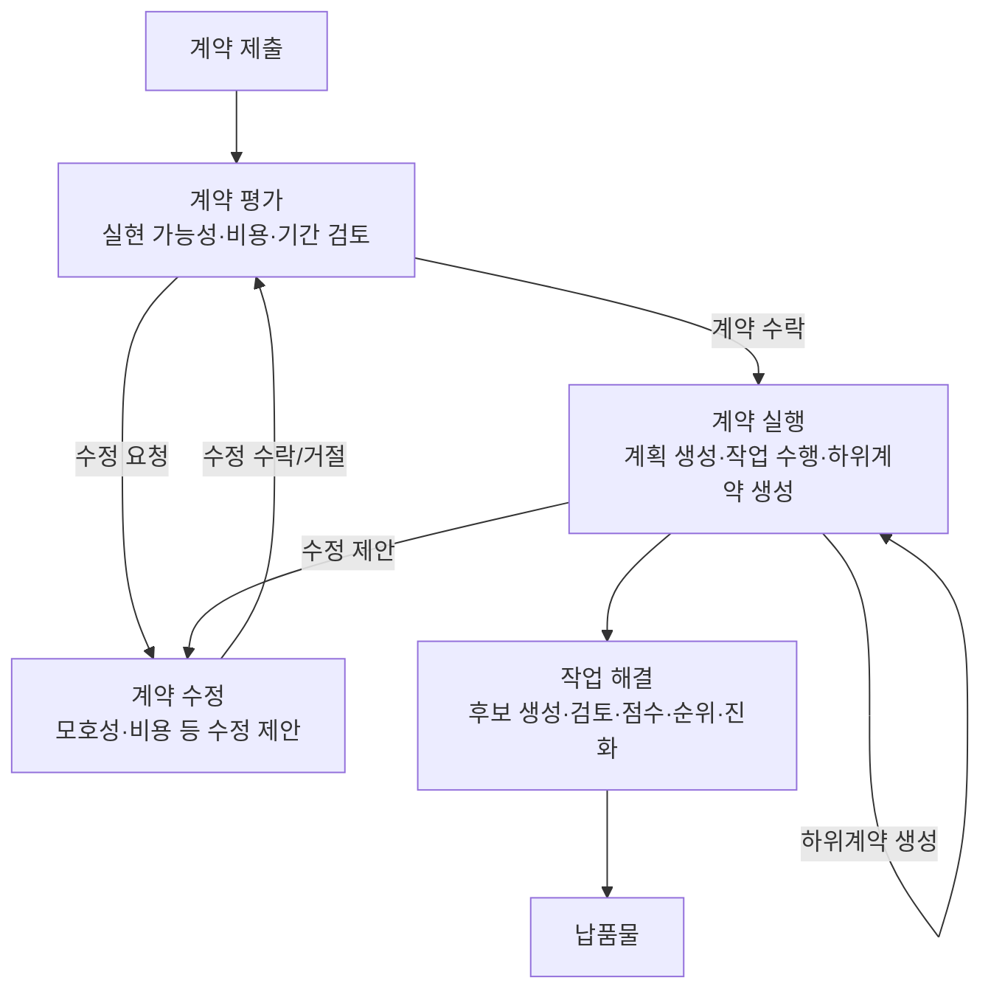
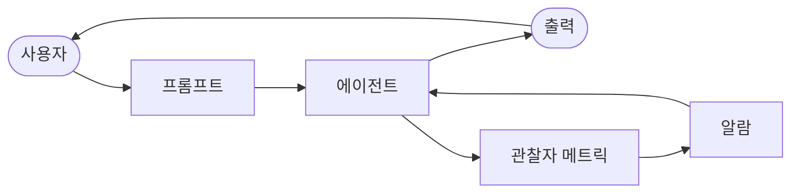

import { KeyPoints, Diagram, CrossRef } from '@site/src/components';

<KeyPoints
  items={[
    "지능형 에이전트 평가(Evaluation and Monitoring)는 전통적인 소프트웨어 테스트를 넘어, 실제 운영 환경에서 에이전트의 효과성·효율성·요구사항 준수 여부를 지속적으로 측정합니다.",
    "기본적인 응답 정확도 평가부터 지연 모니터링(Latency Monitoring), LLM 기반 토큰 사용량(Token Usage) 추적까지, 다양한 계층의 메트릭이 필요합니다.",
    "에이전트 궤적(Agent Trajectories)—에이전트가 목표에 도달하기까지 취한 단계의 순서—은 이상적인 경로와 비교하여 오류와 비효율성을 파악하는 핵심 평가 요소입니다.",
    "판관 LLM(LLM-as-a-Judge) 기법은 '유용성'과 같은 주관적 품질을 뉘앙스 있게 자동 평가하는 방법으로, 확장성과 일관성을 확보합니다.",
    "Google ADK는 웹 UI, pytest 통합, CLI를 통해 단위 테스트용 테스트 파일과 통합 테스트용 evalset 파일을 모두 지원하는 구조화된 평가 방법을 제공합니다.",
    "단순 프롬프트 기반 에이전트에서 공식 '계약(contract)' 기반 컨트랙터 에이전트로의 전환은 모호성을 해소하고, 작업을 협의·분해·자기검증함으로써 복잡한 고위험 작업에서 신뢰성을 확보합니다.",
  ]}
/>

# 19장: 평가 및 모니터링

이 장에서는 지능형 에이전트가 자신의 성능을 체계적으로 평가하고, 목표를 향한 진척도를 모니터링하며, 운영상의 이상 현상을 감지할 수 있도록 하는 방법론을 살펴봅니다. 11장에서는 목표 설정과 모니터링을, 17장에서는 추론 기법(Reasoning Techniques)을 다루었습니다. 본 장은 에이전트의 효과성·효율성·요구사항 준수 여부를 지속적으로—주로 외부에서—측정하는 데 초점을 맞춥니다. 여기에는 메트릭 정의, 피드백 루프(feedback loop) 수립, 운영 환경에서 에이전트 성능이 기대치에 부합하도록 보장하는 보고 시스템 구현이 포함됩니다(그림 1 참조).

<figure>

<figcaption>그림 1 — 평가 및 모니터링 모범 사례</figcaption>
</figure>

## 실용적 응용 및 사용 사례

가장 일반적인 응용 및 사용 사례는 다음과 같습니다.

- **운영 환경에서의 성능 추적**: 프로덕션에 배포된 에이전트의 정확도·지연 시간·리소스 소비를 지속적으로 모니터링합니다(예: 고객 서비스 챗봇의 해결률, 응답 시간).
- **에이전트 개선을 위한 A/B 테스팅(A/B Testing)**: 최적의 접근법을 찾기 위해 서로 다른 에이전트 버전이나 전략의 성능을 병렬로 체계적으로 비교합니다(예: 물류 에이전트에 두 가지 계획 알고리즘을 적용해 비교).
- **컴플라이언스(Compliance) 및 안전성 감사**: 에이전트의 윤리 지침·규제 요건·안전 프로토콜 준수 여부를 추적하는 자동화된 감사 보고서를 생성합니다. 이 보고서는 인간 참여 루프(Human-in-the-Loop) 또는 다른 에이전트가 검증할 수 있으며, KPI를 생성하거나 문제 발견 시 알림을 트리거할 수 있습니다.
- **엔터프라이즈 시스템**: 기업 시스템에서 에이전틱 AI를 거버닝하기 위해 새로운 통제 수단인 AI "계약(Contract)"이 필요합니다. 이 동적 합의는 AI에 위임된 작업의 목표·규칙·통제를 성문화합니다.
- **드리프트 감지(Drift Detection)**: 시간이 지남에 따라 에이전트 출력의 관련성 또는 정확도를 모니터링하고, 입력 데이터 분포 변화(개념 드리프트) 또는 환경 변화로 인해 성능이 저하될 때를 감지합니다.
- **에이전트 행동의 이상 탐지(Anomaly Detection)**: 에이전트가 취한 비정상적이거나 예상치 못한 행동을 식별하여 오류, 악의적 공격, 또는 바람직하지 않은 창발적 행동을 나타낼 수 있는 상황을 감지합니다.
- **학습 진행 평가**: 학습하도록 설계된 에이전트의 경우, 학습 곡선·특정 기술의 향상·다양한 작업이나 데이터셋에서의 일반화 역량을 추적합니다.

## 실습 코드 예제

AI 에이전트를 위한 포괄적인 평가 프레임워크를 개발하는 것은 학문적 분야나 상당한 규모의 출판물에 견줄 만큼 복잡한 도전적 작업입니다. 이러한 어려움은 모델 성능·사용자 상호작용·윤리적 함의·광범위한 사회적 영향 등 고려해야 할 요소가 매우 많기 때문입니다. 그럼에도 실용적인 구현을 위해서는 AI 에이전트의 효율적이고 효과적인 기능에 필수적인 중요 사용 사례에 집중할 수 있습니다.

**에이전트 응답 평가**: 이 핵심 프로세스는 에이전트 출력의 품질과 정확도를 평가하는 데 필수적입니다. 에이전트가 주어진 입력에 대해 관련성 있고, 정확하며, 논리적이고, 편향 없는 정보를 제공하는지 판단합니다. 평가 메트릭에는 사실적 정확성, 유창성, 문법적 정밀성, 사용자 의도에 대한 부합 여부가 포함될 수 있습니다.

```python
def evaluate_response_accuracy(agent_output: str, expected_output:
str) -> float:
   """Calculates a simple accuracy score for agent responses."""
   # This is a very basic exact match; real-world would use more
sophisticated metrics
   return 1.0 if agent_output.strip().lower() ==
expected_output.strip().lower() else 0.0

# Example usage
agent_response = "The capital of France is Paris."
ground_truth = "Paris is the capital of France."
score = evaluate_response_accuracy(agent_response, ground_truth)
print(f"Response accuracy: {score}")
```

```text
not identical. As a result, the function will incorrectly return an accuracy score of 0.0,
```

Python 함수 `evaluate_response_accuracy`는 에이전트의 응답과 기댓값 출력을 앞뒤 공백을 제거한 후 대소문자를 구분하지 않고 정확히 비교하여 기본적인 정확도 점수를 계산합니다. 정확히 일치하면 1.0을, 그렇지 않으면 0.0을 반환하는 이진 평가 방식입니다. 이 방법은 단순한 검사에는 간편하지만, 패러프레이징이나 의미적 동등성을 고려하지 못합니다.

문제는 비교 방식에 있습니다. 이 함수는 두 문자열을 글자 단위로 엄격하게 비교합니다. 위 예제에서:

- `agent_response`: "The capital of France is Paris."
- `ground_truth`: "Paris is the capital of France."

공백을 제거하고 소문자로 변환해도 두 문자열은 동일하지 않습니다. 따라서 두 문장이 같은 의미를 전달함에도 함수는 정확도 점수 0.0을 반환합니다.

단순 비교는 의미적 유사도를 평가하는 데 한계가 있습니다. 보다 효과적인 평가를 위해서는 고급 자연어 처리(NLP) 기법이 필요합니다. 실제 시나리오에서는 Levenshtein 거리, Jaccard 유사도와 같은 문자열 유사도 측정, 특정 키워드의 존재 여부를 확인하는 키워드 분석, 임베딩 모델을 사용한 코사인 유사도 기반 의미 유사도(Semantic Similarity), 이후 설명할 판관 LLM(LLM-as-a-Judge) 평가, 그리고 충실도(faithfulness)와 관련성 같은 검색 증강 생성(RAG) 특화 메트릭이 필수적입니다.

**지연 모니터링(Latency Monitoring)**: AI 에이전트의 응답 속도가 중요한 애플리케이션에서는 에이전트 행동의 지연 모니터링이 매우 중요합니다. 이 과정은 에이전트가 요청을 처리하고 출력을 생성하는 데 걸리는 시간을 측정합니다. 높은 지연 시간(Latency)은 사용자 경험과 에이전트의 전반적인 효과성에 부정적 영향을 미칠 수 있으며, 특히 실시간 또는 대화형 환경에서 그렇습니다. 실용적인 구현에서는 콘솔에 지연 데이터를 출력하는 것만으로는 부족합니다. 구조화된 로그 파일(예: JSON), 시계열 데이터베이스(예: InfluxDB, Prometheus), 데이터 웨어하우스(예: Snowflake, BigQuery, PostgreSQL), 또는 관찰 플랫폼(예: Datadog, Splunk, Grafana Cloud) 같은 영구 저장 시스템에 이 정보를 로깅하는 것이 권장됩니다.

**LLM 상호작용의 토큰 사용량(Token Usage) 추적**: LLM 기반 에이전트에서 토큰 사용량 추적은 비용 관리와 리소스 배분 최적화에 필수적입니다. LLM 상호작용 청구는 처리된 토큰 수(입력 및 출력)에 따라 결정되는 경우가 많습니다. 따라서 효율적인 토큰 사용은 운영 비용을 직접적으로 줄입니다. 또한 토큰 수 모니터링은 프롬프트 엔지니어링(Prompt Engineering) 또는 응답 생성 프로세스의 개선 여지를 파악하는 데 도움이 됩니다.

```python
# This is conceptual as actual token counting depends on the LLM API
class LLMInteractionMonitor:
   def __init__(self):
       self.total_input_tokens = 0
       self.total_output_tokens = 0

   def record_interaction(self, prompt: str, response: str):
       # In a real scenario, use LLM API's token counter or a
tokenizer
       input_tokens = len(prompt.split()) # Placeholder
       output_tokens = len(response.split()) # Placeholder
       self.total_input_tokens += input_tokens
       self.total_output_tokens += output_tokens
       print(f"Recorded interaction: Input tokens={input_tokens},
Output tokens={output_tokens}")

   def get_total_tokens(self):
       return self.total_input_tokens, self.total_output_tokens

# Example usage
monitor = LLMInteractionMonitor()
monitor.record_interaction("What is the capital of France?", "The
capital of France is Paris.")
```

```text
monitor.record_interaction("Tell me a joke.", "Why don't scientists
trust atoms? Because they make up everything!")
input_t, output_t = monitor.get_total_tokens()
print(f"Total input tokens: {input_t}, Total output tokens:
{output_t}")
```

이 섹션에서는 대규모 언어 모델 상호작용에서 토큰 사용량을 추적하기 위해 개발된 개념적 Python 클래스 `LLMInteractionMonitor`를 소개합니다. 이 클래스는 입력 및 출력 토큰에 대한 카운터를 포함합니다. `record_interaction` 메서드는 프롬프트와 응답 문자열을 분리하여 토큰 카운팅을 시뮬레이션합니다. 실용적인 구현에서는 정확한 토큰 수를 위해 특정 LLM API 토크나이저를 사용합니다. 상호작용이 발생하면 모니터는 총 입력 및 출력 토큰 수를 누적합니다. `get_total_tokens` 메서드는 LLM 사용량의 비용 관리 및 최적화에 필수적인 이 누적 합계에 대한 접근을 제공합니다.

**판관 LLM(LLM-as-a-Judge)을 이용한 '유용성'의 커스텀 메트릭**: AI 에이전트의 '유용성'과 같은 주관적 품질을 평가하는 것은 표준 객관적 메트릭을 넘어서는 도전 과제입니다. 가능한 프레임워크는 LLM을 평가자로 활용하는 것입니다. 이 판관 LLM(LLM-as-a-Judge) 방식은 사전에 정의된 '유용성' 기준을 바탕으로 다른 AI 에이전트의 출력을 평가합니다. LLM의 고급 언어 역량을 활용하여 단순한 키워드 매칭이나 규칙 기반 평가를 뛰어넘는 뉘앙스 있는, 인간적 평가를 제공합니다. 아직 개발 중이지만 이 기법은 정성적 평가의 자동화 및 확장에 대한 가능성을 보여줍니다.

```python
import google.generativeai as genai
import os
import json
import logging
from typing import Optional

# --- Configuration ---
logging.basicConfig(level=logging.INFO, format='%(asctime)s -
%(levelname)s - %(message)s')

# Set your API key as an environment variable to run this script
# For example, in your terminal: export
GOOGLE_API_KEY='your_key_here'
try:
   genai.configure(api_key=os.environ["GOOGLE_API_KEY"])
except KeyError:
   logging.error("Error: GOOGLE_API_KEY environment variable not
set.")
```

```python
   exit(1)

# --- LLM-as-a-Judge Rubric for Legal Survey Quality ---
LEGAL_SURVEY_RUBRIC = """
You are an expert legal survey methodologist and a critical legal
reviewer. Your task is to evaluate the quality of a given legal
survey question.

Provide a score from 1 to 5 for overall quality, along with a
detailed rationale and specific feedback.
Focus on the following criteria:

1.  **Clarity & Precision (Score 1-5):**
   * 1: Extremely vague, highly ambiguous, or confusing.
   * 3: Moderately clear, but could be more precise.
   * 5: Perfectly clear, unambiguous, and precise in its legal
terminology (if applicable) and intent.

2.  **Neutrality & Bias (Score 1-5):**
   * 1: Highly leading or biased, clearly influencing the respondent
towards a specific answer.
   * 3: Slightly suggestive or could be interpreted as leading.
   * 5: Completely neutral, objective, and free from any leading
language or loaded terms.

3.  **Relevance & Focus (Score 1-5):**
   * 1: Irrelevant to the stated survey topic or out of scope.
   * 3: Loosely related but could be more focused.
   * 5: Directly relevant to the survey's objectives and well-focused
on a single concept.

4.  **Completeness (Score 1-5):**
   * 1: Omits critical information needed to answer accurately or
provides insufficient context.
   * 3: Mostly complete, but minor details are missing.
   * 5: Provides all necessary context and information for the
respondent to answer thoroughly.

5.  **Appropriateness for Audience (Score 1-5):**
   * 1: Uses jargon inaccessible to the target audience or is overly
simplistic for experts.
   * 3: Generally appropriate, but some terms might be challenging or
oversimplified.
   * 5: Perfectly tailored to the assumed legal knowledge and
background of the target survey audience.

**Output Format:**
```

```python
Your response MUST be a JSON object with the following keys:
* `overall_score`: An integer from 1 to 5 (average of criterion
scores, or your holistic judgment).
* `rationale`: A concise summary of why this score was given,
highlighting major strengths and weaknesses.
* `detailed_feedback`: A bullet-point list detailing feedback for
each criterion (Clarity, Neutrality, Relevance, Completeness,
Audience Appropriateness). Suggest specific improvements.
* `concerns`: A list of any specific legal, ethical, or
methodological concerns.
* `recommended_action`: A brief recommendation (e.g., "Revise for
neutrality", "Approve as is", "Clarify scope").
"""

class LLMJudgeForLegalSurvey:
   """A class to evaluate legal survey questions using a generative
AI model."""


   def __init__(self, model_name: str = 'gemini-1.5-flash-latest',
temperature: float = 0.2):
       """
       Initializes the LLM Judge.

       Args:
           model_name (str): The name of the Gemini model to use.
                             'gemini-1.5-flash-latest' is recommended
for speed and cost.
                             'gemini-1.5-pro-latest' offers the
highest quality.
           temperature (float): The generation temperature. Lower is
better for deterministic evaluation.
       """
       self.model = genai.GenerativeModel(model_name)
       self.temperature = temperature


   def _generate_prompt(self, survey_question: str) -> str:
       """Constructs the full prompt for the LLM judge."""
       return f"{LEGAL_SURVEY_RUBRIC}\n\n---\n**LEGAL SURVEY QUESTION
TO EVALUATE:**\n{survey_question}\n---"

   def judge_survey_question(self, survey_question: str) ->
Optional[dict]:
       """
       Judges the quality of a single legal survey question using the
LLM.
```

```python
       Args:
           survey_question (str): The legal survey question to be
evaluated.

       Returns:
           Optional[dict]: A dictionary containing the LLM's
judgment, or None if an error occurs.
       """
       full_prompt = self._generate_prompt(survey_question)

       try:
           logging.info(f"Sending request to
'{self.model.model_name}' for judgment...")
           response = self.model.generate_content(
               full_prompt,
               generation_config=genai.types.GenerationConfig(
                   temperature=self.temperature,
                   response_mime_type="application/json"
               )
           )

           # Check for content moderation or other reasons for an
empty response.
           if not response.parts:
               safety_ratings =
response.prompt_feedback.safety_ratings
               logging.error(f"LLM response was empty or blocked.
Safety Ratings: {safety_ratings}")
               return None

           return json.loads(response.text)

       except json.JSONDecodeError:
           logging.error(f"Failed to decode LLM response as JSON. Raw
response: {response.text}")
           return None
       except Exception as e:
           logging.error(f"An unexpected error occurred during LLM
judgment: {e}")
           return None

# --- Example Usage ---
if __name__ == "__main__":
   judge = LLMJudgeForLegalSurvey()

   # --- Good Example ---
```

```python
   good_legal_survey_question = """
   To what extent do you agree or disagree that current intellectual
property laws in Switzerland adequately protect emerging AI-generated
content, assuming the content meets the originality criteria
established by the Federal Supreme Court?
   (Select one: Strongly Disagree, Disagree, Neutral, Agree, Strongly
Agree)
   """
   print("\n--- Evaluating Good Legal Survey Question ---")
   judgment_good =
judge.judge_survey_question(good_legal_survey_question)
   if judgment_good:
       print(json.dumps(judgment_good, indent=2))

   # --- Biased/Poor Example ---
   biased_legal_survey_question = """
   Don't you agree that overly restrictive data privacy laws like the
FADP are hindering essential technological innovation and economic
growth in Switzerland?
   (Select one: Yes, No)
   """
   print("\n--- Evaluating Biased Legal Survey Question ---")
   judgment_biased =
judge.judge_survey_question(biased_legal_survey_question)
   if judgment_biased:
       print(json.dumps(judgment_biased, indent=2))

   # --- Ambiguous/Vague Example ---
   vague_legal_survey_question = """
   What are your thoughts on legal tech?
   """
   print("\n--- Evaluating Vague Legal Survey Question ---")
   judgment_vague =
judge.judge_survey_question(vague_legal_survey_question)
   if judgment_vague:
       print(json.dumps(judgment_vague, indent=2))
```

Python 코드는 생성형 AI 모델을 사용하여 법률 설문 문항의 품질을 평가하도록 설계된 `LLMJudgeForLegalSurvey` 클래스를 정의합니다. `google.generativeai` 라이브러리를 사용하여 Gemini 모델과 상호작용합니다.

핵심 기능은 설문 문항을 상세한 평가 루브릭과 함께 모델에 전송하는 것입니다. 루브릭은 설문 문항 판단을 위한 다섯 가지 기준을 명시합니다: 명확성 및 정밀성, 중립성 및 편향, 관련성 및 초점, 완전성, 대상 적합성. 각 기준에 대해 1~5점의 점수와 상세한 근거 및 피드백이 출력에 필요합니다.

`judge_survey_question` 메서드는 이 프롬프트를 구성된 Gemini 모델에 전송하여 정의된 구조에 따른 JSON 응답을 요청합니다. 예상 출력 JSON에는 전반적 점수, 요약 근거, 각 기준별 상세 피드백, 우려사항 목록, 권장 조치가 포함됩니다. 클래스는 JSON 디코딩 오류나 빈 응답과 같은 AI 모델 상호작용 중 발생할 수 있는 오류를 처리합니다.

결론에 앞서 다양한 평가 방법의 강점과 약점을 살펴보겠습니다.

| 평가 방법 | 강점 | 약점 |
|---|---|---|
| 인간 평가 | 미묘한 행동을 포착함 | 확장하기 어렵고, 비용이 많이 들며, 시간이 걸립니다. 주관적인 인간 요소를 고려합니다. |
| 판관 LLM(LLM-as-a-Judge) | 일관성, 효율성, 확장성 | 중간 단계가 간과될 수 있습니다. LLM 역량에 의해 제한됩니다. |
| 자동화 메트릭 | 확장 가능, 효율적, 객관적 | 완전한 역량을 포착하는 데 한계가 있을 수 있습니다. |

## 에이전트 궤적

에이전트 궤적(Agent Trajectories) 평가는 전통적인 소프트웨어 테스트가 불충분하므로 필수적입니다. 표준 코드는 예측 가능한 통과/실패 결과를 산출하는 반면, 에이전트는 확률적으로 동작하므로 최종 출력과 에이전트 궤적—솔루션에 도달하기 위해 취한 단계의 순서—모두에 대한 질적 평가가 필요합니다.

멀티 에이전트 협업(Multi-Agent Collaboration) 시스템 평가는 시스템이 지속적으로 변화하기 때문에 도전적입니다. 이는 개별 성능을 넘어 커뮤니케이션과 팀워크의 효과를 측정하는 정교한 메트릭 개발을 요구합니다. 더불어 환경 자체도 정적이지 않아 테스트 케이스를 포함한 평가 방법이 시간에 따라 적응해야 합니다.

이 과정은 의사결정의 품질, 추론 과정, 전반적인 결과를 검토합니다. 프로토타입 단계를 넘어선 개발에서는 자동화된 평가를 구현하는 것이 가치 있습니다. 궤적 및 툴 사용(Tool Use) 분석에는 에이전트가 목표를 달성하기 위해 사용하는 단계—도구 선택, 전략, 작업 효율성—를 평가하는 것이 포함됩니다.

예를 들어, 고객의 제품 문의를 처리하는 에이전트는 이상적으로 의도 파악, 데이터베이스 검색 도구 사용, 결과 검토, 보고서 생성 순서의 궤적을 따릅니다. 에이전트의 실제 행동은 이상적인 또는 정답 궤적과 비교하여 오류와 비효율성을 파악합니다. 비교 방법에는 다음이 포함됩니다: 정확 일치(ideal sequence와 완전한 일치 요구), 순서 내 일치(순서대로 올바른 행동, 추가 단계 허용), 임의 순서 일치(임의 순서로 올바른 행동, 추가 단계 허용), 정밀도(예측된 행동의 관련성 측정), 재현율(필수 행동이 얼마나 포착되었는지 측정), 단일 도구 사용(특정 행동 확인).

평가 방법 선택은 특정 에이전트 요구사항에 따라 달라집니다. 고위험 시나리오에서는 정확 일치가 필요할 수 있는 반면, 더 유연한 상황에서는 순서 내 또는 임의 순서 일치를 사용할 수 있습니다.

AI 에이전트 평가는 두 가지 주요 접근법을 활용합니다: 테스트 파일과 evalset 파일. JSON 형식의 테스트 파일은 단일하고 단순한 에이전트-모델 상호작용 또는 세션을 나타내며, 신속한 실행과 단순한 세션 복잡성에 초점을 맞추는 활발한 개발 중 단위 테스트에 이상적입니다. 각 테스트 파일은 여러 턴을 포함하는 단일 세션을 포함하며, 여기서 턴은 사용자 쿼리, 예상 도구 사용 궤적, 중간 에이전트 응답, 최종 응답을 포함하는 사용자-에이전트 상호작용입니다. Evalset 파일은 복잡한 멀티 턴 대화를 시뮬레이션하고 통합 테스트에 적합한 여러 개의 잠재적으로 긴 세션을 포함하는 "evalset" 데이터셋을 활용합니다.

**멀티 에이전트**: 여러 에이전트가 있는 복잡한 AI 시스템 평가는 팀 프로젝트를 평가하는 것과 매우 유사합니다. 많은 단계와 핸드오프(Handoff)가 있어 각 단계에서 작업 품질을 확인할 수 있다는 장점이 있습니다. 개별 "에이전트"가 특정 작업을 얼마나 잘 수행하는지 검토하는 동시에 전체 시스템이 전체적으로 어떻게 작동하는지도 평가해야 합니다.

이를 위해 팀의 역학에 관한 핵심 질문을, 구체적인 예와 함께 물어봅니다.

- **에이전트들이 효과적으로 협력하고 있습니까?** 예를 들어, '항공편 예약 에이전트'가 항공편을 확보한 후 올바른 날짜와 목적지를 '호텔 예약 에이전트'에 성공적으로 전달합니까? 협력 실패는 잘못된 주간에 호텔이 예약되는 결과를 낳을 수 있습니다.
- **에이전트들이 좋은 계획을 세우고 그것을 따릅니까?** 먼저 항공편을 예약하고 그다음 호텔을 예약하는 계획이 있다고 가정합시다. '호텔 에이전트'가 항공편이 확정되기 전에 객실을 예약하려고 한다면, 계획에서 벗어난 것입니다. 에이전트가 막혀 있는지도 확인합니다. 예를 들어, "완벽한" 렌터카를 끝없이 찾다가 다음 단계로 나아가지 못하는 경우입니다.
- **적절한 에이전트가 적절한 작업을 위해 선택되고 있습니까?** 사용자가 여행 날씨에 대해 묻는다면, 시스템은 실시간 데이터를 제공하는 전문화된 '날씨 에이전트'를 사용해야 합니다. 대신 "여름에는 보통 따뜻합니다"와 같은 일반적인 답변을 주는 '일반 지식 에이전트'를 사용한다면, 작업에 잘못된 도구를 선택한 것입니다.
- **더 많은 에이전트를 추가하면 성능이 향상됩니까?** 팀에 새로운 '레스토랑 예약 에이전트'를 추가하면 전반적인 여행 계획이 더 좋고 효율적이 됩니까? 아니면 충돌을 만들고 시스템을 느리게 하여 확장성 문제를 나타냅니까?

## 에이전트에서 고급 컨트랙터로

최근 단순 AI 에이전트에서 고급 "컨트랙터(contractor)"로의 진화가 제안되었습니다(Agent Companion, gulli et al.). 이는 복잡한 고위험 환경을 위해 설계된 보다 결정론적이고 책임 있는 시스템으로, 확률적이고 종종 신뢰할 수 없는 시스템에서 벗어나는 것을 목표로 합니다(그림 2 참조).

오늘날의 일반적인 AI 에이전트는 간략하고 불충분하게 명시된 지시에 따라 운영되므로, 단순한 시연에는 적합하지만 모호성이 실패로 이어지는 프로덕션 환경에서는 취약합니다. "컨트랙터" 모델은 사용자와 AI 사이에 인간 세계의 법률 서비스 계약처럼 명확하게 정의되고 상호 합의된 조건의 기반 위에 구축된 엄격하고 공식화된 관계를 확립함으로써 이 문제를 해결합니다. 이 변환은 명확성, 신뢰성, 이전에 자율 시스템의 범위를 넘어섰던 작업의 강력한 실행을 집단적으로 보장하는 네 가지 핵심 기반 위에 지지됩니다.

첫 번째 기반은 공식화된 계약(Formalized Contract)으로, 작업의 단일 진실 소스 역할을 하는 상세한 명세입니다. 이는 단순한 프롬프트를 훨씬 넘어섭니다. 예를 들어, 재무 분석 작업에 대한 계약은 단순히 "지난 분기 매출을 분석하라"고 하지 않습니다. 대신 "2025년 1분기 유럽 시장 매출을 분석하는 20페이지 PDF 보고서를 작성하되, 다섯 가지 특정 데이터 시각화, 2024년 1분기와의 비교 분석, 공급망 중단 포함 데이터셋을 기반으로 한 리스크 평가"를 요구합니다. 이 계약은 필요한 산출물, 정확한 명세, 허용 가능한 데이터 소스, 작업 범위, 그리고 예상 계산 비용 및 완료 시간까지 명시하여 결과를 객관적으로 검증 가능하게 만듭니다.

두 번째 기반은 협상 및 피드백의 동적 생명주기입니다. 계약은 정적인 명령이 아니라 대화의 시작입니다. 컨트랙터 에이전트는 초기 조건을 분석하고 협상할 수 있습니다. 예를 들어, 에이전트가 접근할 수 없는 특정 독점 데이터 소스를 계약이 요구한다면, "지정된 XYZ 데이터베이스에 접근할 수 없습니다. 자격 증명을 제공하거나 데이터 세분성을 약간 변경할 수 있는 대안적 공개 데이터베이스 사용을 승인해 주십시오"라는 피드백을 반환할 수 있습니다. 에이전트가 모호성이나 잠재적 위험을 표시할 수도 있는 이 협상 단계는 실행 전에 오해를 해소하여 비용이 많이 드는 실패를 방지하고 최종 출력이 사용자의 실제 의도와 완벽하게 일치하도록 합니다.

<figure>



<figcaption>그림 2 — 에이전트 간 계약 실행 예시</figcaption>
</figure>

세 번째 기반은 품질 중심 반복 실행입니다. 낮은 지연 시간 응답을 위해 설계된 에이전트와 달리, 컨트랙터는 정확성과 품질을 우선시합니다. 자기 검증 및 수정의 원칙에 따라 운영됩니다. 코드 생성 계약에서, 예를 들어 에이전트는 단순히 코드를 작성하지 않습니다. 여러 알고리즘적 접근법을 생성하고, 계약 내에서 정의된 단위 테스트 스위트에 대해 컴파일 및 실행하고, 성능·보안·가독성과 같은 메트릭으로 각 솔루션을 채점하며, 모든 검증 기준을 통과하는 버전만 제출합니다. 계약 명세가 충족될 때까지 자신의 작업을 생성·검토·개선하는 이 내부 루프는 출력에 대한 신뢰를 구축하는 데 매우 중요합니다.

마지막으로, 네 번째 기반은 서브계약을 통한 계층적 분해(Hierarchical Decomposition)입니다. 상당한 복잡성의 작업을 위해, 주 컨트랙터 에이전트는 프로젝트 관리자 역할을 하여 주요 목표를 더 작고 관리 가능한 하위 작업으로 분해할 수 있습니다. 이는 새로운 공식 "서브계약"을 생성함으로써 달성됩니다. 예를 들어, "전자상거래 모바일 애플리케이션 구축"의 마스터 계약은 주 에이전트에 의해 "UI/UX 설계", "사용자 인증 모듈 개발", "제품 데이터베이스 스키마 생성", "결제 게이트웨이 통합"에 대한 서브계약으로 분해될 수 있습니다. 이러한 각 서브계약은 자체 산출물과 명세를 가진 완전하고 독립적인 계약으로, 다른 전문화된 에이전트에 할당될 수 있습니다. 이 구조화된 분해를 통해 시스템은 방대하고 다면적인 프로젝트를 고도로 조직적이고 확장 가능한 방식으로 해결할 수 있으며, AI가 단순한 도구에서 진정으로 자율적이고 신뢰할 수 있는 문제 해결 엔진으로 전환되는 것을 표시합니다.

궁극적으로, 이 컨트랙터 프레임워크는 공식 명세·협상·검증 가능한 실행의 원칙을 에이전트의 핵심 로직에 직접 내장함으로써 AI 상호작용을 재구상합니다. 이 방법론적 접근법은 인공지능을 유망하지만 종종 예측 불가능한 보조자에서 감사 가능한 정밀성으로 복잡한 프로젝트를 자율적으로 관리할 수 있는 신뢰할 수 있는 시스템으로 향상시킵니다. 모호성과 신뢰성의 중요한 도전과제를 해결함으로써, 이 모델은 신뢰와 책임이 가장 중요한 미션 크리티컬 도메인에 AI를 배포하는 길을 열어줍니다.

## Google ADK

결론에 앞서, 평가를 지원하는 프레임워크의 구체적인 예를 살펴보겠습니다. Google ADK(에이전트 개발 키트(ADK))를 이용한 에이전트 평가(그림 3 참조)는 세 가지 방법으로 수행할 수 있습니다: 대화형 평가 및 데이터셋 생성을 위한 웹 기반 UI(`adk web`), 테스트 파이프라인에 통합하기 위한 pytest를 사용한 프로그래밍 방식 통합, 그리고 정기적인 빌드 생성 및 검증 프로세스에 적합한 자동화된 평가를 위한 직접 명령줄 인터페이스(`adk eval`).

<figure>

<figcaption>그림 3 — Google ADK의 평가 지원</figcaption>
</figure>

웹 기반 UI는 대화형 세션 생성 및 기존 또는 새로운 evalset에 저장, 평가 상태 표시를 가능하게 합니다. pytest 통합은 에이전트 모듈과 테스트 파일 경로를 지정하여 `AgentEvaluator.evaluate`를 호출함으로써 통합 테스트의 일부로 테스트 파일을 실행할 수 있게 합니다.

명령줄 인터페이스는 에이전트 모듈 경로와 evalset 파일을 제공하여 자동화된 평가를 용이하게 하며, 구성 파일을 지정하거나 상세 결과를 출력하는 옵션이 있습니다. 더 큰 evalset 내의 특정 eval은 evalset 파일명 뒤에 쉼표로 구분하여 나열함으로써 실행을 위해 선택할 수 있습니다.

## 한눈에 보기

**무엇이 문제인가**: 에이전틱 시스템(Agentic Systems)과 LLM은 복잡하고 동적인 환경에서 운영되며 시간이 지남에 따라 성능이 저하될 수 있습니다. 확률적이고 비결정론적인 특성으로 인해 전통적인 소프트웨어 테스트는 신뢰성을 보장하기에 불충분합니다. 동적 멀티 에이전트 시스템을 평가하는 것은 지속적으로 변화하는 특성과 환경으로 인해 개별 성능을 넘어 협업 성공을 측정할 수 있는 적응형 테스트 방법과 정교한 메트릭 개발을 요구하는 중요한 도전입니다. 데이터 드리프트, 예상치 못한 상호작용, 도구 호출, 의도된 목표에서의 이탈과 같은 문제는 배포 후 발생할 수 있습니다. 따라서 에이전트의 효과성·효율성·운영 및 안전 요구사항 준수를 측정하기 위한 지속적인 평가가 필요합니다.

**왜 평가 및 모니터링인가**: 표준화된 평가 및 모니터링(Evaluation and Monitoring) 프레임워크는 지능형 에이전트의 지속적인 성능을 평가하고 보장하는 체계적인 방법을 제공합니다. 여기에는 정확도·지연 시간·LLM의 토큰 사용량과 같은 리소스 소비에 대한 명확한 메트릭 정의가 포함됩니다. 또한 추론 과정을 이해하기 위한 에이전트 궤적 분석, 뉘앙스 있는 정성적 평가를 위한 판관 LLM(LLM-as-a-Judge) 활용과 같은 고급 기법도 포함됩니다. 피드백 루프와 보고 시스템을 수립함으로써 이 프레임워크는 지속적인 개선, A/B 테스팅(A/B Testing), 이상 또는 성능 드리프트 감지(Drift Detection)를 가능하게 하여 에이전트가 목표와 일치하도록 보장합니다.

**경험 법칙**: 실시간 성능과 신뢰성이 중요한 라이브 프로덕션 환경에 에이전트를 배포할 때 이 패턴을 사용하십시오. 또한 개선을 주도하기 위해 에이전트 또는 기반 모델의 다른 버전을 체계적으로 비교해야 할 때, 그리고 컴플라이언스(Compliance)·안전성·윤리 감사가 필요한 규제 또는 고위험 도메인에서 운영할 때 사용하십시오. 이 패턴은 데이터 또는 환경 변화(드리프트)로 인해 에이전트 성능이 시간이 지남에 따라 저하될 수 있을 때, 또는 행동 순서(궤적)와 유용성 같은 주관적 출력의 품질을 포함한 복잡한 에이전틱 행동을 평가할 때도 적합합니다.

## 시각적 요약

<figure>


<figcaption>그림 4 — 평가 및 모니터링 디자인 패턴</figcaption>
</figure>

## 핵심 정리

- 지능형 에이전트 평가는 전통적인 테스트를 넘어 실제 환경에서 효과성·효율성·요구사항 준수를 지속적으로 측정합니다.
- 에이전트 평가의 실용적 응용에는 운영 중인 시스템에서의 성능 추적, 개선을 위한 A/B 테스팅(A/B Testing), 컴플라이언스(Compliance) 감사, 행동의 드리프트 감지(Drift Detection) 또는 이상 탐지(Anomaly Detection)가 포함됩니다.
- 기본적인 에이전트 평가는 응답 정확도 평가를 포함하며, 실제 시나리오에서는 지연 모니터링(Latency Monitoring)과 LLM 기반 에이전트의 토큰 사용량(Token Usage) 추적 같은 더 정교한 메트릭이 필요합니다.
- 에이전트 궤적(Agent Trajectories)—에이전트가 취하는 단계의 순서—은 평가에 중요하며, 실제 행동을 이상적인 정답 경로와 비교하여 오류와 비효율성을 파악합니다.
- ADK는 단위 테스트를 위한 개별 테스트 파일과 통합 테스트를 위한 포괄적인 evalset 파일을 통해 구조화된 평가 방법을 제공하며, 둘 다 예상 에이전트 행동을 정의합니다.
- 에이전트 평가는 대화형 테스트를 위한 웹 기반 UI, CI/CD 통합을 위한 pytest를 통한 프로그래밍 방식, 또는 자동화된 워크플로를 위한 명령줄 인터페이스를 통해 실행할 수 있습니다.
- AI를 복잡한 고위험 작업에 신뢰할 수 있게 만들기 위해서는 단순 프롬프트에서 검증 가능한 산출물과 범위를 정확하게 정의하는 공식 "계약"으로 이동해야 합니다. 이 구조화된 합의를 통해 에이전트는 협상하고, 모호성을 명확히 하며, 자신의 작업을 반복적으로 검증할 수 있어, 예측 불가능한 도구에서 책임 있고 신뢰할 수 있는 시스템으로 변환됩니다.

## 결론

결론적으로, AI 에이전트를 효과적으로 평가하려면 단순 정확도 검사를 넘어 동적 환경에서 성능에 대한 지속적이고 다면적인 평가로 나아가야 합니다. 이는 지연 시간과 리소스 소비 같은 메트릭의 실용적인 모니터링과, 궤적을 통한 에이전트 의사결정 과정의 정교한 분석을 포함합니다. 유용성 같은 뉘앙스 있는 품질을 위해서는 판관 LLM(LLM-as-a-Judge) 같은 혁신적인 방법이 필수적이 되고 있으며, Google ADK 같은 프레임워크는 단위 테스트와 통합 테스트 모두를 위한 구조화된 도구를 제공합니다. 멀티 에이전트 협업(Multi-Agent Collaboration) 시스템에서는 초점이 협업 성공과 효과적인 협력을 평가하는 것으로 전환됩니다.

중요한 애플리케이션에서 신뢰성을 보장하기 위해 패러다임은 단순한 프롬프트 기반 에이전트에서 공식 계약으로 구속된 고급 "컨트랙터"로 전환되고 있습니다. 이 컨트랙터 에이전트는 명시적이고 검증 가능한 조건으로 운영되어 협상하고, 작업을 분해하며, 엄격한 품질 기준을 충족하기 위해 자신의 작업을 자기 검증할 수 있습니다. 이 구조화된 접근법은 에이전트를 예측 불가능한 도구에서 복잡하고 고위험 작업을 처리할 수 있는 책임 있는 시스템으로 변환합니다. 궁극적으로, 이 진화는 미션 크리티컬 도메인에 정교한 에이전틱 AI를 배포하는 데 필요한 신뢰를 구축하는 데 매우 중요합니다.

## 참고 문헌

관련 연구 자료:

1. ADK Web: https://github.com/google/adk-web
2. ADK Evaluate: https://google.github.io/adk-docs/evaluate/
3. Survey on Evaluation of LLM-based Agents: https://arxiv.org/abs/2503.16416
4. Agent-as-a-Judge: Evaluate Agents with Agents: https://arxiv.org/abs/2410.10934
5. Agent Companion, gulli et al: https://www.kaggle.com/whitepaper-agent-companion

<figure>


<figcaption>그림 2: 에이전트 간 계약 실행 예시 — 계약 제출 → 평가 → 수정 또는 실행 → 작업 해결 → 납품물</figcaption>
</figure>

<figure>



<figcaption>그림 4: 평가 및 모니터링 설계 패턴 — 에이전트 출력이 관찰자 메트릭을 통해 알람으로 연결되고 개선 피드백 루프 형성</figcaption>
</figure>

