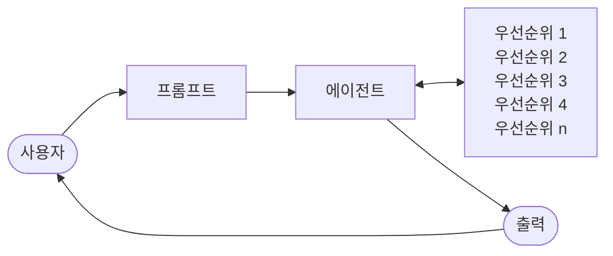

import { KeyPoints, Diagram, CrossRef } from '@site/src/components';

<KeyPoints
  items={[
    "우선순위 결정(Prioritization) 패턴은 에이전트가 복잡하고 동적인 환경에서 수많은 잠재적 행동, 상충하는 목표, 제한된 자원을 효과적으로 관리할 수 있도록 합니다.",
    "우선순위 결정의 핵심 요소는 기준 정의, 작업 평가, 스케줄링·선택 로직, 동적 재우선순위 결정의 네 가지입니다.",
    "에이전트는 긴급성, 중요도, 의존성, 자원 가용성, 비용-편익 분석 등의 기준을 활용해 작업을 평가하고 순위를 매깁니다.",
    "우선순위 결정은 고수준 목표 선택, 하위 작업 순서 결정, 즉각적인 행동 선택(Action Selection) 등 다양한 수준에서 이루어집니다.",
    "동적 재우선순위 결정은 상황 변화에 따라 에이전트가 실시간으로 초점을 조정할 수 있게 하여 적응성과 응답성을 보장합니다.",
    "LangChain 기반 프로젝트 관리 에이전트 예시를 통해 작업 생성, 우선순위 할당, 담당자 배정을 자동화하는 방법을 보여 줍니다.",
  ]}
/>

# 20장: 우선순위 결정(Prioritization)

복잡하고 동적인 환경에서 에이전트는 수많은 잠재적 행동, 상충하는 목표, 제한된 자원과 마주하는 경우가 빈번합니다. 다음 행동을 결정하는 명확한 프로세스 없이는 에이전트의 효율이 저하되거나, 운영 지연이 발생하거나, 핵심 목표 달성에 실패할 수 있습니다. 우선순위 결정(Prioritization) 패턴은 에이전트가 작업·목표·행동을 중요도, 긴급성, 의존성, 수립된 기준에 따라 평가하고 순위를 매길 수 있도록 하여 이 문제를 해결합니다. 이를 통해 에이전트는 가장 중요한 작업에 역량을 집중하여 효과성과 목표 정렬을 높입니다.

## 우선순위 결정 패턴 개요

에이전트는 우선순위 결정을 활용하여 작업, 목표, 하위 목표를 효과적으로 관리하고 후속 행동을 안내합니다. 이 프로세스는 여러 요구 사항을 처리할 때 정보에 기반한 의사결정을 촉진하여, 덜 중요한 활동보다 중요하거나 긴급한 활동을 우선시합니다. 자원이 제한되고, 시간이 부족하며, 목표가 충돌할 수 있는 실제 시나리오에서 특히 중요합니다.

에이전트 우선순위 결정의 근본적인 측면은 일반적으로 여러 요소를 포함합니다. 첫째, **기준 정의(criteria definition)**는 작업 평가를 위한 규칙 또는 지표를 수립합니다. 여기에는 긴급성(작업의 시간 민감도), 중요도(주요 목표에 대한 영향), 의존성(해당 작업이 다른 작업의 전제 조건인지 여부), 자원 가용성(필요한 도구나 정보의 준비 상태), 비용-편익 분석(노력 대비 기대 결과), 개인화 에이전트를 위한 사용자 선호도 등이 포함될 수 있습니다. 둘째, **작업 평가(task evaluation)**는 정의된 기준에 따라 각 잠재적 작업을 평가하며, 간단한 규칙부터 복잡한 점수 부여 또는 LLM에 의한 추론까지 다양한 방법을 활용합니다. 셋째, **스케줄링 또는 선택 로직(scheduling or selection logic)**은 평가 결과를 바탕으로 최적의 다음 행동 또는 작업 순서를 선택하는 알고리즘으로, 큐나 고급 계획 구성 요소를 활용할 수 있습니다. 마지막으로, **동적 재우선순위 결정(dynamic re-prioritization)**은 새로운 중요 이벤트의 발생이나 마감 기한 임박과 같이 상황이 변화함에 따라 에이전트가 우선순위를 수정할 수 있도록 하여 에이전트의 적응성과 응답성을 보장합니다.

우선순위 결정은 다양한 수준에서 발생할 수 있습니다. 상위 목표 선택(고수준 목표 우선순위화), 계획 내 단계 순서 결정(하위 작업 우선순위화), 사용 가능한 옵션 중 다음 즉각적인 행동 선택(행동 선택, Action Selection)이 그 예입니다. 효과적인 우선순위 결정은 에이전트가 보다 지능적이고, 효율적이며, 강건한 행동을 보여 줄 수 있도록 합니다. 이는 특히 복잡하고 다목적인 환경에서 두드러지며, 모든 구성원의 의견을 고려하여 관리자가 작업의 우선순위를 정하는 인간 팀 구성과 유사합니다.

## 실용적 응용 및 사용 사례

다양한 실제 애플리케이션에서 AI 에이전트는 적시에 효과적인 결정을 내리기 위해 정교한 우선순위 결정 방식을 사용합니다.

- **자동화된 고객 지원(Automated Customer Support)**: 에이전트는 비밀번호 재설정과 같은 일상적인 문제보다 시스템 중단 보고와 같은 긴급 요청을 우선시합니다. 고가치 고객에게 우선적인 처리를 제공할 수도 있습니다.
- **클라우드 컴퓨팅(Cloud Computing)**: AI는 최대 수요 시간대에 중요 애플리케이션에 자원 할당을 우선시하고, 덜 긴급한 배치 작업을 비수요 시간대로 미룸으로써 자원을 관리하고 스케줄링하여 비용을 최적화합니다.
- **자율 주행 시스템(Autonomous Driving Systems)**: 안전과 효율성을 보장하기 위해 행동을 지속적으로 우선순위 결정합니다. 예를 들어, 충돌 방지를 위한 제동은 차선 유지나 연료 효율 최적화보다 우선합니다.
- **금융 거래(Financial Trading)**: 봇은 시장 상황, 위험 허용도, 수익 마진, 실시간 뉴스와 같은 요소를 분석하여 거래의 우선순위를 결정하고, 고우선순위 거래를 신속하게 실행합니다.
- **프로젝트 관리(Project Management)**: AI 에이전트는 마감 기한, 의존성, 팀 가용성, 전략적 중요도를 기반으로 프로젝트 보드의 작업 우선순위를 결정합니다.
- **사이버 보안(Cybersecurity)**: 네트워크 트래픽을 모니터링하는 에이전트는 위협 심각도, 잠재적 영향, 자산 중요도를 평가하여 경보의 우선순위를 결정하고, 가장 위험한 위협에 즉각 대응합니다.
- **개인 비서 AI(Personal Assistant AIs)**: 우선순위 결정을 활용하여 일상을 관리하고, 사용자 정의 중요도, 다가오는 마감 기한, 현재 컨텍스트에 따라 달력 이벤트, 알림, 알림을 구성합니다.

이 예시들은 우선순위를 결정하는 능력이 광범위한 상황에서 AI 에이전트의 향상된 성능과 의사결정 역량에 얼마나 근본적인지를 집합적으로 보여 줍니다.

## 실습 코드 예시

다음은 LangChain을 사용하여 프로젝트 관리자 AI 에이전트를 개발하는 방법을 보여 줍니다. 이 에이전트는 작업의 생성, 우선순위 결정, 팀원 배정을 용이하게 하여, 자동화된 프로젝트 관리를 위한 맞춤형 도구와 함께 대규모 언어 모델의 적용을 보여 줍니다.

```python
import os
import asyncio
from typing import List, Optional, Dict, Type

from dotenv import load_dotenv
from pydantic import BaseModel, Field

from langchain_core.prompts import ChatPromptTemplate
from langchain_core.tools import Tool
from langchain_openai import ChatOpenAI
from langchain.agents import AgentExecutor, create_react_agent
from langchain.memory import ConversationBufferMemory

# --- 0. Configuration and Setup ---
# Loads the OPENAI_API_KEY from the .env file.
load_dotenv()

# The ChatOpenAI client automatically picks up the API key from the
environment.
llm = ChatOpenAI(temperature=0.5, model="gpt-4o-mini")

# --- 1. Task Management System ---

class Task(BaseModel):
   """Represents a single task in the system."""
   id: str
   description: str
   priority: Optional[str] = None  # P0, P1, P2
   assigned_to: Optional[str] = None # Name of the worker

class SuperSimpleTaskManager:
   """An efficient and robust in-memory task manager."""
   def __init__(self):
       # Use a dictionary for O(1) lookups, updates, and deletions.
       self.tasks: Dict[str, Task] = {}
       self.next_task_id = 1

   def create_task(self, description: str) -> Task:
       """Creates and stores a new task."""
       task_id = f"TASK-{self.next_task_id:03d}"
       new_task = Task(id=task_id, description=description)
       self.tasks[task_id] = new_task
       self.next_task_id += 1
```

```python
       print(f"DEBUG: Task created - {task_id}: {description}")
       return new_task

   def update_task(self, task_id: str, **kwargs) -> Optional[Task]:
       """Safely updates a task using Pydantic's model_copy."""
       task = self.tasks.get(task_id)
       if task:
           # Use model_copy for type-safe updates.
           update_data = {k: v for k, v in kwargs.items() if v is not
None}
           updated_task = task.model_copy(update=update_data)
           self.tasks[task_id] = updated_task
           print(f"DEBUG: Task {task_id} updated with {update_data}")
           return updated_task

       print(f"DEBUG: Task {task_id} not found for update.")
       return None

   def list_all_tasks(self) -> str:
       """Lists all tasks currently in the system."""
       if not self.tasks:
           return "No tasks in the system."

       task_strings = []
       for task in self.tasks.values():
           task_strings.append(
               f"ID: {task.id}, Desc: '{task.description}', "
               f"Priority: {task.priority or 'N/A'}, "
               f"Assigned To: {task.assigned_to or 'N/A'}"
           )
       return "Current Tasks:\n" + "\n".join(task_strings)

task_manager = SuperSimpleTaskManager()

# --- 2. Tools for the Project Manager Agent ---

# Use Pydantic models for tool arguments for better validation and
clarity.
class CreateTaskArgs(BaseModel):
   description: str = Field(description="A detailed description of
the task.")

class PriorityArgs(BaseModel):
   task_id: str = Field(description="The ID of the task to update,
e.g., 'TASK-001'.")
   priority: str = Field(description="The priority to set. Must be
one of: 'P0', 'P1', 'P2'.")
```

```python
class AssignWorkerArgs(BaseModel):
   task_id: str = Field(description="The ID of the task to update,
e.g., 'TASK-001'.")
   worker_name: str = Field(description="The name of the worker to
assign the task to.")

def create_new_task_tool(description: str) -> str:
   """Creates a new project task with the given description."""
   task = task_manager.create_task(description)
   return f"Created task {task.id}: '{task.description}'."

def assign_priority_to_task_tool(task_id: str, priority: str) -> str:
   """Assigns a priority (P0, P1, P2) to a given task ID."""
   if priority not in ["P0", "P1", "P2"]:
       return "Invalid priority. Must be P0, P1, or P2."
   task = task_manager.update_task(task_id, priority=priority)
   return f"Assigned priority {priority} to task {task.id}." if task
else f"Task {task_id} not found."

def assign_task_to_worker_tool(task_id: str, worker_name: str) ->
str:
   """Assigns a task to a specific worker."""
   task = task_manager.update_task(task_id, assigned_to=worker_name)
   return f"Assigned task {task.id} to {worker_name}." if task else
f"Task {task_id} not found."

# All tools the PM agent can use
pm_tools = [
   Tool(
       name="create_new_task",
       func=create_new_task_tool,
       description="Use this first to create a new task and get its
ID.",
       args_schema=CreateTaskArgs
   ),
   Tool(
       name="assign_priority_to_task",
       func=assign_priority_to_task_tool,
       description="Use this to assign a priority to a task after it
has been created.",
       args_schema=PriorityArgs
   ),
   Tool(
       name="assign_task_to_worker",
       func=assign_task_to_worker_tool,
       description="Use this to assign a task to a specific worker
```

```python
after it has been created.",
       args_schema=AssignWorkerArgs
   ),
   Tool(
       name="list_all_tasks",
       func=task_manager.list_all_tasks,
       description="Use this to list all current tasks and their
status."
   ),
]

# --- 3. Project Manager Agent Definition ---

pm_prompt_template = ChatPromptTemplate.from_messages([
   ("system", """You are a focused Project Manager LLM agent. Your
goal is to manage project tasks efficiently.

   When you receive a new task request, follow these steps:
   1.  First, create the task with the given description using the
`create_new_task` tool. You must do this first to get a `task_id`.
   2.  Next, analyze the user's request to see if a priority or an
assignee is mentioned.
       - If a priority is mentioned (e.g., "urgent", "ASAP",
"critical"), map it to P0. Use `assign_priority_to_task`.
       - If a worker is mentioned, use `assign_task_to_worker`.
   3.  If any information (priority, assignee) is missing, you must
make a reasonable default assignment (e.g., assign P1 priority and
assign to 'Worker A').
   4.  Once the task is fully processed, use `list_all_tasks` to show
the final state.

   Available workers: 'Worker A', 'Worker B', 'Review Team'
   Priority levels: P0 (highest), P1 (medium), P2 (lowest)
   """),
   ("placeholder", "{chat_history}"),
   ("human", "{input}"),
   ("placeholder", "{agent_scratchpad}")
])

# Create the agent executor
pm_agent = create_react_agent(llm, pm_tools, pm_prompt_template)
pm_agent_executor = AgentExecutor(
   agent=pm_agent,
   tools=pm_tools,
   verbose=True,
   handle_parsing_errors=True,
   memory=ConversationBufferMemory(memory_key="chat_history",
```

```python
return_messages=True)
)

# --- 4. Simple Interaction Flow ---

async def run_simulation():
   print("--- Project Manager Simulation ---")

   # Scenario 1: Handle a new, urgent feature request
   print("\n[User Request] I need a new login system implemented
ASAP. It should be assigned to Worker B.")
   await pm_agent_executor.ainvoke({"input": "Create a task to
implement a new login system. It's urgent and should be assigned to
Worker B."})

   print("\n" + "-"*60 + "\n")

   # Scenario 2: Handle a less urgent content update with fewer
details
   print("[User Request] We need to review the marketing website
content.")
   await pm_agent_executor.ainvoke({"input": "Manage a new task:
Review marketing website content."})

   print("\n--- Simulation Complete ---")

# Run the simulation
if __name__ == "__main__":
   asyncio.run(run_simulation())
```

이 코드는 Python과 LangChain을 사용하여 간단한 작업 관리 시스템을 구현하며, 대규모 언어 모델로 구동되는 프로젝트 관리자 에이전트를 시뮬레이션하도록 설계되었습니다.

시스템은 `SuperSimpleTaskManager` 클래스를 사용하여 메모리 내에서 효율적으로 작업을 관리하고, 빠른 데이터 검색을 위해 딕셔너리 구조를 활용합니다. 각 작업은 `Task` Pydantic 모델로 표현되며, 고유 식별자, 설명 텍스트, 선택적 우선순위 수준(P0, P1, P2), 선택적 담당자 지정 등의 속성을 포함합니다. 메모리 사용량은 작업 유형, 작업자 수, 기타 기여 요소에 따라 달라집니다. 작업 관리자는 작업 생성, 작업 수정, 모든 작업 조회를 위한 메서드를 제공합니다.

에이전트는 정의된 도구(Tool) 집합을 통해 작업 관리자와 상호작용합니다. 이 도구들은 새 작업 생성, 작업에 우선순위 할당, 담당자 배정, 모든 작업 목록 조회를 용이하게 합니다. 각 도구는 `SuperSimpleTaskManager` 인스턴스와 상호작용할 수 있도록 캡슐화되어 있습니다. Pydantic 모델은 도구의 필수 인수를 정의하는 데 활용되어 데이터 유효성 검사를 보장합니다.

`AgentExecutor`는 언어 모델, 도구 집합, 대화 메모리 구성 요소로 구성되어 컨텍스트 연속성을 유지합니다. 특정 `ChatPromptTemplate`은 프로젝트 관리 역할에서 에이전트의 행동을 안내하도록 정의됩니다. 프롬프트는 에이전트가 작업 생성으로 시작하고, 이후 명시된 대로 우선순위와 담당자를 할당하며, 종합적인 작업 목록으로 마무리하도록 지시합니다. P1 우선순위 및 'Worker A'와 같은 기본 할당은 정보가 없는 경우를 위해 프롬프트 내에 명시됩니다.

코드는 에이전트의 운영 역량을 보여 주기 위해 비동기 시뮬레이션 함수(`run_simulation`)를 포함합니다. 시뮬레이션은 두 가지 시나리오를 실행합니다: 지정된 담당자와 함께 긴급 작업을 관리하는 경우, 그리고 최소한의 입력으로 덜 긴급한 작업을 관리하는 경우. 에이전트의 행동과 논리 과정은 `AgentExecutor` 내에서 `verbose=True` 설정이 활성화되어 있어 콘솔에 출력됩니다.

## 한눈에 보기

**무엇(What):** 복잡한 환경에서 운영되는 AI 에이전트는 수많은 잠재적 행동, 상충하는 목표, 한정된 자원에 직면합니다. 다음 행동을 결정하는 명확한 방법 없이는 에이전트가 비효율적이고 비효과적으로 될 위험이 있습니다. 이는 상당한 운영 지연이나 주요 목표 달성에 완전한 실패로 이어질 수 있습니다. 핵심 과제는 에이전트가 목적 있고 논리적으로 행동할 수 있도록 이 압도적인 선택의 수를 관리하는 것입니다.

**왜(Why):** 우선순위 결정(Prioritization) 패턴은 에이전트가 작업과 목표를 순위를 매길 수 있도록 하여 이 문제에 표준화된 해결책을 제공합니다. 이는 긴급성, 중요도, 의존성, 자원 비용 등 명확한 기준을 수립함으로써 달성됩니다. 에이전트는 이후 각 잠재적 행동을 이 기준에 따라 평가하여 가장 중요하고 시의적절한 행동 방침을 결정합니다. 이 에이전틱 역량은 시스템이 변화하는 상황에 동적으로 적응하고 제한된 자원을 효과적으로 관리할 수 있게 합니다. 최고 우선순위 항목에 집중함으로써 에이전트의 행동은 보다 지능적이고, 강건하며, 전략적 목표에 부합하게 됩니다.

**경험 법칙:** 에이전틱 시스템이 동적인 환경에서 효과적으로 운영하기 위해 자원 제약 하에 여러 개의 종종 상충하는 작업이나 목표를 자율적으로 관리해야 할 때 우선순위 결정(Prioritization) 패턴을 사용하십시오.

**시각적 요약:**

<figure>



<figcaption>그림 20.1 — 우선순위 결정 설계 패턴</figcaption>
</figure>

## 핵심 정리

- 우선순위 결정은 AI 에이전트가 복잡하고 다면적인 환경에서 효과적으로 기능할 수 있도록 합니다.
- 에이전트는 긴급성, 중요도, 의존성 등 수립된 기준을 활용하여 작업을 평가하고 순위를 매깁니다.
- 동적 재우선순위 결정은 에이전트가 실시간 변화에 대응하여 운영 초점을 조정할 수 있게 합니다.
- 우선순위 결정은 상위 전략 목표와 즉각적인 전술 결정을 아우르는 다양한 수준에서 이루어집니다.
- 효과적인 우선순위 결정은 AI 에이전트의 효율성 향상과 운영 강건성 개선으로 이어집니다.

## 결론

결론적으로, 우선순위 결정 패턴은 효과적인 에이전틱 AI의 초석으로, 시스템이 목적 있고 지능적으로 동적 환경의 복잡성을 탐색할 수 있도록 갖춰 줍니다. 이는 에이전트가 수많은 상충하는 작업과 목표를 자율적으로 평가하여, 제한된 자원을 어디에 집중할지 합리적인 결정을 내릴 수 있게 합니다. 이 에이전틱 역량은 단순한 작업 실행을 넘어, 시스템이 선제적이고 전략적인 의사결정자로 기능할 수 있도록 합니다. 긴급성, 중요도, 의존성과 같은 기준을 고려함으로써 에이전트는 정교하고 인간과 유사한 추론 과정을 보여 줍니다.

이 에이전틱 행동의 핵심 특징은 동적 재우선순위 결정으로, 에이전트에게 상황 변화에 따라 실시간으로 초점을 적응시키는 자율성을 부여합니다. 코드 예시에서 보여 주듯, 에이전트는 모호한 요청을 해석하고, 자율적으로 적절한 도구를 선택하여 사용하며, 목표를 달성하기 위해 행동을 논리적으로 순서화합니다. 자체적으로 워크플로를 관리하는 이 능력이 진정한 에이전틱 시스템을 단순한 자동화 스크립트와 구분짓습니다. 궁극적으로, 우선순위 결정을 마스터하는 것은 복잡한 실제 시나리오에서 효과적이고 신뢰할 수 있게 운영될 수 있는 강건하고 지능적인 에이전트를 만드는 데 근본적입니다.

## 참고 문헌

1. Examining the Security of Artificial Intelligence in Project Management: A Case Study of AI-driven Project Scheduling and Resource Allocation in Information Systems Projects; https://www.irejournals.com/paper-details/1706160
2. AI-Driven Decision Support Systems in Agile Software Project Management: Enhancing Risk Mitigation and Resource Allocation; https://www.mdpi.com/2079-8954/13/3/208

<figure>


<figcaption>그림 1: 우선순위 지정 설계 패턴 — 에이전트가 우선순위 목록을 참조하여 작업을 수행</figcaption>
</figure>

