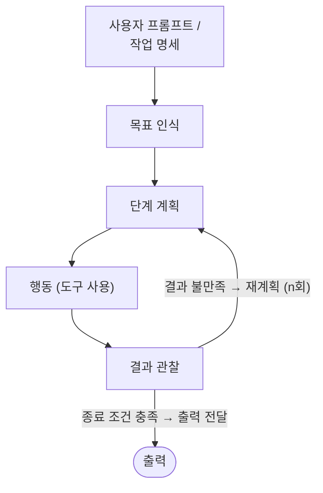

import { KeyPoints, Diagram } from '@site/src/components';

<KeyPoints
  items={[
    "AI 에이전트(AI agent)는 목표를 인식하고 도구를 통해 행동하며 결과를 관찰해 반복하는 소프트웨어 시스템으로, 챗봇과 달리 스스로 루프를 실행합니다.",
    "바이브 코딩(vibe coding)은 자연어로 원하는 바를 기술하고 AI 출력을 그대로 수용하는 캐주얼한 개발 방식이며, 에이전틱 엔지니어링(agentic engineering)은 체계적인 검증과 인간 감독이 수반되는 규율 있는 접근입니다.",
    "두 방식의 핵심 구분은 AI를 사용하는지 여부가 아니라, AI 출력을 둘러싼 구조·검증·인간 판단의 양에 있습니다.",
    "테스트(test)는 결정론적 부분을 검증하고, 평가(eval)는 비결정론적 부분을 검증합니다. 둘 다 없다면 그것은 언제나 바이브 코딩입니다.",
    "작업의 위험도에 따라 스펙트럼의 어느 위치에 있어야 할지 아는 것이 핵심 역량입니다.",
  ]}
/>

# 구문에서 의도로: 에이전트와 바이브 코딩

더 나아가기 전에, 에이전트가 무엇인지 그리고 바이브 코딩(vibe coding)이 실제로 무엇을 의미하는지에 대한 공통된 그림이 필요합니다. 두 용어 모두 여러 의미가 쌓여 있어 신중하게 풀어낼 필요가 있습니다.

## AI 에이전트: 간략한 복습

AI 에이전트(AI agent)란 목표를 인식하고, 그 목표에 도달하기 위한 단계를 계획하며, 도구를 통해 행동하고, 결과를 관찰하여 목표가 달성되거나 정지 조건에 도달할 때까지 반복하는 소프트웨어 시스템입니다. 챗봇이 응답을 생성하고 다음 프롬프트를 기다리는 데 반해, 에이전트는 스스로 루프를 실행합니다. 최상위에서 목표를 제시하면, 에이전트가 각 단계에서 다음에 무엇을 할지 스스로 결정합니다.

<figure>

<figcaption>그림 2: 에이전트 루프 — 인식·계획·행동·관찰·반복. 목표를 인식하고 단계를 계획해 도구로 행동한 뒤 결과를 관찰하며, 만족스럽지 않으면 재계획하고 종료 조건이 충족되면 출력을 전달합니다</figcaption>
</figure>

아무리 단순하거나 정교하더라도 모든 에이전트는 다섯 가지 구성 요소로 이루어집니다. 2025년 11월 『에이전트 입문』 백서에서 각각을 심도 있게 다루고 있습니다.[^2] 여기서는 간략하게 정리합니다.

- **모델**은 추론 엔진입니다. 현재 컨텍스트를 읽고, 다음에 무슨 일이 일어나야 할지 결정하며, 다음 생각·도구 호출·메시지를 생성합니다.
- **도구**는 모델을 세상과 연결합니다. 에이전트가 호출할 수 있는 API, 실행할 수 있는 코드, 쿼리할 수 있는 데이터베이스, 위임할 수 있는 다른 에이전트가 포함됩니다.
- **메모리**는 상태입니다. 에이전트가 과거 상호작용을 기억하고, 프로젝트별 규칙을 검색하며, 세션 전반에 걸쳐 컨텍스트를 유지해 빈 슬레이트에서 시작하지 않도록 합니다.
- **오케스트레이션**은 루프를 실행하는 코드입니다. 각 모델 호출을 위한 컨텍스트를 조립하고, 도구 호출을 디스패치하며, 결과를 포착하고, 계속할지 여부를 결정합니다.
- **배포**는 프로토타입을 서비스로 전환하는 것입니다. 호스팅, 신원, 관측성, 그리고 에이전트가 실행되는 프로덕션 인프라가 포함됩니다.

이 구성 요소들은[^parts] 지속적인 루프 속에서 함께 작동합니다. 임무를 받고, 현장을 살피고, 심사숙고하며, 행동하고, 관찰하고 반복합니다. 이 루프는 모든 에이전트의 심장 박동입니다. 이 백서의 나머지 모든 것, 그리고 과정의 나머지 전부는 이 루프의 변형입니다.

## 바이브 코딩이란 무엇인가?

2025년 2월, Andrej Karpathy는 소프트웨어 엔지니어링 커뮤니티 전반에 광범위하게 공명한 새로운 프로그래밍 방식에 대한 설명을 게시했습니다. 그는 "바이브에 완전히 몸을 맡기고, 지수적 성장을 받아들이며, 코드가 존재한다는 사실조차 잊어버리는" 접근법을 묘사했습니다. 이 방식에서 개발자는 자연어로 원하는 바를 기술하고, AI의 출력을 수용하며, 무언가 깨지면 오류 메시지를 프롬프트에 다시 붙여 넣어 AI에 수정을 요청합니다.[^karpathy]

이 용어가 급속히 퍼진 이유는 실제로 존재하던 무언가를 포착했기 때문입니다. 많은 개발자가 이미 이 방식으로 작업하고 있었지만 언어가 없었을 뿐입니다. 몇 달 만에 "바이브 코딩"은 AI 보조 개발 워크플로우 전반을 가리키는 일반 명칭이 되었고, 이로 인해 혼란이 생겼습니다. 잘 명세화된 기능을 구현하기 위해 AI 어시스턴트를 사용하는 시니어 엔지니어도 "바이브 코딩"인가? 신중하게 계획된 아키텍처를 실행하기 위해 AI 에이전트를 활용하는 팀도 그런가? 용어가 너무 광범위하게 적용되어 의미를 잃기 시작했습니다.

2026년 초 Karpathy 본인도 원래의 프레이밍이 너무 좁았음을 인정하며, 스펙트럼의 보다 규율 있는 끝단을 가리키는 "에이전틱 엔지니어링(agentic engineering)"이라는 용어를 도입했습니다.[^karpathy2026]

## 스펙트럼: 바이브 코딩에서 에이전틱 엔지니어링으로

바이브 코딩과 에이전틱 엔지니어링을 이진법적으로 보기보다, 스펙트럼의 양 끝점으로 생각하는 것이 더 유용합니다. 핵심 구분 기준은 AI를 사용하는지 여부가 아닙니다. AI의 출력을 둘러싼 구조, 검증, 인간 판단의 양이 얼마나 되느냐입니다.

**표 1: 바이브 코딩에서 에이전틱 엔지니어링으로의 스펙트럼**

| 차원 | 바이브 코딩 | 구조화된 AI 보조 코딩 | 에이전틱 엔지니어링 |
|---|---|---|---|
| 의도 명세 | 캐주얼한 자연어 프롬프트 | 예시와 제약이 포함된 상세 프롬프트 | 공식 스펙, 아키텍처 문서, 메모리 파일 |
| 검증 | "제대로 작동하는 것 같은가?" | 수동 테스트, 스팟 체크 | 자동화된 테스트 스위트, CI/CD 게이트, LM 심판 |
| 코드베이스 이해 | 최소 수준; 개발자가 생성된 코드를 읽지 않을 수 있음 | 핵심 경로의 선택적 리뷰 | 아키텍처에 대한 포괄적 리뷰; AI가 구현 세부 사항 처리 |
| 오류 처리 | 오류 메시지를 AI에 복사·붙여 넣기 | 개발자가 근본 원인 진단, AI가 수정 구현 | 에이전트가 정의된 범위 내에서 자가 진단; 인간이 아키텍처 문제 처리 |
| 적절한 범위 | 프로토타입, 스크립트, 개인 프로젝트, 해커톤 | 기존 코드베이스 내 기능 | 프로덕션 시스템, 팀 규모 개발 |
| 리스크 프로파일 | 높음; 일회용 코드에는 허용 가능 | 중간; 주요 체크포인트에서 인간 판단 | 낮음; 모든 단계에서 체계적 검증 |

<figure>

<figcaption>그림 3: 바이브 코딩에서 에이전틱 엔지니어링에 이르는 스펙트럼 — 바이브 코딩(캐주얼 프롬프트) · 구조화된 AI 보조 코딩 · 에이전틱 엔지니어링(정형 스펙+평가+CI/CD 게이트). 차별점은 AI 사용 여부가 아니라 출력이 어떻게 검증되는가입니다</figcaption>
</figure>

두 끝점 사이의 가장 큰 차별 요소는 출력이 어떻게 검증되느냐입니다. 바이브 코딩에서는 검증이 선택적입니다. 개발자가 코드를 실행하고 제대로 작동하는 것 같은지 확인합니다. 에이전틱 엔지니어링에서는 두 가지 메커니즘이 함께 작동합니다. 테스트(test)는 시스템의 결정론적 부분을 검증합니다. 주어진 입력에 대해 함수가 특정 출력을 내는지를 코드로 확인합니다. 평가(eval)는 결정론적이지 않은 부분을 검증합니다. 에이전트가 올바른 단계 경로를 밟고, 적절한 도구를 선택했으며, 품질 기준을 충족하는 최종 응답을 냈는지를 레이블링된 데이터셋·채점 루브릭·LM 심판으로 확인합니다. 테스트는 코드로 검사되고, 평가는 레이블링된 데이터셋·채점 루브릭·LM 심판으로 검사됩니다. 둘 다 없다면, 그 실천은 프롬프트가 아무리 정교하더라도 언제나 바이브 코딩입니다.

:::tip 적용 팁

스펙트럼의 어느 위치가 적합한지는 위험도에 달려 있습니다. 주말 프로토타입은 순수한 바이브 코딩이어도 됩니다. 금융 거래를 처리하는 프로덕션 API는 에이전틱 엔지니어링이 요구됩니다. 실제 작업의 대부분은 그 중간 어딘가에 있으며, 각 작업마다 어디서 선을 그어야 하는지 아는 것이 핵심 역량입니다.

:::

[^2]: Google, "Introduction to Agents" (2025년 11월). 전체 출처는 [미주](/sdlc/endnotes)를 참조하세요.
[^parts]: 옮긴이 주 — 원문은 앞 문단에서 구성 요소를 "다섯 가지(five parts)"로 소개하고 다섯 항목(모델·도구·메모리·오케스트레이션·배포)을 나열한 뒤, 이 문장에서는 "이 네 가지 구성 요소(These four parts)"로 표기합니다. 원문의 표기 불일치로 보이며, 실제 나열된 항목은 다섯 개입니다.
[^karpathy]: Andrej Karpathy, 2025년 2월 게시. 전체 출처는 [미주](/sdlc/endnotes)를 참조하세요.
[^karpathy2026]: Andrej Karpathy, 2026년 초. 전체 출처는 [미주](/sdlc/endnotes)를 참조하세요.
